# upload-labs通关笔记

upload-labs是一个使用php语言编写的，专门收集渗透测试和CTF中遇到的各种上传漏洞的靶场。旨在帮助大家对上传漏洞有一个全面的了解。目前一共21关，每一关都包含着不同上传方式。

>注意
>1.每一关没有固定的通关方法，大家不要自限思维！
>
>2.本项目提供的writeup只是起一个参考作用，希望大家可以分享出自己的通关思路。
>
>3.实在没有思路时，可以点击查看提示。
>
>4.如果黑盒情况下，实在做不出，可以点击查看源码。

**绕过方法**

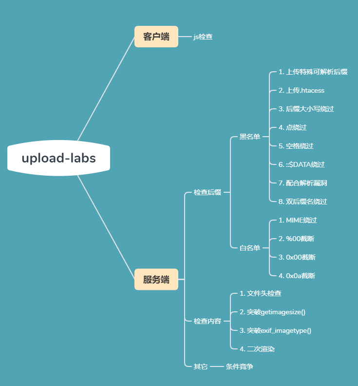

## 第一关	js绕过

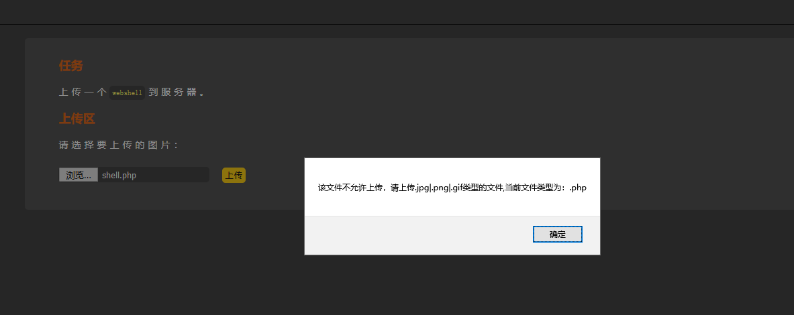

在第一关的时候，此时想直接上传.php一句话木马文件，试试能不能成功，结果提示告警信息。这是需要猜测判断文件后缀的告警信息代码是在前端还是在后端。首先打开burp代理进行拦截，发现点击上传后并没有拦截到数据请求包。由此可知判断文件后缀的代码是写在前端js代码中的，打开浏览器的审查元素找到文件上传的js代码。只需要把`return checkFile()`代码在审查元素中删掉，然后再上传即可。

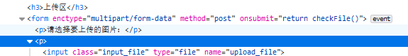

上传成功

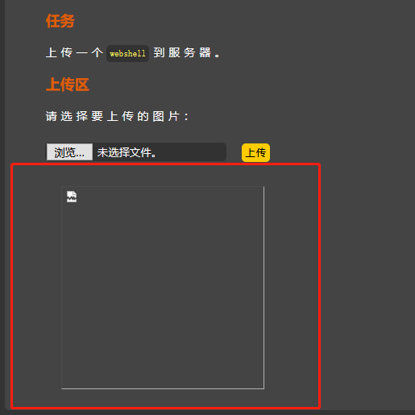

## 第二关	文件类型绕过

第二关是通过后端代码判断的，判断的是文件的MIME，MIME就是指文件的后缀，可以通过burp抓包进行修改。进行修改如下：

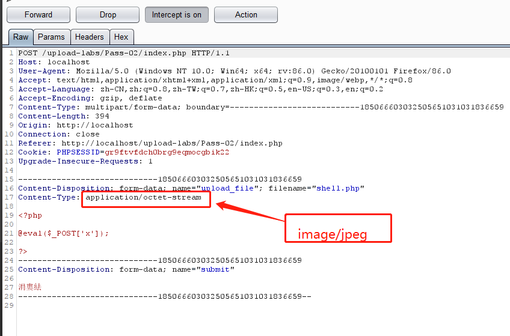

上传成功

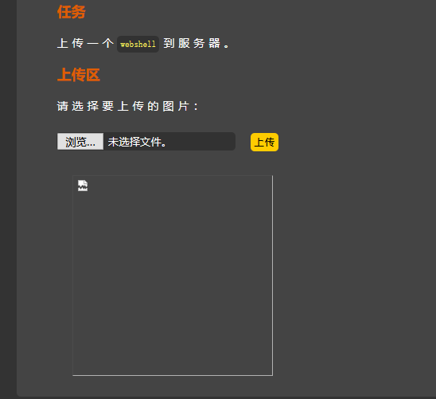

## 第三关	其它可解析类型绕过

上传php文件失败，根据返回的页面数据，判断应该是做了简单的黑名单处理。所以我们可以使用一些其他的可解析的文件。例如：php3、php5等。

~~~
#后缀绕过常用手段
PHP: php2、php3、php5、phtml、pht(是否解析需要根据配置文件中设置类型来决定)
ASP：asa、cer、cdx
ASPX： ascx、ashx、asac
JSP： jsp、jspx、jspf
~~~

为什么上面的东西可以绕过呢？这是利于了配置中正则解析的小错误实现的。

这些后缀名都可以被当做php文件执行。符合的后缀包括php、php3、php4、php5、phtml、pht等，有时候需要挨个尝试。

此关卡直接把文件后缀改为php3即可上传成功。

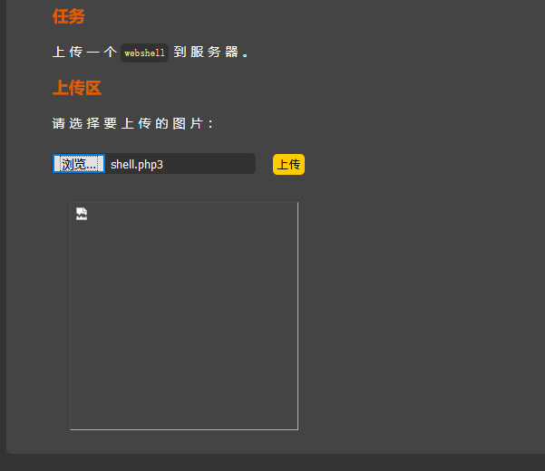

## 第四关	上传.htacess文件绕过

+ **思路一**：

  不能上传php，但是能上传php.jpg、php.asd，说明是黑名单限制，但是第三关中的php3、phtml等后缀名都被限制了，查看提示几乎所有可能绕过的后缀名都被限制了，但是没有禁止.htacess格式的文件，可以先上传一个.htaccess覆写后让所有的文件解析成php，然后再上传一个图片马。

> htaccess文件是Apache服务器中的一个配置文件，它负责相关目录下的网页配置。通过htaccess文件，可以实现：网页301重定向、自定义404错误页面、改变文件扩展名、允许/阻止特定的用户或者目录的访问、禁止目录列表、配置默认文档等功能。

创建一个.htaccess文件，写入代码（内容为将a.jpg当做php文件解析）

~~~
<FilesMatch “a.jpg”>
SetHandler application/x-httpd-php
</FilesMatch>
~~~

这是只讲指定上传的文件当做php文件执行。

先上传文件.htaccess然后再上传图片格式的一句话木马，之后直接用中国菜刀连接即可。原因：所有图片信息再上面文件的配置下都会解析成php文件。

+ **思路二**：

  后缀名冗余（未至扩展名绕过）绕过，例如修改成a.php.aaa，one.php.xxxx等。

  **原理：**本质为apache解析漏洞。apache中的主配置文件httpd.conf中存在DefaultType用于告诉apache该如何处理未知扩展名的文件，比如something.xxx这样的文件，扩展名是xxx，这肯定不是一个正常的网页或脚本文件，这个参数就是告诉apache该怎么处理这种未知扩展名的文件。

  参数DefaultType的默认值是“text/plain”，也就是遇到未知扩展名的文件，就把它当作普通的txt文本或html文件来处理。文件内容为php代码的未知扩展名文件来说也是解析成文本对于something.php.xxx的多扩展名的文件，那么就会被以module方式运行php的apache解析，因为Apache认为一个文件可以拥有多个扩展名，哪怕没有文件名，也可以拥有多个扩展名。Apache认为应该从右到左开始判断解析方法的。如果最右侧的扩展名为不可识别的，就继续往左判断，直到判断到文件名为止。

  **利用场景**：

  如果对方中间件Apache属于低版本，我们可以利用文件上传，上传一个不识别的文件后缀，利用解析漏洞规则成功解析文件，其中后门代码被触发。

## 第五关

## 第六关	大小写绕过

源码中并没有对后缀名的大小写进行限制，所以可以通过修改后缀名的大小写进行绕过限制进行上传。

## 第七关	 空格绕过

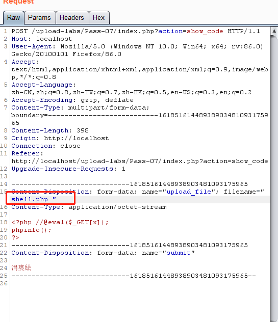

上传成功

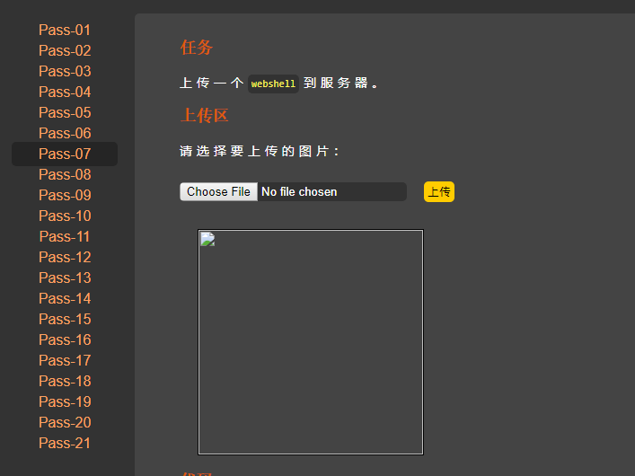

## 第八关	点绕过

后端代码并没有对点进行限制，所以可以在文件后缀名后面加上一个点进行绕过

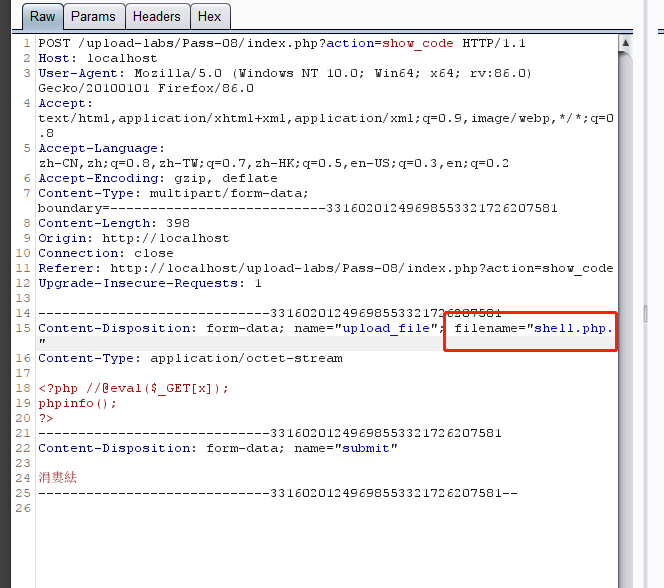

## 第九关	::$DATA文件流特性绕过

发现没有对::$DATA 进行过滤，所以利用windowsNTFS 文件系统特性绕过。传上one.php，burpsuit改包 ， 增 加 后 缀 : : $DATA进行过滤，所以利用windows NTFS文件系统特性绕过。

## 第十关	多点和空格绕过

虽然后端源码会对.和空格进行过滤，但是只会过滤一次。所以我们可以通过写多个点和空格进行绕过限制。

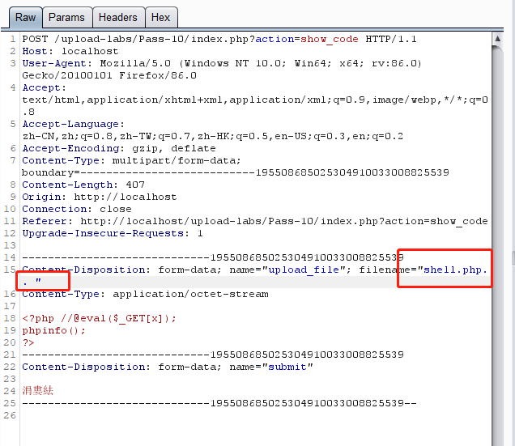

## 第十一关	双写文件名绕过

这一关什么后缀的文件都能上传，但是黑名单内的后缀名却被替换成了空格，无法正常解析。因为下面的控制语句：

~~~php
$file_name = str_ireplace($deny_ext,"", $file_name);
~~~

可以通过构造pphphp绕过限制。

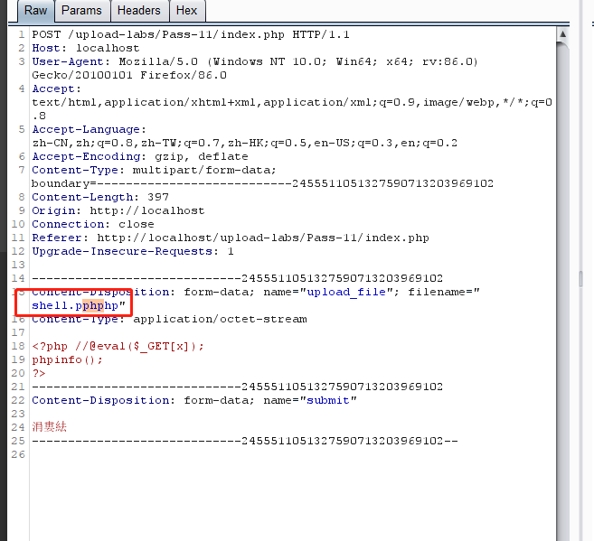

## 第十二关	文件路径%00截断

通过抓包截断 `shell.php.jpg`后面的一个 `.` 换成0x00。在上传的时候，当文件系统读到0x00时，会认为文件已经结束，从而将`shell.php.jpg`的内容写入到 `shell.php`中，从而达到攻击的目的。

**截断条件：**
php版本小于5.3.4 详情关注CVE-2006-7243
php的magic_quotes_gpc为OFF状态

> 做题之前先要把网站中的php.ini中的安全设置修改一下。
>
> php.ini文件里的magic_quotes_gpc设成了off，那么PHP就不会在敏感字符前加上反斜杠（\）
>
> 通过上面的场景，黑名单虽然对很多的文件上传都做了限制，规定那些不能上传，但是总是有一些其他的方法可以实现绕过，所以黑名单是相对于白名单来说安全级别很低的。
>
> 这个场景是一个白名单。并且文件名是拼接而成。

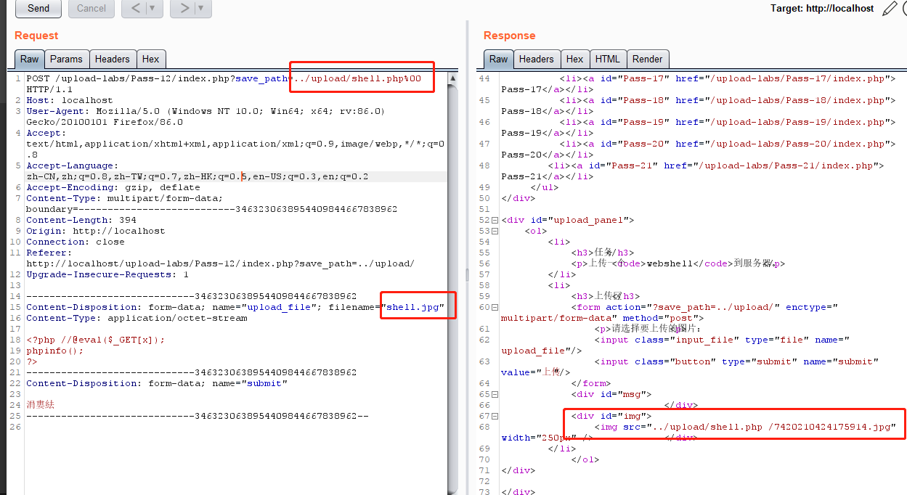

> 可以通过截断上传（0x00，%00，/00 ）实现。
>
> 上传路径名%00截断绕过。上传的文件名写成shell.jpg，
> save_path改成…/upload/shell.php%00，最后保存下来的文件就是shell.php

## 第十三关	post路径%00截断

> 十三关可以看到文件路径中的$_GET[‘save_path’]变成了 $_POST[‘save_path’]。这又会造成什么区别呢？
>
> post不会像get对%00进行自动解码
>
> 也就是说我们不能直接在包中直接加入截断字符了需要手动进行url编码处理(只需要对%00进行转码就可以了)

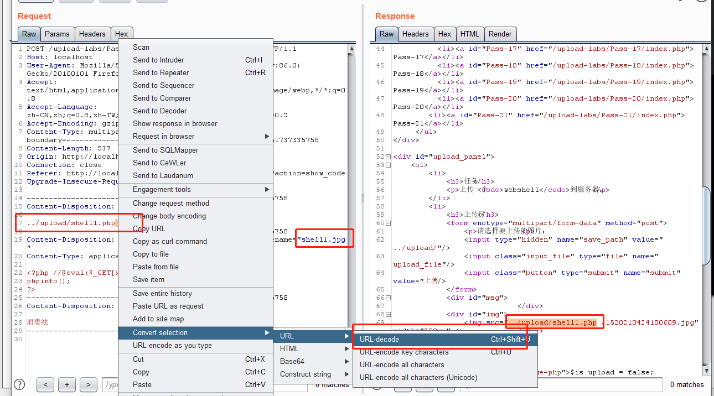

## 第十四关	文件头检测

这题是上传图片马，但是想要利用图片马还需要结合文件包含漏洞，所以本题只需要上传三种图片格式的文件码就行了。

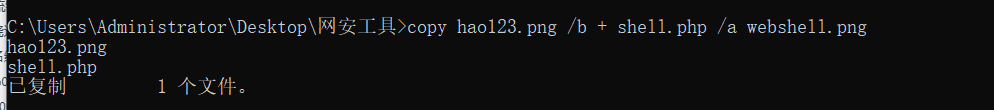

上传成功

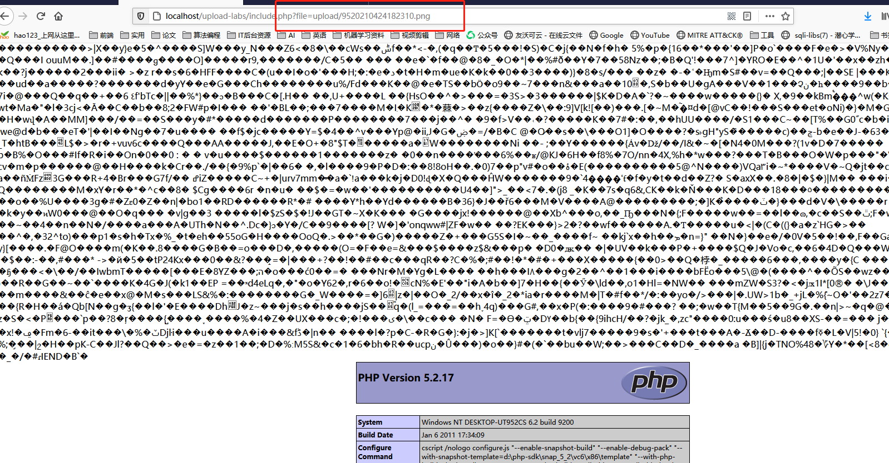

## 十五关	getimagesize()类型验证

本关还是要上传一个图片马，这里用`getimagesize()`获取文件类型，可以直接利用图片马就可以绕过限制。

通过getimagesize()函数来实现对文件类型的识别判断。也就是说用burpsuit改包的方法操作就复杂了，直接合成一张木马图上传即可(与十四相同)

## 十六关	exif_imagetype()检测

通过函数exif_imagetype()函数获得图片文件的类型，从而实现文件白名单的过滤操作。不能抓包改包实现，依旧使用图片马合成。

## 十七关	二次渲染

在将图片上传成功后，使用文件包含来使用一句话木马，打开后发现并没有一句话木马。用文件包含漏洞解析发现是并没有成功。将图片下载下来放到winhex中和我们上传的一句话图片木马进行比较，找相同的地方并且修改为自己的一句话。再对新修改的一句话图片木马上传，上传成功。

图片马二次渲染绕过
1、gif图片
对于gif图片，gif图片的特点是无损（修改图片后，图片质量几乎没有损失），我们可以对比上传前后图片的内容字节，在渲染后不会被修改的部分插入木马。对比工具可以使用burp，也可以使用010编辑器（更直观一点）

或者直接运行php脚本

~~~php
<?php
$p = array(0xa3, 0x9f, 0x67, 0xf7, 0x0e, 0x93, 0x1b, 0x23,
           0xbe, 0x2c, 0x8a, 0xd0, 0x80, 0xf9, 0xe1, 0xae,
           0x22, 0xf6, 0xd9, 0x43, 0x5d, 0xfb, 0xae, 0xcc,
           0x5a, 0x01, 0xdc, 0x5a, 0x01, 0xdc, 0xa3, 0x9f,
           0x67, 0xa5, 0xbe, 0x5f, 0x76, 0x74, 0x5a, 0x4c,
           0xa1, 0x3f, 0x7a, 0xbf, 0x30, 0x6b, 0x88, 0x2d,
           0x60, 0x65, 0x7d, 0x52, 0x9d, 0xad, 0x88, 0xa1,
           0x66, 0x44, 0x50, 0x33);
$img = imagecreatetruecolor(32, 32);
for ($y = 0; $y < sizeof($p); $y += 3) {
   $r = $p[$y];
   $g = $p[$y+1];
   $b = $p[$y+2];
   $color = imagecolorallocate($img, $r, $g, $b);
   imagesetpixel($img, round($y / 3), 0, $color);
}
imagepng($img,'./1.png');
?>
~~~

运行脚本生成1.png，发现木马被写入。可以直接生成不会被杀的图片马。

## 十八关	条件竞争上传

先将文件上传到服务器，然后通过rename修改名称，再通过unlink删除修改名称后的文件，这里可以通过条件竞争的方式在unlink之前，访问webshell。

首先在burp中不断发送上传webshell的数据包即可。

> 这里是这样操作的，先通过move_uploaded_file把文件保存了，然后再去判断后缀名是否合法，合法就重命名，如果不合法再删除。重是重点在于，在多线程情况下，就有可能出现还没处理完，我们就访问了原文件，这样就会导致被绕过防护。

## 十九关	条件竞争上传

根据apache的后缀名识别漏洞：从右往左依次识别后缀，遇到不能识别的后缀名便跳过 ，因此可以文件名改为

1.php.7z,然后利用bs 快速发包，

本关对文件后缀名做了白名单判断，然后会一步一步检查文件大小、文件是否存在等等，将文件上传后，对文件重新命名，同样存在条件竞争的漏洞。可以不断利用burp发送上传图片马的数据包，因为move在rename之前，move操作进行了一次文件保存，然后rename进行了一次更改文件名，由于条件竞争，程序会出现来不及rename的问题，从而上传成功

所以本题相对上题是差不多的，只不过多了一部操作而已：增加Apache的解析识别漏洞（后缀冗余）

（1）利用Apache 的漏洞，将webshell 脚本文件名改为1.php.7z （白名单中 有.7z 这个apache 不能识别的后缀，所以用.7z)

然后利用bs 去不断快速发包，实现条件竞争，进而保留了脚本名，使apache 将其识别为1.php

（2）单纯利用 条件竞争，利用bs 去不断快速发包，实现条件竞争，进而保留了图片马的文件名，成功绕过

## 第二十关	%00截断

代码审计：发现并没有对大小写进行过滤，可以直接使用大小写。

这道题，可以看到名称是可以自行修改的，我们尝试上传图片马，并且修改文件名问php后缀，发现并不能上传上去。

那么我们尝试抓包修改上传名为upload-19.php ，有个.(2e)，我们再进入hex把空格的2e修改为00进行截断，发现上传成功。

递归删除文件名最后的/.导致绕过了后缀名检测,在bs中将文件名改为：1.php/. 成功绕过。

## 第二十一关

通过审计发现，先检查文件类型，后检查是否上传了文件名没有则为文件的名字，判断是否为数组，若不是则以点分割返回一个数组，取数组最后一位数为后缀，文件保存为reset输出数组第一个数，和最后一位数保存

绕过方法
php修改后缀jpg上传抓包
文件类型已经为image/jpeg
修改上传路径为一个数组，当获取文件后缀时为jpg，合成文件名为数组第一个，和最后一个，当我们修改jpg为数组的2时，1此时是空的数组一共有三位数，但是实际只有两位，所有获取到的值为空
此时上传后的文件为upload-20.php.