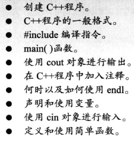
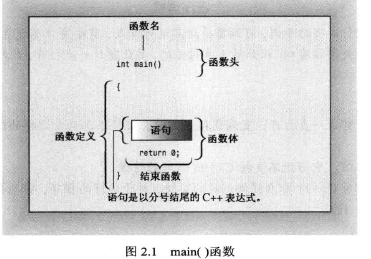
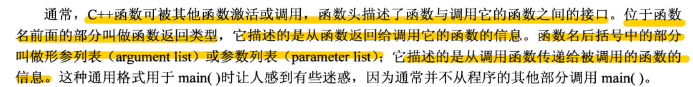
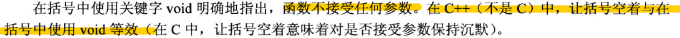
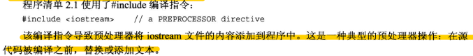
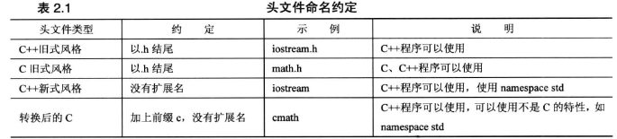
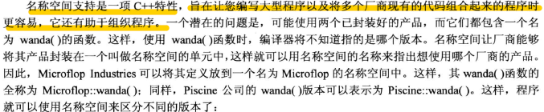
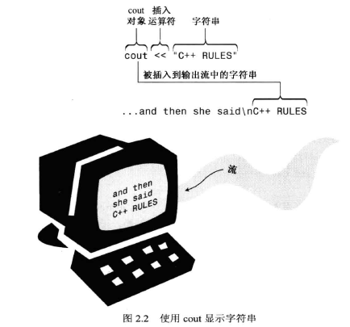
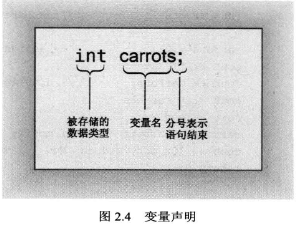

# 第二章 开始学习C++
#进行中 

> 本章内容:
> 
## 进入C++
```Cpp
#include <iostream>

int main() {
	using namespace std;
	cout << "Come up ***";
	cout << endl;
	cout << "You wont regret it!";
	//cin.get();
	return 0;
}

```

### main()函数



**在C++中，不能省略语句结尾的分号！**





### c++注释

C++的注释：
+ //
+ /*  */

### C++预处理器和iostream文件



### 头文件名




### 名称空间




### 使用cout进行C++输出




### C++源代码的格式化


## C++语句

~~~cpp
#include <iostream>

int main1(void) {
	using namespace std;
	int num;
	cout << "Hello World!" << endl << "please input number:";
	cin >> num;
	num = num + 2;
	cout << "number is " << num <<" ! " << endl;

	return 0;
}
~~~

### 声明语句和变量



