# 《C Primer Plus》第六版
#进行中 
## 第一章 初识C语言

本章介绍一下内容：
+ C的历史和特性
+ 编写程序的步骤
+ 编译器和链接器的一些知识

>在计算机看来，高级指令就是一堆无法理解的无用数据。编译器在这里派上了用场。**编译器是把高级语言程序翻译成计算机能理解的机器语言指令集的程序。**程序员进行高级思维活动，而编译器则负责处理冗长乏味的细节工作。

>**使用C语言的7个步骤**
>1. 定义程序的目标
>2. 设计程序
>3. 编写代码
>4. 编译
>5. 运行程序
>6. 测试和调试程序
>7. 维护和修改代码


## 第二章 C语言概述

本章主要内容：
>+ 运算符：=
>+ 函数：main()、printf()
>+ 编写一个简单的C程序
>+ 创建整型变量，为其赋值并在屏幕上显示其值
>+ 换行字符
>+ 如何在程序中写注释，创建包含多个函数的程序，发现程序的错误
>+ 什么是关键字

### 2.1 简单的C程序示例

```c
#include <stdio.h>

int main(void){
	int num;
	num = 1;
	printf("I am a simple ");
	printf("computer.\n");
	printf("My favorite number is %d because it is first.\n",num);
	getchar();
	return 0;
}
```

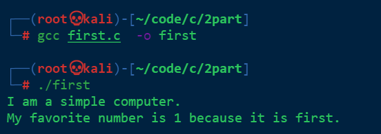


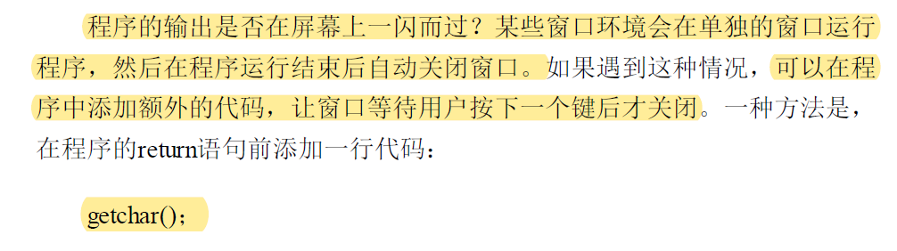

**这行代码会让程序等待击键，窗口会在用户按下一个键后才关闭。**

### 2.2 示例解释

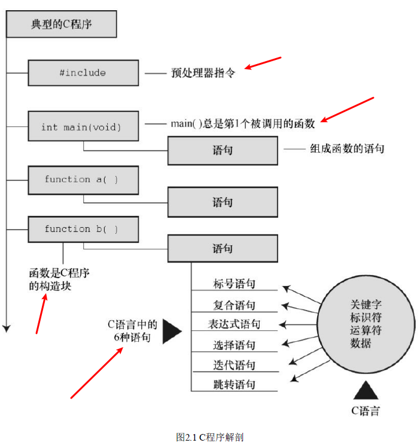


#### 2.2.1 第1遍：快速概要

>+ \#include<stdio.h>　　　←包含另一个文件
>	+ 该行告诉编译器**把stdio.h中的内容包含在当前程序中**。**stdio.h是C编译器软件包的标准部分**，它提供**键盘输入和屏幕输出**的支持。
>+ int main(void)　　　　 ←函数名
>	+ 圆括号表明main()是一个**函数名**。int表明main()函数**返回一个整数**，void表明main()不带任何参数。
>+ \/* 一个简单的C程序 \*/　　　 ←注释
>+ {　　　　←函数体开始
>	+ 左花括号表示函数定义开始，右花括号（}）表示函数定义结束。
>+ int num;　　　←声明
>	+ 该声明表明，将使用一个名为num的变量，而且num是int（整数）类型。
>+ num = 1;　　　←赋值表达式语句
>+ printf("I am a %d simple\n "); ←调用一个函数
>	+ printf()是标准的C库函数。在程序中使用函数叫作调用函数。
>	+ 代码\n告诉计算机另起一行，即把光标移至下一行。
>	+ %d告诉计算机以何种形式输出num的值，打印在何处。
>+ return 0;　　 ←return语句
>	+ **C函数可以给调用方提供（或返回）一个数**。目前，可暂时把该行看作是结束main()函数的要求。

#### 2.2.2 第2遍：程序细节

1. **\#include**指令和头文件
	**\#include <stdio.h>**
	>+ 这是程序的第1行。==\#include <stdio.h>的作用相当于把stdio.h文件中的所有内容都输入该行所在的位置。==实际上，这是一种“拷贝-粘贴”的操作。
	>+ **include文件提供了一种方便的途径共享许多程序共有的信息。**
	>+ \#include这行代码是一条**C预处理器指令**（preprocessor directive）。通常，C编译器在编译前会对源代码做一些准备工作，即预处理（preprocessing）。
	>+ \#include中的#符号表明，C预处理器在编译器接手之前处理这条指令。

2. **main()**函数
	**int main(void);**
	>+ **C程序一定从main函数开始执行。**
	>+ 圆括号的功能是用于识别代码是一个函数。
	>+ 函数是C程序的基本模块。
	
3. 注释
	**\/\*一个简单的程序\*/**
	>+ C99新增了另一种风格的注释，普遍用于C++和Java。这种新风格使用//符号创建注释，仅限于单行。==// 这种注释只能写成一行。==
	
4. 花括号、函数体和块
	{
	...
	}
	>+ 一般而言，所有的C函数都使用花括号标记函数体的开始和结束。这是规定，不能省略。
	
5. 声明
	**int num;**
	>+ 声明是C语言最重要的特性之一。
	>+ 在该例中，声明完成了两件事。其一，在函数中有一个名为num的**变量**（variable）。其二，**int表明num是一个整数**（即，没有小数点或小数部分的数）。
	>+ int是一种数据类型。编译器使用这些信息为num变量在内存中分配存储空间。分号在C语言中是大部分语句和声明的一部分。
	>+ **声明把特定标识符与计算机内存中的特定位置联系起来**，同时也确定了储存在某位置的信息类型或数据类型。
	>+ 在C语言中，**所有变量都必须先声明才能使用。**
	>+ 可以用小写字母、大写字母、数字和下划线（\_）来命名。而且，**名称的第1个字符必须是字符或下划线，不能是数字。**
	
	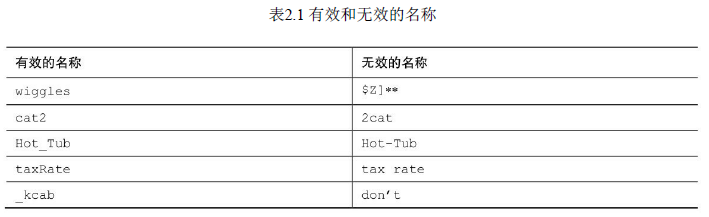

6. 赋值
	**num = 1;**
	>+ 赋值是C语言的基本操作之一。该行代码的意思是“把值1赋给变量num”。
	>+ 在执行int num; 声明时，编译器在**计算机内存**中为变量num**预留了空间**，然后在执行这行**赋值**表达式语句时，把**值储存在之前预留的位置**。
	>+ **可以给num赋不同的值**，这就是num之所以被称为变量（variable）的原因。
	
7. printf()函数

	>+ C语言的一个标准函数：printf()。圆括号表明printf是一个函数名。
	>+ 在C语言中，实际参数（简称**实参**）是传递给函数的特定值，形式参数（简称**形参**）是函数中用于储存值的变量。
	>+ **%d相当于是一个占位符**，其作用是指明输出num值的位置。
	>+ %提醒程序，要在该处打印一个变量，d表明把变量作为十进制整数打印。
	>+ printf()函数名中的f提醒用户，这是一种格式化打印函数。
	
8. return语句
	**return 0;**
	>+ C标准要求main()这样做。有返回值的C函数要有return语句。该语句以return关键字开始，后面是待返回的值，并以分号结尾。
	
### 2.3 简单程序的结构

>+ 函数由函数头和函数体组成。
>+ 函数头包括函数名、传入该函数的信息类型和函数的返回类型。
>+ 函数体被花括号括起来，由一系列语句、声明组成。

### 2.4 提高程序可读性的技巧

>+ 选择有意义的函数名和写注释;
>+ 在函数中用空行分隔概念上的多个部分;
>+每条语句各占一行;

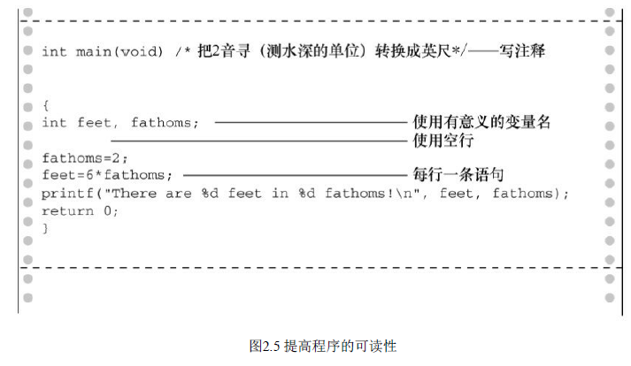


### 2.5 进一步使用C

```c
// fathm_ft.c -- 把2音寻转换成英寸
#include　<stdio.h>
int　main(void)
{
	int　feet,　fathoms;
	
	fathoms　=　2;
	feet = 6 * fathoms;
	printf("There　are　%d　feet　in　%d　fathoms!\n",　feet,　fathoms);
	printf("Yes, I said %d feet!\n", 6 * fathoms);
}
```

这段代码提供了程序描述，声明了多个变量，进行了乘法运算，并打印了两个变量的值。

#### 2.5.1 程序说明

程序在开始处有一条注释（使用新的注释风格），给出了文件名和程序的目的。

#### 2.5.2 多条声明

程序在一条声明中声明了两个变量，而不是一个变量。为此，
要在声明中**用逗号隔开两个变量**（feet和fathoms）。


> int　feet,　fathoms;
> 和
> int　feet;
> int　fathoms;
> 等价。

#### 2.5.3 乘法

用\*表示乘法

`feet = 6 * fathoms;`的意思是“查找变量fathoms的值，用6乘以该值，并把计算结果赋给变量feet”。

#### 2.5.4 打印多个值

双引号号后面的第1个变量（feet）替换了双引号中的第1个%d；双引号号后面的第2个变量（fathoms）替换了双引号中的第2个%d。注意，待输出的变量列于双引号的后面。还要注意，**变量之间要用逗号隔开。**

### 2.6 多个函数

程序清单2.3演示了除main()以外，**如何把自己的函数加入程序中。**


```c
/* two_func.c -- 一个文件中包含两个函数 \*/
#include　<stdio.h>
void butler(void); /* ANSI/ISO C函数原型 */
int　main(void)
{
	printf("I　will　summon　the　butler　function.\n");
	butler();
	printf("Yes.　Bring　me　some　tea　and　writeable　DVDs.\n");
	return　0;
}
void butler(void) /* 函数定义开始 */
{
	printf("You　rang,　sir?\n");
}
```

>+ butler()函数在程序中出现了3次。
>+ 第1次是**函数原型**（prototype），告知编译器在程序中要使用该函数；
>+ 第 2 次以**函数调用**（function call）的形式出现在 main()中；
>+ 最后一次出现在**函数定义**（function definition）中，函数定义即是函数本身的源代码。


函数原型是一种声明形式，告知编译器正在使用某函数，因此函数原型也被称为函数声明（functiondeclaration）。函数原型还指明了函数的属性。

**何时执行 butler()函数取决于它在 main()中被调用的位置，而不是 butler()的定义在文件中的位置。**

C标准建议，要为程序中用到的所有函数提供函数原型。

### 2.7 调试程序

### 2.8 关键字和保留标识符

关键字是C语言的词汇。

**在表 2.2 中所列的C语言关键字中，粗体表示的是C90标准新增的关键字，斜体表示的C99标准新增的关键字，粗斜体表示的是C11标准新增的关键字。**

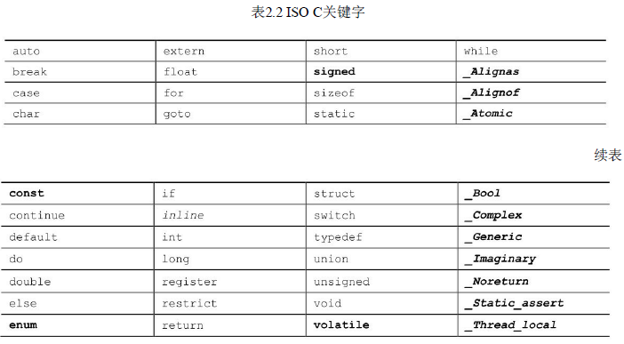

### 2.9 关键概念

由于编译器不具有真正的智能，所以你必须用编译器能理解的术语表达你的意图，这些术语就是C语言标准规定的形式规则（尽管有些约束，但总比直接用机器语言方便得多）。

## 第3章 数据和C

本章介绍以下内容：
>+ 关键字：int 、short、long、unsigned、char、float、double、_Bool、_Complex、_Imaginary
>+ 运算符：sizeof()
>+ 函数：scanf()
>+ 整数类型和浮点数类型的区别
>+ 如何书写整型和浮点型常数，如何声明这些类型的变量
>+ 如何使用printf()和scanf()函数读写不同类型的值

### 3.1 示例程序

```c
#include <stdio.h>
int main(void){  
	float weight;  
	float value;  
	printf("Are you worth your weight in platinum?\n");  
	printf("Let's check it out.\n");  
	printf("Please enter your weight in pounds: ");  
	  
	scanf("%f",&weight);  
	  
	value = 1700.0 * weight * 14.5833;  
	  
	printf("Your weight in platinum is worth $%.2f.\n", value);  
	printf("You are easily worth that! If platinum prices drop,\n");  
	printf("eat more to maintain your value.\n");  
	  
	return 0;  
}
```

> getchar()函数读取下一个输入字符，因此程序会等待用户输入。在这种情况下，键入 156 并按下Enter（或Return）键（发送一个换行符），**然后scanf()读取键入的数字，第1个getchar()读取换行符，**第2个getchar()让程序暂停，等待输入。

#### 3.1.1 程序中的新元素

本例使用了**浮点数类型**（float）的变量，以便处理更大范围的数据。float 类型可以储存带小数的数字。

>+ %.2f中的**.2**用于精确控制输出，**指定输出的浮点数只显示小数点后面两位**。
>+ scanf()函数用于读取键盘的输入。**%f说明scanf()要读取用户从键盘输入的浮点数**，**&weight告诉 scanf()把输入的值赋给名为 weight 的变量**。scanf()函数使用**&符号表明找到 weight变量的地点**。


### 3.2 变量与常量数据

有些数据类型在程序使用之前已经预先设定好了，在整个程序的运行过程中没有变化，这些称为**常量**（constant）。其他数据类型在程序运行期间可能会改变或被赋值，这些称为**变量**（variable）。

### 3.3 数据：数据类型关键字

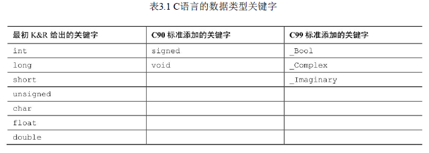

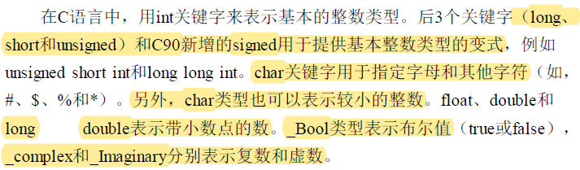


#### 3.3.1 整数和浮点数

#### 3.3.2 整数

#### 3.3.3 浮点数

2.75、3.16E7、7.00 和 2e-8 都是浮点数。


### 3.4 C语言基本数据类型

#### 3.4.1 int类型
**一般而言，系统用一个特殊位的值表示有符号整数的正负号。**

C语言把不含小数点和指数的数作为整数。因此，22和-44都是整型常量，但是22.0和2.2E1则不是。

8进制和16进制：
>在C语言中，用特定的前缀表示使用哪种进制。**0x或0X前缀表示十六进制值**，所以十进制数16表示成十六进制是0x10或0X10。与此类似，**0前缀表示八进制**。例如，十进制数16表示成八进制是020。
>以十进制显示数字，使用%d；以八进制显示数字，使用**%o**；以十六进制显示数字，使用**%x**。另外，要显示各进制数的前缀0、0x和0X，必须分别使用**%#o、%#x、%#X**。

```c
#include <stdio.h>  
int main(void)  
{  
	int x = 100;  
	printf("dec = %d; octal = %o; hex = %x\n", x, x, x);  
	printf("dec = %d; octal = %#o; hex = %#x\n", x, x, x);  
	return 0;  
}
```

#### 3.4.2 其他整数类型

C语言提供3个附属关键字修饰基本整数类型：**short**、**long和unsigned**。
应记住以下几点:
>+ short int类型（或者简写为short）占用的存储空间可能比int类型少，常用于较小数值的场合以节省空间。与int类似，short是有符号类型。
>+ long int或long占用的存储空间可能比int多，适用于较大数值的场合。与int类似，long是有符号类型。
>+ long long int或long long（C99标准加入）占用的储存空间可能比long多，适用于更大数值的场合。**该类型至少占64位**。与int类似，long long是有符号类型。
>+ unsigned int或unsigned**只用于非负值的场合**。这种类型与有符号类型表示的范围不同。例如，16位unsigned int允许的取值范围是0～65535，而不是-32768～32767。用于表示正负号的位现在用于表示另一个二进制位，所以无符号整型可以表示更大的数。
>+ 在C90标准中，添加了unsigned long int或unsigned long和unsigned int或unsigned short类型。C99标准又添加了unsigned long long int或unsigned long long。
>+ **在任何有符号类型前面添加关键字signed，可强调使用有符号类型的意图。例如，short、short int、signed short、signed short int都表示同一种类型。**


#### 3.4.3 使用字符：char类型

char类型用于储存字符（如，字母或标点符号），但是从技术层面看，char是整数类型。因为**char类型实际上储存的是整数而不是字符。**

`char grade = 'A';`

在C语言中，用**单引号**括起来的单个字符被称为字符**常量**（character constant）。
实际上，字符是以数值形式储存的，所以也可使用数字代码值来赋值：
`char grade = 65;`

**双引号括起来，编译器则认为"A"是一个字符串。**

```c
/* charcode.c-显示字符的代码编号 */#include <stdio.h>  
int main(void)  
{  
	char ch;  
	printf("Please enter a character.\n");  
	scanf("%c", &ch); /* 用户输入字符 */printf("The code for %c is %d.\n", ch, ch);  
	return 0;  
}
```

#### 3.4.4 _Bool类型

C99标准添加了_Bool类型，用于表示布尔值，即逻辑值true和false。因为C语言用值**1表示true，值0表示false**，所以_Bool类型实际上也是一种整数类型。但原则上它仅占用1位存储空间，因为对0和1而言，1位的存储空间足够了。

#### 3.4.5 可移植类型：stdint.h和inttypes.h

C 语言提供了许多有用的整数类型。但是，某些类型名在不同系统中的功能不一样。C99 新增了两个头文件`stdint.h`和`inttypes.h`，以确保C语言的类型在各系统中的功能相同。

#### 3.4.6 float、double和long double

**浮点类型能表示包括小数在内更大范围的数。浮点数的表示类似于科学记数法（即用小数乘以10的幂来表示数字）。该记数系统常用于表示非常大或非常小的数。**

系统储存一个浮点数要占用32位。其中8位用于表示指数的值和符号，剩下24位用于表示非指数部分（也叫作尾数或有效数）及其符号。

一般情况下，double占用64位而不是32位。一些系统将多出的 32 位全部用来表示非指数部分，这不仅增加了有效数字的位数（即提高了精度），而且还减少了舍入误差。


C语言的第3种浮点类型是long double，以满足比double类型更高的精度要求。不过，C只保证long double类型至少与double类型的精度相同。

下面是更多的有效浮点型常量示例：
3.14159
.2
4e16
.8E-5
100.

1.56 E+12不要在浮点型常量中间加空格（错误！）


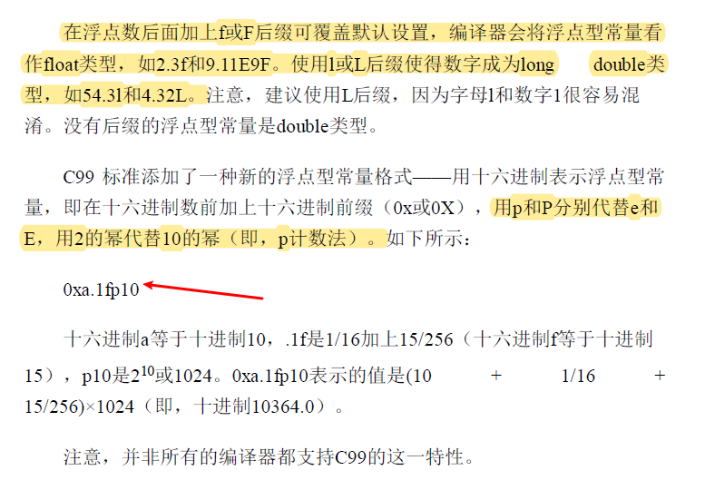

**使用%f转换说明打印十进制记数法的float和double类型浮点
数，用%e打印指数记数法的浮点数。如果系统支持十六进制格式的浮点数，可用a和A分别代替e和E。打印long double类型要使用%Lf、%Le或%La转换说明。**

#### 3.4.7 复数和虚数类型

C语言有3种复数类型：float_Complex、double_Complex和
long double _Complex。

#### 3.4.8 其他类型

#### 3.4.9 类型大小

```c
//* typesize.c -- 打印类型大小 */
#include <stdio.h>  
int main(void){  
/* C99为类型大小提供%zd转换说明 */
	printf("Type int has a size of %zd bytes.\n", sizeof(int));  
	printf("Type char has a size of %zd bytes.\n", sizeof(char));  
	printf("Type long has a size of %zd bytes.\n", sizeof(long));  
	printf("Type long long has a size of %zd bytes.\n",sizeof(long long));  
	printf("Type double has a size of %zd bytes.\n",sizeof(double));  
	printf("Type long double has a size of %zd bytes.\n",sizeof(long double));  
	return 0;  
}
```

**sizeof是C语言的内置运算符，以字节为单位给出指定类型的大小。**

### 3.5 使用数据类型

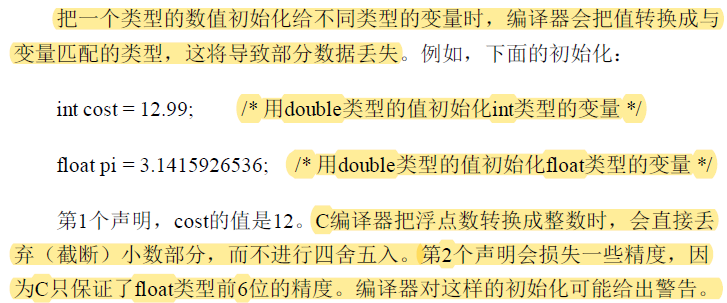


### 3.6 参数和陷阱

双引号中的字符序列（如，"Hello,pal."）被称为字符串（string）。

**无论双引号中包含多少个字符和标点符号，一个字符串就是一个参数。**

### 3.7 转义序列示例

#### 3.7.2 刷新输出

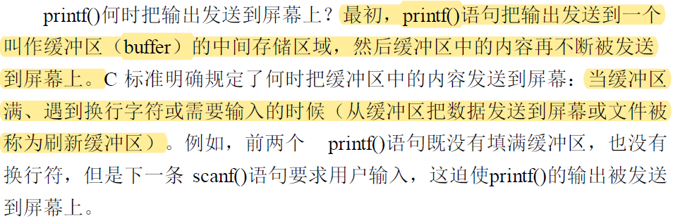

还有一种刷新缓冲区的方法是使用fflush()函数

## 第4章 字符串和格式化输入/输出

本章介绍以下内容：
>+ 函数：strlen()
>+ 关键字：const
>+ 字符串
>+ 如何创建、存储字符串
>+ 如何使用strlen()函数获取字符串的长度
>+ 用C预处理器指令#define和ANSIC的const修饰符创建符号常量