# 《Linux就该这么学》第2版
#进行中

## 常用命令

~~~bash
cut -d <分隔符> -f <第几列> 文件名 
~~~


### 标准输入输出及错误输出

> 标准输入重定向（STDIN，文件描述符为0）
>
> 标准输出重定向（STDOUT，文件描述符为1）
>
> 错误输出重定向（STDERR，文件描述符为2）


**不区分标准输出和错误输出，只要命令有输出信息则全部追加写入到文件中，这就要用到`&>>`操作符**

### 管道符

> 管道符的作用：**把前一个命令原本要输出在屏幕上的内容作为第二个命令的标准输入**

~~~bash
`tee`命令 

Usage: tee [OPTION]... [FILE]...                                                                                                                                          

Copy standard input to each FILE, and also to standard output. 
既可以在屏幕上显示输出结果，而且还把输出结果保存到某一个文件中。
~~~

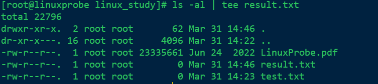

### 命令行的通配符

**顾名思义，通配符就是通用的匹配信息的符号**


还可以创建文件，但是使用{}来包括

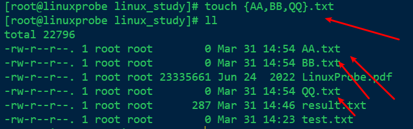

### 常用的转义字符

~~~bash
\	使得反斜杠后面的变量变成一个普通的字符
''	转义其中所有的变量为普通的字符串
""	保留其中的变量属性，不进行转义处理
``	把其中的命令执行并返回结果
~~~

`$$`的作用是返回当前进程的进程ID号

### 环境变量

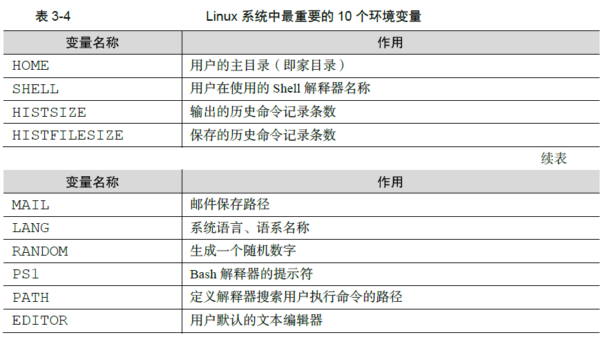

> `export`可以把自己设置的变量提升为全局变量
>
> 后续要是不使用这个变量了，则可执行`unset` 命令把它取消掉
>
> 直接在终端设置的变量能够立即生效，但在重启服务器后就会失效，因此我们需要将变量和变量值写入到 .bashrc 或者 .bash pr ofile 文件中 以确保永久能使用它们。


### vim

> 在`/etc/sysconfig/network-scripts`目录下，存放这网卡配置文件 `ifcfg-ensxxx`
>
> `nmcli connection reload ens160`网卡重启命令


### Shell

~~~$bash
$0	脚本的名称
$#	脚本一共几个输入参数
$*	列出所有的参数
$?	显示上一次命令的执行返回值
$1……$N	分别对应1至N的位置上的参数值
~~~

> 条件测试：**条件成立返回数字0，否则返回非零值**
>
> + 文件测试语句
> + 逻辑测试语句
> + 整数值比较语句
> + 字符串比较语句


例子：


**与或非：**

> &&是逻辑 ”与”，只有当前面的语句执行成功的时候才会执行后面的语句。
> || 是逻辑 ”或”，只有当前面的语句执行失败的时候才会执行后面的语句。
> ! 是逻辑 “非”代表对逻辑测试结果取反值 之前若为正确则变成错误，若为错误则变成正确。

**整数运算符：**


**字符串比较运算符：**


**if条件测试语句：**

+ 单分支的if条件语句

​	

+ 双分支的if条件语句

​	

+ 多分支的 if 条件语句

​	

**for条件语句：**


**while条件循环语句：**


**case条件测试语句：**


### 定时任务

~~~bash
at ： 执行一次定时任务
	-l	显示待执行的任务列表
	-m	执行完成发送邮件
	-d	删除指定的待执行的任务
	-f	指定包含命令的任务文件
	-q	指定新任务的名称
~~~

也可以使用`atrm 任务序号`删除待执行的任务

~~~bash
crontab : 周期性的执行任务
	-e	编译任务
	-u	指定用户名称，root用户可以编辑他人任务
	-l	列出任务列表
	-r	删除任务计划
	
口诀：分、时、日、月、星期 命令
~~~

**注意事项：**


### 用户

~~~bash
useradd 
	-N 	不创建与用户同名的用户组
~~~

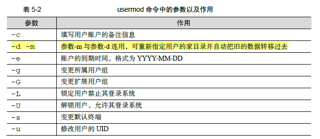

~~~bash
passwd
	-e	强制用户在下次登录时修改密码
	-S	显示用户的密码是否被锁定，以及密码所采用的加密算法名称
~~~

### 文件

> 常见的文件类型：
>
> + 普通文件（-）
> + 链接文件（l）
> + 目录文件（d）
> + 管道文件（p）
> + 块设备文件（b）
> + 字符设备文件（c）

### 文件的特殊权限

> SUID是一种对二进制程序进行设置的特殊权限，能够让二进制程序的执行者暂时拥有所有者的权限；


> 下面的普通用户ljw就会拥有所有者root的权限

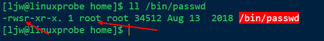

**为了权限泄露，千万不要将 SUID 权限设置到 vim 、 cat 、 rm 等命令上面！！！**

> SGID 特殊权限有两种应用场景：当对二进制程序进行设置时，能够让执行者临时获取文件所属组的权限；当对目录进行设置时，则是让目录内新创建的文件自动继承该目录原有用户组的名称。

> SBIT特殊权限位可确保用户只能删除自己的文件，而不能删除其他用户的文件。
>
> 当对某个目录设置了 SBIT 粘滞位权限后，那么该目录中的文件就只能被其所有者执行删除操作了。


**RHEL 8 系统中的 /tmp 作为一个共享文件的目录，默认已经设置了 SBIT 特殊权限位，因此除非是该目录的所有者，否则无法删除这里面的文件。**


> 注意：SUID 和SGID 的写法是，原先有执行权限则是小写s，如果没有执行权限则是大写S；而SBIT 的写法则是，原先有执行权限是小写t，没有执行权限是大写T。

### 文件的隐藏属性

~~~bash
chattr:用户设置文件的隐藏属性
语法：chattr [参数] 文件名称

~~~

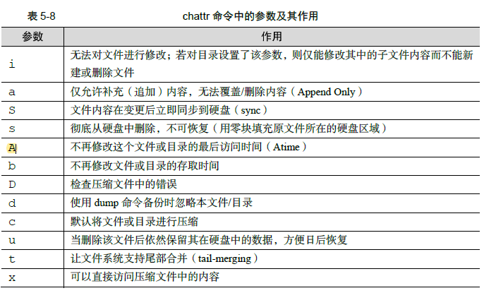

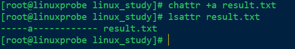

~~~bash
lsattr:用于查看文件的隐藏权限
语法格式：lsattr [参数]	文件名称
~~~

### ACL(访问控制列表)

**一般权限、特殊权限、隐藏权限其实有一个共性：权限是针对某一类用户设置的，能够对很多人同时生效。**

> 如果针对某个目录设置了ACL，则目录中的文件会继承其ACL 权限；若针对文件设置了ACL，则文件不再继承其所在目录的ACL 权限。

~~~bash
setfacl:用于管理文件的ACL权限规则
语法格式：setfacl	[参数]	文件名称
~~~


>  常用的ls 命令是看不到ACL 信息的，但是却可以看到文件权限的最后一个点（ .）变成了加号（ +），这就意味着该文件已经设置了ACL。


~~~bash
getfacl:查看文件的ACL权限规则
语法：getfacl	[参数]	文件名称
~~~

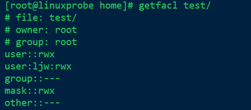

### su和sudo

~~~bash
su

~~~

su 命令可以解决切换用户身份的需求，使得当前用户在不退出登录的情况下，顺畅地切换到其他用户，比如从root 管理员切换至普通用户


~~~bash
sudo 命令用于给普通用户提供额外的权限，语法格式为“sudo [参数] 用户名”
集中管理用户与权限的文件为`/etc/sudoers`
~~~


~~~bash
visudo:命令用于编辑、配置用户sudo 的权限文件，语法格式为“visudo [参数]”
这是一条会自动调用vi 编辑器来配置/etc/sudoers 权限文件的命令，能够解决多个用户同时修改权限而导致的冲突问题。
visudo 命令只有root 管理员才可以执行，普通用户在使用时会提示权限不足。
~~~


>  第100 行的信息代表的意思为：
>
> **谁可以使用	允许使用的主机=（以谁的身份）	可以执行的命令列表**
>
> 谁可以使用：稍后为哪位用户进行命令授权
>
> 允许使用的主机：填写ALL表示不限制来源的主机，也可填写如192.168.1.0/24这样的网段限制来源的地址，使得只有从允许网段登录时才能使用sudo命令
>
> 以谁的身份：填写ALL表示系统最高权限，也可以是另外一位用户的名字
>
> 可执行的命令列表：填写ALL表示不限制命令，，亦可填写如/usr/bin/cat 这样的文件名称来限制命令列表，多个命令文件之间用逗号（，）间隔。

利用visodu配置：

`ljw	ALL=(ALL)	ALL`

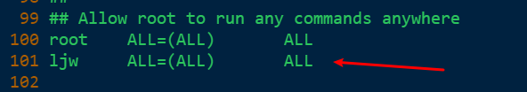

配置成功


**每次执行sudo 命令都要输入一次密码其实也挺麻烦的，这时可以添加`NOPASSWD `参数，使得用户下次再执行sudo 命令时就不用密码验证：**

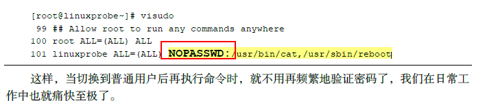

## 第六章	存储结构与管理硬盘


### 一切从“/”开始

> **系Linux统中的一切文件都是从“根”目录（/）开始的，并按照文件系统层次标准（FHS）采用倒树状结构来存放文件。**


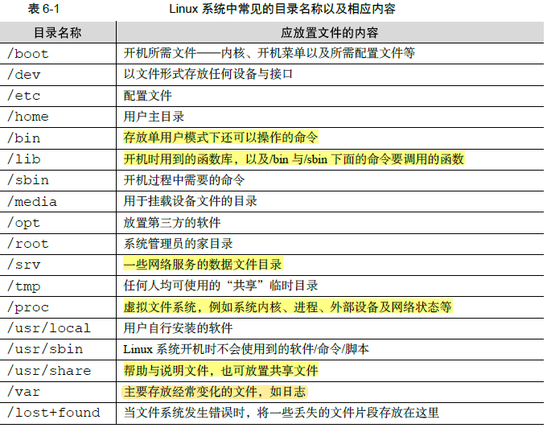

### 物理设备的命名规则

> 系统内核中的**udev 设备管理器**会自动把硬件名称规范起来，目的是让用户通过设备文件的名
> 字可以猜出设备大致的属性以及分区信息等。
>
> **udev设备管理器**的服务会一直以守护进程的形式运行并侦听内核发出的信号来管理/dev 目录下的
> 设备文件。


> **硬盘的分区编号也很有讲究：**
>
> + 主分区或扩展分区的编号从1开始，到4结束；
> + 逻辑分区从编号5开始。

**注：**

**（1）/dev目录中sda设备之所以是a，并不是由插槽决定的，而是由系统内核中的识别顺序来决定的，而恰巧很多主板的插槽顺序就是系统内核的识别顺序，因此才会被命名为/dev/sda。**

**（2）分区的数字编码不一定是强制顺延下来的，也有可能是手工指定的。因为sda3
只能表示是编号3的分区，而不能判设备上已经存在3个分区。**


> /dev/目录中保存的应当是硬件设备文件；其次，sd 表示的是存储设备；然后，a表示系统中同类接口中第一个被识别到的设备；最后，5 表示这个设备是一个逻辑分区。一言以蔽之，**“/dev/sda5”**表示的就是**“这是系统中第一块被识别到的硬件设备中分区编号为5 的逻辑分区的设备文件”。**

---

**主分区、扩展分区、逻辑分区的介绍**

1. 硬盘设备是由大量的扇区组成的，每个扇区的容量为512字节。其中第一个扇区最重要，他里面保存着`主引导记录`和`分区表`信息。就第一个扇区来讲，主引导记录需要占用446字节，分区表占用64字节，结束符2字节；其中分区表中每一个分区信息就需要16字节，这样一来最多只能有4个分区信息可以卸载第一个扇区中，这4个分区就是4个主分区。

   

2. 为了解决分区个数不够的问题，可以将第一个扇区的分区表中16字节（）的空间（）拿来指向另外一个分区。也就是说，扩展分区其实并不是一个真正的分区，而更像是一个占用16 字节分区表空间的指针 —— 一个指向另外一个分区的指针。

   

   **注：**所谓扩展分区，严格地讲它不是一个实际意义的分区，而仅仅是一个指向其他分区的指针，这种指针结构将形成一个`单向链表`。因此扩展分区自身不能存储数据，用户需要在其指向的对应分区（称之为逻辑分区）上进行操作。

   ---

   

### 文件系统与数据资料

文件系统类型：

+ Ext2
+ Ext3
+ Ext4
+ XFS

> **在拿到一块新的硬盘存储设备后，先需要分区，然后再格式化文件系统，最后才能挂载并正常使用。**
>
> 也可以选择不进行分区，但是必须对硬盘进行格式化处理。

Linux 只是把每个文件的权限与属性记录在`inode` 中，而且每个文件占用一个独立的inode 表格，该表格的大小默认为`128` 字节，里面记录着如下信息：

+ 该文件的访问权限（read、write、execute）；
+  该文件的所有者与所属组（owner、group）； 
+ 该文件的大小（size）；
+  该文件的创建或内容修改时间（Ctime）；
+  该文件的最后一次访问时间（Atime）；
+  该文件的修改时间（Mtime）；
+  文件的特殊权限（SUID、SGID、SBIT）；
+  该文件的真实数据地址（point）。

> 查看其中某个文件的详细信息（包括inode），可以使用`stat`命令，示例：
>
> `stat folder1`

   


**Linux 内核中的软件层为用户程序提供了一个虚拟文件系统（Virtual File System，VFS）接口，这样用户实际上在操作文件时就是统一对这个虚拟文件系统进行操作了。图6-6 所示为VFS 的架构示意图**


### 挂载硬件设备

硬盘设备：分区->格式化->挂载

**挂载是在使用硬件设备前所执行的最后一步操作**

#### mount

~~~bash
mount 命令用于挂载文件系统
格式为“mount 文件系统 挂载目录”
	-a	挂载所有在/etc/fstab中定义的文件系统
	-t	指定文件系统的类型
	
对于比较新的Linux 系统来讲，一般不需要使用-t 参数来指定文件系统的类型，Linux 系统会自动进行判断。
~~~


> **如果在工作中要挂载一块网络存储设备，该设备的名字可能会变来变去，这样再写为sdb 就不太合适了。这时推荐用UUID（Universally Unique Identifier，通用唯一识别码）进行挂载操作。UUID 是一串用于标识每块独立硬盘的字符串，具有唯一性及稳定性，特别适合用来挂载网络设备**

~~~bash
blkid： 
	blkid 命令用于显示设备的属性信息，英文全称为“block id”，语法格式为“blkid [设备名]”
~~~

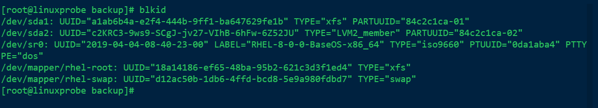

> 上面执行`mount`命令挂载的方法，在系统重启之后挂载就会失效
>
> 永久挂载方法：
>
> + 在`/etc/fstab`文件中修改内容
> + 填写格式`设备文件 挂载目录 格式类型 权限选项 是否备份 是否自检`


~~~bash
vim /etc/fstab

/dev/sda1	/root/linux_study/backup	ext4	defaults	0	0
~~~

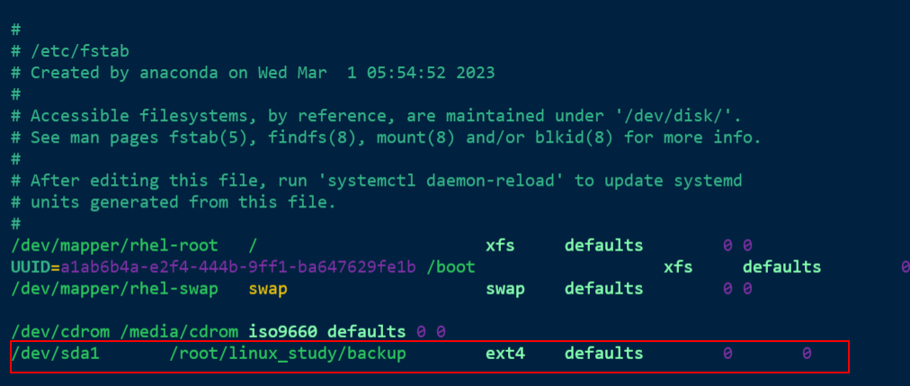

**写入到`/etc/fstab` 文件中的设备信息并不会立即生效，需要使用`mount -a` 参数进行自动挂载**

#### df

~~~bash
df	: 用于查看已挂载的磁盘空间使用情况，英文全称为“disk free”
	语法格式为 “df -h”。
	-h 参数便捷地对存储容量进行“进位”操作
~~~

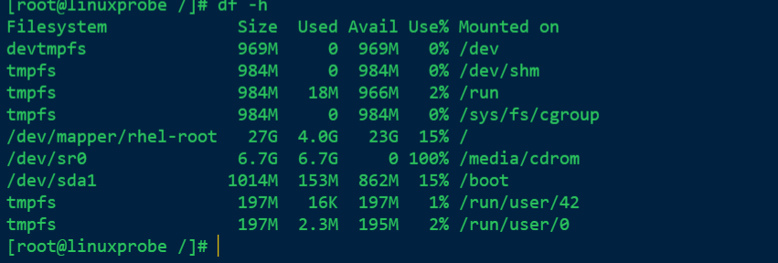

> 说到**网络存储设备**，建议您在fstab 文件挂载信息中加上`_netdev` 参数。加上后系统会等联网成功后再尝试挂载这块网络存储设备，从而避免了开机时间过长或失败的情况。

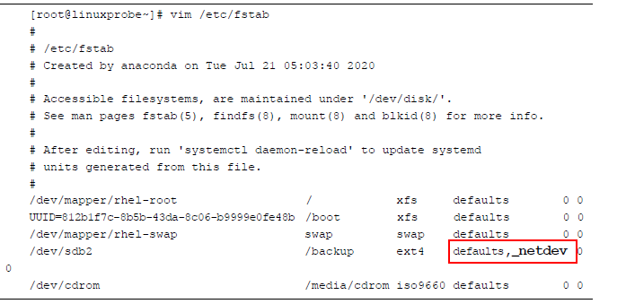

#### umount

~~~bash
umount :用于卸载设备或文件系统，英文全称为“un mount
语法格式为“umount [设备文件/挂载目录]”。
~~~

~~~bash
lsblk	以树状图的形式列举
	用于查看已挂载的磁盘的空间使用情况，英文全称为“list block id”
~~~


### 添加硬盘设备

#### fdisk	分区

~~~bash
fdisk：用于新建、修改及删除磁盘的分区表信息，英文全称"format	disk"
	用法：fdisk	磁盘名称
这条命令的参数是交互式的一问一答的形式
~~~

> 在Linux 系统中，管理硬盘设备最常用的方法就当属fdisk 命令了。它提供了集添加、删除、转换分区等功能于一身的"一站式分区服务”


#### mkfs	格式化

> 如果硬件存储设备没有进行格式化，则Linux 系统无法得知怎么在其上写入数据。因此，在对存储设备进行分区后还需要进行格式化操作。在Linux 系统中用于格式化操作的命令是`mkfs`。

~~~bash
mkfs:文件系统格式化
用法：mkfs.文件类型名称		分区文件
~~~


#### 挂载设备

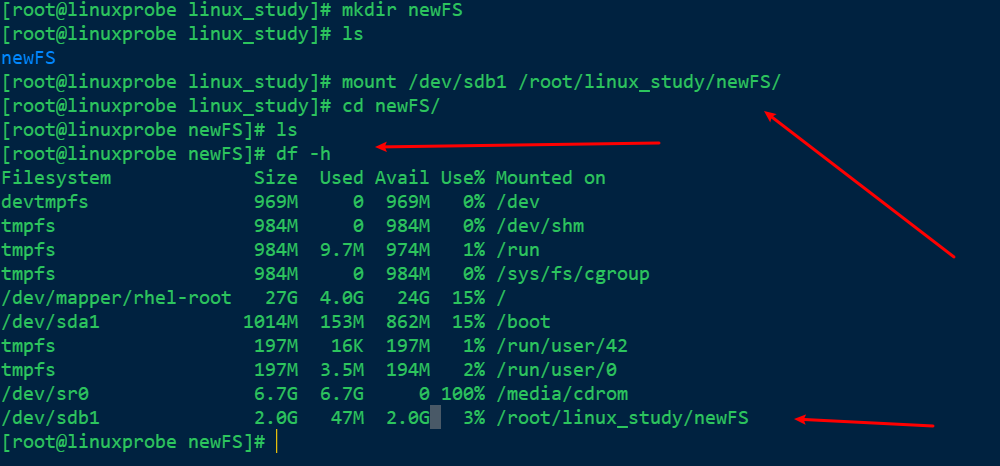

**既然存储设备已经顺利挂载，接下来就可以尝试通过挂载点目录向存储设备中写入文件了**

#### du

~~~bash
du:	用于查看分区或目录所占用的磁盘容量大小。英文全称为“disk usage”
语法格式为“du -sh 目录名称”。
~~~

### 添加交换分区

> 交换（SWAP）分区是一种通过在硬盘中预先划分一定的空间，然后把内存中暂时不常用的数据临时存放到硬盘中，以便腾出物理内存空间让更活跃的程序服务来使用的技术，其设计目的是为了解决真实物理内存不足的问题。
>
> 只有当真实的物理内存耗尽后才会调用交换分区的资源。

#### 创建交换分区

~~~bash
fdisk /dev/sdb
~~~

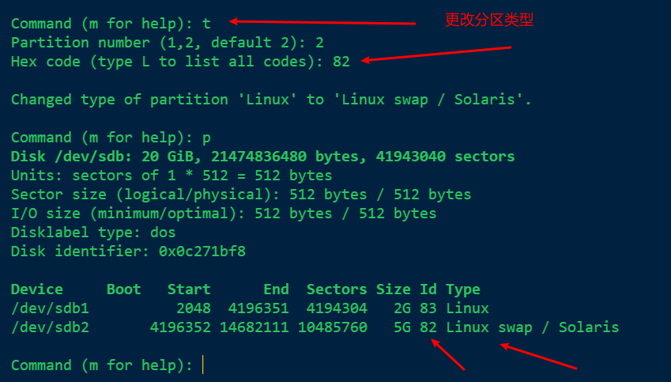

#### 格式化交换分区

~~~bash
mkswap:用于对新设备进行交换分区格式化。英文全称为：“make swap”
用法：mkswap 设备/分区名称
~~~


#### 激活交换分区

~~~bash
swapon :用于激活新的交换分区设备，英文全称为“swap on”
语法格式为“swapon 设备名称“
~~~


> 为了使交换分区永久有效，需要在/etc/fstab文件中配置

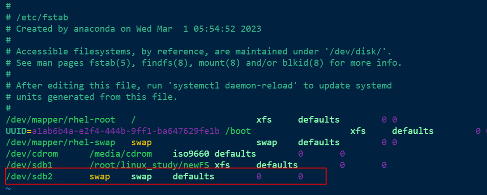

### 磁盘容量配额
>可以使用`quota`技术进行磁盘容量配额管理，从而**限制用户的硬盘可用容量或所能创建的最大文件个数**。`quota`技术还有软限制和硬限制的功能。
+ **软限制**：当达到软限制会提醒用户，但仍允许用户在限定的额度内继续使用。
+ **硬限制**：当达到硬限制时会提示用户，且强制终止用户的操作。


显示如下则配置quota成功


####  xfs_quota命令
~~~bash 
xfs_quota：用于管理设备的磁盘容量配额
语法：xfs_quota [参数] 配额 文件系统
	-c: 以参数的形式设置要执行的命令
	-x: 专家模式
~~~

>使用`xfs_quota`命令来设置用户tom 对/boot 目录的quota 磁盘容量配额。具体的限额控制包括：硬盘使用量的软限制和硬限制分别为3MB 和6MB；创建文件数量的软限制和硬限制分别为3 个和6 个。


>在Linux 系统中每个文件都会使用一个独立的inode 信息块来保存属性信息，**一个文件对应一个`inode`信息块**，所以`isoft和ihard` 就是通过限制系统最大使用的inode个数来限制了文件数量。`bsoft和bhard` 则是代表文件所占用的block大小，也就是文件占用的最大容量的总统计。

超过6M，tom用户在/boot目录下创建文件失败


[Linux dd 命令 | 菜鸟教程 (runoob.com)](https://www.runoob.com/linux/linux-comm-dd.html)
#### edquota命令
**在为用户设置了quota 磁盘容量配额限制后，可以使用edquota 命令按需修改限额的数值。**

```bash
edquota: 用于管理系统的磁盘配额。"edit quota"
用法： edquota [参数] 用户名
	-u： 对某个用户进行设置
	-g: 对某个用户组进行设置
	-p: 复制原有的规则到新的用户/组
	-t：限制宽限期限
```
`edquota -u tom`

在上面的界面修改配额
### VDO（虚拟数据优化）
>VDO（Virtual Data Optimize，虚拟数据优化）是一种通过压缩或删除存储设备上的数据来优化存储空间的技术。
>VDO 技术**支持本地存储和远程存储**，可以作为本地文件系统、iSCSI 或Ceph 存储下的附加存储层使用。

1. 从虚拟机中新添加一个硬盘-> /dev/sdc
2. 使用vdo技术管理新添加的硬盘
	1. name参数表示新的设备卷的名称
	2. device表示由哪块磁盘制作
	3. vdoLogicalSize表示制作后的设备大小，依据红帽公司推荐的原则。20G物理硬盘将映射成200G的逻辑硬盘
```bash
vdo create --name=storage --device=/dev/sdc --vdoLogicalSize=200G
```


在创建成功后，使用`status` 参数查看新建卷的概述信息：


**接下来，对新建卷格式化并挂载**
*新建的vdo卷设备会被放在/dev/mapper目录下，并以设备名称命名*


***挂载前可以用`udevadm settle` 命令对设备进行一次刷新操作，避免刚才的配置没有生效：***
>内核启动后，使用`udevd`为所有检测到的设备创建设备节点。 这是一个相对耗时的任务， _必须_在启动过程中继续完成，否则由于缺少设备节点而存在服务失败的风险。
>`udevadm settle`等待`udevd`处理所有硬件设备的设备创建事件，从而确保所有设备节点都已成功创建，然后再继续。


~~~bash
vdostats:查看设备的实际使用情况
human-readable 参数的作用是将存储容量自动进位，以人们更易读的方式输出（比如，显示20G 而不是20971520K）
~~~
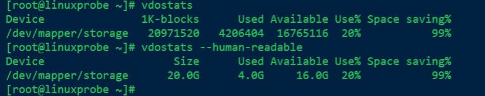

**这里显示的是物理大小，如果想查阅逻辑大小，使用df命令查看**
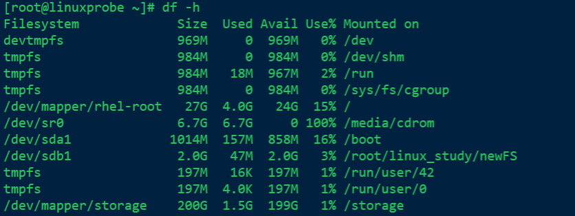

**使用UUID号，永久挂载vdo设备卷**


### 软硬方式链接
+ **软链接**：也叫符号链接（symbolic link），仅仅包含所链接文件的名称和路径，很像一个记录地址的标签。**当原始文件被删除或移动后，新的链接文件也会随之失效，不能被访问。**与Windows中的快捷方式具有**一样的性质；
+ **硬链接**：**可以将它理解为一个“指向原始文件block 的指针”，系统会创建出一个与原来一模一样的inode 信息块。**硬链接文件与原始文件其实是一模一样的，只是名字不同。每添加一个硬链接，该文件的inode 个数就会增加1；而且只有当该文件的inode 个数为0 时，才算彻底将它删除。换言之，由于硬链接实际上是指向原文件block 的指针，因此即便原始文件被删除，依然可以通过硬链接文件来访问。需要注意的是，由于技术的局限性，**不能跨分区对目录文件进行硬链接**。

#### ln命令
~~~bash
ln: 用于创建文件的软硬链接，英文全称：“link”
语法： ln [参数] 原始文件名 链接文件名
	-s: 创建“符号链接”（如果不带-s参数，则默认创建硬链接）
	-f: 强制创建文件或目录的链接
	-i: 覆盖前先询问
	-v: 显示创建链接的过程
~~~


>**创建的硬链接文件竟然会让文件属性第二列的数字变成了2，这个数字表示的是文件的inode 信息块的数量。**即便删除了原始文件，新的文件也会一如既往地可以读取，因为只有当文件inode 数量被“清零”时，才真正代表这个文件被删除了。

## 第七章 使用RAID与LVM磁盘阵列技术

本章讲解了如下内容：
+  RAID（独立冗余磁盘阵列）；
+ LVM（逻辑卷管理器）；
### RAID(独立冗余磁盘阵列)

>RAID技术通过把多个硬盘设备组合成一个容量更大、安全性更好的磁盘阵列，并把数据切割成多个区段后分别存放在各个不同的物理硬盘设备上，然后利用分散读写技术来提升磁盘阵列整体的性能，同时把多个重要数据的**副本同步**到不同的物理硬盘设备上，从而起到了非常好的数据冗余备份效果。

>RAID 不仅**降低了硬盘设备损坏后丢失数据的几率**，还**提升了硬盘设备的读写速度**，所以它在绝大多数运营商或大中型企业中得到了广泛部署和应用。

常见方案：


#### RAID 0 

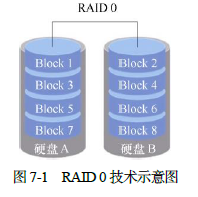

>+ RAID 0 技术能够有效地提升硬盘数据的吞吐速度，但是不具备数据备份和错误修复能力。如图7-1 所示，数据被分别写入到不同的硬盘设备中，即硬盘A 和硬盘B 设备会分别保存数据资料，最终实现提升读取、写入速度的效果。
>+ 若任意一块硬盘发生故障，将导致整个系统的数据都会受到破坏。

#### RAID 1


>+ 写入操作速度低，读取速度相对较高
>+ 安全性高

#### RAID 5

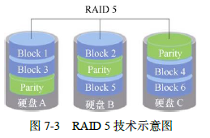

>+ 图7-3 中Parity 部分存放的就是数据的奇偶校验信息。换句话说，就是RAID 5 技术实际上没有备份硬盘中的真实数据信息，而是当硬盘设备出现问题后通过奇偶校验信息来尝试重建损坏的数据。
>+ RAID5最少由3块硬盘组成，使用的是硬盘切割（Disk Striping）技术。
#### RAID 10


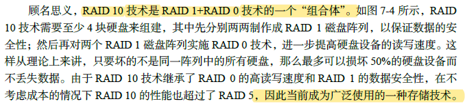
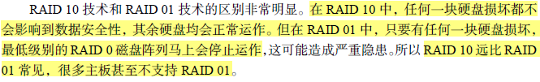

#### 部署磁盘阵列

~~~bash
mdadm: 用于创建、调整、监控和管理RAID设备，英文“multiple devices admin”
语法：mdadm [参数] 硬盘名称
	-a: 检测设备名称
	-n: 指定设备数量
	-l: 指定RAID级别
	-x：设备备份盘
	-C: 创建一个RAID阵列卡
	-v: 显示创建过程
	-f: 模拟设备损坏过程
	-r: 移除设备
	-Q: 查看摘要信息
	-D: 查看详细信息
	-S: 停止RAID磁盘阵列
	
~~~
```bash
mdadm -Cv /dev/md0 -n 4 -l 10 /dev/sdb /dev/sdc /dev/sdd /dev/sde
```


```bash
mdadm -Q /dev/md0
```


**RAID10它通过两两一组硬盘组成的RAID 1 磁盘阵列保证了数据的可靠性，其中每一份数据都会被保存两次，因此导致硬盘存在50%的使用率和50%的冗余率。这样一来，80GB 的硬盘容量也就只有一半了。**

然后格式化磁盘
`mkfs.ext4 /dev/md0
`


挂载磁盘

`mount /dev/md0 /RAID`


永久挂载

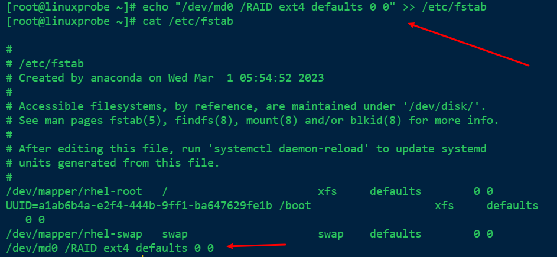

#### 损坏磁盘阵列及修复

>在确认有一块物理硬盘设备出现损坏而不能再继续正常使用后，应该使用mdadm 命令将其移除，然后查看RAID 磁盘阵列的状态，可以发现状态已经改变：


`-f`模拟磁盘损坏的效果


`-D`查看磁盘详细信息


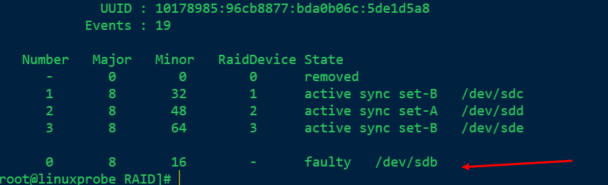

`-r`移除设备


`-a`更换硬盘设备后通过-a添加操作


`mdadm -D /dev/md0`


#### 磁盘阵列+备份盘

`mdadm -Cv /dev/md0 -n 3 -l 5 -x 1 /dev/sdb /dev/sdc /dev/sdd /dev/sde`

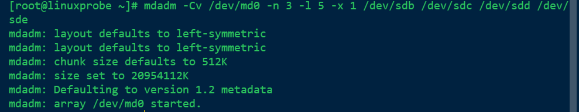

存在一个备份盘：

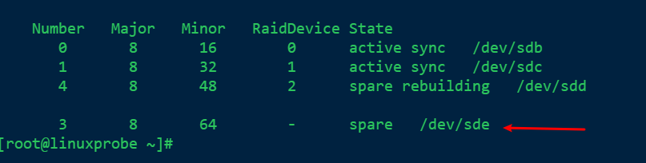

`格式化+挂载/dev/md0`

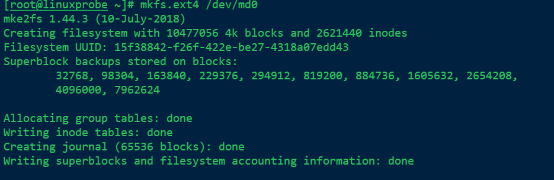

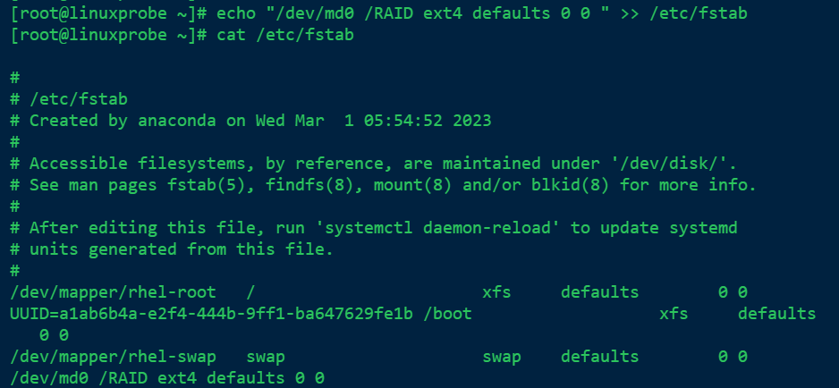


>再次把硬盘设备/dev/sdb 移出磁盘阵列，然后迅速查看/dev/md0 磁盘阵列的状态，就会发现备份盘已经被自动顶替上去并开始了数据同步。


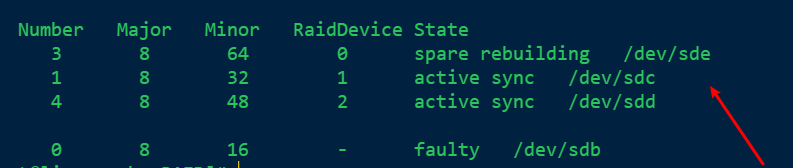
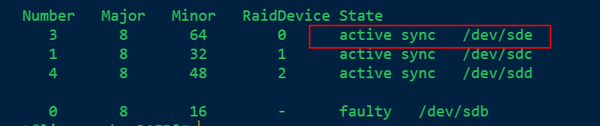


#### 删除磁盘阵列

1. 卸载磁盘、将所有磁盘设置成停用状态


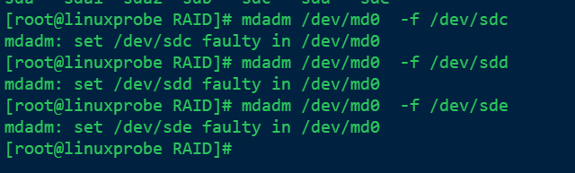

2. 逐一移除出去

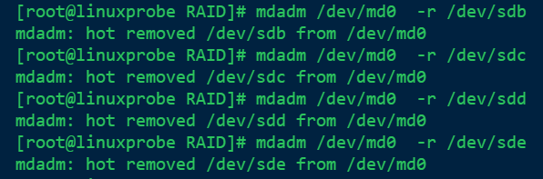

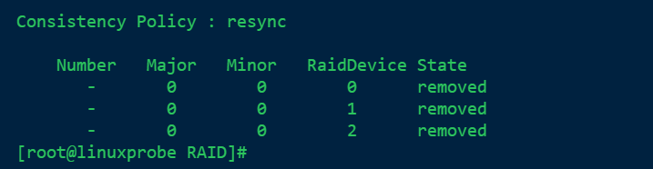


3. 停用整个RAID 磁盘阵列

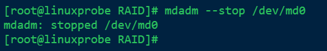


### LVM（逻辑卷管理器）
>+ 硬盘分好区或者部署为RAID磁盘阵列之后，再想修改硬盘分区大小就不容易了。
>+ 这时就需要用到另外一项非常普及的硬盘设备资源管理技术了——逻辑卷管理器（Logical Volume Manager，LVM）。LVM 允许用户对硬盘资源进行动态调整。
>+ LVM 是Linux 系统用于对硬盘分区进行管理的一种机制，理论性较强，其创建初衷是为了解决硬盘设备在创建分区后不易修改分区大小的缺陷。
>


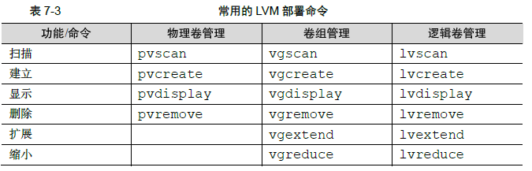
#### 部署逻辑卷
1. 让新添加的两块硬盘设备支持LVM技术

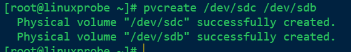


2. 把两块硬盘设备加入到storage卷中，然后查看卷组的状态。


查看vg信息


3. 切割出一个约为150MB的逻辑卷设备


`lvcreate -n vo -l 37 storage`


`lvdisplay`

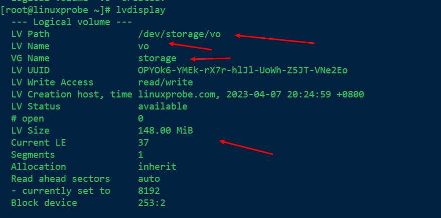

4. 把生成好的**逻辑卷**进行格式化，然后挂载使用

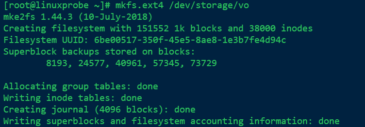


>**如果使用了逻辑卷管理器，则不建议用XFS 文件系统，因为XFS 文件系统自身就可以使用xfs_growfs 命令进行磁盘扩容。这虽然不比LVM 灵活，但起码也够用。在实测阶段我们发现，在有一些服务器上，XFS 与LVM 的兼容性并不好。**


5. 查看挂载状态，并写入配置文件，使其永久生效

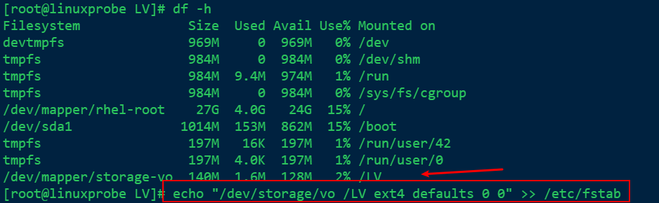

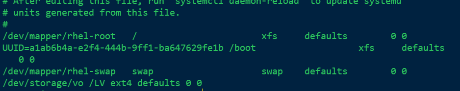

#### 扩容逻辑卷

> 在前面的实验中，卷组是由两块硬盘设备共同组成的。用户在使用存储设备时感知不到设备底层的架构和布局，更不用关心底层是由多少块硬盘组成的，只要卷组中有足够的资源，就可以一直为逻辑卷扩容。**扩容前请一定要记得卸载设备和挂载点的关联。**


`umount /LV`

1. 把逻辑卷vo的大小从148M扩容到290M

`lvextent -L 290M /dev/storage`


2. 检查硬盘的完整性，确认目录结构、内容和文件内容没有丢失。一般情况下没有报错，均为正常情况。

[e2fsck命令 – 检查使用 Linux ext2档案系统的partition是否正常工作](https://www.linuxcool.com/e2fsck#:~:text=e2fsck%E5%91%BD%E4%BB%A4%E7%94%A8%E4%BA%8E%E6%A3%80%E6%9F%A5%E4%BD%BF%E7%94%A8%20Linux%20ext2%20%E6%A1%A3%E6%A1%88%E7%B3%BB%E7%BB%9F%E7%9A%84,partition%20%E6%98%AF%E5%90%A6%E6%AD%A3%E5%B8%B8%E5%B7%A5%E4%BD%9C%E3%80%82.%20e2fsck%E5%91%BD%E4%BB%A4%E5%8F%AF%E4%BB%A5%E6%A3%80%E6%9F%A5ext2%E3%80%81ext3%E3%80%81ext4%E6%96%87%E4%BB%B6%E7%B3%BB%E7%BB%9F%EF%BC%8C%E5%A6%82%E6%9E%9C%E7%B3%BB%E7%BB%9F%E5%B7%B2%E7%BB%8F%E6%8C%82%E8%BD%BD%E4%BA%86%EF%BC%8C%E9%82%A3%E4%B9%88%E4%B8%8D%E5%BB%BA%E8%AE%AE%E5%8E%BB%E6%A3%80%E6%9F%A5%EF%BC%8C%E5%9B%A0%E4%B8%BA%E8%BF%99%E6%A0%B7%E6%98%AF%E4%B8%8D%E5%AE%89%E5%85%A8%E7%9A%84%E3%80%82.%20%E6%AD%A4%E5%91%BD%E4%BB%A4%E7%9A%84%E9%80%82%E7%94%A8%E8%8C%83%E5%9B%B4%EF%BC%9ARedHat%E3%80%81RHEL%E3%80%81Ubuntu%E3%80%81CentOS%E3%80%81SUSE%E3%80%81openSUSE%E3%80%81Fedora%E3%80%82.)

`e2fsck -f /dev/storage/vo
`
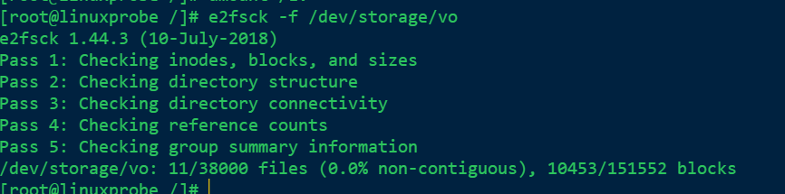

3. 重置设备在系统中的容量。刚刚是对LV（逻辑卷）设备进行了扩容操作，但系统内核还没有同步到这部分新修改的信息，需要手动进行同步。

`resize2fs /dev/storage/vo`

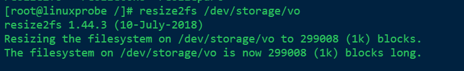

4. 重新挂载硬盘设备并查看挂载状态


#### 缩小逻辑卷

**卸载文件系统**

`umount /LV
`
1. 检查文件系统的完整性

`e2fsck -f /dev/storage/vo`


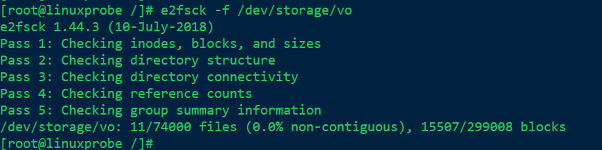

2. 通知系统内核将逻辑卷vo 的容量减小到120MB。
`resize2fs /dev/storage/vl 120M
`
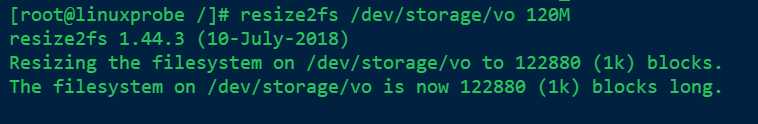


3. 将LV（逻辑卷）的容量修改为120M
`lvreduce -L 120M /dev/storage/vo`

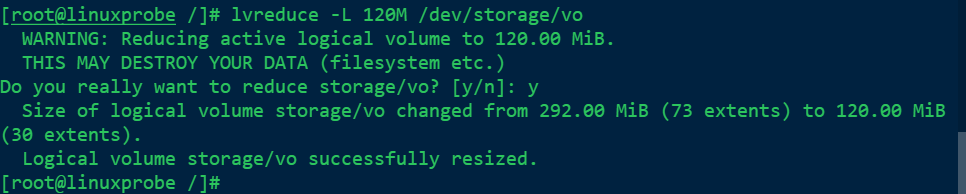

**缩容操作先通知系统内核自己想缩小逻辑卷，如果在执行resize2fs 命令后系统没有报错，再正式操作。**

4. 重新挂载文件系统并查看系统状态。

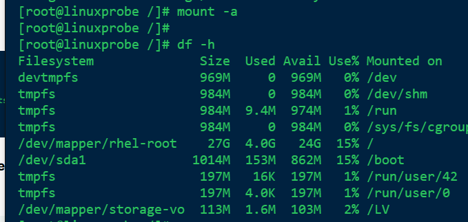

#### 逻辑卷快照

>LVM 还具备有“快照卷”功能，该功能类似于虚拟机软件的还原时间点功能。

**快照卷功能的两个特点**
+ 快照卷的容量必须等同于逻辑卷的容量；
+ 快照卷仅一次有效，一旦执行还原操作后则会被立即自动删除。

在正式操作前，先看看VG（卷组）中的容量是否够用
`vgdisplay`

1. 使用`-s` 参数生成一个快照卷，使用`-L `参数指定切割的大小，**需要与要做快照的设备容量保持一致**。另外，还需要在命令后面写上是针对哪个逻辑卷执行的快照操作，稍后数据也会还原到这个相应的设备上。

`lvcreate -L 120M -s -n SNAP /dev/storage/vo
`


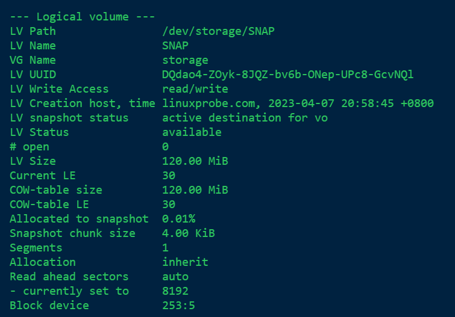

2. 在逻辑卷所挂载的目录中创建一个100MB 的垃圾文件，然后再查看快照卷的状态。可以发现存储空间的占用量上升了。

`dd if=/dev/zero of=/LV/files count=1 bs=100M`


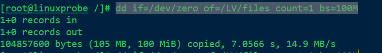


3. 为了校验快照卷的效果，需要对逻辑卷进行快照还原操作。**在此之前记得先卸载掉逻辑卷设备与目录的挂载。**
~~~
	lvconvert命令用于管理逻辑卷的快照 
	语法格式为 lvconvert [参数] 快照卷名称
~~~

`lvconvert --merge /dev/storage/SNAP`


4. 快照卷会被自动删除掉，并且刚刚在逻辑卷设备被执行快照操作后再创建出来的100MB 的垃圾文件也被清除了。


#### 删除逻辑卷
**依次删除逻辑卷、卷组、物理卷设备，这个顺序不可颠倒。**
1. 取消逻辑卷与目录的挂载关联，删除配置文件中永久生效的设备参数。


2. 删除逻辑卷设备，需要输入y 来确认操作。


3. 删除卷组，此处只写卷组名称即可，不需要设备的绝对路径。


4. 删除物理卷设备


## 第八章 使用iptables与firewalld防火墙

> 本章主要内容：
> + 防火墙管理工具；
> + iptables
> + firewalld;
> + 服务的访问控制列表；
> + Cockpit驾驶舱管理工具；

### 防火墙管理工具
**在公网与企业内网之间充当保护屏障的防火墙（见图8-1）虽然有软件或硬件之分，但主要功能都是依据策略对穿越防火墙自身的流量进行过滤。防火墙策略可以基于流量的源目地址、端口号、协议、应用等信息来定制，然后防火墙使用预先定制的策略规则监控出入的流量，若流量与某一条策略规则相匹配，则执行相应的处理，反之则丢弃。**


>1. 其实，iptables 与firewalld 都不是真正的防火墙，它们都只是用来定义防火墙策略的防火墙管理工具而已；或者说它们只是一种服务。
>2. iptables 服务会把配置好的防火墙策略交由内核层面的`netfilter` 网络过滤器来处理；
>3. 而firewalld 服务则是把配置好的防火墙策略交由内核层面的`nftables` 包过滤框架来处理。

### iptables
### 策略与规则链

>+ 防火墙会按照从上到下的顺序来读取配置的策略规则，在找到匹配项后就立即结束匹配工作并去执行匹配项中定义的行为（即放行或阻止）。
>+ 如果在读取完所有的策略规则之后没有匹配项，就去执行默认的策略。
>

规则链依据数据包处理位置不同进行分类：
+ 在进行路由选择前处理数据包（PREROUTING）;
+ 处理流入的数据包（INPUT）；
+ 处理流出的数据包（OUTPUT）；
+ 处理转发的数据包（FORWARD）；
+ 在进行路由选择后处理数据包（POSTROUTING）；

### 基本的名命令参数

>+ 根据OSI七层模型的定义，iptables数据数据链路层的服务，所以可以根据流量的源地址、目的地址、传输协议、服务类型等信息进行匹配；
>+ 一点匹配成功，iptables就会根据策略规则所预设的动作来处理这些流量；
>+ 防火墙策略规则的匹配顺序是从上到下的，因此要把较为严格、优先级较高的策略规则放到前面。


1. 在iptables命令后添加`-L` 参数查看已有的防火墙规则链。


2. 在iptables命令后添加`-F`参数清空已有的防火墙规则链。


3. 把INPUT规则链的默认策略都设置为拒绝。`-P`设置默认策略


%%此时ssh连接流量已经被拒绝了，所以只能用本机的终端了，哈哈哈%%
**当把INPUT 链设置为默认拒绝后，就要往里面写入允许策略了，否则所有流入的数据包都会被默认拒绝掉。**

**规则链的默认策略拒绝动作只能是DROP，而不能是REJECT。**

4. 向INPUT链中添加允许ICMP流量进入的策略规则
`-I` 在规则链的头部加入新规则
`-p` 协议类型
`-j` 目标动作

```bash
iptables -I INPUT -p icmp -j ACCEPT
```


5. 删除INPUT规则链中刚刚加入的那条策略（允许ICMP流量），并把默认策略设置为允许。
`-D` 删除某一条指定的策略，可以按规则序号和内容删除


6. 将INPUT规则链设置为只允许指定网段的主机访问本机的22端口，拒绝来自其它所有主机的流量。
```bash
iptables -I INPUT -s 192.168.10.0/24 -p tcp --dport 22 -j ACCEPT

iptables -A INPUT -p tcp --dport 22 -j REJECT
```


>**防火墙策略规则是按照从上到下的顺序匹配的，因此一定要把允许动作放到拒绝动作前面，否则所有的流量就将被拒绝掉，从而导致任何主机都无法访问我们的服务。**

7. 向INPUT规则链中添加拒绝所有人访问本机12345端口的策略规则
```bash
iptables -I INPUT -p tcp --dport 12345 -j REJECT
iptables -I INPUT -p udp --dport 12345 -j REJECT
```


8. 向INPUT规则链中添加拒绝192.168.10.5主机访问本机80端口（Web服务）的策略规则。

```bash
iptables -I INPUT -p tcp -s 192.168.10.5  --dport 80 -j REJECT
```


9. 向INPUT规则链中添加拒绝所有主机访问本机1000-1024端口的策略
`前面在添加防火墙策略时，使用的是-I 参数，它默认会把规则添加到最上面的位置，因此优先级是最高的。如果工作中需要添加一条最后“兜底”的规则，那就用-A 参数吧。`
```bash
iptables -A INPUT -p tcp --dport 1000:1024 -j REJECT&&iptables -A INPUT -p udp --dport 1000:1024 -j REJECT
```


**但是请特别注意，使用iptables 命令配置的防火墙规则默认会在系统下一次重启时失效，如果想让配置的防火墙策略永久生效，还要执行保存命令：**
`iptables-save`


### firewalld

>firewalld（Dynamic Firewall Manager of Linux systems，Linux 系统的动态防火墙管理器）服务是默认的防火墙配置管理工具，它拥有基于CLI（命令行界面）和基于GUI（图形用户界面）的两种管理方式。

>相较于传统的防火墙管理配置工具，firewalld 支持动态更新技术并加入了区域（zone）的概念。简单来说，区域就是firewalld 预先准备了几套防火墙策略集合（策略模板），用户可以根据生产场景的不同而选择合适的策略集合，从而实现防火墙策略之间的快速切换。


>**如果想让配置策略一直存在，就需要使用永久（Permanent）模式了，方法就是在命令firewall-cmd正常设置防火墙策略时添加`--permanent`参数，这样配置的防火墙策略就可以永久生效了。
>如果想让配置的策略立即生效，需要手动执行`firewall-cmd --reload` 命令。**

1. 查看firewalld服务当前所使用的区域
`firewall-cmd --get-defaults-zone`


2. 查询指定网卡在firewalld服务中绑定的区域
`firewall-cmd --get-zone-of-interface=ens160`


3. 把网卡默认区域修改为external，并在系统重启后生效。
`firewall-cmd --permanent --zone=external --change-interface=ens160`
`firewall-cmd --permanent --get-zone-of-interface=ens160`


4. 把firewalld服务的默认区域设置为public
`firewall-cmd --set-default-zone=public`

>默认区域也叫全局配置，指的是对所有网卡都生效的配置，优先级较低。在下面的代码中可以看到，当前默认区域为public，而ens160 网卡的区域为external。此时便是以网卡的区域名称为准。


5. 启动和关闭firewalld防火墙服务的应急状况模式。

>使用`--panic-on` 参数会立即切断一切网络连接，而使用`--panic-off`则会恢复网络连接。切记，紧急模式会切断一切网络连接，因此在远程管理服务器时，在按下回车键前一定要三思。


6. 查询SSH和HTTPS协议的流量是否允许放行

>在工作中可以不使用--zone 参数指定区域名称，firewall-cmd 命令会自动依据默认区域进行查询，从而减少用户输入量。但是，如果默认区域与网卡所绑定的不一致时，就会发生冲突，因此规范写法的zone 参数是一定要加的。


7. 把HTTPS协议的流量设置为永久允许放行，并立即生效。
`firewall-cmd --permanent --zone=public --add-service=https`


还是没有设置完成。如果不想重启计算机，需要使用--reload参数更新。

`firewall-cmd --reload`
`firewall-cmd --zone=public --query-service=https`


8. 把HTTP协议的流量设置为永久拒绝，并立即生效
`firewall-cmd --permanent --zone=public --remove=service=http`
`firewall-cmd --reload`


9. 把访问8080和8081端口的流量策略设置为允许，但仅限当前生效
`firwall-cmd --zone=public -add-port=8080-8081/tcp`


10. 把原本访问本机888端口的流量转发到22端口，而且要求当前和长期均有效
`firewall-cmd --permanent --zone=public --add-forward-port=port=888:proto=tcp:toport=22:toaddr=192.168.10.12`
`firewall-cmd --reload`


11. 富规则的设置

>富规则也叫复规则，表示更细致、更详细的防火墙策略配置，它可以针对系统服务、端口号、源地址和目标地址等诸多信息进行更有针对性的策略配置。它的优先级在所有的防火墙策略中也是最高的。

`firewall-cmd --permanent --zone=public --add-rich-rule="rule family="ipv4" source address="192.168.10.0/24" service name="ssh" reject"`


#### 图形管理工具

firewall-config


### 服务的访问控制列表

>+ TCP Wrapper是RHEL 6/7 系统中默认启用的一款流量监控程序 
>+ Linux 系统中其实有两个层面的防火墙，第一种是前面讲到的基于TCP/IP协议的流量过滤工具，而TCP Wrapper 服务则是能允许或禁止Linux 系统提供服务的防火墙，从而在更高层面保护了Linux 系统的安全运行。


### Cockpit驾驶舱管理工具
Cockpit 是一个基于Web 的图形化服务管理工具

`dnf install cockpit`
`systemctl start cockpit`
`systemctl enable cockpit.socket`
在Cockpit 服务启动后，打开系统自带的浏览器，在地址栏中输入“本机地址:9090”即可访问.


## 第九章 使用SSH服务管理远程主机

本章主要讲解内容：
+ 配置网络服务
+ 远程控制服务
+ 不间断会话服务
+ 检索日志信息

### 配置网络服务

#### 配置网卡参数
**在RHEL 8 系统中至少有5 种网络的配置方法**

`nmtui`命令配置网络


选择ens160网卡进行编辑


把网卡ipv4的配置方式改为Maual（手动）


按下show按钮，（show按钮的功能就是展开的意思）


填写IP 地址和子网掩码

单击OK 按钮保存配置


至此，在Linux 系统中配置网络的步骤就结束了。

>在安装RHEL 8系统时默认没有激活网卡，只需使用Vim 编辑器将网卡配置文件中的ONBOOT参数修改成yes，这样在系统重启后网卡就被激活了。

~~~bash
vim /etc/sysconfig/network-scripts/ifcfg-ens160
~~~


当修改完Linux 系统中的服务配置文件后，并不会对服务程序立即产生效果。要想让服务程序获取到最新的配置文件，需要手动重启相应的服务、
~~~bash
nmcli connection reload ens160
nmcli connection up ens160
~~~~

[nmcli命令行网络配置](https://blog.csdn.net/ymz641/article/details/111465599)

#### 创建网络会话
>RHEL和CentOS系统默认使用`NetWorkManager`来提供网络服务，这是一种**动态管理网络配置的守护进程**，能够让网络设备保持连接状态。可以使用`nmcli`命令来管理NetWorkManager服务程序。它是一款基于命令行的网络配置工具。


>+ RHEL8系统支持**网络会话**功能，允许用户在多个配置文件中快速切换。使用nmcli命令按照`connection add con-name type ifname`的格式来创建网络会话。


>+ 使用`con-name`参数指定公司所使用的网络会话为company，然后依次用`ifname`参数指定本机的网卡名称，用`autoconnect no` 参数将网络会话设置为默认不被自动激活，用`ip4`和`gw4`参数手动指定网络的IP地址。

`nmcli connection add con-name company ifname ens160 autoconnect no type ethernet ip4 192.168.10.10/24 gw4 192.168.10.2


>+ 使用con-name 参数指定家庭所使用的网络会话名称house。**因为要从外部DHCP 服务器自动获得IP 地址，所以这里不需要进行手动指定。**

`nmcli connection add con-name house type ethernet ifname ens160`


在成功创建网络会话后，可以使用nmcli命令查看创建的所有网络会话：
`nmcli connection show`


**使用nmcli 命令配置过的网络会话是永久生效的,切换网络会话到公司的网络环境**
`nmcli connection up company`


多了两个网络配置文件


**删除网络会话，直接使用delete命令**


#### 绑定两块网卡


目前是两个网卡


>左侧ens160、ens192这些原本独立的网卡设备此时需要被配置成为一块“从属”网卡，服务于右侧的bond0“主”网卡，不应该再有自己的地址等信息。在进行了初始设置之后，它们就可以支持网卡绑定。

1. **创建出一个bond网卡**
`nmcli connection add con-name bond0 type bond ifname bond0 bond.options "mode=balance-rr"`


>+ balance-rr为网卡绑定模式，其中rr是round-robin的缩写，全称为轮循模式。
>+ activate-backup：主备模式。


2. 向bond0设备中添加从属网卡

>刚才创建成功的bond0 设备当前仅仅是个名称，里面并没有真正能为用户传输数据的网卡设备，接下来使用下面的命令把ens160 和ens192 网卡添加进来。

`nmcli connection add type ethernet slave-type bond con-name bond0-part1 ifname ens160 master bond0`

`nmcli connection add type ethernet slave-type bond con-name bond0-part2 ifname ens192 master bond0`


3. 配置bond0设备的网络信息

>用nmcli 命令依次配置网络的IP 地址及子网掩码、网关、DNS、搜索域和手动配置等参数。如果不习惯这个命令，也可以直接编辑网卡配置文件，或使用nmtui 命令完成下面的操作

```bash
[root@linuxprobe ~]# nmcli connection modify bond0 ipv4.addresses 192.168.10.12/24

[root@linuxprobe ~]# nmcli connection modify bond0 ipv4.gateway 192.168.10.2

[root@linuxprobe ~]# nmcli connection modify bond0 ipv4.dns 192.168.10.2

[root@linuxprobe ~]# nmcli connection modify bond0 ipv4.dns-search linuxprobe.com

[root@linuxprobe ~]# nmcli connection modify bond0 ipv4.method manual
```


4. 启动bond0网卡

`nmcli connection up bond0`


`nmcli device status` 查看设备的详细列表


### 远程控制服务

#### 配置sshd服务

>+ SSH（Secure Shell）是一种能够以安全的方式提供远程登录的协议，也是目前远程管理Linux系统的首选方式。
>+ 想要使用SSH 协议来远程管理Linux 系统，则需要配置部署sshd 服务程序。sshd 是基于SSH协议开发的一款远程管理服务程序，不仅使用起来方便快捷，而且能够提供两种安全验证的方法：
>	+ **基于密码的验证**——用账号密码来验证登录；
>	+ **基于密钥的验证**——在本地生成密钥对，公钥上传服务器，私钥本地存储。

**sshd服务的配置信息保存在/etc/ssh/sshd_config文件**


#### 安全密钥验证

1. 在客户端主机中生成“密钥对”，**记住是客户端**  `ssh-keygen`


2. 在客户端主机中生成的公钥文件传送到远程服务器。`ssh-copy-id ipaddress`


3. 对服务器进行设置，使其只允许密钥验证，拒绝传统的密码验证方式。记得在修改配置文件后保存并重启sshd 服务程序。


4. 客户端尝试登录到服务器，此时无须输入密码也可成功登录，特别方便


#### 远程传输命令

~~~~bash
scp：基于SSH协议在网络上进行安全传输的命令

语法：scp [参数] 本地文件 远程账户@远程ip：远程目录
还可以使scp命令把远程服务器上的文件下载到本地主机，其命令格式为
 “scp [参数]远程用户@IP远程地址:远程文件 本地目录”

~~~~


### 不间断会话服务

>Terminal Multiplexer（终端复用器，简称为Tmux）是一款能够实现多窗口远程控制的开源服务程序。简单来说就是为了解决网络异常中断或为了同时控制多个远程终端窗口而设计的程序。用户还可以使用Tmux 服务程序同时在多个远程会话中自由切换，能够实现如下功能。
>+ 会话恢复：即使网络中断，也可让会话随时恢复，确保用户不会失去对远程会话的控制。
>+ 多窗口：每个会话都是独立运行的，拥有各自独立的输入输出终端窗口。
>+ 会话共享：当多个用户同时登录到远程服务器时，便可以使用会话共享功能让用户之间的输入输出信息共享。

`dnf install tmux`

#### 管理远程会话

>Tmux服务能做的事情非常多，例如创建不间断会话、恢复离线工作、将界面切分为不同的窗格、共享会话等


里面分别显示的是会话编号、名称、主机名及系统时间。

这时就已经进入Tmux 会话中了，在里面执行的任何操作都会被后台记录下来。
假设我们突然要去忙其他事情，但会话窗口中执行的进程还不能被中断，此时便可以用detach 参数将会话隐藏到后台。虽然看起来与刚才没有不同，但实际上可以看到当前的会话正在工作中：


`tmux ls`


>回归到backup 会话中的方法很简单，直接在tmux 命令后面加attach 和会话编号或会话名称就可以。关闭会话窗口之前正在进行的一切工作状态都会被原原本本地呈现出来，丝毫不受影响：

`tmux attach -t backup`

#### 管理多窗格

>+ 使用“tmux split-window”命令可以创建上下切割的多窗格终端界面
>+ 使用“tmux split-window -h”命令可以创建左右切割的多窗格终端界面


**Ctrl+B+方向键**可以调整窗格的尺寸


>通过输入命令来切换窗格难免有些麻烦，实际上Tmux 服务为用户提供了一系列快捷键来执行窗格的切换。方法是先同时按下Ctrl+B 组合键，然后松手后再迅速按下其他后续按键， 而不是一起按下。


#### 会话共享功能
>当多个用户同时控制服务器的时候，它可以把服务器屏幕内容共享出来。也就是说，每个用户都能够看到相同的内容，还能一起同时操作


```bash
tmux new -s share

tmux attach -t share
```


### 检索日志信息

>在RHEL 8 系统中，默认的日志服务程序是rsyslog。可以将rsyslog 理解成之前的syslogd服务的增强版本，它更加注重日志的安全性和性能指标。


>从理论上讲，日志文件分为下面3 种类型。
>1. 系统日志：主要记录系统的运行情况和内核信息。
>2. 用户日志：主要记录用户的访问信息，包含用户名、终端名称、登入及退出时间、来源IP 地址和执行过的操作等。
>3. 程序日志：稍微大一些的服务一般都会保存一份与其同名的日志文件，里面记录着服务运行过程中各种事件的信息；每个服务程序都有自己独立的日志文件，且格式相差较大。

>`journalctl` 命令用于检索和管理系统日志信息，>英文全称为“journal control”，
>语法格式为“`journalctl 参数`”。
>它可以根据事件、类型、服务名称等信息进行信息检索，从而大大提高了日常排错的效率。


**在rsyslog 服务程序中，日志根据重要程度被分为9 个等级，**


## 第十章 使用Apache服务配置静态网站

本章主要内容：
+ 网站服务程序
+ 配置服务文件参数
+ SELinux安全子系统
+ 个人用户主页功能
+ 虚拟主机功能
+ Apache的访问控制

### 网站服务程序

目前能够提供WEB网络服务的程序有IIS、Nginx、Apache等。

`dnf install httpd` 下载安装apache web服务程序

```bash
systemctl start httpd
systemctl enable httpd
```

**安装成功**


#### 配置服务文件参数


在httpd 服务程序的主配置文件中，存在3 种类型的信息：**注释行信息、全局配置、区域配置**，如图10-4 所示。


>+ 全局配置参数就是一种全局性的配置参数，可作用于所有的子站点，既保证了子站点的正常访问，也有效降低了频繁写入重复参数的工作量。
>+ 区域配置参数则是单独针对每个独立的子站点进行设置的。


在默认情况下，网站数据保存在/var/www/html 目录中，如果想把保存网站数据的目录修改为/home/wwwroot 目录，该怎么操作呢？

1. 建立网站数据的保存目录，并创建首页文件
```bash
mkdir /home/wwwroot
echo "The New Web Directory" > /home/wwwroot/index.html
```

2. 修改/etc/httpd/conf/httpd.conf中122行用于定义网站数据保存路径的参数Document；修改127行和134行用于定义目录权限的参数Directory


3. 重新启动httpd 服务程序并验证效果，浏览器刷新页面后的内容如图10-6 所示。**奇怪！怎么提示权限不足了？**


#### SELinux安全子系统

>**SELinux（Security-Enhanced Linux)是美国国家安全局在Linux开源社区的帮助下开发的一个强制访问控制（MAC，Mandatory Access Control）的安全子系统。Linux系统使用SELinux技术的目的是为了让各个服务进程都受到约束，使其仅获取到本应获取的资源。**

>它能够从多方面监控违法行为：
>+ 对服务程序的功能进行限制（**SELinux域**限制可以确保服务程序做不了出格的事情）；
>+ 对文件资源的访问进行限制（**SELinux安全上下文**确保文件资源只能被其所属的服务程序进行访问）。

==注：如果一般权限和防火墙是“门窗”的话，那么SELinux 便是在门窗外面安装的“防护栏”，可以让系统内部更加安全。==

**SELinux服务有3种配置模式，具体如下：**
+ enforcing：强制启用安全策略模式，将拦截服务的不合法请求。
+ permissive：遇到服务越权访问时，只发出警告而不强制拦截。
+ disabled：对于越权的行为不警告也不拦截。

`vim /etc/selinux/config`  查看SELinux的配置策略


`getenforce` 查看当前SELinux服务的运行模式：


为了确认禁止访问修改数据目录后Apache服务的结果是因为SELinux 而导致的，可以用etenforce [0|1]命令修改SELinux 当前的运行模式（0 为禁用，1 为启用）。注意，这种修改只是临时的，在系统重启后就会失效：


---
上述这段话先思考SELinux域的使用限制，然后思考了SELinux安全上下文的限制。

---

**在ls 命令中，`-Z` 参数用于查看文件的安全上下文值，-d` 参数代表对象是个文件夹。**


>在文件上设置的SELinux 安全上下文是由**用户段、角色段以及类型段**等多个信息项共同组成的。其中，**用户段system_u 代表系统进程的身份**，**角色段object_r 代表文件目录的角色**，**类型段httpd_sys_content_t 代表网站服务的系统文件**。

针对当前这种情况，我们只需要使semanage命令，将当前网站目录/home/wwwroot的SELinux安全上下文修改为跟原始网站目录的一样就行了。

```bash
semanage: 用于管理SELinux的策略，英文全称为“SELinux manage”
语法格式：semanage [参数] [文件]
-l 查询
-a 添加
-m 修改
-d 删除
```

> 向新的网站数据目录中新添加一条SELinux安全上下文，让这个目录以及里面的所有文件能够被httpd服务程序访问到：

```bash
[root@linuxprobe conf]# semanage fcontext -a -t httpd_sys_content_t /home/wwwroot

[root@linuxprobe conf]# semanage fcontext -a -t httpd_sys_content_t /home/wwwroot/*
```


在执行上述设置之后，还无法立即访问网站，还需要使用`restorecon` 命令将设置好的SELinux 安全上下文立即生效。在使用restorecon命令时，可以加上`-Rv` 参数对指定的目录进行递归操作，以及显示SELinux 安全上下文的修改过程.

[restorecon命令 – 恢复文件安全上下文](https://www.linuxcool.com/restorecon)


### 个人用户主页功能


1. 在httpd服务中默认没有开启个人用户主页功能。我们需要编下
面的配置文件，然后在第17 行的UserDir disabled 参数前面加上井号（#），表示让httpd 服务程序开启个人用户主页功能；同时再把第24 行的UserDir public_html 参数前面的井号（#）去掉（UserDir 参数表示网站数据在用户家目录中的保存目录名称，即public_html 目录）。最后，在修改完毕后记得保存。

`vim /etc/httpd/conf.d/userdir.conf`


2. 在用户家目录中建立用于保存网站数据的目录及首页文件。另外，把家目录的权限修改为755，保证其他人也有权限读取里面的内容。


3.  重新启动httpd 服务程序，在浏览器的地址栏中输入网址，其格式为“网址/～用户名”（其中的波浪号是必需的，而且网址、波浪号、用户名之间没有空格）。从理论上来讲，现在就可以看到用户的个人网站了。出乎意料的是，系统显示报错页面。这一定还是SELinux 惹的祸。


4. 思考这次报错的原因是什么。httpd 服务程序在提供个人用户主页功能时，该用户的网站数据目录本身就应该是存放到与这位用户对应的家目录中的，所以应该不需要修改家目录的SELinux 安全上下文。但是，前文还讲到了SELinux 域的概念。SELinux 域确保服务程序不能执行违规的操作，只能本本分分地为用户提供服务。httpd 服务中突然开启的这项个人用户主页功能到底有没有被SELinux 域默认允许呢？

接下来使用getsebool 命令查询并过滤出所有与HTTP 协议相关的安全策略。其中，off为禁止状态，on 为允许状态。


大致确定后就可以用setsebool 命令来修改SELinux 策略中各条规则的布尔值了。大家一定要记得在`setsebool` 命令后面加上`-P `参数，让修改后的SELinux 策略规则永久生效且立即生效。

```bash
setsebool -P httpd_enable_homedirs=on
```


**有时，网站的拥有者并不希望直接将网页内容显示出来，而只想让通过身份验证的用户看到里面的内容，这时就可以在网站中添加密码功能了。**

1. 先使用htpasswd命令生成密码数据库，-c参数表示第一次生成；后面再分别添加密码数据库的存放文件，以及验证要用到的用户名称（该用户不必是系统中已有的本地账户）。

`htpasswd -c /etc/httpd/passwd linuxprobe`


2. 继续编辑个人用户主页功能的配置文件。把第31～37 行的参数信息修改成下列内容，其中以井号（#）开头的内容为添加的注释信息，可将其忽略。随后保存并退出配置文件，重启httpd 服务程序即可生效。

`vim /etc/httpd/conf.d/userdir.conf`


```bash
AllowOverride all
#刚 刚 生 成 出 的 密 码 验 证 文 件 保 存 路 径
authuserfile "/etc/httpd/passwd"
#当 用 户 访 问 网 站 时 的 提 示 信 息
authname "My private website"
#验 证 方 式 为 密 码 模 式
authtype basic
#访 问 网 站 时 需 要 验 证 的 用 户 名 称
require user linuxprobe
```


### 虚拟主机功能

>利用虚拟主机功能，可以把一台处于运行状态的物理服务器分割成多个“虚拟的服务器”。但是，该技术无法实现目前云主机技术的硬件资源隔离，而只能让这些虚拟的服务器共同使用物理服务器的硬件资源，供应商只能限制硬盘的使用空间大小。
>Apache的虚拟主机功能是服务器基于用户请求的不同的IP地址、主机域名或端口号，提供多个网站同时为外部提供访问服务的技术。


#### 基于IP地址

配置三个IP地址


`**nmcli connection up ens160**` 并且测试网络连通性


1. 分别在/home/wwwroot 中创建用于保存不同网站数据的3 个目录，并向其中分别写入网站的首页文件。每个首页文件中应有明确区分不同网站内容的信息，方便稍后能更直观地检查效果。


2. 从httpd服务的配置文件中大约第132行的位置，分别追加写入3个基于IP地址的虚拟主机网站参数，然后保存并退出。然后重启httpd服务。


3. 此时访问网站，则会看到httpd 服务程序的默认首页面中显示“权限不足”。大家现在应该立刻就反应过来—这是SELinux 在捣鬼。由于当前的/home/wwwroot 目录及里面的网站数据目录的SELinux 安全上下文与网站服务不吻合，因此httpd 服务程序无法获取到这些网站数据目录。我们需要手动把新的网站数据目录的SELinux 安全上下文设置正确（见前文的实验），并使用restorecon 命令让新设置的SELinux 安全上下文立即生效，这样就可以立即看到网站的访问效果了

```bash
semanage fcontext -a -t httpd_sys_content_t /home/wwwroot
```


#### 基于主机域名

当服务器无法为每个网站都分配一个独立IP 地址的时候，可以尝试让Apache 自动识别用户请求的域名，从而根据不同的域名请求来传输不同的内容。

1. 配置/etc/hosts 域名解析文件


2. 分别在/home/wwwroot 中创建用于保存不同网站数据的3 个目录，并向其中分别写入网站的首页文件。每个首页文件中应有明确区分不同网站内容的信息，方便稍后能更直观地检查效果。

~~~bash
[root@linuxprobe~]# mkdir -p /home/wwwroot/linuxprobe
[root@linuxprobe~]# mkdir -p /home/wwwroot/linuxcool
[root@linuxprobe~]# mkdir -p /home/wwwroot/linuxdown
[root@linuxprobe~]# echo "www.linuxprobe.com" > /home/wwwroot/linuxprobe/index.html
[root@linuxprobe~]# echo "www.linuxcool.com" > /home/wwwroot/linuxcool/index.html
[root@linuxprobe~]# echo "www.linuxdown.com" > /home/wwwroot/linuxdown/index.html
~~~

3. ：从httpd 服务的配置文件中大约第132 行处开始，分别追加写入3 个基于主机名的虚拟主机网站参数，然后保存并退出。记得需要重启httpd 服务，这些配置才生效。


4. 因为当前的网站数据目录还是在/home/wwwroot 目录中，因此还是必须要正确设置网站数据目录文件的SELinux 安全上下文，使其与网站服务功能相吻合。最后记得用restorecon 命令让新配置的SELinux 安全上下文立即生效，这样就可以立即访问到虚拟主机网站了

```bash
semanage fcontext -a -t httpd_sys_content_t /home/wwwroot
```


#### 基于端口号

基于端口号的虚拟主机功能可以让用户通过指定的端口号来访问服务器上的网站资源。

>在使用Apache 配置虚拟网站主机功能时，基于端口号的配置方式是最复杂的。因此我们不仅要考虑httpd 服务程序的配置因素，还需要考虑到SELinux 服务对新开设端口的监控。


1. 分别在/home/wwwroot 中创建用于保存不同网站数据的3 个目录，并向其中分别写入网站的首页文件。每个首页文件中应有明确区分不同网站内容的信息，方便稍后能更直观地检查效果。
```bash
[root@linuxprobe~]# mkdir -p /home/wwwroot/6111
[root@linuxprobe~]# mkdir -p /home/wwwroot/6222
[root@linuxprobe~]# mkdir -p /home/wwwroot/6333
[root@linuxprobe~]# echo "port:6111" > /home/wwwroot/6111/index.html
[root@linuxprobe~]# echo "port:6222" > /home/wwwroot/6222/index.html
[root@linuxprobe~]# echo "port:6333" > /home/wwwroot/6333/index.html
```

2. 在httpd 服务配置文件的第46 行～48 行分别添加用于监听6111、6222 和6333端口的参数。


3. 从httpd 服务的配置文件中大约第134 行处开始，分别追加写入3 个基于端口号的虚拟主机网站参数，然后保存并退出。记得需要重启httpd 服务，这些配置才生效。


4.因为我们把网站数据目录存放在/home/wwwroot 目录中，因此还是必须要正确设置网站数据目录文件的SELinux 安全上下文，使其与网站服务功能相吻合。最后记得用restorecon 命令让新配置的SELinux 安全上下文立即生效。
```bash
semanage fcontext -a -t httpd_sys_content_t /home/wwwroot/*
```
**重启服务报错**


>这是因为SELinux 服务检测到6111、6222 和6333 端口原本不属于Apache 服务应该需要的资源，但现在却以httpd 服务程序的名义监听使用了，所以SELinux 会拒绝使用Apache 服务使用这3 个端口。可以使用semanage 命令查询并过滤出所有与HTTP 协议相关且SELinux 服务允许的端口列表。

`semanage port -l | grep http`


5. SELinux 允许的与HTTP 协议相关的端口号中默认没有包含6111、6222 和6333，因此需要将这3 个端口号手动添加进去。该操作会立即生效，而且在系统重启过后依然有效。设置好后再重启httpd 服务程序，然后就可以看到网页内容了

```bash
semanage port -a -t http_port_t -p tcp 6111
semanage port -a -t http_port_t -p tcp 6222
semanage port -a -t http_port_t -p tcp 6333
```


### Apache的访问控制


1. 先在服务器上的网站数据目录中新建一个子目录，并在这个子目录中创建一个包含Successful 单词的首页文件。


2. 打开httpd 服务的配置文件，在第161 行后面添加下述规则来限制源主机的访问。这段规则的含义是允许使用Firefox 浏览器的主机访问服务器上的首页文件，除此之外的所有请求都将被拒绝。


除了匹配浏览器特征之外，还可以匹配源IP

~~~bash
<Directory "/var/www/html/server">
	Order allow,deny
	Allow from 192.168.10.20
</Directory>
~~~

## 第十一章 vstfpd服务传输文件

本章主要内容：
+ 文件传输协议
+ vsftpd服务程序
+ TFTP简单文件传输协议

### 文件传输协议

FTP是一种在互联网中进行文件传输的协议，基于C/S模式，默认使用20、21端口，其中20端口进行数据传输，21端口进行接收客户端发出的相关FTP命令和参数。


**FTP两种工作模式：**


1. 安装vsftpd
```bash
dnf install vsftpd
```

2. 清空iptables防火墙策略

```bash
[root@linuxprobe~]# iptables -F
[root@linuxprobe~]# iptables-save
```

3. 再把FTP 协议添加到firewalld 服务的允许列表

```bash
firewall-cmd --permanent --zone=public --add-service=ftp
firewall-cmd --reload
```

4. vsftpd配置文件/etc/vsftpd/vsftpd.conf，过滤未注释的内容
```bash
[root@linuxprobe~]# cat /etc/vsftpd/vsftpd.conf
anonymous_enable=NO
local_enable=YES
write_enable=YES
local_umask=022
dirmessage_enable=YES
xferlog_enable=YES
connect_from_port_20=YES
xferlog_std_format=YES
listen=NO
listen_ipv6=YES
pam_service_name=vsftpd
userlist_enable=YES
```

5. vsftpd 服务程序主配置文件中常用的参数以及作用


### vsftpd服务程序
vsftpd 作为更加安全的文件传输协议服务程序，允许用户以3 种认证模式登录FTP 服务器。

> + 匿名开放模式
> + 本地用户模式
> + 虚拟用户模式

#### 匿名访问模式
**向匿名用户开放的权限参数以及作用**


登录ftp服务器，用户名anonymous，密码为空
在pub目录下创建目录的话，有两个前提条件
+ 修改/var/ftp/pub 文件夹所属用户
	+ chown -R ftp /var/ftp/pub
+ 修改SELinux策略
	+ setsebool -P ftp_full_access=on

#### 本地用户模式


**使用本地账号登录ftp服务器**
>+ user_list和ftpusers配置文件中限制访问账号名
>+ 其中user_list文件中userlist_deny=NO就会把user_list改为白名单。
>+ 采用本地模式，默认访问的是该用户的家目录，就不会存在像匿名登录一样访问权限不足的问题。只需修改`setsebool -P ftpd_full_access=on`即可创建、删除文件。


#### 虚拟用户模式*
#已放弃
虚拟用户模式是这3 种模式中最安全的一种认证模式


### TFTP（简单文件传输协议）

> 简单文件传输协议（Trivial File Transfer Protocol，TFTP）是一种基于UDP 协议在客户端和服务器之间进行简单文件传输的协议。顾名思义，它提供不复杂、开销不大的文件传输服务，可将其当作FTP 协议的简化版本。


```bash
dnf install tftp-server tftp xinetd
```


**TFTP的根目录为为/var/lib/tftpboot**


## 第十二章 使用Samba 或NFS 实现文件共享

本章内容：
>+ Samba文件共享服务；
>+ NFS（网络文件系统）；
>+ autofs自动挂载服务；

### Samba文件共享服务

Samba 服务程序现在已经成为在Linux 系统与Windows 系统之间共享文件的最佳选择。它是基于SMB协议开发出来的。

**安装samba客户端和服务程序**

```bash
dnf install samba samba-client
```


**删除[homes][printers][print$]**

5～8 行参数中所提到的cups的全称为Common UNIX Printing System（通用UNIX 打印系统），依然是用于打印机或打印
服务器的，继续予以删除。


>security 参数代表用户登录Samba 服务时采用的验证方式。总共有4种可用参数。
>+ share：代表主机无须验证密码。这相当于vsftpd 服务的匿名公开访问模式，比较方便，但安全性很差。
>+ user：代表登录Samba 服务时需要使用账号密码进行验证，通过后才能获取到文件。这是默认的验证方式，最为常用。
>+ domain: 代表通过域控制器进行身份验证，用来限制用户的来源域。
>+ server：代表使用独立主机验证来访用户提供的密码。这相当于集中管理账号，并不常用。

#### 配置共享资源
**创建共享资源的方法很简单，只要将表12-2中的参数写入Samba服务程序的主配置文件中，然后重启该服务即可。**


1. 创建用于访问共享资源的账户信息。

```bash
pdbedit 用于管理Samba服务程序的账号信息数据库
格式为：pdedit [选项] 账户
-u： 指定用户名
```


2. 创建用于共享资源的文件目录。然后修改selinux上下文并更新

```bash
mkdir /home/database
chown -Rf linuxprobe:linuxprobe /home/database
semanage fcontext -a -t samba_share_t /home/database
restorecon -Rv /home/database
```


3. 设置SELinux 服务与策略，使其允许通过Samba 服务程序访问普通用户家目录。


4. 在Samba 服务程序的主配置文件中


5. Samba 服务程序的配置工作基本完毕。重启服务


**为了避免防火墙限制用户访问，这里将iptables 防火墙清空，再把Samba 服务添加到firewalld 防火墙中，确保万无一失。**


6. 使用smbclient 命令来查看共享详情；-U参数指定了用户名称（用哪位用户挂载了Samba 服务，就用哪位用户的身份进行查看）；-L参数列出了共享清单。


#### Windows挂载共享

> 使用windows访问挂载在linux上的共享目录


#### Linux 挂载共享

Samba 服务程序还可以实现Linux 系统之间的文件共享。

在客户机上安装支持文件共享服务的软件包`dnf install cifs-utils`

在Linux 客户端创建一个用于挂载Samba 服务共享资源的目录,mount 命令中的-t 参数用于指定协议类型，-o 参数用于指定用户名和密码，最后追加上服务器IP 地址、共享名称和本地挂载目录即可。

```bash
[root@linuxprobe~]# mkdir /database
[root@linuxprobe~]# mount -t cifs -o username=linuxprobe,password=redhat //192.
168.10.10/database /database
```


为了开机之后自动挂载，可以按照Samba 服务的用户名、密码、共享域的顺序将相关信息写入一个认证文件中，然后让/etc/fstab 文件和系统自动加载它。为了保证不被其他人随意看到，最后把这个认证文件的权限修改为仅root 管理员才能够读写：

```bash
[root@linuxprobe~]# vim auth.smb
username=linuxprobe
password=redhat
domain=SAMBA
[root@linuxprobe~]# chmod 600 auth.smb
```
将挂载信息写入/etc/fstab 文件中，以确保共享挂载信息在服务器重启后依然生效：
```bash
[root@linuxprobe~]# vim /etc/fstab
//192.168.10.10/database database cifs credentials=/root/auth.smb 0 0
[root@linuxprobe~]# mount -a
```

### NFS（网络文件系统）
>NFS 服务可以将远程Linux 系统上的文件共享资源挂载到本地主机的目录上，从而使得本地主机（Linux 客户端）基于TCP/IP 协议，像使用本地主机上的资源那样读写远程Linux 系统上的共享文件。


`dnf install nfs-utils`

1. 安装服务程序，配置防火墙

2. 在NFS 服务器上建立用于NFS 文件共享的目录，并设置足够的权限确保其他人也有写入权限。

```bash
mkdir /nfsfile
chmod -R 777 /nfsfile
echo "welcome to linuxprobe.com" > /nfsfile/readme
```

3. NFS 服务程序的配置文件为/etc/exports，默认情况下里面没有任何内容。按照“共享目录的路径 允许访问的NFS 客户端（共享权限参数）”的格式，定义要共享的目录与相应的权限。


```bash
#让这些主机都拥有读写权限，在将数据写入到NFS 服务器的硬盘中后才会结束操作，
#最大限度保证数据不丢失，以及把来访客户端root 管理员映射为本地的匿名用户等
[root@linuxprobe~]# vim /etc/exports
/nfsfile 192.168.10.*(rw,sync,root_squash)
```

4. 启动和启用NFS 服务程序。由于在使用NFS 服务进行文件共享之前，需要使用**RPC**（Remote Procedure Call，远程过程调用）服务将NFS 服务器的IP 地址和端口号等信息发送给客户端。因此，在启动NFS 服务之前，还需要顺带重启并启用rpcbind 服务程序，并将这两个服务一并加入开机启动项中。

```bash

[root@linuxprobe~]# systemctl restart rpcbind
[root@linuxprobe~]# systemctl enable rpcbind
[root@linuxprobe~]# systemctl start nfs-server
[root@linuxprobe~]# systemctl enable nfs-server
```

5. NFS 客户端的配置步骤。先使用`showmount` 命令查询NFS 服务器的远程共享信息，该命令的必要参数如表12-8 所示，其输出格式为“共享的目录名称 允许使用客户端地址”


6. 然后在NFS 客户端创建一个挂载目录。使用mount 命令并结合-t 参数，指定要挂载的文件系统的类型，并在命令后面写上服务器的IP 地址、服务器上的共享目录以及要挂载到本地系统（即客户端）的目录。

```bash
[root@linuxprobe~]# mkdir /nfsfile
[root@linuxprobe~]# mount -t nfs 192.168.10.10:/nfsfile /nfsfile
```

7. NFS 文件共享服务能一直有效，则需要将其写入到fstab 文件中

`vim /etc/fstab`


### autofs自动挂载服务

>与mount 命令不同，autofs 服务程序是一种Linux 系统守护进程，当检测到用户试图访问一个尚未挂载的文件系统时，将自动挂载该文件系统。换句话说，**将挂载信息填入/etc/fstab 文件后，系统在每次开机时都自动将其挂载，而autofs 服务程序则是在用户需要使用该文件系统时才去动态挂载，从而节约了网络资源和服务器的硬件资源。**

`dnf install autofs`

>在autofs服务程序中，主配置文件中需要按照“挂载目录 子配置文件”的格式进行填写。
>+ 挂载目录是设备挂载位置的上一级目录。
>+ 对应的子配置文件则是对这个挂载目录内的挂载设备信息作进一步的说明。子配置文件需要用户自行定义，文件名字没有严格要求，但后缀建议以.misc 结束。

`vim /etc/auto.master`


**在子配置文件中，应按照“挂载目录 挂载文件类型及权限 :设备名称”的格式进行填写。**
`vim /etc/iso.misc`


---
**自动挂载远程nfs**

1. 在主配置文件/etc/auto.master中有一个/etc/auto.misc子配置目录。在这个子配置文件中填写挂载信息
`vim /etc/auto.misc`


2. 重启autofs服务

## 第十三章 使用BIND提供域名解析服务(***)

本章主要内容：
>+ DNS域名解析服务
>+ 安装bind服务程序
>+ 部署从服务器
>+ 安全的加密传输
>+ 部署缓存服务器
>+ 分离解析技术

### DNS域名解析服务
域名系统（Domain Name System，DNS）是一项用于管理解析域名与IP地址对应关系的技术。


DNS服务器类型：
+ 主服务器: 在特定区域内具有唯一性，负责维护该区域内的域名与IP 地址之间的对应关系。
+ 从服务器：从主服务器中获得域名与IP 地址的对应关系并进行维护，以防主服务器宕机等情况。
+ 缓存服务器：通过向其他域名解析服务器查询获得域名与IP 地址的对应关系，并将经常查询的域名信息保存到服务器本地，以此来提高重复查询时的效率。

域名查询方式：
+ 递归查询
+ 迭代查询


### 安装bind服务程序

>BIND（Berkeley Internet Name Domain，伯克利因特网名称域）服务是全球范围内使用最广泛、最安全可靠且高效的域名解析服务程序。

>大家在生产环境中安装部服务程序时加上chroot（俗称bind牢笼机制）扩展包，以便有效地限制bind服务程序仅能对自身的配置文件进行操作，以确保整个服务器的安全。

在bind 服务程序中有下面这3 个比较关键的文件:
+ 主配置文件（/etc/named.conf）：只有59 行，而且在去除注释信息和空行之后，实际有效的参数仅有30 行左右，这些参数用来定义bind 服务程序的运行。
+ 区域配置文件（/etc/named.rfc1912.zones）:用来保存域名和IP 地址对应关系的所在位置。
+ 数据配置文件目录（/var/named）：该目录用来保存域名和IP 地址真实对应关系的数据配置文件。


**在Linux 系统中，bind 服务程序的名称为named。**


#### 正向解析实验

**DNS域名解析服务中，正向解析是指根据域名（主机名）查找到对应地IP**

1. 编辑区域配置文件

添加内容
```bash
zone "linuxprobe.com" IN {
	type master;
	file "linuxprobe.com.zone";
	allow-update {none;};
};
```

2. 编辑数据配置文件 ，在/var/named目录下

```bash
cp -a named.localhost linuxprobe.com.zone
systemctl restart named
systemctl enable named
```


**域名解析记录类型**


#### 反向解析实验

1. 编辑区域配置文件

~~~bash
zone "10.168.192.in-addr.arpa" IN {
	type master;
	file "192.168.10.arpa";
	allow-update {none;};
};
~~~

2. 编辑数据配置文件

#已放弃 

## 第十四章 使用DHCP动态管理主机地址

>本章讲解了如下内容：
>+ 动态主机配置协议；
>+ 部署dhcpd 服务程序；
>+ 自动管理IP 地址；
>+ 分配固定IP 地址。

### 动态主机配置协议

**DHCP 常用名词**


### 部署dhcpd服务程序

`dnf install -y dhcp-server`
`cat /etc/dhcp/dhcpd.conf`


**dhcpd 服务程序配置文件中使用的常见参数以及作用**


```bash
[root@linuxprobe~]# vim /etc/dhcp/dhcpd.conf
ddns-update-style none;
ignore client-updates;
subnet 192.168.10.0 netmask 255.255.255.0 {
	range 192.168.10.50 192.168.10.150;
	option subnet-mask 255.255.255.0;
	option routers 192.168.10.1;
	option domain-name "linuxprobe.com";
	option domain-name-servers 192.168.10.1;
	default-lease-time 21600;
	max-lease-time 43200;
}

```

```bash
[root@linuxprobe~]# systemctl start dhcpd
[root@linuxprobe~]# systemctl enable dhcpd
```

配置防火墙

`firewall-cmd --zone=public --permanent --add-service=dhcp`
`firewall-cmd --reload`

> 在正常情况下，DHCP 的运作会经历4 个过程：请求、提供、选择和确认。当客户端顺利获得一个IP 地址及相关的网络信息后，就会发送一个ARP（Address Resolution Protocol，地址解析协议）请求给服务器。在dhcpd 服务程序收到这条信息后，也会再把这个IP 地址分配给其他主机，从根源上避免了IP 地址冲突的情况。


### 分配固定IP地址

>DHCP协议中有个术语是“预约”，它用来确保局域网中特定的设备总是获取到固定IP地址。换句话说，就dhcpd服务程序会把某IP地址私藏下来，只将其用于相匹配的特定设备。
>**使用MAC地址绑定固定IP**

```bash
[root@linuxprobe~]# vim /etc/dhcp/dhcpd.conf
ddns-update-style none;
ignore client-updates;
subnet 192.168.10.0 netmask 255.255.255.0 {
	range 192.168.10.50 192.168.10.150;
	option subnet-mask 255.255.255.0;
	option routers 192.168.10.1;
	option domain-name "linuxprobe.com";
	option domain-name-servers 192.168.10.1;
	default-lease-time 21600;
	max-lease-time 43200;
	host linuxprobe {
		hardware ethernet 00:0c:29:dd:f2:22;
		fixed-address 192.168.10.88;
		}
	
}
systemctl restart dhcpd
```

## 第十五章 使用Postfix 与Dovecot 部署邮件系统 （***）
#已放弃 


## 第十六章 使用Ansible服务实现自动化运维
> 本章主要内容：
> + Ansible 介绍与安装；
> + 设置主机清单；
> + 运行临时命令；
> + 剧本文件实战；
> + 创建及使用角色；
> + 创建和使用逻辑卷；
> + 判断主机组名；
> + 管理文件属性；
> + 管理密码库文件。

### Ansible介绍与安装

>用户可以使用Ansible 自动部署应用程序，以此实现IT基础架构的全面部署。
>Ansible 服务本身并没有批量部署的功能，它仅仅是一个框架，真正具有批量部署能力的是其所运行的模块。
>


**下面准备在系统上部署Ansible 服务程序:**

1. 配置网络，可以访问外网


2. 在原有软件仓库配置的下方，追加EPEL 扩展软件包安装源的信息。

```bash
[root@linuxprobe~]# vim /etc/yum.repos.d/rhel.repo
[BaseOS]
name=BaseOS
baseurl=file:///media/cdrom/BaseOS
enabled=1
gpgcheck=0
[AppStream]
name=AppStream
baseurl=file:///media/cdrom/AppStream
enabled=1
gpgcheck=0
[EPEL]
name=EPEL
baseurl=https://dl.fedoraproject.org/pub/epel/8/Everything/x86_64/
enabled=1
gpgcheck=0
```


3. 安装
`dnf install -y ansible`

**rhel安装没成功，改用centos系统安装成功；
在centos9上已经不支持yum安装，可以使用python的pip安装**

4. 验证安装是否成功

`ansible --version`

~~~bash
[root@localhost ~]# ansible --version
ansible [core 2.14.5]
  config file = None
  configured module search path = ['/root/.ansible/plugins/modules', '/usr/share/ansible/plugins/modules']
  ansible python module location = /usr/local/lib/python3.9/site-packages/ansible
  ansible collection location = /root/.ansible/collections:/usr/share/ansible/collections
  executable location = /usr/local/bin/ansible
  python version = 3.9.16 (main, Dec  8 2022, 00:00:00) [GCC 11.3.1 20221121 (Red Hat 11.3.1-4)] (/usr/bin/python3)
  jinja version = 3.1.2
  libyaml = True

~~~

### 设置主机清单

**主配置文件优先级**

>Ansible 服务的主配置文件存在优先级的顺序关系，默认存放在**/etc/ansible 目录中的主配置文件优先级最低**。如果在当前目录或用户家目录中也存放着一份主配置文件，则以当前目录或用户家目录中的主配置文件为主。同时存在多个Ansible 服务主配置文件时，具体优先级顺序如下表所示。


```bash
#### ansible.cfg
[defaults]
 
#inventory      = /etc/ansible/hosts   #定义Inventory
#library        = /usr/share/my_modules/  //自定义lib库存放目录 
#remote_tmp     = ~/.ansible/tmp       //零时文件远程主机存放目录
#local_tmp      = ~/.ansible/tmp       //零时文件本地存放目录
#forks          = 5                    //默认开启的并发数
#poll_interval  = 15                   //默认轮询时间间隔
#sudo_user      = root                 //默认sudo用户
#ask_sudo_pass = True                  //是否需要sudo密码
#ask_pass      = True                  //是否需要密码
#host_key_checking = False             //首次连接是否检查key认证
#roles_path    = /etc/ansible/roles    //默认下载的Roles存放的目录
#log_path = /var/log/ansible.log       //执行日志存放目录
#module_name = command                 //默认执行的模块
#action_plugins     = /usr/share/ansible/plugins/action //action插件存放目录
#callback_plugins   = /usr/share/ansible/plugins/callback //callback插件存放目录
#connection_plugins = /usr/share/ansible/plugins/connection  //connection插件存放目录
#lookup_plugins     = /usr/share/ansible/plugins/lookup //lookup插件存放目录
#vars_plugins       = /usr/share/ansible/plugins/vars //vars插件存放目录
#filter_plugins     = /usr/share/ansible/plugins/filter //filter插件存放目录
#test_plugins       = /usr/share/ansible/plugins/test //test插件存放目录
#strategy_plugins   = /usr/share/ansible/plugins/strategy //strategy插件存放目录
#fact_caching = memory                 //getfact缓存的主机信息存放方式
#retry_files_enabled = False              
#retry_files_save_path = ~/.ansible-retry  //错误重启文件存放目录
```

用户可以把要管理的主机IP地址预先写入`/etc/ansible/hosts`文件，后续再通过执行ansible命令来执行任务时就自动包含这些主机了，也就不需要每次都重复输入受管主机的地址了。


| 操作系统 |    IP地址     | 功能用途 |
|:--------:|:-------------:|:--------:|
| centos9  | 192.168.10.10 | 控制机器 |
| centos8  | 192.168.10.11 |   dev    |
|  rhel8   | 192.168.10.12 |   dev    |
| centos7  | 192.168.10.17 |   test   |


```bash
vim /etc/ansible/hosts
[dev]
192.168.10.11
192.168.10.12
[test]
192.168.10.17

```


主机清单文件在修改后会立即生效，一般使用“`ansible-inventory --graph`”命令以结构化的方式显示出受管主机的信息。


**注：pip方式安装ansible默认没有主配置文件，需要自己创建。`/etc/ansible/ansible.cfg`和`/etc/ansible/hosts`文件**

>如果每次执行操作都要输入受管主机的密码，也是比较麻烦的事情。好在Ansible 服务已经对此有了解决办法，那就是使用如表16-4 所示的变量。


用户只需要将对应的变量及信息填写到主机清单文件中，在执行任务时便会自动对账号和密码进行匹配，而不用每次重复输入它们。继续修改主机清单文件：

```bash
[root@linuxprobe~]# vim /etc/ansible/hosts
[dev]
192.168.10.11
192.168.10.12
[test]
192.168.10.17
[all:vars]
ansible_user=root
ansible_password=redhat

```

将Ansible 主配置文件中的设置成默认不需要SSH 协议的指纹验证，以及将设置成默认执行剧本时所使用的管理员名称为root：

```bash
[root@linuxprobe~]# vim /etc/ansible/ansible.cfg

# uncomment this to disable SSH key host checking
host_key_checking = False

………………省略部分输出信息………………

remote_user = root
```

上述操作完成，不需要重启服务。

### 运行临时命令

Ansible 服务的强大之处在于只需要一条命令，便可以操控成千上万台的主机节点。

"ansible-doc" 模块名称”的命令格式自行查询模块详细信息。


**命令格式**
```bash
ansible 受控主机节点 -m 模块名称[-a 模块参数]
```

**可以使用ansible 命令直接针对所有主机调用ping 模块，不需要增加额外的参数，返回值若为SUCCESS，则表示主机当前在线。**

```bash
ansible all -m ping 
```

成功执行，显示连接成功


#### 剧本文件实战

**Ansible 服务的剧本（playbook）文件采用YAML 语言编写。**

剧本文件的结构由4 部分组成，分别是target、variable、task、handler，其各自的作用如下：
>➢ target：用于定义要执行剧本的主机范围。
>➢ variable：用于定义剧本执行时要用到的变量。
>➢ task：用于定义将在远程主机上执行的任务列表。
>➢ handler：用于定义执行完成后需要调用的后续任务。

**实例：创建一个名为packages.yml 的剧本，让dev、test 组的主机可以自动安装数据库软件，并且将dev 组主机的软件更新至最新。**

```yaml
#[root@linuxprobe~]# vim packages.yml
---
- name: 安装软件包 #剧本的名称
  hosts: dev,test #执行剧本的主机列表
  tasks:
  - name: one #单一任务的名称
    yum: #模块名称
     name: mariadb
     state: latest
```


红帽系统主机安装未成功，centos8系统主机安装成功。找到原因：红帽系统主机未挂载cdrom，无法在yum源里找到mariadb程序，重新挂载即可。
```bash
mkdir /media/cdrom
vim /etc/fstab
/dev/cdrom /media/cdrom  iso9660 defaults 0 0

```

在centos8主机中测试，mariadb程序已经利用剧本安装成功。


rhel8系统主机修改完yum源之后，剧本则执行成功。


其中，ok 和changed 表示执行及修改成功。如遇到unreachable 或failed 大于0 的情况，建议手动检查剧本是否在所有主机中都正
确运行了，以及有无安装失败的情况。


### 创建及使用角色

>1. 角色（role）这一功能则是自Ansible 1.2 版本开始引入的新特性，用于层次性、结构化地组织剧本。
>2. 角色功能分别把变量、文件、任务、模块及处理器配置放在各个独立的目录中，然后对其进行便捷加载。
>3. 角色的获取有3 种方法，分别是加载系统内置角色、从外部环境获取角色以及自行创建角色。

#### 加载系统内置角色

用户只需要配置好软件仓库的配置文件，然后安装包含系统角色的软件包rhel-system-roles。

`dnf install -y rhel-system-roles`

`ansible-galaxy list`


```bash
cp /usr/share/doc/rhel-system-roles/timesync/example-multiple-ntp-servers-playbook.yml timesync.yaml

[root@localhost ansible]# cat timesync.yaml
---
- name: Example with multiple servers
  hosts: "{{ targets }}"
  vars:
    timesync_ntp_servers:
      - hostname: 0.pool.ntp.org
        iburst: true
      - hostname: 1.pool.ntp.org
        iburst: true
      - hostname: 2.pool.ntp.org
        iburst: true
      - hostname: 3.pool.ntp.org
        iburst: true
  roles:
    - rhel-system-roles.timesync


```


#### 从外部环境获取角色

Ansible Galaxy 是Ansible 的一个官方社区，用于共享角色和功能代码，用户可以在网站自由地共享和下载Ansible 角色。

https://galaxy.ansible.com/

这里还存在两种特殊情况：
>➢ 在国内访问Ansible Galaxy 官网时可能存在不稳定的情况，导致访问不了或者网速较慢。
>➢ 某位作者是将作品上传到了自己的网站，或者除Ansible Galaxy 官网以外的其他平台。在这两种情况下，就不能再用“ansible-galaxy install 角色名称”的命令直接加载了，而是需要手动先编写一个YAML 语言格式的文件，指明网址链接和角色名称，然后再用`-r` 参数进行加载。

```yaml

#[root@linuxprobe~]# cat my_nginx_roles.yml
---
- src: https://www.linuxprobe.com/Software/nginxinc-nginx_core-0.3.0.tar.gz
  name: nginx-core
```


==切换在/etc/ansible文件夹下载角色文件，但是文件被下载到了root目录下，暂时不知道原因！！！在下一小节解决==


#### 自行创建角色

除了能够使用系统自带的角色和从Ansible Galaxy 中获取的角色之外，也可以自行创建符合工作需求的角色。这种定制化的编写工作能够更好地贴合生产环境的实际情况，但难度也会稍高一些。

==接下来将会创建一个名为apache 的新角色，它能够帮助我们自动安装、运行httpd 网站服务，设置防火墙的允许规则，以及根据每个主机生成独立的index.html 首页文件。用户在调用这个角色后能享受到“一条龙”的网站部署服务。==


**在Ansible 的主配置文件中，`roles_path`是角色保存路径。如果用户新建的角色信息不在规定的目录内，则无法使用ansible-galaxy list 命令找到。**

`vim /etc/ansible/ansible.cfg`


**注：修改完角色保存路径之后，重新下载角色文件，路径更改了，解决了刚才提到的问题，但是其余两个路径下的角色不显示了**


在ansible-galaxy 命令后面跟一个`init`参数，创建一个新的角色信息，且建立成功后便会在当前目录下生成出一个新的目录：

```bash
[root@linuxprobe~]# cd /etc/ansible/roles
[root@linuxprobe roles]# ansible-galaxy init apache
- Role apache was created successfully
[root@linuxprobe roles]# ls
apache nginx nginxinc.nginx
```

进入apache目录下，查看他的结构


**在创建新角色时，最关键的便是能够正确理解目录结构**。通俗来说，就是**要把正确的信息放入正确的目录中，这样在调用角色时才能有正确的效果。**角色信息对应的目录结构及含义如表16-10 所示。


---

下面准备创建新角色：

1. 打开用于定义角色任务的`tasks/main.yml` 文件。**在该文件中不需要定义要执行的主机组列表**，因为后面会单独编写剧本进行调用，此时应先对apache 角色能做的事情（任务）有一个明确的思路，在调用角色后yml 文件会按照从上到下的顺序自动执行。


```yml
#[root@linuxprobe apache]# vim tasks/main.yml
---
- name: one
  yum:
   name: httpd
   state: latest
```

2. 使用service 模块启动httpd 网站服务程序，并加入到启动项中，保证能够一直为用户提供服务。在初次使用模块前，先用ansible-doc 命令查看一下帮助和实例信息。

```yaml

#[root@linuxprobe apache]# vim tasks/main.yml
---
- name: one
  yum:
      name: httpd
      state: latest
- name: two
  service:
          name: httpd
          state: started
          enabled: yes
```


3. 配置防火墙的允许策略，让其他主机可以正常访问。在配置防火墙时，需要使用firewalld 模块。同样也是先看一下帮助示例：

```bash
[root@linuxprobe defaults]# ansible-doc firewalld

- firewalld:
   service: https
   permanent: yes
   state: enabled
- firewalld:
   port: 8081/tcp
   permanent: yes
   state: disabled
   immediate: yes

```

依据输出信息可得知，在firewalld 模块设置防火墙策略时，**指定协议名称为“service: http”参数**，**放行该协议为“state: enabled”参数**，设置为永久生效为“permanent: yes”参数，当前立即生效为“immediate: yes”参数

```yml 
#[root@linuxprobe apache]# vim tasks/main.yml

---
# tasks file for apache
- name: one
  yum:
   name: httpd
   state: latest
- name: two
  service:
    name: httpd
    state: started
    enabled: yes
- name: three
  firewalld:
    service: http
    permanent: yes
    state: enabled
    immediate: yes

```

4. 让每台主机显示的主页文件均不相同。

```bash
[root@linuxprobe apache]# ansible-doc template
```


从template 模块的输出信息中可得知，这是一个用于复制文件模板的模块，**能够把文件从Ansible 服务器复制到受管主机上**。其中，`src` 参数用于定义本地文件的路径，`dest` 参数用于定义复制到受管主机的文件路径，`而owner`、`group`、`mode` 参数可选择性地设置文件归属及权限信息。

**有时候，我们想让每台客户端根据自身系统的情况产生不同的文
件信息，这就需要用到Jinja2 技术了，Jinja2 格式的模板文件后缀是.j2。继续编写：**

```yml

---
# tasks file for apache
- name: one
  yum:
   name: httpd
   state: latest
- name: two
  service:
    name: httpd
    state: started
    enabled: yes
- name: three
  firewalld:
    service: http
    permanent: yes
    state: enabled
    immediate: yes
- name: four
  template:
    src: index.html.j2
    dest: /var/www/html/index.html

```

>+ Jinja2 是Python 语言中一个被广泛使用的模板引擎，最初的设计思想源自Django 的模块引擎。
>+ 正常情况下的复制操作会让新旧文件一模一样，但在使技术时，不是在原始文件中直接写入文件内容，而是写入一系列的变量名Jinja2。

查询到对应的变量名称、主机名及地址所对应的值保存在哪里？可以用`setup `模块进行查询。

```bash
[root@linuxprobe apache]# ansible-doc setup
```

>+ setup 模块的作用是自动收集受管主机上的变量信息，使用-a 参数外加filter 命令可以对收集来的信息进行二次过滤。相应的语法格式为**ansible all -m setup -a 'filter="\*关键词\*"'**，其中\*号是第3 章节讲到的通配符，用于进行关键词查询。例如，如果想搜索各个主机的名称，可以使用通配符搜索所有包含fqdn 关键词的变量值信息。
>+ FQDN（Fully Qualified Domain Name，完全限定域名）用于在逻辑上准确表示出主机的位置。FQDN 常常被作为主机名的完全表达形式，比/etc/hostname 文件中定义的主机名更加严谨和准确


`ansible all -m setup -a 'filter="*fqdn*"'`

```bash
[root@localhost apache]# ansible all -m setup -a 'filter="*fqdn*"'
192.168.10.12 | SUCCESS => {
    "ansible_facts": {
        "ansible_fqdn": "catl.com",
        "discovered_interpreter_python": "/usr/libexec/platform-python"
    },
    "changed": false
}
192.168.10.11 | SUCCESS => {
    "ansible_facts": {
        "ansible_fqdn": "catl.com",
        "discovered_interpreter_python": "/usr/libexec/platform-python"
    },
    "changed": false
}
192.168.10.17 | SUCCESS => {
    "ansible_facts": {
        "ansible_fqdn": "centos7",
        "discovered_interpreter_python": "/usr/bin/python"
    },
    "changed": false
}

```

在确认了主机名与IP 地址所对应的具体变量名称后，在角色所对应的**templates 目录内新建一个与上面的template 模块参数相同的文件名称（index.html.j2）**。Jinja2 在调用变量值时，格式为在变量名称的两侧格加两个大括号：

```bash
[root@linuxprobe apache]# vim emplates/index.html.j2

Welcome to {{ ansible_fqdn }} on {{ ansible_all_ipv4_addresses }}
```

最后要做的就是编写一个用于调用apache 角色的yml文件，以及执行这个文件。

```yaml
#[root@localhost ansible]# vim apache_roles.yml

---
- name: 调用自建角色
  hosts: all
  roles: 
    - apache

#[root@linuxprobe~]# ansible-playbook roles.yml
```

剧本-角色执行成功


### 创建和使用逻辑卷

创建一个能批量、自动管理逻辑卷设备的剧本，不但能大大提高硬盘设备的管理效率，而且还能避免手动创建带来的错误。

>使用Ansible 剧本要比使用Shell 脚本的优势大，原因主要有下面两点:
>+ ➢ Ansible 模块化的功能让操作更标准，只要在执行过程中无报错，那么便**会依据远程主机的系统版本及配置自动做出判断和操作**，不用担心因系统变化而导致命令失效的问题。
>+ ➢  Ansible 服务在执行剧本文件时会进行判断：**如果该文件或该设备已经被创建过，或是某个动作（play）已经被执行过，则绝对不会再重复执行；而使用Shell 脚本有可能导致设备被重复格式化，导致数据丢失。**


1. dev 组的两台主机上分别添加一块硬盘设备，大小为20GB，类型为SATA，其余选项选择默认值。
2. 根据第7章学习的逻辑卷的知识，应该让剧本文件一次创建物理卷（PV）、卷组（VG）、逻辑卷（LV）。需要使用lvg模块让设备支持逻辑卷技术，然后创建一个名为research的卷组。

```bash
[root@linuxprobe~]# ansible-doc lvg

EXAMPLES:

- name: Create a volume group on top of /dev/sda1 with physical extent size = 32MB
  community.general.lvg:
    vg: vg.services
    pvs: /dev/sda1
    pesize: 32

- name: Create a volume group on top of /dev/sdb with physical extent size = 128KiB
  community.general.lvg:
    vg: vg.services
    pvs: /dev/sdb
    pesize: 128K

```

>通过输出信息可得知，创建PV 和VG 的lvg 模块总共有3 个必备参数。其中，`vg` 参数用于定义卷组的名称，`pvs` 参数用于指定硬盘设备的名称，`pesize` 参数用于确定最终卷组的容量大小（可以用PE 个数或容量值进行指定）。

3. 编写创建逻辑卷的剧本

```yaml
#[root@linuxprobe~]# vim lv.yml
---
- name: 创建和使用逻辑卷
  hosts: all
  tasks:
      - name: 创建逻辑卷组和物理卷
        lvg:
           vg: research
           pvs: /dev/sdb
           pesize: 150M


```

接下来使用lvol 模块创建出逻辑卷设备。还是按照惯例，先查看模块的帮助信息：
```bash
[root@linuxprobe~]# ansible-doc lvol

EXAMPLES:

- name: Create a logical volume of 512m
  community.general.lvol:
    vg: firefly
    lv: test
    size: 512

- name: Create a logical volume of 512m with disks /dev/sda and /dev/sdb
  community.general.lvol:
    vg: firefly
    lv: test
    size: 512
    pvs: /dev/sda,/dev/sdb

- name: Create cache pool logical volume
  community.general.lvol:
    vg: firefly
    lv: lvcache
    size: 512m
    opts: --type cache-pool


```

>通过输出信息可得知，**lvol 是用于创建逻辑卷设备的模块**。其中，`vg` 参数用于指定卷组名称，`lv` 参数用于指定逻辑卷名称，`size` 参数则用于指定最终逻辑卷设备的容量大小（不用加单位，默认为MB）。填写好参数，创建出一个大小为150MB、归属于research 卷组且名称为data 的逻辑卷设备：

4. 创建逻辑卷

```yml
#[root@linuxprobe~]# vim lv.yml
---
- name: 创建和使用逻辑卷
  hosts: all
  tasks:
      - name: 创建逻辑卷组和物理卷
        lvg:
           vg: research
           pvs: /dev/sdb
           pesize: 150M
      - name: 创建逻辑卷
        lvol:
          vg: research
          lv: data
          size: 150M

```

>将创建出的/dev/research/data 逻辑卷设备自动用Ext4 文件系统进行格式化操作，则又能帮助运维管理员减少一些工作量。可使用`filesystem` 模块来完成设备的文件系统格式化操作。该模块的帮助信息如下：

```bash
[root@linuxprobe~]# ansible-doc filesystem

EXAMPLES:

- name: Create a ext2 filesystem on /dev/sdb1
  community.general.filesystem:
    fstype: ext2
    dev: /dev/sdb1

- name: Create a ext4 filesystem on /dev/sdb1 and check disk blocks
  community.general.filesystem:
    fstype: ext4
    dev: /dev/sdb1
    opts: -cc

```

5. 格式化，编写剧本

```yml
#[root@linuxprobe~]# vim lv.yml

---
- name: 创建和使用逻辑卷
  hosts: all
  tasks:
      - name: 创建逻辑卷组和物理卷
        lvg:
           vg: research
           pvs: /dev/sdb
           pesize: 150M
      - name: create lv
        lvol:
          vg: research
          lv: data
          size: 150M
      - name: format filesystem
        filesystem:
          fstype: ext4
          dev: /dev/research/data

```

6. 执行错误，输出提示信息


```yml
---
- name: 创建和使用逻辑卷
  hosts: all
  tasks:
    - block:
       - name: 创建逻辑卷组和物理卷
         lvg:
            vg: research
            pvs: /dev/sdb
            pesize: 150M
       - name: create lv
         lvol:
           vg: research
           lv: data
           size: 150M
       - name: format filesystem
         filesystem:
           fstype: ext4
           dev: /dev/research/data
      rescue:
       - debug:
           msg: "Could not create logical volume of that size"
```

YAML 语言对格式有着硬性的要求，既然rescue 是对block 内的模块进行救援的功能代码，因此**recue 和block 两个操作符必须严格对齐**，错开一个空格都会导致剧本执行失败。确认无误后，执行lv.yml 剧本文件检阅一下效果：

~~~bash
[root@linuxprobe~]# ansible-playbook lv.yml
~~~


可以看到dev的两台机器执行成功，test主机报错显示debug内容。新建的逻辑卷信息如下图所示：


### 判断主机组名

+ 使用copy模块
+ 使用when关键词判断条件

```yaml
#[root@linuxprobe~]# vim issue.yml
---
- name: 修改文件内容
  hosts: all
  tasks:
  - name: one
    copy:
     content: 'Development'
     dest: /etc/issue
    when: "inventory_hostname in groups.dev"
  - name: two
    copy:
     content: 'Test'
     dest: /etc/issue
    when: "inventory_hostname in groups.test"
  - name: three
    copy:
     content: 'Production'
     dest: /etc/issue
    when: "inventory_hostname in groups.prod"
```


### 管理文件属性

Ansible服务将常用的文件管理功能都合并到file模块中

```bash
ansible-doc file
```

>实验：
>1. 请创建出一个名为/linuxprobe 的新目录，所有者及所属组均为root 管理员身份；
>2. 设置所有者和所属于组拥有对文件的完全控制权，而其他人则只有阅读和执行权限；
>3. **给予SGID 特殊权限；**
>4. 仅在dev 主机组的主机上实施。

```yaml
#[root@linuxprobe~]# vim chmod.yml
---
- name: 管理文件属性
  hosts: dev
  tasks:
  - name: one
    file:
    path: /linuxprobe
    state: directory
    owner: root
    group: root
    mode: '2775'
```

> 添加一个需求：请再创建一个名称为/linuxcool 的快捷方式文件，指向刚刚建立的/linuxprobe 目录。

```yaml
#[root@linuxprobe~]# vim chmod.yml
---
- name: 管理文件属性
  hosts: dev
  tasks:
  - name: one
    file:
    path: /linuxprobe
    state: directory
    owner: root
    group: root
    mode: '2775'
- name: two
   file:
   src: /linuxprobe
   dest: /linuxcool
   state: link
```

### 管理密码库文件


1. 创建出一个名为locker.yml 的配置文件，其中保存了两个变量值：

```yml
#[root@linuxprobe~]# vim locker.yml
---
pw_developer: Imadev
pw_manager: Imamgr
```

2. 使用`ansible-vault `命令对文件进行加密。由于需要每次输入密码比较麻烦，因此还应新建一个用于保存密码值的文本文件，以便让ansible-vault 命令自动调用。为了保证数据的安全性，在新建密码文件后将该文件的权限设置为600，确保仅管理员可读可写：

```bash
[root@linuxprobe~]# vim /root/secret.txt
whenyouwishuponastar
[root@linuxprobe~]# chmod 600 /root/secret.txt
```

在Ansible 服务的主配置文件中，在第140 行的`vault_password_file `参数后指定密码值保存的文件路径，准备进行调用：

```bash
[root@linuxprobe~]# vim /etc/ansible/ansible.cfg
137
138 # If set, configures the path to the Vault password file as an alternative to
139 # specifying --vault-password-file on the command line.
140 vault_password_file = /root/secret.txt
141

```

3. **在设置好密码文件的路径后，Ansible 服务便会自动进行加载**。用户也就不用在每次加密或解密时都重复输入密码了。例如，在加密刚刚创建的locker.yml 文件时，只需要使用encrypt 参数即可：

```bash
[root@linuxprobe~]# ansible-vault encrypt locker.yml
Encryption successful
```

文件将使用AES 256 加密方式进行加密，也就是意味着密钥有2256 种可能。查看到加密后的内容为:

```bash
[root@linuxprobe~]# cat locker.yml
$ANSIBLE_VAULT;1.1;AES256
386532343138393361383839316638373335333961613437303535303130383136316534393663353432346333346239386334663836643432353434373733310a306662303565633762313232663763383663343162393762626562306435316566653761666636356564363633386264643334303431626664643035316133650a333331393538616130656136653630303239663561663237373733373638623832343030616238656334663366363639616230393432363563363563616137363337396239616334303865663838623363333339396637363061626363383266
```


4. 如果想查看和修改加密文件中的内容，该怎么操作呢？对于已经加密过的文件，需要使用ansible-vault 命令的edit 参数进行修改，随后用view 参数即可查看到修改后的内容。ansible-vault 命令对加密文件的编辑操作默认使用的是Vim 编辑器，在修改完毕后请记得执行wq 操作保存后退出：


## 第十七章 使用iSCSI服务部署网络存储 （***）

#已放弃 
本章讲解内容：
+ iSCSI 技术介绍；
+ 创建RAID硬盘阵列；
+ 配置iSCSI服务端；
+ 配置Linux客户端；
+ 配置Windows客户端；

>iSCSI 技术实现了物理硬盘设备与TCP/IP 网络协议的相互结合，使得用户能够通过互联网方便地访问远程机房提供的共享存储资源。

**互联网小型计算机系统接口（iSCSI，Internet Small Computer System Interface）。**
### iSCSI技术介绍

**当前的硬盘接口类型主要有IDE、SCSI 和SATA 这3 种。**

➢ IDE：一种成熟稳定、价格便宜的并行传输接口。
➢ SATA：一种传输速度更快、数据校验更完整的串行传输接口。
➢ SCSI：一种用于计算机和硬盘、光驱等设备之间系统级接口的通用标准，具有系统资源占用率低、转速高、传输速度快等优点。


## 第18章 使用MariaDB 数据库管理系统

本章主要讲解内容：

>+ 数据库管理系统；
>+ 初始化mariadb 服务；
>+ 管理用户以及授权；
>+ 创建数据库与表单；
>+ 管理表单及数据；
>+ 数据库的备份及恢复。

### 数据库管理系统

数据库是指按照某些特定结构来存储数据资料的数据仓库。

### 初始化mariadb服务

`dnf install -y mariadb mariadb-server`

```bash
[root@localhost ansible]# systemctl enable mariadb
[root@localhost ansible]# systemctl start mariadb


```

> 为了确保数据库的安全性和正常运转，需要先对数据库程序进行初始化操作，包括5个步骤。
> 1. 设置root管理员在数据库中的密码值。
> 2. 设置root管理员在数据库中的专有密码。
> 3. 删除匿名用户，并使用root 管理员从远程登录数据库，以确保数据库上运行的业务的安全性。
> 4. 删除默认的测试数据库，取消测试数据库的一系统访问权限。
> 5. 刷新授权列表，让初始化的设定立即生效。

```bash
[root@linuxprobe ~]# mysql_secure_installation 

NOTE: RUNNING ALL PARTS OF THIS SCRIPT IS RECOMMENDED FOR ALL MariaDB
      SERVERS IN PRODUCTION USE!  PLEASE READ EACH STEP CAREFULLY!

In order to log into MariaDB to secure it, we'll need the currentpassword for the root user.  If you've just installed MariaDB, andyou haven't set the root password yet, the password will be blank,
so you should just press enter here.

Enter current password for root (enter for none): 
OK, successfully used password, moving on...

Setting the root password ensures that nobody can log into the MariaDB
root user without the proper authorisation.

Set root password? [Y/n] y
New password: 
Re-enter new password: 
Password updated successfully!
Reloading privilege tables..
 ... Success!


By default, a MariaDB installation has an anonymous user, allowing anyone to log into MariaDB without having to have a user account created for them.  This is intended only for testing, and to make the installation go a bit smoother.  You should remove them before moving into a production environment.

Remove anonymous users? [Y/n] y
 ... Success!

Normally, root should only be allowed to connect from 'localhost'.  This ensures that someone cannot guess at the root password from the network.

Disallow root login remotely? [Y/n] y
 ... Success!

By default, MariaDB comes with a database named 'test' that anyone can access.  This is also intended only for testing, and should be removed
before moving into a production environment.

Remove test database and access to it? [Y/n] y
 - Dropping test database...
 ... Success!
 - Removing privileges on test database...
 ... Success!

Reloading the privilege tables will ensure that all changes made so far will take effect immediately.

Reload privilege tables now? [Y/n] y
 ... Success!

Cleaning up...

All done!  If you've completed all of the above steps, your MariaDB installation should now be secure.

Thanks for using MariaDB!

```

> 在很多生产环境中都需要使用站库分离的技术（即网站和数据库不在同一个服务器上），**如果需要让root 管理员远程访问数据库，**可在上面的初始化操作中设置策略，以允许root 管理员从远程访问。然后还需要设置防火墙，使其放行对数据库服务程序的访问请求。数据库服务程序默认会占用3306 端口，在防火墙策略中服务名称统一叫作mysql：

```bash
firewall-cmd --permanent --add-service=mysql
firewall-cmd --permanent --add-port=3306/tcp
```

登录
```bash
mysql -u root -p

```

[Mariadb 设置远程访问](https://blog.csdn.net/weixin_43919932/article/details/123193962)

```bash
grant all privileges on *.* to root@"%" identified by "password" with grant option; 
flush privileges;
```

### 管理用户以及授权

为了保障数据库系统的安全性，以及让其他用户协同管理数据库，可以在MariaDB 数据库管理系统中为他们**创建多个专用的数据库管理用户**，然后再分配合理的权限，以满足他们的工作需求。

使用root 管理员登录数据库管理系统，然后按照`“CREATE USER 用户名@主机名IDENTIFIED BY '密码';”`的格式创建数据库管理用户。

```mysql
create user luky@localhost identified by 'luky';
use mysql;
select host,user,password from user;

```


**不过，用户luke 仅仅是一位普通用户，没有数据库的任何操作权限。**


```mysql
show grants for luky@localhost;
```


```mysql
GRANT SELECT, INSERT, UPDATE, DELETE ON `mysql`.`user` TO 'luky'@'localhost';

```

上面输出信息中显示用户luke 已经拥有了针对mysql 数据库中user 表单的一系列权限了。

**移除刚才的授权:**

```mysql

REVOKE SELECT,UPDATE,DELETE,INSERT ON mysql.user FROM luke@localhost;
```

**删除用户**


```bash
drop user luky@localhost;
```

### 创建数据库与表单


1. 创建数据库
```mysql
CREATE DATABASE linuxprobe;
```


2. 在新建的linuxprobe 数据库中创建表单mybook,我们分别定义3 个字段项，其中，字符型字段name（长度为15 字符）用来存放图书名称，整型字段price 和pages 分别存储图书的价格和页数。

```mysql
use linuxprobe;
create table mybook(name char(15),price int,pages int);
desc mybook;
```


### 管理表单及数据

接下来向mybook 数据表单中**插入**一条图书信息。

```mysql 
insert into mybook(name,price,pages) values('linuxprobe',60,518);
```


**更新表单**

```mysql
UPDATE mybook SET price=55 ;
```


**想修改指定的某一条记录？没问题的，用WHERE 命令进行限定即可**

```mysql
MariaDB [linuxprobe]> INSERT INTO mybook(name,price,pages) VALUES('linuxcool','85', '300');
Query OK, 1 row affected (0.002 sec)

MariaDB [linuxprobe]> INSERT INTO mybook(name,price,pages) VALUES('linuxdown','105', '500');
Query OK, 1 row affected (0.004 sec)

MariaDB [linuxprobe]> UPDATE mybook SET price=60 where name='linuxcool';


```


**还可以使用DELETE 命令删除某个数据表单中的内容**

```mysql
DELETE FROM mybook;
DELETE FROM mybook where name='linuxprobe';

```
**要想让查询结果更加精准，就需要结合使用SELECT 与WHERE 命令了**


```mysql
SELECT * FROM mybook WHERE price>75;
SELECT * FROM mybook WHERE price!=80;
SELECT * from mybook WHERE price=30 AND pages=518 ;
```

### 数据库的备份及恢复

>`mysqldump` 命令用于备份数据库数据，格式为`“mysqldump [参数] [数据库名称]”`。其中参数与mysql 命令大致相同，**-u** 参数用于定义登录数据库的用户名称，**-p** 参数表示密码提示符。**下面将linuxprobe 数据库中的内容导出为一个文件**，并保存到root 管理员的家目录中：

```bash
mysqldump -u root -p 123.com > /root/linuxprobeDB.dump

```

```mysql
#[root@linuxprobe ~]# cat linuxprobeDB.dump 
-- MySQL dump 10.19  Distrib 10.3.28-MariaDB, for Linux (x86_64)
--
-- Host: localhost    Database: linuxprobe
-- ------------------------------------------------------
-- Server version	10.3.28-MariaDB

/*!40101 SET @OLD_CHARACTER_SET_CLIENT=@@CHARACTER_SET_CLIENT */;
/*!40101 SET @OLD_CHARACTER_SET_RESULTS=@@CHARACTER_SET_RESULTS */;
/*!40101 SET @OLD_COLLATION_CONNECTION=@@COLLATION_CONNECTION */;
/*!40101 SET NAMES utf8mb4 */;
/*!40103 SET @OLD_TIME_ZONE=@@TIME_ZONE */;
/*!40103 SET TIME_ZONE='+00:00' */;
/*!40014 SET @OLD_UNIQUE_CHECKS=@@UNIQUE_CHECKS, UNIQUE_CHECKS=0 */;
/*!40014 SET @OLD_FOREIGN_KEY_CHECKS=@@FOREIGN_KEY_CHECKS, FOREIGN_KEY_CHECKS=0 */;
/*!40101 SET @OLD_SQL_MODE=@@SQL_MODE, SQL_MODE='NO_AUTO_VALUE_ON_ZERO' */;
/*!40111 SET @OLD_SQL_NOTES=@@SQL_NOTES, SQL_NOTES=0 */;

--
-- Table structure for table `mybook`
--

DROP TABLE IF EXISTS `mybook`;
/*!40101 SET @saved_cs_client     = @@character_set_client */;
/*!40101 SET character_set_client = utf8 */;
CREATE TABLE `mybook` (
  `name` char(15) DEFAULT NULL,
  `price` int(11) DEFAULT NULL,
  `pages` int(11) DEFAULT NULL
) ENGINE=InnoDB DEFAULT CHARSET=latin1;
/*!40101 SET character_set_client = @saved_cs_client */;

--
-- Dumping data for table `mybook`
--

LOCK TABLES `mybook` WRITE;
/*!40000 ALTER TABLE `mybook` DISABLE KEYS */;
INSERT INTO `mybook` VALUES ('linuxprobe',55,518),('linuxcool',60,300),('linuxdown',105,500);
/*!40000 ALTER TABLE `mybook` ENABLE KEYS */;
UNLOCK TABLES;
/*!40103 SET TIME_ZONE=@OLD_TIME_ZONE */;

/*!40101 SET SQL_MODE=@OLD_SQL_MODE */;
/*!40014 SET FOREIGN_KEY_CHECKS=@OLD_FOREIGN_KEY_CHECKS */;
/*!40014 SET UNIQUE_CHECKS=@OLD_UNIQUE_CHECKS */;
/*!40101 SET CHARACTER_SET_CLIENT=@OLD_CHARACTER_SET_CLIENT */;
/*!40101 SET CHARACTER_SET_RESULTS=@OLD_CHARACTER_SET_RESULTS */;
/*!40101 SET COLLATION_CONNECTION=@OLD_COLLATION_CONNECTION */;
/*!40111 SET SQL_NOTES=@OLD_SQL_NOTES */;

-- Dump completed on 2023-05-31 20:08:04

```

**然后进入MariaDB 数据库管理系统，彻底删除linuxprobe 数据库，这样mybook 数据表单也将被彻底删除。然后重新建立linuxprobe 数据库：**

`DROP DATABASE linuxprobe;`


```mysql
mysql -u root -p linuxprobe < /root/linuxprobeDB.dump
```


## 第十九章 使用PXE+Kickstart 无人值守安装服务
#已放弃 

## 第二十章 使用LNMP 架构部署动态网站环境

本章讲解了如下内容：
>+  源码包程序；
>+  LNMP 动态网站部署架构；
>+  搭建WordPress 博客；
>+  选购服务器主机。

LNMP 动态网站部署架构是一套由Linux + Nginx + MySQL + PHP 组成的动态网站系统解决方案，具有免费、高效、扩展性强且资源消耗低等优良特性，目前正在被广泛使用。


