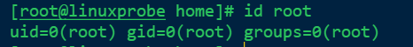

# 《Linux运维之道》第2版

## 基本命令

~~~bash
ls -t	以修改时间排序，默认是以名称排序
ls -d	显示文件目录本身的信息，而非文件目录下的文件信息
ls -u	显示文件或目录最后被访问的时间
~~~

> `touch` 命令可以修改文件的创建时间等信息

~~~bash
cp -r	递归复制
cp -a	复制文件的所有信息，包括权限和时间信息
~~~

~~~bash
du 	计算文件或者目录的容量
du -a	查看所有文件以及目录的容量 
du -s	仅显示总容量
du -h	个性化显示容量（KB、MB等形式）
~~~

> 软链接可以跨分区，但是不可以删除源文件
>
> 硬链接不可以跨分区，但是可以删除源文件

~~~bash
ln -s	创建软链接
ln	创建硬链接
~~~

> 如果`history`的编号为3，可以用!3执行之前编号为3的命令

## vim

~~~bash
`vim`工具：包括普通模式、命令模式和插入模式

在vim编辑文档过程中，如果要执行某一个命令而不想退出vim，则可以在命令模式下输出`:!命令`
如果vim拥有root权限，那么就可以提权；
在普通模式下，按下ZZ也可以保存退出文档；
~~~

##  账号、组

**Linux对用户和组的管理是通过ID号来实现的**

**Linux系统uid是唯一的但可以供多个用户使用，gid其实同理也是可以的；**

**Linux对组分为基本组和附加组，基本组为创建用户的同名组**

## 创建用户、组

~~~bash
useradd:
用法：	useradd [参数] 用户名
	-c	账号描述信息	
	-d	指定用户家目录，默认加上此参数
	-e	账号失效时间
	-g	指定基本组，默认加上此参数，组名与用户名相同
	-G	指定附加组
	-M	不设置家目录
	-s	设置shell，默认为bash
	-u	设置UID,一般使用自动分配的
~~~

~~~bash
groupadd:
用法：groupadd [参数] 组名
	-g	设置组ID号
~~~

~~~bash
id root：显示root用户的账号信息和组信息
~~~

## 修改账号、组

~~~bash
passwd ：修改账号密码
	-l	锁定账号，仅root账号有权限使用
	--stdin	从文件或者管道读取密码
	-u	解锁账号，仅root账号有权限使用
	-d	清空账号密码，仅root账号有权限使用
~~~

~~~bash
usermod:
用法：usermod [参数]	账号名
	-e	修改失效时间
	-d	修改家目录
	-g	修改基本组
	-G	修改附加组
	-s	修改shell
    -u	修改UID
~~~

## 删除账号、组

~~~bash
userdel
用法：userdel [参数] 用户名
	-r	删除账号及相关文件
~~~

~~~bash
groupdel
用法：groupdel 组名
~~~

## ACL访问控制权限

~~~bash
getfacl
setfacl
	-b	删除全部
	-m	修改一个
	-x	删除一个
	-R	递归操作
~~~

