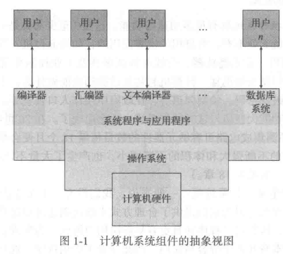
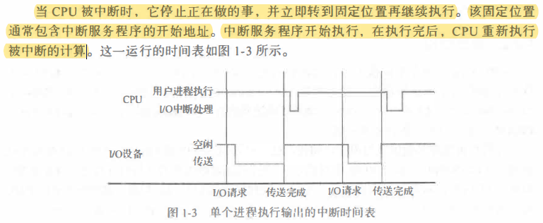
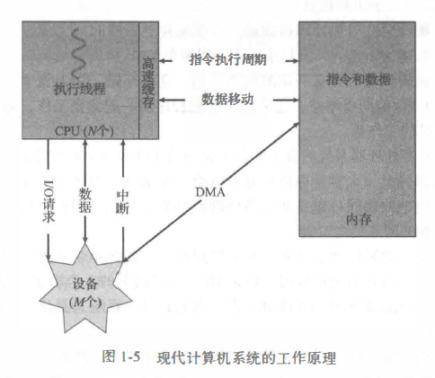
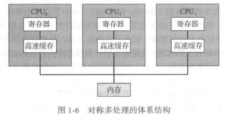
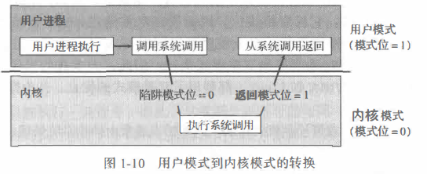
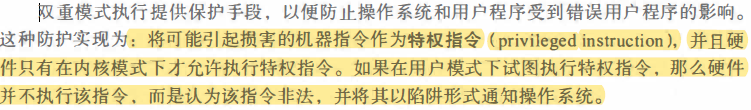
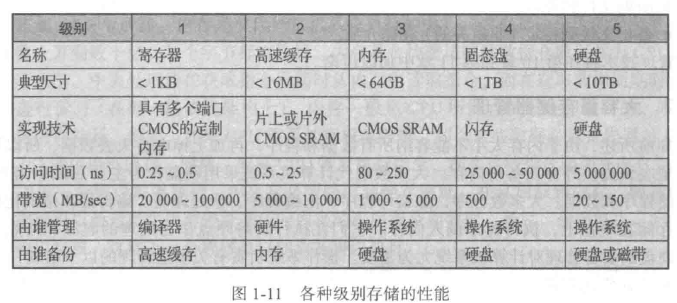
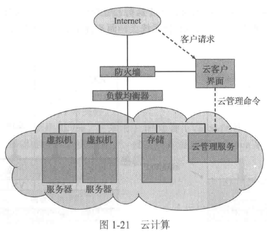

# 《操作系统概念》第九版
#进行中 

## 第一章	导论

> 操作系统是管理计算机硬件的软件。
>
> 计算机系统可以粗分为四个组件：
>
> + 硬件
> + 操作系统
> + 应用程序
> + 用户

 **操作系统的定义：**

> 一般公认的定义：操作系统是一直运行在计算机上的程序（通常称为内核）；
>
> 除了内核以外，还存在两类程序：
>
> + 系统程序
> + 应用程序

## 计算机系统的组成

> 现代通用计算机系统包括一**个或多个CPU和若干设备控制器**， 通过**公用总线**相连而成， 该总线提供了共享内存的访问（图1-2)。 **每个设备控制器负责一类特定的设备**（如磁盘驱动器、 音频设备或视频显示器）。 CPU与设备控制器可以并发执行， 并且竞争访问内存。 为了确保有序访问共享内存， 需要内存控制器来协调访问内存。

>  引导程序：当计算机电源打开或重启以便开始运行时 ，它需要运行一个初始程序。 该初始程序或引
> 导程序(bootstrap program)通常很简单， 一般位于计算机的固件(firmware)。
>
> 引导程序必须知道如何加载操作系统并且开始执行系统。 为了完成这一 目标，引导程序必须定位操作系统内核并且加到内存。

**中断：**

**存储结构**

> + cpu只能从内存中加载指令，因此执行程序必须位于内存。
> + 通用计算机运行的大多数程序位于可读写内存，称为内存（main memory），也称为随机访问内存（RAM）。内存通常为动态随机访问内存（DRAM）。
>   + 内存特点：易失性，掉电丢失数据。
> + 只读内存（ROM），数据不可修改，即不可写
> + 外存：磁盘、硬盘、U盘等。非易失性，数据可持久化。

​		**当两个存储组件的访问时间或传输速率具有明显差异时，可以通过高速缓存来改善性能。**

**I/O结构**

> 操作系统为每个设备控制器提供一个设备驱动程序(device driver)。 该设备驱动程序负责设备控制器．并且为操作系统的其他部分提供统一的设备访问 接口。

## 计算机系统的体系结构

+ 单处理器系统
+ 多处理器系统
  + 优点：
    + 增加**吞吐量**
    + 规模经济
    + 增加可靠性
  + 类型
    + 非对称处理器
    + 对称处理器 

+ 集群系统
  + 非对称集群
  + 对称集群

## 操作系统的结构

> 操作系统最重要的一点是具有多道程序能力。 一般来说， 单个程序并不能让CPU和I/O设备始终忙碌。单个用户通常具有多个运行程序。多道程序设计(multiprogramming)通过安排作业（编码与数据）使得CPU总有一个执行作业，从而提高CPU利用率。
> 操作系统在内存中同时保存多个任务（图1-9)。 由于主存太小不能容纳所有作业， 因此这些作业首先保存在磁盘的**作业池**(Job pool)上。 该作业池包括磁盘上的 、等待分配内存 的所有**进程**。

> 分时系统：分时系统(time sharing)(或多任务(multitasking)) 是多道程序设计的自然延伸。 对于分时系统 ，虽然CPU还是通过切换作业来执行多个作业，但是由千切换频率很高， 用户可以在程序运行时与其交互。

## 操作系统的执行

> **现代操作系统是中断驱动**(interrupt driven)的。事件总是由中断或陷阱引起的。
>
> 陷阱(trap)（或异常(exception)）是一种软件生成的中断，或源于出错，或源于用户程序的特定请求。

### 双重模式与多重模式的执行

+ 为确保操作系统的正确运行，必须区分操作系统代码和用户代码的执行。

+ 用户模式（user mode）和内核模式（kernel mode）

  + 计 算机硬件可以通过一个**模式位** (mode bit) 来表示当前模式：**内核模式 (0)** 和**用户模式 (1)**。

  + 当计算机系统执行用户应用时， 系统处千用户模式。然而， 当用户应用通过**系统调用**， 请求操作系统服务时， 系统必须从用户模式切换到内核模式， 以满足请求。

    

  + 

### 定时器

> 操作系统应该维持控制 CPU, 防止用户程序陷入死循环， 或不调用系统服务并且不将控制返给操作系统。 为了实现这一目标， 可以使用定时器 (timer)。
>
> 定时器可设置为在指定周期后中断计算机。 

## 进程管理

> 在未被CPU执行之前， 程序做不了任何事。 执行的程序称为进程。
>
> 进程是系统的工作单元。系统由多个进程组成， 其中有的是操作系统进程（执行系统代
> 码）， 其他的是用户进程（执行用户代码）。所有这些进程都会并发执行。

操作系统负责进程管理的以下活动：

+ 在CPU上调度进程和线程
+ 创建和删除用户进程和系统进程
+ 挂起和重启进程
+ 提供进程同步机制
+ 提供进程通信机制

## 内存管理

> 内存是现代计算机系统执行的中心。 内存是一个大的字节数组。
>
> 如果CPU 需要处理磁盘数据， 那么这些数据必须首先通过CPU 产生的I/O 调用传到内存。同样， 如果CPU 需要执行指令， 那么这些指令必须在内存中。
>
> 为改进CPU 的利用率和用户的计算机响应速度， 通用计算机应在内存中保留多个程序，这就需要内存管理。

操作系统负责内存管理的以下活动：

+ 记录内存的哪部分在被使用以及被谁使用。
+ 决定哪些进程（或其部分） 会调入或调出内存。
+ 根据需要分配和释放内存空间。

## 存储管理

> **操作系统提供信息存储的统一逻辑视图。**
>
> 操作系统对存储设备的物理属性进行了抽象， 并定义了逻辑存储单元， 即文件(file)。操作系统映射文件到物理媒介， 并通过存储设备来访问文件。

### 文件管理

操作系统负责文件管理的以下活动：

+ 创建和删除文件。
+ 创建和删除目录， 以便组织文件
+ 提供文件和目录的操作原语。
+ 映射文件到外存。
+ 备份文件到稳定（非易失的）存储介质。

### 大容量存储器管理

操作系统负责有关硬盘管理的以下活动：

+ 空闲空间管理
+ 存储空间分配
+ 硬盘调度

### 高速缓存

> 高速缓存，一般集成在CPU中

### I/O系统

> **操作系统的目的之一是为用户隐藏具体硬件设备的特性。**

I/O子系统包括以下几个组件：

+ ·包括缓冲、 高速缓存和假脱机的内存管理组件。
+ 设备驱动器的通用接口。
+ 特定硬件设备的驱动程序。

**只有设备驱动程序才能知道控制设备的特性。**

## 保护与安全

> 保护(protection)是一种机制， 用千控制进程或用户访问计算机系统的资源。
>
> 防止系统不受外部或内部的攻击是安全(security)的工作。

## 内核数据结构

+ 链表、堆栈、队列
+ 树
+ 哈希函数、哈希表
+ 位图

## 计算环境

+ 传统计算

+ 移动计算

+ 分布计算

+ 客户机--服务器计算

+ 对等计算（P2P）

+ 虚拟化

  + 虚拟化技术是一种软件技术

  

+ 云计算

  

+ 实时嵌入式系统

## 第二章 操作系统结构

