# 《深入理解计算机系统》CSAPP
#进行中 
## 第一章 计算机系统漫游
### 信息就是位+上下文

>在C语言中，每一个文本行都是以以一个看不见的`‘\n’`换行符来结束的。它所对应的ASCII码整数值为10。

>+ 系统中所有的信息——包括磁盘文件、内存中的程序、内存中存放的用户数据以及网络上传输的数据，都是由一串比特表示的。
>+ 区分不同数据对象的唯一方法是我们读到这些数据对象时的上下文。

### 程序被其他程序翻译成不同的格式

1. 预处理阶段 `gcc -E`

2. 编译阶段 `gcc -S`

hello.s

3. 汇编阶段 `gcc -c`

4. 链接阶段

### 了解编译系统如何工作是大有益处的

>+ 优化程序性能
>+ 理解链接时出现的错误
>+ 避免安全漏洞

### 存储器读并解释储存在内存中的指令

#### 系统的硬件组成

1. 总线
	贯穿整个系统的一组电子管道，称为总线。它携带信息字节并负责在各个部件之间传递。
2. I/O设备
	I/O(输入/输出）设备是系统与外部世界的联系通道。每个I/O 设备都通过一个控制器或适配器与I/O 总线相连。控制器和适配器之间的区别主要在于它们的封装方式。
3. 主存
	主存是一个临时存储设备，在处理器执行程序时，用来存放程序和程序处理的数据。
4. 处理器
	中央处理单元（CPU), 简称处理器，是解释（或执行）存储在主存中指令的引擎。

#### 运行hello 程序

**将hello输入到shell程序中**

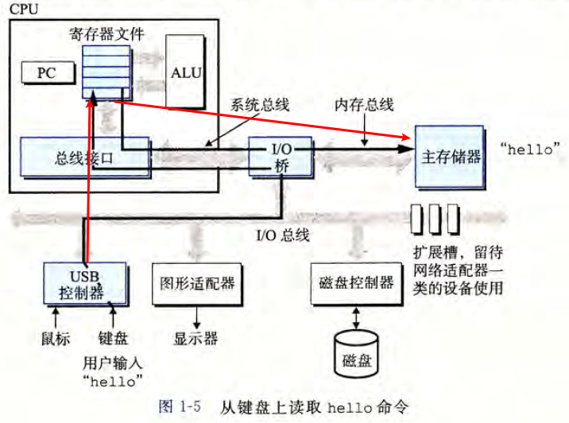

**按下回车键**
利用直接存储器存取（**DMA**）技术，数据可以不通过处理器而直接从磁盘到达主存。

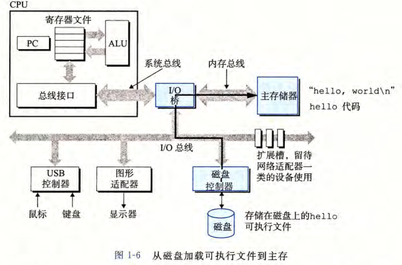
**直接hello程序中的代码，最终显示字符串**

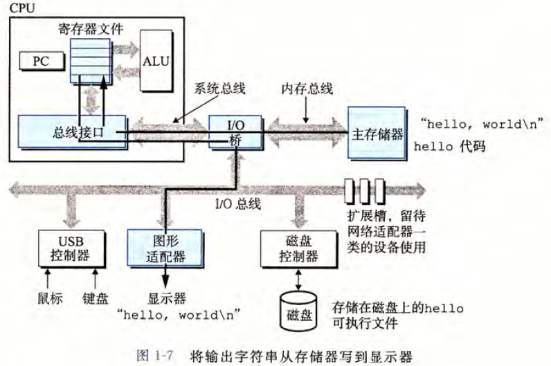

### 高速缓存至关重要

L1和L2高速缓存是用一种叫做静态随机访问存储器（SRAM)的硬件技术实现。

>系统可以获得一个很大的存储器，同时访问速度也很快，**原因**是利用了**高速缓存的局部性原理**，即程序具有访问局部区域里的数据和代码的趋势。==通过让高速缓存里存放可能经常访问的数据，大部分的内存操作都能在快速的高速缓存中完成。==

==**注：意识到高速缓存存储器存在的应用程序员能够利用高速缓存将程序的性能提高一个数量级**==

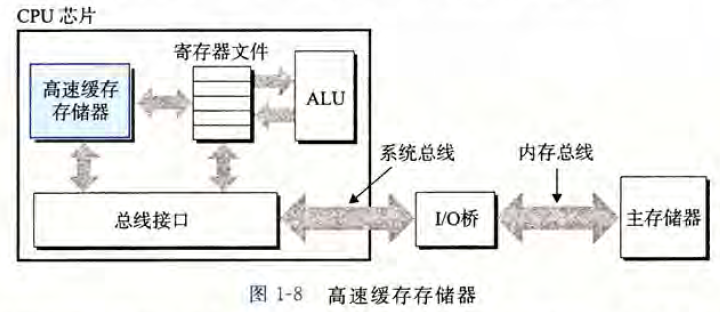

### 存储设备形成层次结构

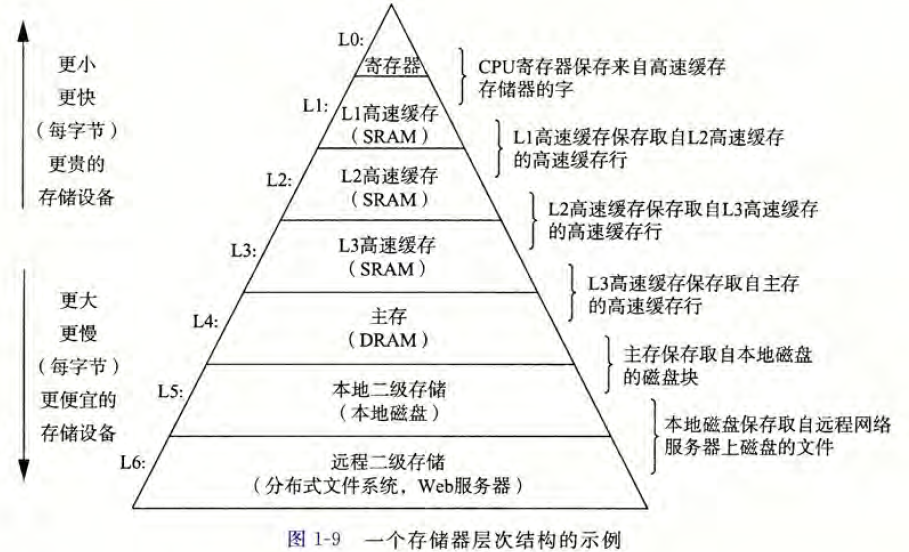

**存储器层次结构的主要思想是上一层的存储器作为低一层存储器的高速缓存。**

###  操作系统管理硬件
>shell 和hello 程序都没有直接访问键盘、显示器、磁盘或者主存。取而代之的是，它们**依靠操作系统提供的服务**。我们可以把操作系统看成是应用程序和硬件之间插人的一层软件，如图1-10 所示

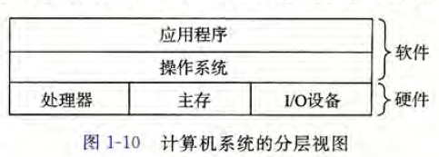

>操作系统有两个基本功能：
>（1)防止硬件被失控的应用程序滥用；
>（2)向应用程序提供简单一致的机制来控制复杂而又通常大不相同的低级硬件设备。
>
>操作系统通过几个基本的抽象概念（进程、虚拟内存和文件）来实现这两个功能。

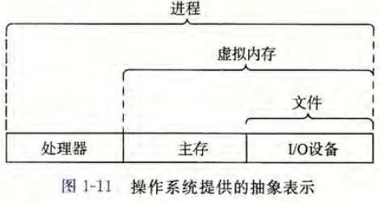

#### 进程

**进程是操作系统对一个正在运行的程序的一种抽象。**

无论是在单核还是多核系统中，一个CPU 看上去都像是在并发地执行多个进程，这是通过处理器在**进程间切换**来实现的。操作系统实现这种交错执行的机制称为**上下文切换**。

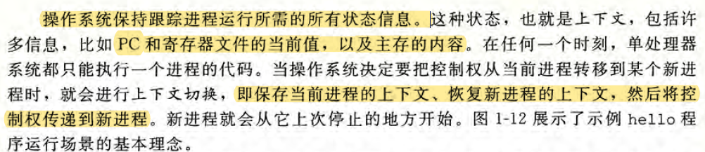

如图1-12 所示，**从一个进程到另一个进程的转换是由操作系统内核（kernel)管理的。**

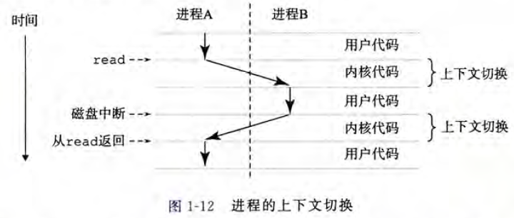

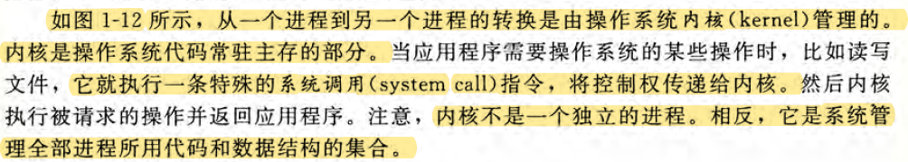

#### 线程

> + 在现代系统中，一个进程实际上，可以由多个称为线程的执行单元组成，**每个线程都运行在进程的上下文中，并共享同样的代码和全局数据。**
> + 由于网络服务器中对并行处理的需求，线程成为越来越重要的编程模型，因为**多线程之间比多进程之间更容易共享数据**，也因为**线程一般来说都比进程更高效**。当有多处理器可用的时候，多线程也是一种使得程序可以运行得更快的方法。

#### 虚拟内存

虚拟内存是一个抽象概念，它为每个进程提供了一个假象，即每个进程都在独占地使用主存。

每个进程看到的内存都是一致的，称为虚拟地址空间。

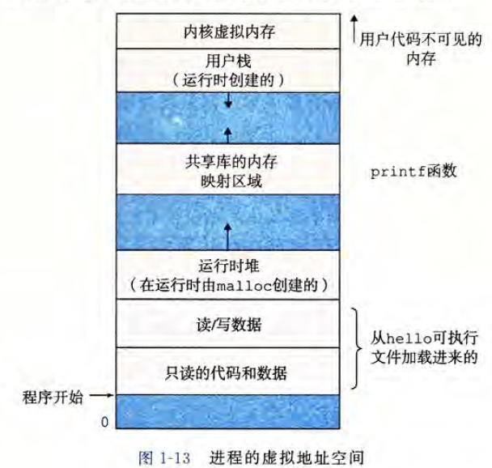

+ 地址空间最上面的区域是保留给操作系统中的代码和数据的；
+ 地址空间的底部区域存放用户进程定义的代码和数据。

**每个进程看到的虚拟地址空间由大量准确定义的区构成，每个区都有专门的功能：**
1. 程序代码和数据
	代码是从同一固定地址开始，紧接着的是和 C 全局变量相对应的数据位置。代码和数据区是直接按照可执行目标文件的内容初始化的，在示例中就是可执行文件hello。
2. 堆
	代码和数据区在进程一开始运行时就被指定了大小，与此不同，当调用像malloc 和free 这样的C 标准库函数时，**堆可以在运行时动态地扩展和收缩。**
3. 共享库
	大约在地址空间的中间部分是一块用来存放像C 标准库和数学库这样的共享库的代码和数据的区域。
4. 栈
	位于用户虚拟地址空间顶部的用户栈，编译器用它来实现函数调用。和堆一样，**用户栈在程序执行期间可以动态地扩展和收缩。**特别地，**每次我们调用一个函数时，栈就会增长；从一个函数返回时，栈就会收缩。**
5. 内核虚拟内存
	地址空间顶部的区域是为内核保留的。不允许应用程序读写这个区域的内容或者直接调用内核代码定义的函数。相反，它们必须调用内核来执行这些操作。

**虚拟内存基本思想是把一个进程虚拟内存的内容存储在磁盘上，然后用主存作为磁盘的高速缓存。**

#### 文件

文件就是字节序列，仅此而已。每个I/O 设备，包括磁盘、键盘、显示器，甚至网络，都可以看成是文件。系统中的所有输人输出都是通过使用一小组称为Unix I/O 的系统函数调用读写文件来实现的。

## 系统之间利用网络通信

随着Internet 这样的全球网络的出现，从一台主机复制信息到另外一台主机已经成为计算机系统最重要的用途之一。比如，像电子邮件、即时通信、万维网、FTP 和telnet 这样的应用都是基于网络复制信息的功能。

## 重要主题

系统是硬件和系统软件互相交织的集合体，它们必须共同协作以达到运行应用程序的最终目的。

#### 并发和并行

**并发(concurrency)**是一个通用的概念，指一个同时具有多个活动的系统；
而术语**并行（parallelism)**指的是用并发来使一个系统运行得更快。并行可以在计算机系统的多个抽象层次上运用。

1. 线程级并发
	
	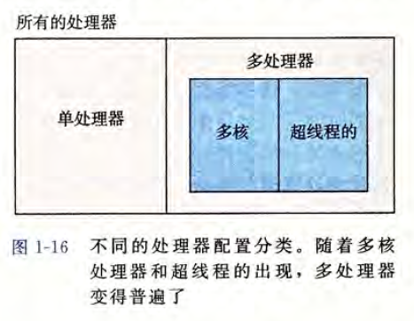
	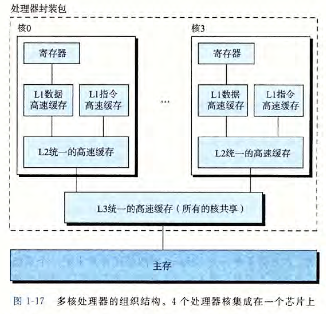

2. 指令级并行
	流水线
3. 单指令、多数据并行
	在最低层次上，许多现代处理器拥有特殊的硬件，允许一条指令产生多个可以并行执行的操作，这种方式称为单指令、多数据，即SIMD 并行。

#### 计算机系统中抽象的重要性

抽象的使用是计算机科学中最为重要的概念之一。

## 第二章 信息的表示和处理

### 信息存储

大多数计算机使用8 位的块，或者字节（byte), 作为最小的可寻址的内存单位，而不是访问内存中单独的位。

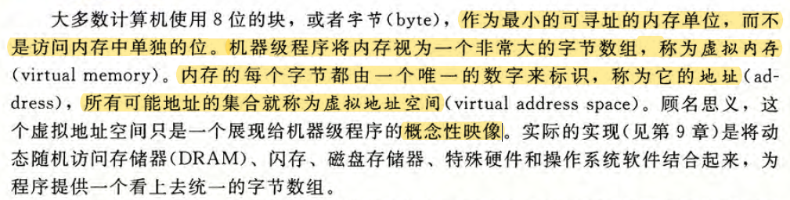

#### 十六进制表示法

