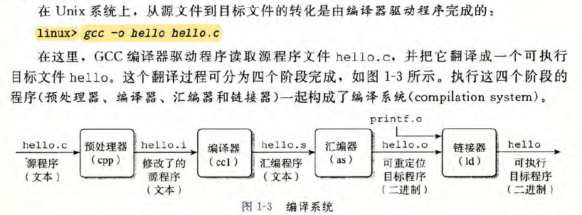
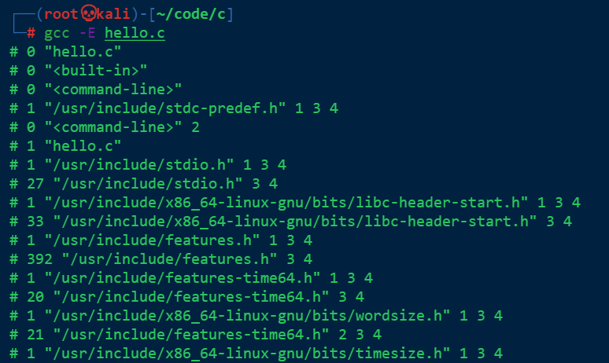
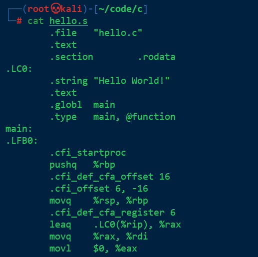
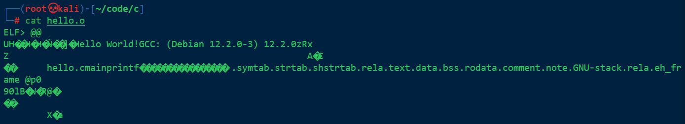
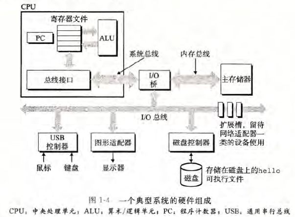

# 《深入理解计算机系统》CSAPP
#进行中 
## 第一章 计算机系统漫游
### 信息就是位+上下文

>在C语言中，每一个文本行都是以以一个看不见的`‘\n’`换行符来结束的。它所对应的ASCII码整数值为10。

>+ 系统中所有的信息——包括磁盘文件、内存中的程序、内存中存放的用户数据以及网络上传输的数据，都是由一串比特表示的。
>+ 区分不同数据对象的唯一方法是我们读到这些数据对象时的上下文。

### 程序被其他程序翻译成不同的格式

1. 预处理阶段 `gcc -E`

2. 编译阶段 `gcc -S`

hello.s

3. 汇编阶段 `gcc -c`

4. 链接阶段

### 了解编译系统如何工作是大有益处的

>+ 优化程序性能
>+ 理解链接时出现的错误
>+ 避免安全漏洞

### 存储器读并解释储存在内存中的指令

#### 系统的硬件组成

1. 总线
	贯穿整个系统的一组电子管道，称为总线。它携带信息字节并负责在各个部件之间传递。
2. I/O设备
	I/O(输入/输出）设备是系统与外部世界的联系通道。每个I/O 设备都通过一个控制器或适配器与I/O 总线相连。控制器和适配器之间的区别主要在于它们的封装方式。
3. 主存
	主存是一个临时存储设备，在处理器执行程序时，用来存放程序和程序处理的数据。
4. 
