# 《计算机科学导论》第3版
#进行中


## 第一章	绪论

### 图灵模型

#### 数据处理器


#### 可编程数据处理器

程序是用来告诉计算机对数据进行处理的指令集合。

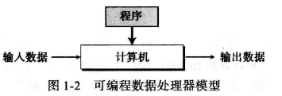

**输出数据是依赖两方面因素的结合作用：输入数据、程序**

+ 相同程序，不同输入数据，输出不同
+ 相同输入数据，不同程序，输出不同
+ 相同输入数据，相同程序，输出相同

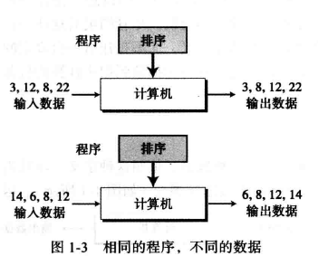

#### 通用图灵机

> 通用图灵机是对现代计算机的首次描述，该机器只要提供了合适的程序就能做任何运算。

### 冯诺依曼模型

冯诺依曼指出：**数据和程序都存储在计算机的存储器中**

#### 4个子系统

+ 存储器：用来存储数据和程序的区域
+ 算术逻辑单元（ALU）：用来进行计算和逻辑运算的地方
+ 控制单元：对存储器、算术逻辑单元、输入/输出等子系统进行逻辑操作的单元
+ 输出/输出单元：输入子系统负责从计算机外部接收输入数据；输出子系统负责将计算机处理结果输出到计算机外部。

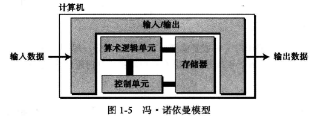

#### 存储程序概念

**冯诺依曼模型中要求程序必须存储在内存（存储器）中。**

> 现代计算机的存储单元用来存储程序及其相应数据。这意味着数据和程序应该具有相同的格式，这是因为他们都存储在存储器中。

#### 指令的顺序执行

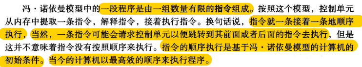

### 计算机组成部分

计算机由三大部分组成：计算机硬件、数据、计算机软件

#### 数据

冯诺依曼模型将一台计算机定义为一台数据处理机。他接收输入数据，处理并输出相应的结果。

+ 存储数据
+ 组织数据


#### 计算机软件

+ 算法：由有序的指令集组成
+ 语言
  + 机器语言
  + 自然语言
    + 符号语言（汇编语言）
    + 高级语言（C、Java等）
+ 软件工程：结构化程序的设计和编写，为高效的程序开发而诞生的一门理论体系；
+ 操作系统

### 计算机历史

+ 机械计算机器（1930年以前）
+ 电子计算机（1930-1950年）
+ 现代计算机（1950年至今）

## 第二章	数字系统

主要内容：

+ 理解数字系统的概念；
+ 分清非位置化和位置化数字系统；
+ 描述十进制系统（以 10 为底）；
+ 描述二进制系统（以2为底）；
+ 描述十六进制系统（以 16 为底）；
+ 描述八进制系统（以8为底）；
+ 将二进制、 八进制或十六进制数字转换为十进制系统；
+ 将十进制数字转换为二进制、 八进制或十六进制系统；
+ 将二进制和八进制数字相互转换；
+ 将二进制和十六进制数字相互转换；
+ 查找在各种系统中代表特定数值所需的数码。

> **数字系统**定义了如何用独特的符号来表示一个数字。

数字系统分类：

+ 位置化系统
+ 非位置化系统

### 位置化系统


> S是一套符号集； b是底（或基数），它等于S符号集中的符号总数， 其中 S1和 ＆是代表分数部分或整个数字的符号。+-符号表示该数字可正可负。

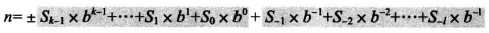

#### 十进制系统（以10为底）

符号集是S ={0, 1, 2, 3, 4, 5, 6, 7, 8, 9}

1. 整数

   

2. 实数（整数部分+小数部分）

   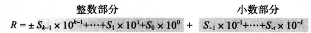

#### 二进制系统(以2为底)

符号集：S={0,1}

> 数据和程序是以二进制模式（即位串）存储于计算机中的。

1. 整数

   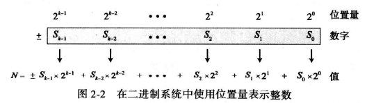

2. 实数

   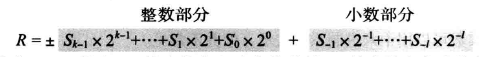

   

####    十六进制系统（以16为底）

符号集：S={0,1,2,3,4,5,6,7,8,9,A,B,C,D,E,F}

1. 整数

   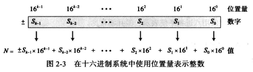

2. 实数

   实数用十六进制表示并不常见 

#### 八进制（以8为底）

字符集S={0,1,2,3,4,5,6,7}

1. 整数

   

2. 实数

   实数用8进制表示并不常见

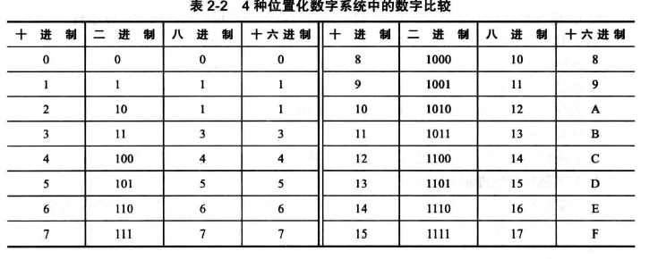

####    位置转换

1. 其他进制转换到10进制

   

   

   2. 十进制到其他进制的转换

      1. 整数部分的转换使用连除
      2. 小数部分的转换使用连乘法

   3. 二进制转换16进制

      二进制中的4位恰好是十六进制中的1位

   4. 二进制转换8进制

      二进制中的3位恰好是八进制中的1位

   5. 16进制与8进制之间的转换

      借助二进制转换

      + 8 ->2 ->16
      + 16 -> 2 -> 8

## 第三章	数据存储

本章主要内容：

+ 列出计算机中使用的5种不同的数据类型；
+ 描述不同的数据如何以位模式存储在计算机内部；
+ 描述整数如何以无符号格式存储在计算机中；
+ 描述整数如何以符号加绝对值格式存储在计算机中；
+ 描述整数如何以二进制补码格式存储；
+ 描述实数如何以浮点格式存储在计算机中；
+ 描述文本如何通过各种不同的编码系统存储在计算机中；
+ 描述音频如何通过采样、 量化和编码存储在计算机中；
+ 描述图像如何通过光栅和矢量图模式存储在计算机中；
+ 描述视频如何以图像随时间变化的表示来存储在计算机中。

### 数据类型

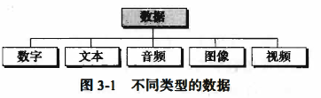

> + 位(bit, binary digit的缩写）是**存储在计算机中的最小单位**。它是0或者1；
> + 位模式（位流）：表示数据的不同类型，多个位组成一个位模式；
> + 字节（Byte）：长度为8的位模式，成为1字节；
> + 字：指代更长位模式，比如可以表示`1个字=2字节`或者`1个字=4字节`等等；


**计算机内存存储所有这些而无需辨别它们表示的是何种数据类型。**

### 存储数字

在存储到计算机内存之前，数字被转换为二进制系统，但是：

1. 如何存储数字的正负符号
2. 如何显示小数点
#### 存储整数
**整数可以被当做小数点位置固定的数字：小数点被固定在最右边。`定点表示法`用于存储整数，小数点是假定的，并不存储。**


>整数通常使用定点表示法存储在内存中
1. 无符号表示法
无符号整数是只包括零和正数的非负整数。计算机不可能表示到无穷大的整数，计算机定义了一个常量，称为`最大无符号整数`(2<sup>n</sup>-1)


>溢出：
>因为大小（即存储单元的位的数量）的限制，可以表达的整数范围是有限的。在 n 位存储单元中，我们可以存储的无符号整数仅为 0 到2<sup>n</sup>-1之间。
>**如果发生溢出，只保存最右边的n位数字。**
>

>无符号整数的应用：
>**无符号整数表示法可以提高存储的效率，因为不必存储整数的符号。这就意味着所有分配的位单元都可以用来存储数字。只要用不到负整数，都可以用无符号整数表示法。**
>+ 计数
>+ 寻址
>+ 存储其他数据类型


2. 符号加绝对值表示法
尽管符号加绝对值格式在存储整数中并不常用，但该格式用千在计算机中存储部分实数。
>用于无符号整数的有效范围(0到2<sup>n</sup>-1) 被分成两个相等的子范围。
>0表示正整数；1表示负整数。


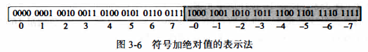

+ 符号加绝对值表示法的溢出
	存在正负两种溢出情况

3. 二进制补码表示法
>**几乎所有的计算机都是用二进制补码表示法来存储n位存储单元中有符号整数**
>在整数补码形式下，0表示正整数；1表示负整数。


`反码`

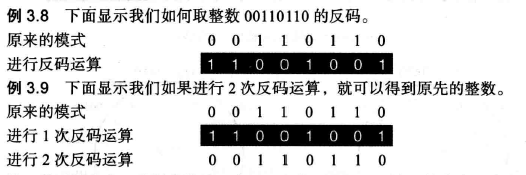

`补码`

**1. 两种运算方式：**
+ 1. 该运算分为两步：首先， 从右边复制位， 直到有 1 被复制 ；接着， 反转其余的位。

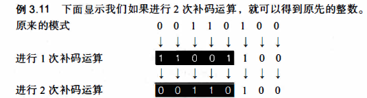

+ 2.将一个整数进行补码运算的方法是先对它进行1次反码运算再加上1得到结果。

**2. 以二进制补码格式存储整数**

计算机遵循以下步骤：
- 将整数变为二进制序列
- 整数如果是0或者整数，以其原样存储（整数和0的补码为其自身）；如果是负数，计算机取其补码存储

**3.  从二进制补码格式还原整数**

计算机遵循以下步骤：
+ 如果最左位是1， 计算机取其补码。如果最左位是0, 计算机不进行操作。
+ 计算机将该整数转换为十进制。

**二进制补码表示法是计算机中用于存储整数的标准表示法**
#### 存储实数


>+ 实数是带有整数部分和小数部分的数字。
>+ 带有很大的整数部分或者很小的小数部分的实数不应该用定点表示法存储。


1. 浮点表示法

```
浮点表示法：该表示法允许小数点浮动；
组成：符号、位移量、定点数
```


2. 规范化

	
3. 符号、指数和尾数
	
	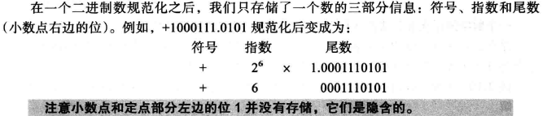
	
	1. 符号
		一个数的符号可以用二进制位来存储（0或1）
	2. 指数
		指数（2的幂）定义为小数点移动的位数。注意幂可以为正也可以为负。余数表示法是用来存储指数位的方法。
	3. 尾数
		指的是小数点右边的二进制数。
		
1. 余码系统

	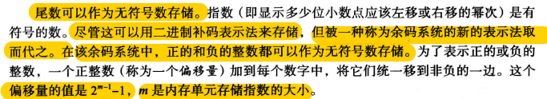
5. IEEE标准


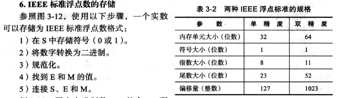


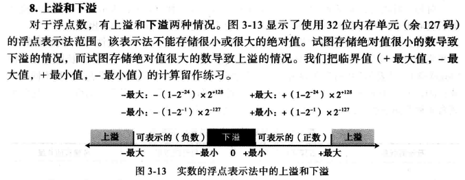

9. 存储0
	约定在这种情况下，符号、指数和尾数都设为0
10. 截断错误
	主要原因是尾数长度大于规定的长度，导致小数点右边的某几位数字被裁掉。
### 存储文本


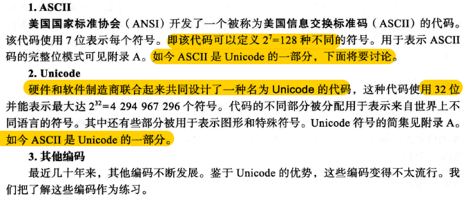

### 存储音频


##### 采样


**采样率**

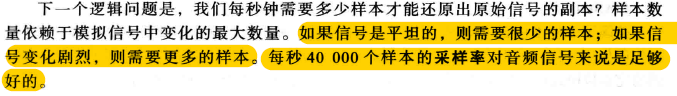

##### 量化

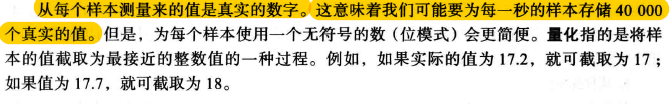

##### 编码


#### 声音编码标准

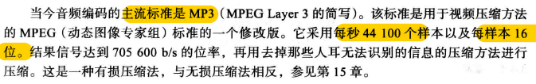

### 存储图像

>存储在计算机中的图像使用两种不同的技术：光栅图和矢量图
#### 光栅图


1. 解析度

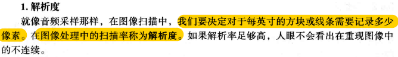

2. 色彩深度

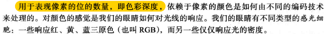

+ **真彩色：24位编码**
+ **索引色：8位编码**

3. 图像编码标准

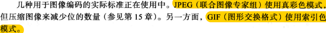


#### 矢量图


### 存储视频


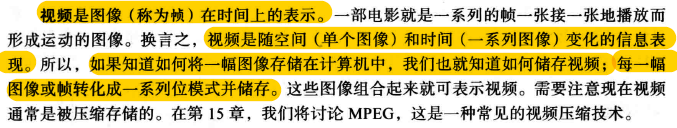

## 第四章 数据运算

>本章主要学习内容：
>+ 列出在数据上进行的三类操作；
>+ 在位模式上进行一元和二元逻辑运算；
>+ 区分逻辑移位运算和算术移位运算；
>+ 在位模式上进行逻辑移位运算；
>+ 在以二进制补码形式存储的整数上进行算术移位运算；
>+ 在以二进制补码形式存储的整数上进行加法和减法运算；
>+ 在以符号加绝对值形式存储的整数上进行加法和减法运算；
>+ 在以浮点格式存储的实数上进行加法和减法运算；
>+ 理解逻辑和移位运算的一些应用，如置位、复位和指定位的反转等。


### 逻辑运算

#### 位层次上的逻辑运算

>一个位可以是0或者1，“0”表示逻辑“假”，“1”表示逻辑“真”，使用布尔代数的定义去操作二进制

1. 非（NOT）
	它只有一个输人。输出位是输入位的相反， 如果输入是0, 则输出为1 ；如果输人为1, 则输出为0。

	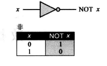
2. 与（AND）

	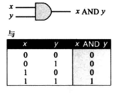
3. 或（OR）

	
4. 异或（XOR）


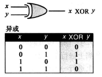

#### 模式层次上的逻辑运算
相同的4个运算符被应用到n位模式


+ 非
	

+ 与

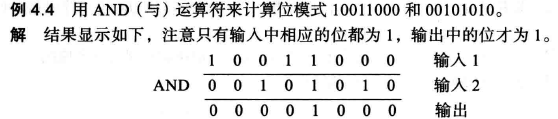
+ 或

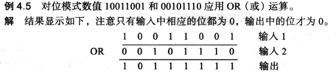
+ 异或

	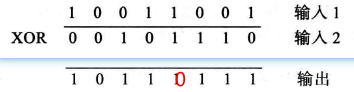
##### 应用
1. 求反
2. 对指定的位复位（输入掩码）
	1. AND指定的位通过掩码  复位--0

	
		2.  OR指定的位通过掩码  复位--1
	
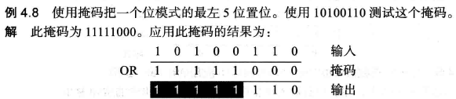
		3.  XOR指定的位通过掩码 复位 取反


### 移位运算

>移位运算移动模式中的位， 改变位的位置。它们能向左或向右移动位。我们可以把移位 运算分成两大类：逻辑移位运算和算术移位运算。
#### 逻辑移位运算

>逻辑移位运算应用于**不带符号位的数的模式**。原因是这些移位运算可能会改变数的符号， 此符号是由模式中最左位定义的。

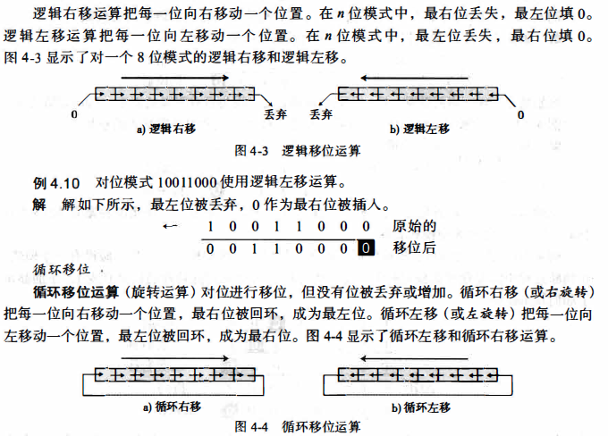


#### 算术移位运算

>算术移位运算假定位模式是用二进制补码格式表示的带符号位的整数。算术右移被用来对整数除以2；而算术左移被用来对整数乘以2。


>+ 算术右移保留符号位， 但同时也把它复制， 放入相邻的右边的位中， 因此符号被保存。
>+ 算术左移丢弃符号位，接受它的左边的位作为符号位。如果新的符号位与原先的相同，那么运算成功，否则发生上溢或下溢，结果是非法的。


**实际应用：**


### 算术运算

**算术运算包括加、减、乘、除，适用于整数和浮点数。**
#### 整数的算术运算


1. 二进制补码中的加减法
	
	 
	
	
	
	
	
	
	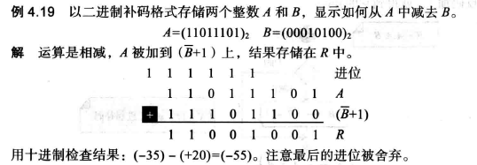
	==**两个数A与B相减的时候，不论B为正数还是负数，都要取反+1。因为A-B=A+(-B),把-B整体看成一个负数，取反操作只需将B取反加1即可。**==


2. 符号加绝对值整数的加减法
	

#### 实数的算术运算
**实数的加减法**
>以浮点数存储的实数的加法和减法被简化为小数点对齐后以符号加绝对值格式（符号和尾数的组合） 存储的两整数的加法和减法。

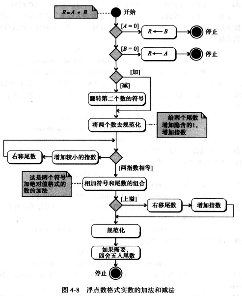


## 第五章 计算机组成

>主要内容：
>+ 列出计算机的三个子系统；
>+ 描述计算机中央处理单元（CPU）的作用；
>+ 描述典型计算机中指令周期的取指令--译码--执行阶段；
>+ 描述主存和它的地址空间
>+ 区分主存和缓存
>+ 定义输入/输出子系统；
>+ 理解子系统间的互相连接，列出不同总线系统；
>+ 描述输入/输出编址的不同方法；
>+ 区分设计计算机体系结构的两种主要趋势；
>+ 理解计算机是如何使用管道改善吞吐量的；
>+ 理解并行处理是如何改善计算机的吞吐量的。

**计算机组成部分**
+ 中央处理器（CPU）
+ 主存储器（内存）
+ 输入输出子系统

### 中央处理器
>用于数据的运算。包括三个部分：算术逻辑单元（ALU）、控制单元、寄存器组


##### 算术逻辑单元
对数据进行运算
1. 逻辑运算
2. 移位运算
3. 算术运算

#### 寄存器
用来存放临时数据的高速独立存储单元

1. 数据存储器：保存运算的中间结果，命名为R1~Rn；


#### 控制单元


>控制单元控制各个子系统的操作，控制是通过从控制单元到其他子系统的信号来进行。

1. 指令存储器：CPU从内存中逐条的取出指令，并存储在指令存储器中，解释并执行指令；
2. 程序计数器：保存当前正在执行的指令的地址，当前指令执行完成后，计数器自动加1，指向下一条指令的内存地址；

### 主存储器（内存）

> + 内存是存储单元的集合，每个存储单元都有唯一的标识，称为地址；
> + **数据以字的形式在内存中传入传出**，字可以是8位、16位、32位、64位。如果字是8位，一般称为一个字节。

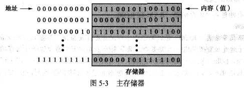

##### 地址空间 

>在硬件层次上，每个字都是通过地址来标识的。所有在存储器中标识的独立的地址单元的总数称为地址空间。 


**内存用无符号二进制整数定义**

#### 存储器类型

主要的两种类型：RAM 、ROM

1. RAM
	1. SRAM：速度快，但价格昂贵
	2. DRAM：速度慢，价格便宜
特点：**易失性**，系统断电后，信息（程序或数据）会丢失
随机存取存储器是计算机中主存的主要组成部分

2. ROM
	1. PROM
	2. EPROM
	3. EEPROM
里面的数据由制造商写进去，用户只能读不能写。
特点：**非易失性**，系统断电后数据不会丢失。常用来存储那些在开机时运行的程序。

#### 存储器的层次结构

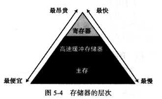

#### 高速缓冲存储器

>+ 高速缓存容量较小，且常被至于CPU与主存之间。
>+ 高速缓冲存储器在**任何时间**都含有主存中一部分内容的副本。


cpu要存取主存中的一个字的时候，将按一下步骤进行：

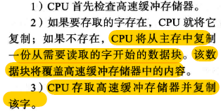


### 输入/输出子系统

>+ 可以使计算机与外界进行通信，并在断电情况下存储程序和数据，分为两大类：非存储设备和存储设备
>+ 非存储设备：键盘、鼠标、显示器、打印机等；
>+ 存储设备：也称为辅助存储设备，通常有磁介质和光介质两种。
>	+ 特点：便宜，断电后数据不丢失

### 子系统的互连
#### CPU与存储器的连接

CPU与主存储器之间通常由称为总线的三组线路连接在一起，分别为：数据总线、地址总线和控制总线；

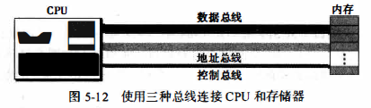


>1. 数据总线：
>	数据总线是由多根线组成，每一根线上每次传递1位的数据。**线的数量取决于计算机的字的大小**。计算机的字是32 位(4 字节），那么需要有32 根线的数据总线，以便同一时刻能够同时传送32 位的字。
>2. 地址总线：
>	地址总线允许访问存储器中的某个字，地址的总线的线数取决于存储空间的大小（和字的位长也存在关系吧）。如果存储器容量为2<sup>n</sup>个字，那么总线一次需要传送n位的地址数据。因此他需要n根线。
>3. 控制总线：
>	**控制总线负责在中央处理器和内存之间传送信息。**
>	控制总线的线数取决千计算机所需要的控制命令的总数。如果计算机有了条控制命令，那么控制总线就需要有m根， 因为m位可以定义2<sup>m</sup> 个不同的操作。


#### I/O设备的连接
 
>输入/输出设备**不能够直接与连接CPU和内存的总线相连**。因为输入/输出设备的本质与CPU和内存的本质不同，输入/输出设备都是些机电、磁性或光学设备， 而CPU和内存是电子设备。**与CPU和内存相比，输入/输出设备的操作速度要慢得多。**因此必须要有**中介**来处理这种差异，输入/输出设备是通过一种被称为输入/输出控制器或接口的器件连接到总线上的。每一个输人/输出设备都有一个特定的控制器。


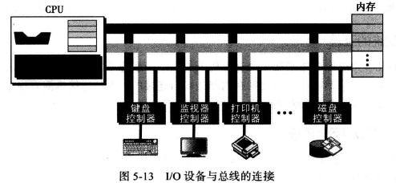


##### 控制器

控制器，或者说接口， 清除了输人／输出设备与CPU及内存在本质上的障碍。控制器可以是串行或并行的设备。

+ 串行控制器
	+ 只有一根数据线连接到设备上
+ 并行控制器
	+ 有多根数据线连接到设备上，一次能同时传送多个位
+ 常用控制器
	+ SCSI、火线、USB和HDM


1. 小型计算机系统接口（SCSI）

	

2. 火线

	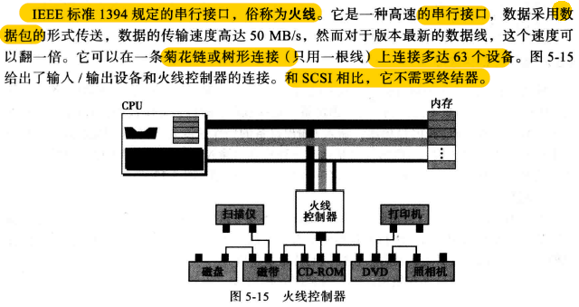
3. 通用串行总线USB


	


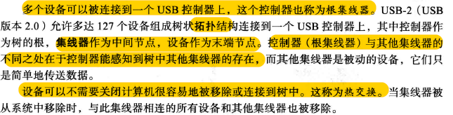


4. 高清晰度多媒体接口（HDMI）


#### 输入/输出设备的寻址

>通常CPU使用相同的总线在主存和输入/输出设备之间读写数据，唯一的不同是指令。如果指令涉及主存中的字，那么数据会在主存和CPU之间传送；如果指令涉及输入输出设备，那么数据会在输入输出设备和CPU之间进行传送。
>有两种方法对输入输出设备进行寻址：
>+ I/O独立寻址
>+ I/O存储器映射寻址

##### I/O 独立寻址

在I/O独立寻址中， 用来读／写内存的指令与用来读／写输入／输出设备的指令是完全不同的。有专门的指令完成对输入／输出设备的测试、 控制以及读写操作。每个输入／输出 设备有自己的地址。因为指令的不同， 所以输入／输出地址可以和内存地址重叠而不会产生混淆。
	+ 例如， CPU可以使用读命令Read 101 来从内存中读取字 101。它也可以使用输入 命令lnput 101 来从地址端口为 101 的输入／输出设备中读取数据。

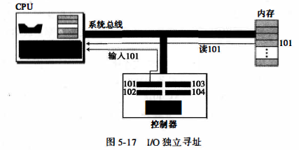

 ##### I/O存储器映射寻址

在I/O存储器映射寻址方式中， **CPU将输入／输出控制器中的每一个寄存器都看作内存中的某个存储字**。换言之， **CPU没有不同的指令用来表示是从内存或是从输入／输出设备传送数据**。例如， 在指令集中只有一条Read指令， 如果地址指定的是内存中的某个单元， 则从内存中读取数据。如果地址指定的是输入／输出设备中的某个寄存器， 那么就从寄存器中读取数据。存储器映射的输入／输出的配置**优点**在于有一个较小的指令集， 所有对内存的操作指令都同样适合与输入／输出设备， 其**缺点**是输入／输出控制器占用了一部分内存地址。


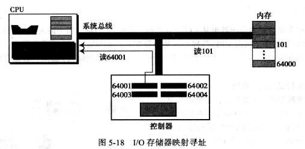


###  程序执行

通用计算机使用称为程序的一系统指令来处理数据。计算机通过执行程序，将输入数据转换成输出数据。程序和数据都放在内存中。

#### 机器周期

>+ CPU利用重复的机器周期来执行程序中的指令，一步一步，从开始到结束。
>+ 一个简化的周期包括3步：取指令、译码、执行；


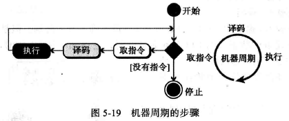


1. 取指令
	在取指令阶段， 控制单元命令系统将**下一条将要执行的指令复制到CPU的指令寄存器中**。被复制的指令地址保存在程序计数器中。复制完成后， 程序计数器自动加1指向内存中的下一条指令。
2. 译码
	机器周期的第二阶段是译码阶段。当指令置千指令寄存器后， 该指令将由**控制单元负责译码**。指令译码的结果是产生一系列系统可以执行的二进制代码。
3. 执行
	指令译码完毕后， 控制单元发送**任务命令到CPU的某个部件**， 例如， 控制单元告知系统， 让它从内存中加载（读）数据项， 或者是CPU让算术逻辑单元将两个输入寄存器中的内容相加并将结果保存在输出寄存器。这就是执行阶段。


#### 输入/输出操作

>计算机需要通过命令把数据从I/O设备传输到CPU和内存。因为输入输出设备的运行速度比CPU慢得多，因此CPU的操作在某种程度上必须要和输入输出设备同步。
>有三种办法被设计用于同步，分别为：程序控制输入/输出、中断控制输入/输出、直接存储器存取（DMA）。

##### 程序控制输入/输出
在程序控制输入输出中，采用最简单的一种同步：CPU等待I/O设备。
	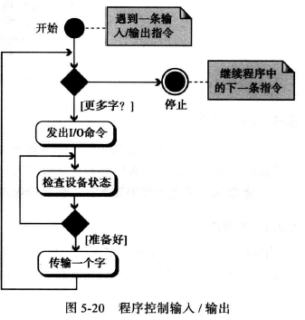
>CPU与I/O设备之间的数据传输是通过程序中的指令实现的。
>缺点：CPU需要不时地检查设备状态，影响CPU的性能

##### 中断控制输入/输出

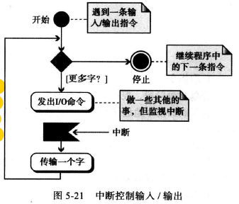
>+ CPU不需要不停地查询IO设备的状态。当IO设备准备好时，他通知（中断）CPU；
>+ 节省CPU时间；
	
##### 直接存储器存放（DMA）


>由DMA控制器来承担CPU的一些功能，主要用于高速IO设备传输大量的数据，如硬盘；
>
>优点：CPU工作效率很高
>
>缺点：需要增加DMA控制硬件
>
>DMA控制器中有寄存器，可以在内存传输前后保存数据块。


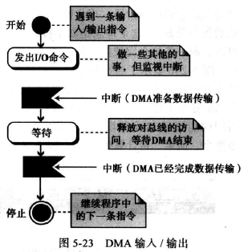
>**这种方法中，CPU只有在一小段时间内是空闲的。CPU仅当在DMA和内存间传输数据时才空闲，而不是在设备为传输数据做准备时。**

 
### 不同的体系结构

##### CISC（复杂指令集计算机）
`complex instruction set computer`
+ 设计策略: 使用大量的指令，包括复杂指令；
+ 优点：程序设计更容易，因为每个简单的或复杂的任务都有一条对应的指令。程序员不需要写一大堆的指令去完成复杂的任务。
+ 缺点：指令集的复杂性是的CPU和控制单元的电路非常复杂
+ 优化方案：程序在两个层面上运行，CPU不直接执行机器语言指令，CPU只执行被称为微操作的简单操作，复杂指令被转化为一系统简单操作后由CPU执行，使用微操作的程序设计被称为微程序设计。
+ 应用：英特尔公司开发的奔腾系列CPU

##### RISC（精简指令集计算机）
`reduce instruction set computer`
+ 设计策略：使用少量的指令完成最少的简单操作。
+ 缺点：程序设计更难，更费时，复杂指令都用简单指令来模拟。

#### 流水线


#### 并行处理

>+ 传统计算机只有单个控制单元、单个算术逻辑单元、单个内存单元；如今拥有具有多个控制单元、多个算术逻辑单元和多个内存单元的计算机，这种思量成为并行处理。
>+ 并行处理可以发生在数据流、指令流或两者都有；
>+ 并行处理把计算机的组织（从数据处理来看）分为4类：
>	+ SISD组织
>	+ SIMD组织
>	+ MISD组织
>	+ MIMD组织


1. SISD组织（单指令流，单数据流）
	表示计算机有一个控制单元、一个算术逻辑单元、一个内存单元；指令被顺序执行，每条指令可以存取数据流中的一个或多个数据项。
	


2. SIMD组织（单指令流、多数据流）
	计算机有一个控制单元、多个处理单元和一个内存单元。所有处理器单元从控制单元接收相同的指令，但在不同的数据项上操作。
	


3. MISD组织（多指令流、单数据流）
	
	多个指令流的多个指令作用于相同的数据项。
	只是概念，从来没被实现过。
	
	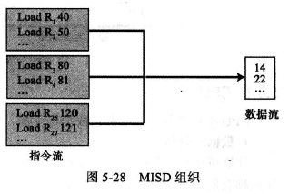


4. MIMD组织（多指令流、多数据流）
	多指令流的多个指令作用于多个数据流（每条指令作用于一个数据项）
	被现代计算机实现；
	


### 简单计算机


#### CPU
三部分：数据寄存器、算术逻辑单元（ALU）、控制单元
1. 数据寄存器：
	1. 计算机中有16个16位的数据寄存器，记为R<sub>0</sub>-R<sub>15</sub>
2. 控制单元
	1. 程序计数器（PC）：8位。保存下一条被执行的指令的地址
	2. 指令寄存器（IR）：16位。存放当前周期译码的指令

#### 主存


#### 输入/输出子系统


#### 指令集


#### 处理指令

**ALU只能操作那些存储在CPU数据寄存器中的数据**


  ## 第六章 计算机网络和因特网

本章目标：
+ 描述局域网和广域网（LAN和WAN）；
+ 区分因特网和互联网；
+ 描述作为因特网网络模型的TCP/IP协议族；
+ 定义TCP/IP协议族中的各层以及他们的关系；
+ 从应用层描述一些应用；
+ 描述传输层协议提供的服务；
+ 描述网络层协议提供的服务；
+ 描述数据链路层使用的不同协议；
+ 描述物理层的责任；
+ 描述在计算机网络中使用的不同传输介质；


### 引言

#### 网络

**网络**：是一系列可用于通信的设备相互连接构成的

**设备：**
+ 主机（终端），如台式机、笔记本电脑、工作站、手机等；
+ 连接设备
	+ 路由器：将一个网络和另一个网络相连
	+ 交换机：将不同设备连接在一起
	+ 调制解调器：可以改变数据形式


##### 局域网

**局域网（LAN）**通常是与单个办公室、建筑或校园内的几个主机相连的**私有网络**


##### 广域网

**广域网**也是通信设备互联构成的。
+ 局域网将主机相连，广域网则将交换机、路由器或调制调节器之类的连接设备互连
+ 局域网为机构私有，广域网则有通信公司创建并运营

种类：
+ 点对点广域网：通过传输媒介（电缆或无线）连接两个通信设备的网络
+ 交换广域网：至少两个端的网络，交换广域网用于当今全球通信的骨干网，是几个点对点广域网通 过开关连接产生的结合体


##### 互联网络

两个或多个网络（通常是局域网和广域网）相互连接时，它们构成一个互联网络（网际网）


#### 因特网

**成千上万个互联网络组成**

+ **骨干网**：在顶层，为通信公司拥有，通过一些复杂的交换系统相互连接，这些交换系统称为网络对等汇点
+ **供应商网络**：在第二层，规模较小的网络，付费使用骨干网上的一些服务，与骨干网相连，有时也连接其他供应商网络
+ **客户网络**：在边缘，真正使用基于因特网服务的网络，向供应商网络付费得到服务
+ **骨干网和供应商网络也被称为因特网服务供应商（ISP）**，骨干网被称为国际因特网服务供应商，供应商网络被称为国内或地域性因特网服务供应商


#### 协议分层

**协议**：定义了发送器、接收器以及中间设备必须遵循的以保证有效通信的规则。

**协议分层：** 简单的通信可能只需要一条简单的协议，当通信变得复杂，可能需要将任务分配到不同的协议层，那么在每一个协议层都需要一个协议。

#### TCP/IP协议族

因特网中使用的协议集（一组通过不同分层进行组织的协议）被称为**TCP/IP协议族**

TCP/IP协议族是一个**分层协议**，由特定功能的交互式模块组成，**层次这个术语说明每一个高层协议都基于一个或多个底层协议提供服务**


##### 分层架构

为了展示TCP/IP协议族中的分层是如何在两台主机通信中的作用，我们假设使用一个由3个LAN构成的小网络，且链路层开关与每个LAN相连，同时这些链接都与同一个路由器相连。


>+ 计算机A与B进行通信，共有5个设备：源主机A、链接1中的链路层开关、路由器、链接2中的链路层开关、目标主机B
>+ 每个设备涉及的层组都由其在网络上扮演的角色所涉及的层组决定，两台主机涉及5个协议层，源主机A在应用层创建消息通过协议层向下发送到物理层，目标主机B在物理层接收消息，通其他协议层发送至应用层
>+ 路由器只涉及3个层，路由器只用来路由，没有传输层和应用层
>+ 链路层开关只涉及2个层：数据链路层和物理层


##### 地址和数据包名称

>+ 任何涉及两步校验的通信需要两个地址：源地址和目标地址
>+ 每个协议层都需要一组地址，但物理层不需要地址，因为物理层的数据交换的单位是位，无法得到地址
>  
>  
**>应用层**：使用名称来定义提供服务的站点，如jzstudio.com或邮箱地址等
**>传输层**：地址被称为端口号，端口号作用是在源和目标之间定义应用层程序，通过各程序的本地地址来区分多个同时运行的本地程序
**>网络层**：在整个因特网范围是全球化的，独一无二地定义了该设备与因特网的连接
**>链路层**：有时称为MAC地址，每个链路层地址在计算机网络中定义一个特定的主机或路由器


### 应用层

> 应用层向用户提供服务。通信由逻辑连接提供，也就是说，假设两个应用层通过之间假想的直接连接发送和接受消息。


##### 应用层模式


+ 客户机—服务器模式（Client/Server模式）
	+ 万维网（WWW、web）和它的超文本传输协议（HTTP）、文件传输协议（FTP）、安全外壳协议（SSH）、邮件服务等
	+ 特点：
		+ 服务器端程序需要一直运行，客户端程序只在需要的时候运行
		+ 客户端不能提供服务
		+ 服务器端通信负荷压力大，服务器费用昂贵

+ 端到端模式（P2P模式）
+ 特点：
	+ 不需要一个一直运行并等待客户端程序连接的服务器程序
	+ 终端可以同时提供服务也可以接收服务
	+ 易于扩展，不需要专门的服务器，分散服务器压力，成本低
	+ 安全性相对要差
	+ 适应性差，并不是所有的应用都可以使用端对端模式


#### 标准化客户机-服务器应用

##### 万维网和超文本传输协议

>万维网（WWW或Web）：具有连接分布在世界各地的文档中的存储库

>+ 分布式
  分布在世界上的每一个Web服务器都可以往这个存储库中添加新的网页
>+ 超文本
>文档中链接的另一个文档，可以检索到被链接的文档，编辑这种文档的语言称为HTML（超文本标记语言）
>+ 站点
>客户通过浏览器访问服务器的服务，提供的服务分布在许多地方，称为站点
>+ 网页
>每个站点存储一个或多个文档称为网页，每个网页之间可以通过超文本进行链接


#### 文件传输服务

文件传输协议（FTP）是TCP/IP提供的标准协议，用于从一台计算机复制文件到另一台计算机

+ 客户端有三部分组成：用户接口、客户端控制进程、客户端数据传输进程

+ 服务端有两部分组成：服务器控制进程、服务器数据传输进程

+ 控制连接建立在控制进程间，数据连接建立在数据传输进程间


>命令和数据的分开传输使得FTP效率更高。控制连接使用非常简单的通信规则，一次只需传输一行命令或一行响应。另一方面，数据连接需要更复杂的规则，因为传输的数据是多种多样的。

>两个连接有不同的生命周期:
>+ 控制连接在整个交互式FTP会话中都保持打开
>+ 数据连接为每个文件传输打开和关闭，每次涉及使用文件传输命令时，它就打开，文件传输结束后，它就关闭

#### 电子邮件


#### TELNET（Terminal Network）
终端网络，最早的远程登录协议之一
	TELNET以明文的（没有加密）发送所有数据，包括密码，不安全

#### SSH（安全外壳）
是一个可以用作多个目的（如远程登录和文件传输）的安全应用程序
最初是为了替代TELNET而设计


#### 域名服务
**使用IP地址唯一的标识主机与网络之间的连接，但是我们更愿意使用名字而不是数字化的地址，需要一个可以将名称映射到地址的目录系统**

+ 中央目录系统
早期中央目录系统承担所有的映射工作，随着计算机网络的发展，中央目录系统压力很大，一旦出现故障，整个通信网络就会瘫痪。

+ 分布式目录系统
将目录映射的工作分布到世界上的很多专门的计算机上


### 传输层

## 第七章 操作系统


