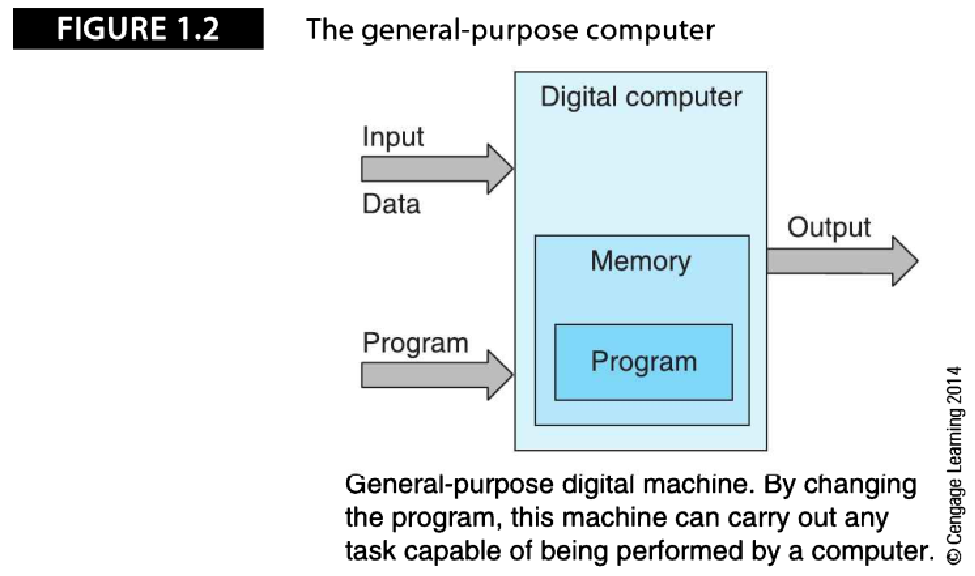
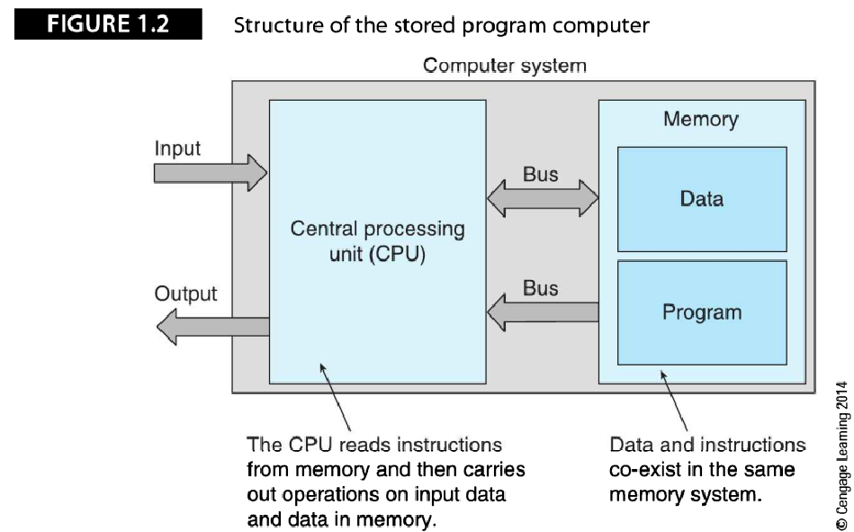
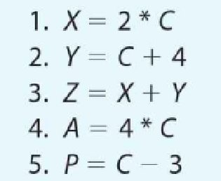
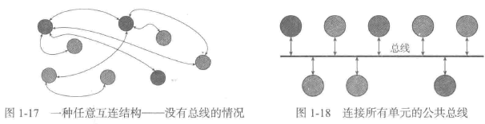

#进行中 
## 起始篇 （包括第1、2章）
**术语体系结构的3种用法**

+ 指令集体系结构（ISA）
描述了**程序员**看到的计算机的**抽象视图**，并且定义了汇编语言和编程模型。之所以说它是抽象的，是因为它并没有考虑计算机的实现。
+ 微体系结构
描述了一种指令集体系结构的实现方式。微体系结构关注计算机的**内部设计**。
+ 系统体系结构
关注包括处理器、存储器、总线和外设在内的整个系统。

**计算机系统体系结构所涉及的内容：**

## 第一章  计算机系统体系结构

## 什么是计算机体系结构

>+ 计算机系统包括读取并执行程序的**中央处理单元**（Central processing unit,CPU），保存程序和数据的**存储器**，以及**输入输出子系统**，这些子系统会使CPU与显示器、打印机等外部设备之间的通信变得更加容易。
>+ 计算机中实际执行程序的部分叫做CPU，或者更简单地被称作**处理器**。**微处理器**则是在单个硅片上实现的CPU。围绕着微处理器构建的计算机被称作**微机**。
>+ 尽管CPU是计算机的核心，计算机的性能既取决于CPU，也取决于其他子系统的性能。如果不能高效进行数据传输，仅仅提高CPU的性能是毫无意义的。

**简单通用计算机结构**
没有扩展总线

>+ 信息（即程序和数据）保存在存储器中，为了实现不同的目标，计算机会使用不同类型的存储器，如Cache、主存、辅存等多个存储层次，大多数处理器都在CPU内集成了片上Cache。
>+ Cache是存放常用数据的高速、专用存储器。主存中存放了大量的工作数据。辅存是指磁盘和CD-ROM，能够存储海量数据。
>+ 组成计算机的各个子系统通过总线连接在一起，数据通过总线从计算机中的一个位置传递到另一个位置。

（1）如图，描述了一台接收并处理输入信息、产生输出结果的可编程数字计算机。

（2）可编程计算机接收两种类型的输入：要处理的数据，以及要如何处理输入数据的程序。程序不过是计算机所执行的完成给定任务的操作序列。

（3）数字计算机的结构，可以被分为两部分：中央处理单元和存储器系统。CPU读程序并完成程序指定的操作。存储器系统保存两类信息：程序，程序处理或产生的数据。

（4）寄存器是CPU内部用来存放数据的存储单元。

（5）时钟提供了脉冲流，所有内部操作都在时钟脉冲的触发下进行。时钟频率是决定计算机速度的一个因素。

**程序执行的过程**

**计算机指令**
尽管计算机能够执行上百种不同指令，但下面的6条基本指令可以将所有计算机指令进行分类：

>+ MOV   A, B			将B的值复制到A
>+ LOAD   A, B			将存储单元B的值复制到寄存器A中
>+ STORE  A, B			将寄存器B的值复制到存储单元A中
>+ ADD	A, B			A与B相加，结果保存到A中
>+ TEST     A			测试A的值是否为0
>+ BEQ	Z		  	若最后一次测试结果为TRUE，执行地址Z处的代码,执行

 
## 体系结构和组成

**计算机体系结构**

>计算机体系结构含有结构（structure）的意思，描述了一些与计算机组成方式有关的内容。之所以定义计算机体系结构，是因为不同的用户会从完全不同的角度看待计算机。计算机体系结构通常被认为是**程序员视角**中的计算机。程序员所看到的是计算机的抽象视图，计算机的实际硬件和实现都被隐藏起来了。这个抽象视图现在通常被称作**指令集体系结构**（instruction set architecture，ISA）。

**计算机组成**
>计算机组成表示其体系结构的具体实现。计算机组成是计算机体系结构的实例化（即将抽象变为具体）。
>本书用术语“体系结构”代表计算机的抽象指令集体系结构（它的指令集），用术语“组成”代表计算机的实际硬件实现。

**寄存器**

>**寄存器**是用来存放一个单位的数据或字数据的存储单元。寄存器通常用它所保存数据的位数来描述，典型的有8位、16位、32位和64位。
>寄存器与存储器中的字存储单元没有本质区别。二者的实际差别在于，寄存器位于CPU内，它的访问**速度远远快于**访问CPU外的存储器。

**机器码&汇编语言&高级语言**

>计算机上执行的代码表示为二进制0和1组成的串，被称作机器码。每种计算机都只能执行一种特定的**机器码**。
>人类可读的机器码（如ADD R0,R1）叫作**汇编语言**。
>能够在类型完全不同的计算机上运行，与底层计算机体系结构几乎没有关系的代码叫做**高级语言**（如C或Java等）。在执行之前，高级语言程序必须先被编译为计算机的本地机器码。

**时钟**
>绝大多数数字电子电路都带有一个时钟，用以生成连续的间隔固定的电脉冲流。之所以被称作时钟，是因为可用这些电脉冲来计时或确定计算机内所有事件的顺序。如，处理器可能会在每一个时钟脉冲到来时执行一条新指令。

**RISC和CISC**

1. RISC（精简指令集计算机）体系结构

>+ 设计策略：是使用少量的指令完成最少的简单操作。
>+ 缺点：程序设计更难，复杂指令需要用简单指令模拟。
>+ 应用：ARM处理器

2. CISC（复杂指令集计算机）体系结构

>+ 设计策略：是使用大量的指令，包括复杂指令。
>+ 优点：程序设计更容易，因为每个简单的或复杂的任务都有一条对应的指令。程序员不需要写一大堆的指令去完成复杂的任务。
>+ 缺点：指令集的复杂性使得CPU和控制单元电路非常复杂。
>+ 应用：英特尔公司开发的奔腾系列CPU。

## 计算机发展

### 机械计算机

### 机电式计算机

### 早期的电子计算机

### 微机和PC革命

### 摩尔定律和进步的历程

+ **摩尔定律**

	是卡沃-米德于1975年根据戈登-摩尔所观察到集成电路的集成度每18个月翻一番，摩尔定律是一个经验性的观察结果。

**乱序执行**

程序中的指令必须一条接一条按照在程序中的出现的顺序执行。

有时可以通过改变指令的执行顺序提高计算机的速度。图中，指令（4）和（5）可以在任何时候执行，但指令（3）必须在指令（1）和（2）结束后执行。

### 存储技术发展

覆盖着电容的旋转的磁鼓
	->阴极射线管
		->铁氧体磁芯存储器
			->磁盘
				->光存储器（DVD等）

### 普适计算

计算是无所不在的！

### 多媒体计算机

多媒体处理（处理和存储音频/视频数据）需要很大的存储容量以及完成大量简单重复操作的实时处理声音样本的图像像素的能力。

## 存储程序计算机

## 存储程序的概念

操作数为数据的地址，而不是数据本身。

两地址指令

单地址指令

**计算机分类：**
>+ 可以按照计算机的指令处理数据的方式对计算机分类
>	+ **存储器-存储器型：**一条指令能够从存储器中读出源操作数，对数据完成某个操作，并将结果保存在存储器中
>	+ **寄存器-存储器型**：能够处理两个数据，其中一个位于存储器中，另一个位于寄存器中，结果要么被写回存储器，要么被写回寄存器，如Intel IA32 CPU体系结构
>	+ **寄存器-寄存器型：**只能对寄存器中的内容进行操作，这些计算机必须通过LOAD指令将数据读入寄存器并使用STORE指令将数据从寄存器送回存储器。由于LOAD 和STORE操作是仅有的存储器访问指令，这些计算机也被称为load/store 型计算机，如ARM和MIPS CPU体系结构

## 计算机系统概览

1. 存储层次
	

2. 总线
	

## 第二章 计算机算术
