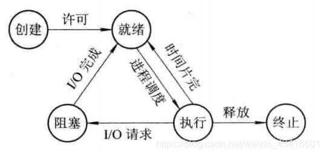
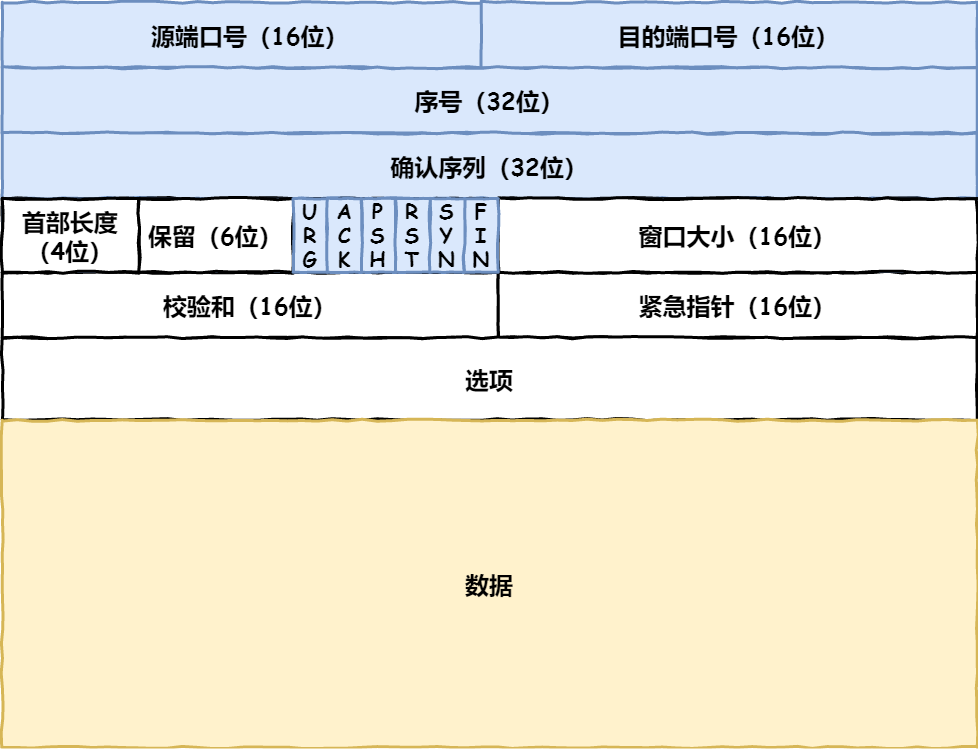
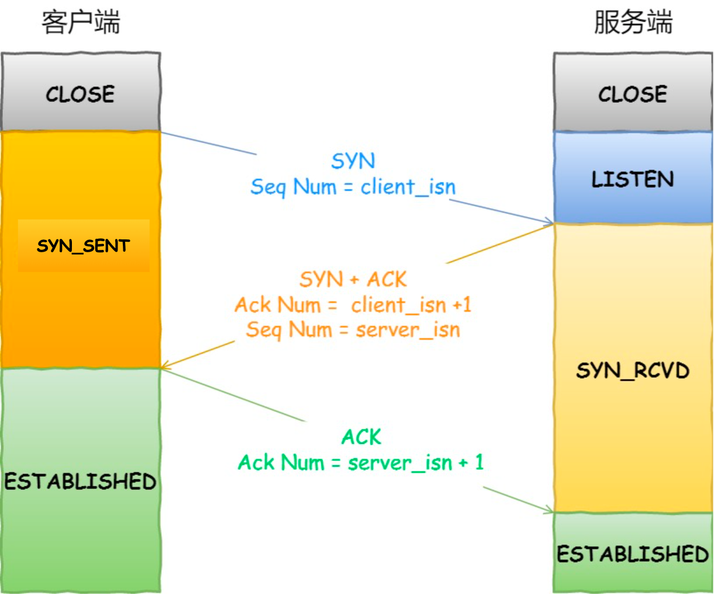

# 操作系统

## 1. 进程

进程就是正在执行的程序，是操作系统在资源分配的基本单位。一般来说，进程包括指令、数据和PCB。

**守护进程**是运行在后台的特殊进程，独立于控制终端的，并周期性地执行某些任务。

## 2. 僵尸进程

**僵尸进程**是子进程先于父进程退出后，子进程的PCB需要其父进程释放，但是父进程并没有释放子进程的 PCB，这样的子进程就称为僵尸进程。**僵尸进程实际上是一个已经死掉但并未释放 PBC 的进程**。

+ 僵尸进程的产生

  一个进程在调用 exit 命令结束自己的生命周期时，它并没有真正的被销毁，而是留下一个称为**僵尸进程（Zombie）** 的数据结构（系统调用 exit 的作用是使进程退出，但也仅仅限于将一个正常的进程变成一个僵尸进程，并不能将其完全销毁）。在 Linux 进程的状态中，僵尸进程是非常特殊的一种，它已经放弃了几乎所有内存空间，没有任何可执行代码，也不能被调度，仅仅在进程列表中保留一个位置，记载该进程的退出状态等信息供其他进程收集，除此之外，僵尸进程不再占有任何内存空间。这个僵尸进程需要它的父进程来为它收尸，如果他的父进程没有处理这个僵尸进程的措施，那么它就一直保持僵尸状态，如果这时父进程结束了，那么init进程自动会接手这个子进程，为它收尸，它还是能被清除的。但是如果如果父进程是一个循环，不会结束，那么子进程就会一直保持僵尸状态，这就是为什么系统中有时会有很多的僵尸进程。

+ 僵尸进程的危害

  如果有大量的僵尸进程驻在系统之中，必然消耗大量的系统资源。但是系统资源是有限的，因此当僵尸进程达到一定数目时，系统因缺乏资源而导致奔溃。所以在实际编程中，避免和防范僵尸进程的产生显得尤为重要。

+ 如何避免僵尸进程？=================

  + 父进程通过wait和waitpid等函数等待子进程结束；
  + 使用signal函数为SIGCHLD安装handler；
  + 父进程不关心子进程的结束，则交给内核处理；
  + fork两次，回收子进程，并将孙进程交给１号进程（initi进程）。

## 3. 孤儿进程

一个父进程退出，而它的一个或多个子进程还在运行，那么那些子进程将成为孤儿进程。孤儿进程将被 init 进程（pid=1）所收养，并由init进程对它们完成状态收集工作。

**孤儿进程与僵尸进程的区别：**

孤儿进程与僵尸进程不同的是，由于父进程已经死亡，系统会帮助父进程回收处理孤儿进程。所以孤儿进程实际上是不占用资源的，因为它终究是被系统回收了。不会像僵尸进程那样占用 ID，损害运行系统。

## 4. 线程

线程是进程内部不同的执行路径，是操作系统独立调度的基本单位。一个进程中可以有多个线程，他们共享进程资源。

比如说，微信和浏览器是两个进程，浏览器进程里面有很多线程，例如 HTTP 请求线程、事件响应线程、渲染线程等等，线程的并发执行使得在浏览器中点击一个新链接从而发起 HTTP 请求时，浏览器还可以响应用户的其它事件。

+ **两种线程**
  + 用户线程、内核级线程

## 5. 进程和线程的区别？

+ 进程是资源分配的最小单位，线程是CPU调度的最小单位
+ 进程就是**正在执行的程序**，线程是进程内部的**不同的执行路径**。
+ 一个程序至少有一个进程，一个进程至少有一个线程。
+ 进程有自己的独立地址空间，每启动一个进程，系统就会为它分配地址空间；而线程是共享进程中的数据、地址空间的。
+ 多进程程序更健壮，多线程程序只要有一个线程死掉，整个进程也死掉了；而一个进程死掉并不会对另外一个进程造成影响，因为进程有自己独立的地址空间。
+ 线程之间的通信更方便，同一进程下的线程共享全局变量、静态变量等[数据](https://www.nowcoder.com/jump/super-jump/word?word=数据)
+ 进程上下文切换开销大，线程开销小

有个形象的例子区分进程和线程：车间和工人或者高速路和车道。

## 6. 进程状态

+ 在五状态模型里面，进程一共有 5 中状态，分别是**创建、就绪、运行、终止、阻塞**。
+ 运行状态就是进程正在 CPU 上运行。在单处理机环境下，每一时刻最多只有一个进程处于运行状态。
+ 就绪状态就是说进程已经处于准备运行的状态，即进程获得了除CPU之外的一切所需资源，一旦得到CPU即可运行。
+ 阻塞状态就是进程正在等待某一事件而暂停运行，比如等待某资源为可用或等待I/O完成。即使CPU空闲，该进程也不能运行。

运行态→阻塞态：往往是由于等待外设，等待主存等资源分配或等待人工干预而引起的。

阻塞态→就绪态：则是等待的条件已满足，只需分配到处理器后就能运行。

运行态→就绪态：不是由于自身原因，而是由外界原因使运行状态的进程让出处理器，这时候就变成就绪态。例如时间片用完，或有更高优先级的进程来抢占处理器等。

就绪态→运行态：系统按某种策略选中就绪队列中的一个进程占用处理器，此时就变成了运行态。

## 7. 并发和并行

+ 并发就是在一段时间内，多个任务都会被处理；但在同一时刻，只有一个任务在执行。单核处理器可以做到并发。比如有两个进程A和B，A运行一个时间片之后，切换到B，B运行一个时间片之后又切换到A。因为切换速度足够快，所以宏观上表现为一段时间内能同时运行多个程序。
+ 并行就是在同一时刻，有多个任务在执行。这个需要多核处理器才能完成，在微观上就能同时执行多条指令，不同的程序被放到不同的处理器上运行，这个是物理上的多个进程同时进行。

## 8. 进程调度算法

**调度算法**是指根据系统的资源分配策略所规定的资源分配算法。

+ 先来先服务算法

  + 非抢占式的调度算法，按照请求的顺序进行调度。
  + 有利于长作业，但不利于短作业，因为短作业必须一直等待前面的长作业执行完毕才能执行，而长作业又需要执行很长时间，造成了短作业等待时间过长。另外，对`I/O`密集型进程也不利，因为这种进程每次进行`I/O`操作之后又得重新排队。

+ 短作业优先

  + 非抢占式的调度算法，按估计运行时间最短的顺序进行调度。
  + 长作业有可能会饿死，处于一直等待短作业执行完毕的状态。因为如果一直有短作业到来，那么长作业永远得不到调度。

+ 最短剩余时间优先

  + 最短作业优先的抢占式版本，按剩余运行时间的顺序进行调度。 当一个新的作业到达时，其整个运行时间与当前进程的剩余时间作比较。如果新的进程需要的时间更少，则挂起当前进程，运行新的进程。否则新的进程等待。

+ 时间片轮转

  + 将所有就绪进程按 `FCFS` 的原则排成一个队列，每次调度时，把 `CPU` 时间分配给队首进程，该进程可以执行一个时间片。当时间片用完时，由计时器发出时钟中断，调度程序便停止该进程的执行，并将它送往就绪队列的末尾，同时继续把 `CPU` 时间分配给队首的进程。
  + 时间片轮转算法的效率和时间片的大小有很大关系：
    - 因为进程切换都要保存进程的信息并且载入新进程的信息，如果时间片太小，会导致进程切换得太频繁，在进程切换上就会花过多时间。 
    - 而如果时间片过长，那么实时性就不能得到保证。

+ 优先级调度

  + 为每个进程分配一个优先级，按优先级进行调度。

    为了防止低优先级的进程永远等不到调度，可以随着时间的推移增加等待进程的优先级。

  

  **抢占式调度、非抢占式调度：**

  + **抢占式**就是说操作系统将正在运行的进程强行暂停，由调度器将`CPU`分配给其他就绪进程。
  + **非抢占式**是调度器一旦把处理机分配给某进程后便让它一直运行下去，直到进程完成或发生进程调度进程调度某事件而阻塞时，才把处理机分配给另一个进程。

## 9. 什么是进程和线程的亲缘性？

进程/线程只在某个cpu核上运行，避免因切换带来的CPU的L1/L2 cache失效。

## 10. 什么是协程？

**协程**是用户态的轻量级线程，是一种比线程更加轻量级的存在，协程不被操作系统内核管理，完全由程序控制。

**协程的优点**

1）没有线程切换开销；

2）单线程无需对共享资源加锁机制。

其**缺点**也显而易见，就是无法利用多核资源。**协程本质还是单线程，无法直接利用多核处理器，需要配合进程实现**。

## 11. 死锁

两个线程或两个以上线程都在等待对方执行完毕才能继续往下执行的时候就发生了死锁。结果就是这些线程都陷入了无限的等待中。

原因：

+ 系统提供的资源太少了，远不能满足并发进程对资源的需求
+ 进程推进顺序不合适，互相占有彼此需要的资源，同时请求对方占有的资源，往往是程序设计不合理

## 12. 死锁产生的必要条件

需要同时具有以下四个条件：

+ **互斥条件：**即某个资源在一段时间内只能由一个进程占有，不能同时被两个或两个以上的进程占有。
+ **不可抢占条件**：进程所获得的资源在未使用完毕之前，资源申请者不能强行的从资源占有者手中夺取资源，而只能由该资源的占有者进程自行释放。
+ **占有且等待条件：**已经得到了某个资源的进程可以再请求新的资源。
+ **循环等待条件：**有两个或者两个以上的进程组成一条环路，该环路中的每个进程都在等待下一个进程所占有的资源。

## 13. 处理死锁的四种方法

（1）死锁预防：通过确保死锁的一个必要条件不会满足，保证不会发生死锁
（2）死锁检测：允许死锁的发生，但是可以通过系统设置的检测结构及时的检测出死锁的发生，采取一些措施，	将死锁清除掉
（3）死锁避免：在资源分配过程中，使用某种方法避免系统进入不安全的状态，从而避免发生死锁
（4）死锁解除：与死锁检测相配套的一种措施。当检测到系统中已发生死锁，需将进程从死锁状态中解脱出来。

+ **死锁预防：破坏三个条件（互斥是非共享设备特性，无法更改）。**

+ **死锁避免：**

  ​		两种死锁避免算法

  + 进程启动拒绝：如果一个进程的请求会导致死锁，则不启动该进程。
  + 资源分配拒绝：如果一个进程增加的资源请求会导致死锁，则不允许此分配 (银行家算法)。

+ **死锁检测**

  死锁检测的方法：

  + 在资源分配图中，找到不会阻塞又不独立的进程结点，使该进程获得其所需资源并运行，运行完毕后，再释放其所占有的全部资源。也就是消去该进程结点的请求边和分配边。
  + 使用上面的算法进行一系列简化，若能消去所有边，则表示不会出现死锁，否则会出现死锁。

+ **死锁解除**

  + 撤销死锁进程
  + 剥夺死锁进程的资源，直到不存在死锁
  + 鸵鸟算法（即直接忽略，当做什么都没发生，说出来可能不信，绝大多数的操作系统选择这个方法）。

# 计算机网络

## NAT协议

## 二层交换机和三层交换机的区别

## osi七层模型

物理层、数据链路层、网络层、传输层、表示层、会话层、应用层

## TCP报文头部结构

## IP 报文头部的格式

## 三次握手

## 四次挥手

## 路由交换协议

## TCP 可靠性

## TCP 和 UDP 区别