# 《计算机科学导论》第3版
#进行中


## 第一章	绪论

### 图灵模型

#### 数据处理器


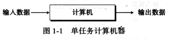

#### 可编程数据处理器

程序是用来告诉计算机对数据进行处理的指令集合。


**输出数据是依赖两方面因素的结合作用：输入数据、程序**

+ 相同程序，不同输入数据，输出不同
+ 相同输入数据，不同程序，输出不同
+ 相同输入数据，相同程序，输出相同

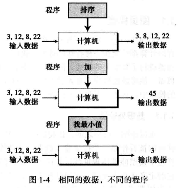

#### 通用图灵机

> 通用图灵机是对现代计算机的首次描述，该机器只要提供了合适的程序就能做任何运算。

### 冯诺依曼模型

冯诺依曼指出：**数据和程序都存储在计算机的存储器中**

#### 4个子系统

+ 存储器：用来存储数据和程序的区域
+ 算术逻辑单元（ALU）：用来进行计算和逻辑运算的地方
+ 控制单元：对存储器、算术逻辑单元、输入/输出等子系统进行逻辑操作的单元
+ 输出/输出单元：输入子系统负责从计算机外部接收输入数据；输出子系统负责将计算机处理结果输出到计算机外部。


#### 存储程序概念

**冯诺依曼模型中要求程序必须存储在内存（存储器）中。**

> 现代计算机的存储单元用来存储程序及其相应数据。这意味着数据和程序应该具有相同的格式，这是因为他们都存储在存储器中。

#### 指令的顺序执行


### 计算机组成部分

计算机由三大部分组成：计算机硬件、数据、计算机软件

#### 数据

冯诺依曼模型将一台计算机定义为一台数据处理机。他接收输入数据，处理并输出相应的结果。

+ 存储数据
+ 组织数据


#### 计算机软件

+ 算法：由有序的指令集组成
+ 语言
  + 机器语言
  + 自然语言
    + 符号语言（汇编语言）
    + 高级语言（C、Java等）
+ 软件工程：结构化程序的设计和编写，为高效的程序开发而诞生的一门理论体系；
+ 操作系统

### 计算机历史

+ 机械计算机器（1930年以前）
+ 电子计算机（1930-1950年）
+ 现代计算机（1950年至今）

## 第二章	数字系统

主要内容：

+ 理解数字系统的概念；
+ 分清非位置化和位置化数字系统；
+ 描述十进制系统（以 10 为底）；
+ 描述二进制系统（以2为底）；
+ 描述十六进制系统（以 16 为底）；
+ 描述八进制系统（以8为底）；
+ 将二进制、 八进制或十六进制数字转换为十进制系统；
+ 将十进制数字转换为二进制、 八进制或十六进制系统；
+ 将二进制和八进制数字相互转换；
+ 将二进制和十六进制数字相互转换；
+ 查找在各种系统中代表特定数值所需的数码。

> **数字系统**定义了如何用独特的符号来表示一个数字。

数字系统分类：

+ 位置化系统
+ 非位置化系统

### 位置化系统


> S是一套符号集； b是底（或基数），它等于S符号集中的符号总数， 其中 S1和 ＆是代表分数部分或整个数字的符号。+-符号表示该数字可正可负。


#### 十进制系统（以10为底）

符号集是S ={0, 1, 2, 3, 4, 5, 6, 7, 8, 9}

1. 整数

   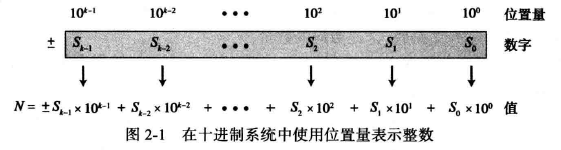

2. 实数（整数部分+小数部分）

   

#### 二进制系统(以2为底)

符号集：S={0,1}

> 数据和程序是以二进制模式（即位串）存储于计算机中的。

1. 整数

   

2. 实数

   

   

####    十六进制系统（以16为底）

符号集：S={0,1,2,3,4,5,6,7,8,9,A,B,C,D,E,F}

1. 整数

   

2. 实数

   实数用十六进制表示并不常见 

#### 八进制（以8为底）

字符集S={0,1,2,3,4,5,6,7}

1. 整数

   

2. 实数

   实数用8进制表示并不常见


####    位置转换

1. 其他进制转换到10进制

   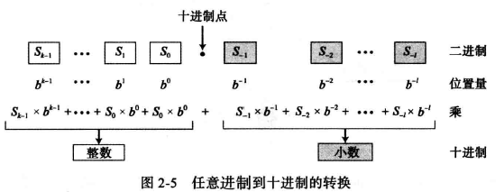

   

   2. 十进制到其他进制的转换

      1. 整数部分的转换使用连除
      2. 小数部分的转换使用连乘法

   3. 二进制转换16进制

      二进制中的4位恰好是十六进制中的1位

   4. 二进制转换8进制

      二进制中的3位恰好是八进制中的1位

   5. 16进制与8进制之间的转换

      借助二进制转换

      + 8 ->2 ->16
      + 16 -> 2 -> 8

## 第三章	数据存储

本章主要内容：

+ 列出计算机中使用的5种不同的数据类型；
+ 描述不同的数据如何以位模式存储在计算机内部；
+ 描述整数如何以无符号格式存储在计算机中；
+ 描述整数如何以符号加绝对值格式存储在计算机中；
+ 描述整数如何以二进制补码格式存储；
+ 描述实数如何以浮点格式存储在计算机中；
+ 描述文本如何通过各种不同的编码系统存储在计算机中；
+ 描述音频如何通过采样、 量化和编码存储在计算机中；
+ 描述图像如何通过光栅和矢量图模式存储在计算机中；
+ 描述视频如何以图像随时间变化的表示来存储在计算机中。

### 数据类型


> + 位(bit, binary digit的缩写）是**存储在计算机中的最小单位**。它是0或者1；
> + 位模式（位流）：表示数据的不同类型，多个位组成一个位模式；
> + 字节（Byte）：长度为8的位模式，成为1字节；
> + 字：指代更长位模式，比如可以表示`1个字=2字节`或者`1个字=4字节`等等；

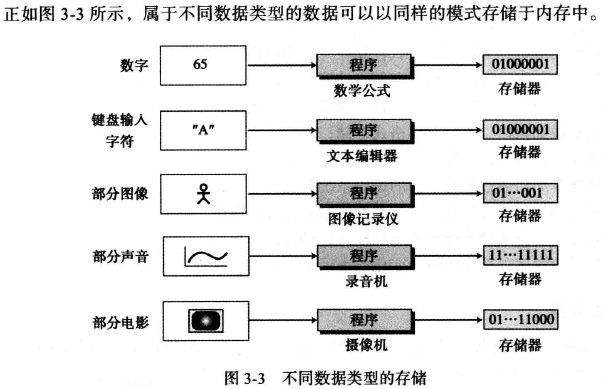

**计算机内存存储所有这些而无需辨别它们表示的是何种数据类型。**

### 存储数字

在存储到计算机内存之前，数字被转换为二进制系统，但是：

1. 如何存储数字的正负符号
2. 如何显示小数点
#### 存储整数
**整数可以被当做小数点位置固定的数字：小数点被固定在最右边。`定点表示法`用于存储整数，小数点是假定的，并不存储。**


>整数通常使用定点表示法存储在内存中
1. 无符号表示法
无符号整数是只包括零和正数的非负整数。计算机不可能表示到无穷大的整数，计算机定义了一个常量，称为`最大无符号整数`(2<sup>n</sup>-1)

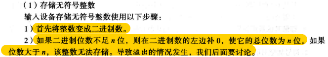


>溢出：
>因为大小（即存储单元的位的数量）的限制，可以表达的整数范围是有限的。在 n 位存储单元中，我们可以存储的无符号整数仅为 0 到2<sup>n</sup>-1之间。
>**如果发生溢出，只保存最右边的n位数字。**
>

>无符号整数的应用：
>**无符号整数表示法可以提高存储的效率，因为不必存储整数的符号。这就意味着所有分配的位单元都可以用来存储数字。只要用不到负整数，都可以用无符号整数表示法。**
>+ 计数
>+ 寻址
>+ 存储其他数据类型


2. 符号加绝对值表示法
尽管符号加绝对值格式在存储整数中并不常用，但该格式用千在计算机中存储部分实数。
>用于无符号整数的有效范围(0到2<sup>n</sup>-1) 被分成两个相等的子范围。
>0表示正整数；1表示负整数。


+ 符号加绝对值表示法的溢出
	存在正负两种溢出情况

3. 二进制补码表示法
>**几乎所有的计算机都是用二进制补码表示法来存储n位存储单元中有符号整数**
>在整数补码形式下，0表示正整数；1表示负整数。


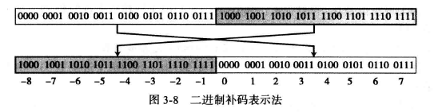


`反码`


`补码`

**1. 两种运算方式：**
+ 1. 该运算分为两步：首先， 从右边复制位， 直到有 1 被复制 ；接着， 反转其余的位。


+ 2.将一个整数进行补码运算的方法是先对它进行1次反码运算再加上1得到结果。

**2. 以二进制补码格式存储整数**

计算机遵循以下步骤：
- 将整数变为二进制序列
- 整数如果是0或者整数，以其原样存储（整数和0的补码为其自身）；如果是负数，计算机取其补码存储

**3.  从二进制补码格式还原整数**

计算机遵循以下步骤：
+ 如果最左位是1， 计算机取其补码。如果最左位是0, 计算机不进行操作。
+ 计算机将该整数转换为十进制。

**二进制补码表示法是计算机中用于存储整数的标准表示法**
#### 存储实数


>+ 实数是带有整数部分和小数部分的数字。
>+ 带有很大的整数部分或者很小的小数部分的实数不应该用定点表示法存储。


1. 浮点表示法

```
浮点表示法：该表示法允许小数点浮动；
组成：符号、位移量、定点数
```


2. 规范化

	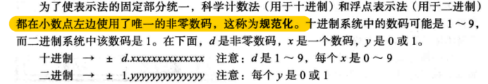
3. 符号、指数和尾数
	
	
	
	1. 符号
		一个数的符号可以用二进制位来存储（0或1）
	2. 指数
		指数（2的幂）定义为小数点移动的位数。注意幂可以为正也可以为负。余数表示法是用来存储指数位的方法。
	3. 尾数
		指的是小数点右边的二进制数。
		
1. 余码系统

	
5. IEEE标准

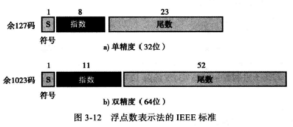


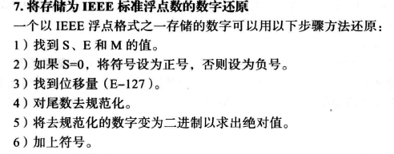


9. 存储0
	约定在这种情况下，符号、指数和尾数都设为0
10. 截断错误
	主要原因是尾数长度大于规定的长度，导致小数点右边的某几位数字被裁掉。
### 存储文本

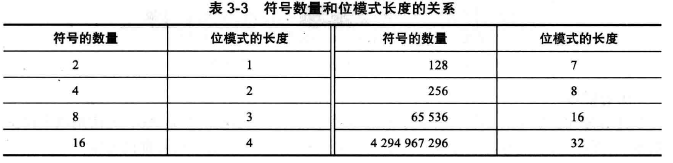


### 存储音频

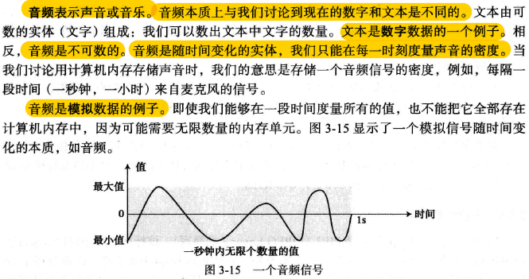

##### 采样


**采样率**


##### 量化


##### 编码

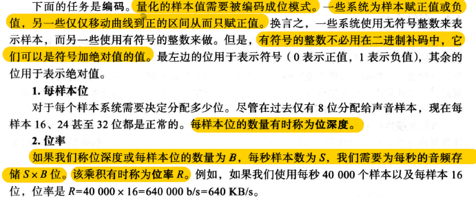
#### 声音编码标准


### 存储图像

>存储在计算机中的图像使用两种不同的技术：光栅图和矢量图
#### 光栅图

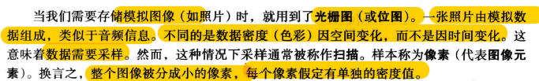

1. 解析度


2. 色彩深度


+ **真彩色：24位编码**
+ **索引色：8位编码**

3. 图像编码标准


#### 矢量图


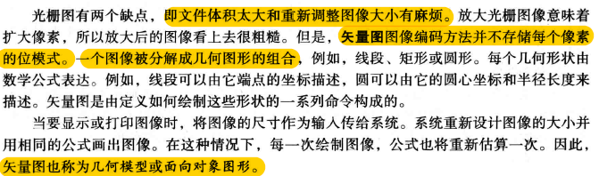


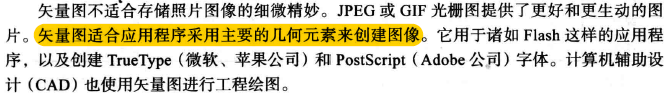


### 存储视频


## 第四章 数据运算

>本章主要学习内容：
>+ 列出在数据上进行的三类操作；
>+ 在位模式上进行一元和二元逻辑运算；
>+ 区分逻辑移位运算和算术移位运算；
>+ 在位模式上进行逻辑移位运算；
>+ 在以二进制补码形式存储的整数上进行算术移位运算；
>+ 在以二进制补码形式存储的整数上进行加法和减法运算；
>+ 在以符号加绝对值形式存储的整数上进行加法和减法运算；
>+ 在以浮点格式存储的实数上进行加法和减法运算；
>+ 理解逻辑和移位运算的一些应用，如置位、复位和指定位的反转等。


### 逻辑运算

#### 位层次上的逻辑运算

>一个位可以是0或者1，“0”表示逻辑“假”，“1”表示逻辑“真”，使用布尔代数的定义去操作二进制

1. 非（NOT）
	它只有一个输人。输出位是输入位的相反， 如果输入是0, 则输出为1 ；如果输人为1, 则输出为0。

	
2. 与（AND）

	
3. 或（OR）

	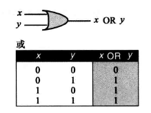
4. 异或（XOR）


#### 模式层次上的逻辑运算
相同的4个运算符被应用到n位模式

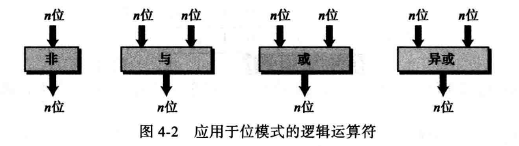

+ 非
	

+ 与


+ 或


+ 异或

	
##### 应用
1. 求反
2. 对指定的位复位（输入掩码）
	1. AND指定的位通过掩码  复位--0

	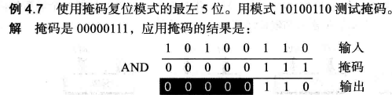
		2.  OR指定的位通过掩码  复位--1
	

		3.  XOR指定的位通过掩码 复位 取反


### 移位运算

>移位运算移动模式中的位， 改变位的位置。它们能向左或向右移动位。我们可以把移位 运算分成两大类：逻辑移位运算和算术移位运算。
#### 逻辑移位运算

>逻辑移位运算应用于**不带符号位的数的模式**。原因是这些移位运算可能会改变数的符号， 此符号是由模式中最左位定义的。


#### 算术移位运算

>算术移位运算假定位模式是用二进制补码格式表示的带符号位的整数。算术右移被用来对整数除以2；而算术左移被用来对整数乘以2。

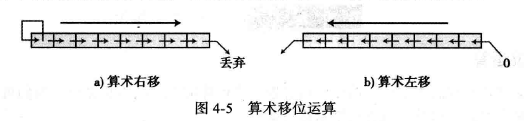
>+ 算术右移保留符号位， 但同时也把它复制， 放入相邻的右边的位中， 因此符号被保存。
>+ 算术左移丢弃符号位，接受它的左边的位作为符号位。如果新的符号位与原先的相同，那么运算成功，否则发生上溢或下溢，结果是非法的。


**实际应用：**

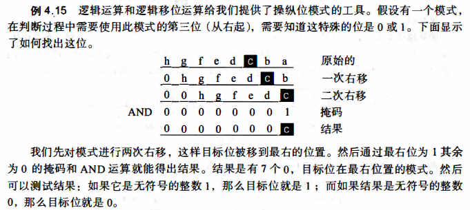
### 算术运算

**算术运算包括加、减、乘、除，适用于整数和浮点数。**
#### 整数的算术运算


1. 二进制补码中的加减法
	
	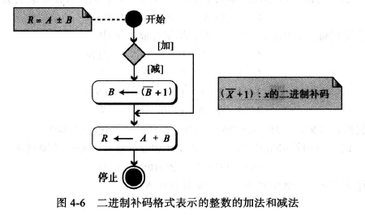 
	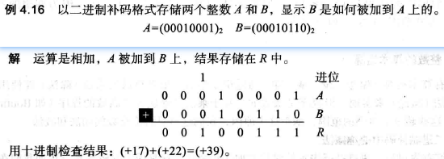
	
	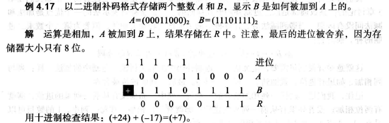
	
	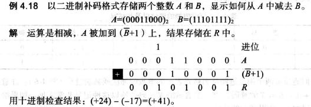
	
	
	==**两个数A与B相减的时候，不论B为正数还是负数，都要取反+1。因为A-B=A+(-B),把-B整体看成一个负数，取反操作只需将B取反加1即可。**==

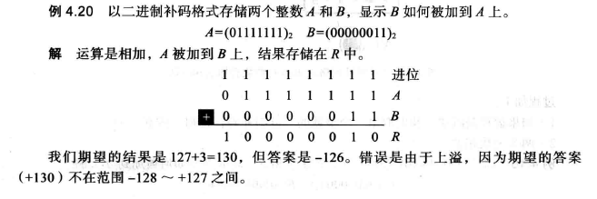
2. 符号加绝对值整数的加减法
	

#### 实数的算术运算
**实数的加减法**
>以浮点数存储的实数的加法和减法被简化为小数点对齐后以符号加绝对值格式（符号和尾数的组合） 存储的两整数的加法和减法。


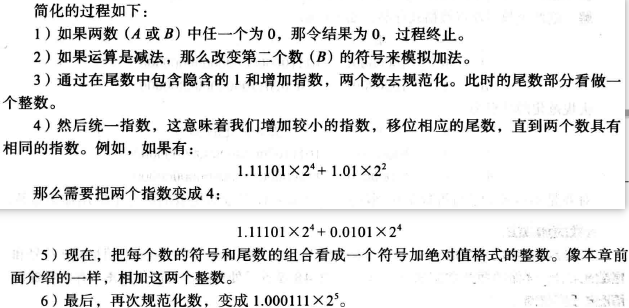


## 第五章 计算机组成

>主要内容：
>+ 列出计算机的三个子系统；
>+ 描述计算机中央处理单元（CPU）的作用；
>+ 描述典型计算机中指令周期的取指令--译码--执行阶段；
>+ 描述主存和它的地址空间
>+ 区分主存和缓存
>+ 定义输入/输出子系统；
>+ 理解子系统间的互相连接，列出不同总线系统；
>+ 描述输入/输出编址的不同方法；
>+ 区分设计计算机体系结构的两种主要趋势；
>+ 理解计算机是如何使用管道改善吞吐量的；
>+ 理解并行处理是如何改善计算机的吞吐量的。

**计算机组成部分**
+ 中央处理器（CPU）
+ 主存储器（内存）
+ 输入输出子系统

### 中央处理器
>用于数据的运算。包括三个部分：算术逻辑单元（ALU）、控制单元、寄存器组


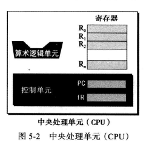

##### 算术逻辑单元
对数据进行运算
1. 逻辑运算
2. 移位运算
3. 算术运算

#### 寄存器
用来存放临时数据的高速独立存储单元

1. 数据存储器：保存运算的中间结果，命名为R1~Rn；


#### 控制单元


>控制单元控制各个子系统的操作，控制是通过从控制单元到其他子系统的信号来进行。

1. 指令存储器：CPU从内存中逐条的取出指令，并存储在指令存储器中，解释并执行指令；
2. 程序计数器：保存当前正在执行的指令的地址，当前指令执行完成后，计数器自动加1，指向下一条指令的内存地址；

### 主存储器（内存）

> + 内存是存储单元的集合，每个存储单元都有唯一的标识，称为地址；
> + **数据以字的形式在内存中传入传出**，字可以是8位、16位、32位、64位。如果字是8位，一般称为一个字节。


##### 地址空间 

>在硬件层次上，每个字都是通过地址来标识的。所有在存储器中标识的独立的地址单元的总数称为地址空间。 

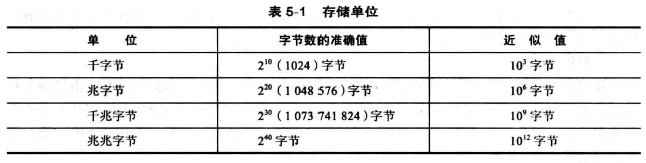

**内存用无符号二进制整数定义**

#### 存储器类型

主要的两种类型：RAM 、ROM

1. RAM
	1. SRAM：速度快，但价格昂贵
	2. DRAM：速度慢，价格便宜
特点：**易失性**，系统断电后，信息（程序或数据）会丢失
随机存取存储器是计算机中主存的主要组成部分

2. ROM
	1. PROM
	2. EPROM
	3. EEPROM
里面的数据由制造商写进去，用户只能读不能写。
特点：**非易失性**，系统断电后数据不会丢失。常用来存储那些在开机时运行的程序。

#### 存储器的层次结构


#### 高速缓冲存储器

>+ 高速缓存容量较小，且常被至于CPU与主存之间。
>+ 高速缓冲存储器在**任何时间**都含有主存中一部分内容的副本。


cpu要存取主存中的一个字的时候，将按一下步骤进行：


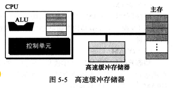
### 输入/输出子系统

>+ 可以使计算机与外界进行通信，并在断电情况下存储程序和数据，分为两大类：非存储设备和存储设备
>+ 非存储设备：键盘、鼠标、显示器、打印机等；
>+ 存储设备：也称为辅助存储设备，通常有磁介质和光介质两种。
>	+ 特点：便宜，断电后数据不丢失

### 子系统的互连
#### CPU与存储器的连接

CPU与主存储器之间通常由称为总线的三组线路连接在一起，分别为：数据总线、地址总线和控制总线；


>1. 数据总线：
>	数据总线是由多根线组成，每一根线上每次传递1位的数据。**线的数量取决于计算机的字的大小**。计算机的字是32 位(4 字节），那么需要有32 根线的数据总线，以便同一时刻能够同时传送32 位的字。
>2. 地址总线：
>	地址总线允许访问存储器中的某个字，地址的总线的线数取决于存储空间的大小（和字的位长也存在关系吧）。如果存储器容量为2<sup>n</sup>个字，那么总线一次需要传送n位的地址数据。因此他需要n根线。
>3. 控制总线：
>	**控制总线负责在中央处理器和内存之间传送信息。**
>	控制总线的线数取决千计算机所需要的控制命令的总数。如果计算机有了条控制命令，那么控制总线就需要有m根， 因为m位可以定义2<sup>m</sup> 个不同的操作。


#### I/O设备的连接
 
>输入/输出设备**不能够直接与连接CPU和内存的总线相连**。因为输入/输出设备的本质与CPU和内存的本质不同，输入/输出设备都是些机电、磁性或光学设备， 而CPU和内存是电子设备。**与CPU和内存相比，输入/输出设备的操作速度要慢得多。**因此必须要有**中介**来处理这种差异，输入/输出设备是通过一种被称为输入/输出控制器或接口的器件连接到总线上的。每一个输人/输出设备都有一个特定的控制器。


##### 控制器

控制器，或者说接口， 清除了输人／输出设备与CPU及内存在本质上的障碍。控制器可以是串行或并行的设备。

+ 串行控制器
	+ 只有一根数据线连接到设备上
+ 并行控制器
	+ 有多根数据线连接到设备上，一次能同时传送多个位
+ 常用控制器
	+ SCSI、火线、USB和HDM


1. 小型计算机系统接口（SCSI）

	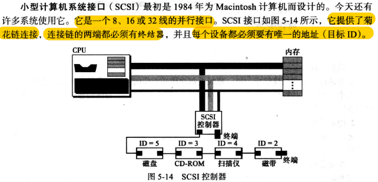

2. 火线

	
3. 通用串行总线USB


	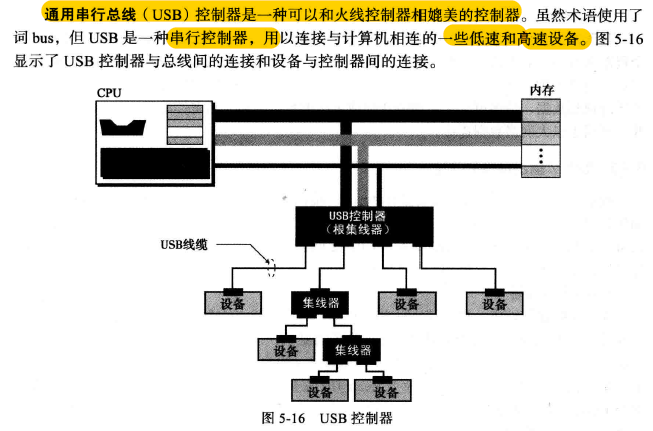


4. 高清晰度多媒体接口（HDMI）


#### 输入/输出设备的寻址

>通常CPU使用相同的总线在主存和输入/输出设备之间读写数据，唯一的不同是指令。如果指令涉及主存中的字，那么数据会在主存和CPU之间传送；如果指令涉及输入输出设备，那么数据会在输入输出设备和CPU之间进行传送。
>有两种方法对输入输出设备进行寻址：
>+ I/O独立寻址
>+ I/O存储器映射寻址

##### I/O 独立寻址

在I/O独立寻址中， 用来读／写内存的指令与用来读／写输入／输出设备的指令是完全不同的。有专门的指令完成对输入／输出设备的测试、 控制以及读写操作。每个输入／输出 设备有自己的地址。因为指令的不同， 所以输入／输出地址可以和内存地址重叠而不会产生混淆。
	+ 例如， CPU可以使用读命令Read 101 来从内存中读取字 101。它也可以使用输入 命令lnput 101 来从地址端口为 101 的输入／输出设备中读取数据。


 ##### I/O存储器映射寻址

在I/O存储器映射寻址方式中， **CPU将输入／输出控制器中的每一个寄存器都看作内存中的某个存储字**。换言之， **CPU没有不同的指令用来表示是从内存或是从输入／输出设备传送数据**。例如， 在指令集中只有一条Read指令， 如果地址指定的是内存中的某个单元， 则从内存中读取数据。如果地址指定的是输入／输出设备中的某个寄存器， 那么就从寄存器中读取数据。存储器映射的输入／输出的配置**优点**在于有一个较小的指令集， 所有对内存的操作指令都同样适合与输入／输出设备， 其**缺点**是输入／输出控制器占用了一部分内存地址。


###  程序执行

通用计算机使用称为程序的一系统指令来处理数据。计算机通过执行程序，将输入数据转换成输出数据。程序和数据都放在内存中。

#### 机器周期

>+ CPU利用重复的机器周期来执行程序中的指令，一步一步，从开始到结束。
>+ 一个简化的周期包括3步：取指令、译码、执行；


1. 取指令
	在取指令阶段， 控制单元命令系统将**下一条将要执行的指令复制到CPU的指令寄存器中**。被复制的指令地址保存在程序计数器中。复制完成后， 程序计数器自动加1指向内存中的下一条指令。
2. 译码
	机器周期的第二阶段是译码阶段。当指令置千指令寄存器后， 该指令将由**控制单元负责译码**。指令译码的结果是产生一系列系统可以执行的二进制代码。
3. 执行
	指令译码完毕后， 控制单元发送**任务命令到CPU的某个部件**， 例如， 控制单元告知系统， 让它从内存中加载（读）数据项， 或者是CPU让算术逻辑单元将两个输入寄存器中的内容相加并将结果保存在输出寄存器。这就是执行阶段。


#### 输入/输出操作

>计算机需要通过命令把数据从I/O设备传输到CPU和内存。因为输入输出设备的运行速度比CPU慢得多，因此CPU的操作在某种程度上必须要和输入输出设备同步。
>有三种办法被设计用于同步，分别为：程序控制输入/输出、中断控制输入/输出、直接存储器存取（DMA）。

##### 程序控制输入/输出
在程序控制输入输出中，采用最简单的一种同步：CPU等待I/O设备。
	
>CPU与I/O设备之间的数据传输是通过程序中的指令实现的。
>缺点：CPU需要不时地检查设备状态，影响CPU的性能

##### 中断控制输入/输出


>+ CPU不需要不停地查询IO设备的状态。当IO设备准备好时，他通知（中断）CPU；
>+ 节省CPU时间；
	
##### 直接存储器存放（DMA）


>由DMA控制器来承担CPU的一些功能，主要用于高速IO设备传输大量的数据，如硬盘；
>
>优点：CPU工作效率很高
>
>缺点：需要增加DMA控制硬件
>
>DMA控制器中有寄存器，可以在内存传输前后保存数据块。

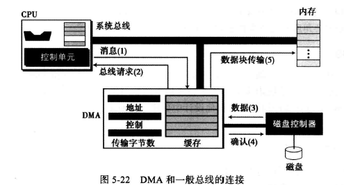


>**这种方法中，CPU只有在一小段时间内是空闲的。CPU仅当在DMA和内存间传输数据时才空闲，而不是在设备为传输数据做准备时。**

 
### 不同的体系结构

##### CISC（复杂指令集计算机）
`complex instruction set computer`
+ 设计策略: 使用大量的指令，包括复杂指令；
+ 优点：程序设计更容易，因为每个简单的或复杂的任务都有一条对应的指令。程序员不需要写一大堆的指令去完成复杂的任务。
+ 缺点：指令集的复杂性是的CPU和控制单元的电路非常复杂
+ 优化方案：程序在两个层面上运行，CPU不直接执行机器语言指令，CPU只执行被称为微操作的简单操作，复杂指令被转化为一系统简单操作后由CPU执行，使用微操作的程序设计被称为微程序设计。
+ 应用：英特尔公司开发的奔腾系列CPU

##### RISC（精简指令集计算机）
`recude instruction set computer`
+ 设计策略：使用少量的指令完成最少的简单操作。
+ 缺点：程序设计更难，更费时，复杂指令都用简单指令来模拟。

#### 流水线

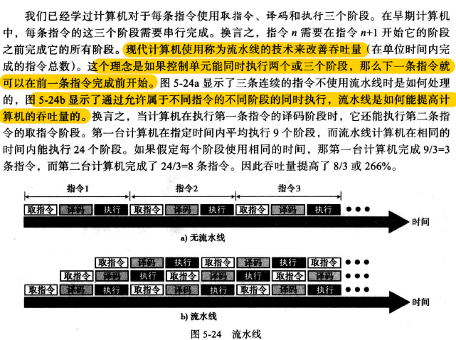

#### 并行处理

>+ 传统计算机只有单个控制单元、单个算术逻辑单元、单个内存单元；如今拥有具有多个控制单元、多个算术逻辑单元和多个内存单元的计算机，这种思量成为并行处理。
>+ 并行处理可以发生在数据流、指令流或两者都有；
>+ 并行处理把计算机的组织（从数据处理来看）分为4类：
>	+ SISD组织
>	+ SIMD组织
>	+ MISD组织
>	+ MIMD组织


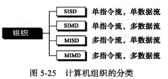

1. SISD组织（单指令流，单数据流）
	表示计算机有一个控制单元、一个算术逻辑单元、一个内存单元；指令被顺序执行，每条指令可以存取数据流中的一个或多个数据项。
	

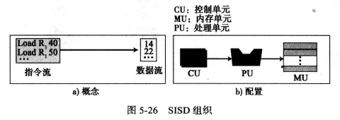


2. SIMD组织（单指令流、多数据流）
	计算机有一个控制单元、多个处理单元和一个内存单元。所有处理器单元从控制单元接收相同的指令，但在不同的数据项上操作。
	
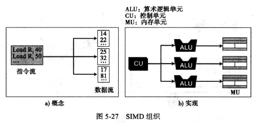


3. MISD组织（多指令流、单数据流）
	
	多个指令流的多个指令作用于相同的数据项。
	只是概念，从来没被实现过。
	
	


4. MIMD组织（多指令流、多数据流）
	多指令流的多个指令作用于多个数据流（每条指令作用于一个数据项）
	被现代计算机实现；
	
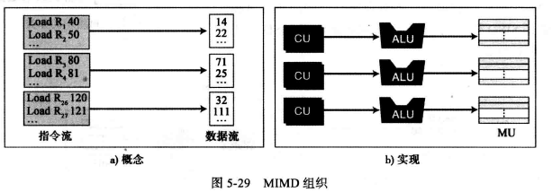


### 简单计算机


#### CPU
三部分：数据寄存器、算术逻辑单元（ALU）、控制单元
1. 数据寄存器：
	1. 计算机中有16个16位的数据寄存器，记为R<sub>0</sub>-R<sub>15</sub>
2. 控制单元
	1. 程序计数器（PC）：8位。保存下一条被执行的指令的地址
	2. 指令寄存器（IR）：16位。存放当前周期译码的指令

#### 主存

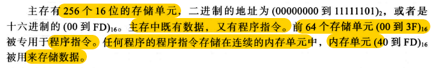

#### 输入/输出子系统

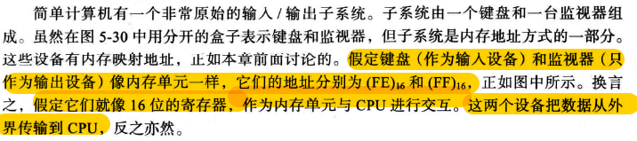


#### 指令集


#### 处理指令

**ALU只能操作那些存储在CPU数据寄存器中的数据**


  ## 第六章 计算机网络和因特网

本章目标：
+ 描述局域网和广域网（LAN和WAN）；
+ 区分因特网和互联网；
+ 描述作为因特网网络模型的TCP/IP协议族；
+ 定义TCP/IP协议族中的各层以及他们的关系；
+ 从应用层描述一些应用；
+ 描述传输层协议提供的服务；
+ 描述网络层协议提供的服务；
+ 描述数据链路层使用的不同协议；
+ 描述物理层的责任；
+ 描述在计算机网络中使用的不同传输介质；


# 操作系统学习

## 《操作系统概念》第九版
#进行中 

### 第一章	导论

> 操作系统是管理计算机硬件的软件。
>
> 计算机系统可以粗分为四个组件：
>
> + 硬件
> + 操作系统
> + 应用程序
> + 用户


 **操作系统的定义：**

> 一般公认的定义：操作系统是一直运行在计算机上的程序（通常称为内核）；
>
> 除了内核以外，还存在两类程序：
>
> + 系统程序
> + 应用程序

#### 计算机系统的组成

> 现代通用计算机系统包括一**个或多个CPU和若干设备控制器**， 通过**公用总线**相连而成， 该总线提供了共享内存的访问（图1-2)。 **每个设备控制器负责一类特定的设备**（如磁盘驱动器、 音频设备或视频显示器）。 CPU与设备控制器可以并发执行， 并且竞争访问内存。 为了确保有序访问共享内存， 需要内存控制器来协调访问内存。

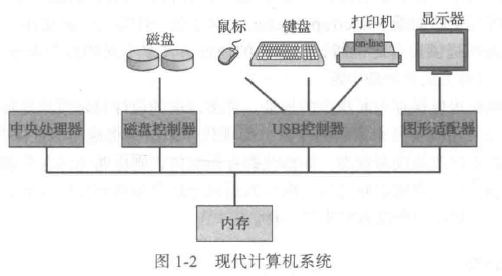

>  引导程序：当计算机电源打开或重启以便开始运行时 ，它需要运行一个初始程序。 该初始程序或引
> 导程序(bootstrap program)通常很简单， 一般位于计算机的固件(firmware)。
>
> 引导程序必须知道如何加载操作系统并且开始执行系统。 为了完成这一 目标，引导程序必须定位操作系统内核并且加到内存。

**中断：**


**存储结构**

> + cpu只能从内存中加载指令，因此执行程序必须位于内存。
> + 通用计算机运行的大多数程序位于可读写内存，称为内存（main memory），也称为随机访问内存（RAM）。内存通常为动态随机访问内存（DRAM）。
>   + 内存特点：易失性，掉电丢失数据。
> + 只读内存（ROM），数据不可修改，即不可写
> + 外存：磁盘、硬盘、U盘等。非易失性，数据可持久化。

​		**当两个存储组件的访问时间或传输速率具有明显差异时，可以通过高速缓存来改善性能。**

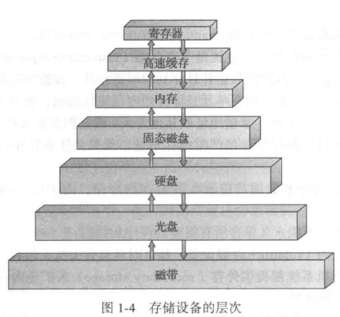

**I/O结构**

> 操作系统为每个设备控制器提供一个设备驱动程序(device driver)。 该设备驱动程序负责设备控制器．并且为操作系统的其他部分提供统一的设备访问 接口。


#### 计算机系统的体系结构

+ 单处理器系统
+ 多处理器系统
  + 优点：
    + 增加**吞吐量**
    + 规模经济
    + 增加可靠性
  + 类型
    + 非对称处理器
    + 对称处理器 


+ 集群系统
  + 非对称集群
  + 对称集群

#### 操作系统的结构

> 操作系统最重要的一点是具有多道程序能力。 一般来说， 单个程序并不能让CPU和I/O设备始终忙碌。单个用户通常具有多个运行程序。多道程序设计(multiprogramming)通过安排作业（编码与数据）使得CPU总有一个执行作业，从而提高CPU利用率。
> 操作系统在内存中同时保存多个任务（图1-9)。 由于主存太小不能容纳所有作业， 因此这些作业首先保存在磁盘的**作业池**(Job pool)上。 该作业池包括磁盘上的 、等待分配内存 的所有**进程**。


> 分时系统：分时系统(time sharing)(或多任务(multitasking)) 是多道程序设计的自然延伸。 对于分时系统 ，虽然CPU还是通过切换作业来执行多个作业，但是由千切换频率很高， 用户可以在程序运行时与其交互。

#### 操作系统的执行

> **现代操作系统是中断驱动**(interrupt driven)的。事件总是由中断或陷阱引起的。
>
> 陷阱(trap)（或异常(exception)）是一种软件生成的中断，或源于出错，或源于用户程序的特定请求。

##### 双重模式与多重模式的执行

+ 为确保操作系统的正确运行，必须区分操作系统代码和用户代码的执行。

+ 用户模式（user mode）和内核模式（kernel mode）

  + 计 算机硬件可以通过一个**模式位** (mode bit) 来表示当前模式：**内核模式 (0)** 和**用户模式 (1)**。

  + 当计算机系统执行用户应用时， 系统处千用户模式。然而， 当用户应用通过**系统调用**， 请求操作系统服务时， 系统必须从用户模式切换到内核模式， 以满足请求。

    

  + 

##### 定时器

> 操作系统应该维持控制 CPU, 防止用户程序陷入死循环， 或不调用系统服务并且不将控制返给操作系统。 为了实现这一目标， 可以使用定时器 (timer)。
>
> 定时器可设置为在指定周期后中断计算机。 

#### 进程管理

> 在未被CPU执行之前， 程序做不了任何事。 执行的程序称为进程。
>
> 进程是系统的工作单元。系统由多个进程组成， 其中有的是操作系统进程（执行系统代
> 码）， 其他的是用户进程（执行用户代码）。所有这些进程都会并发执行。

操作系统负责进程管理的以下活动：

+ 在CPU上调度进程和线程
+ 创建和删除用户进程和系统进程
+ 挂起和重启进程
+ 提供进程同步机制
+ 提供进程通信机制

#### 内存管理

> 内存是现代计算机系统执行的中心。 内存是一个大的字节数组。
>
> 如果CPU 需要处理磁盘数据， 那么这些数据必须首先通过CPU 产生的I/O 调用传到内存。同样， 如果CPU 需要执行指令， 那么这些指令必须在内存中。
>
> 为改进CPU 的利用率和用户的计算机响应速度， 通用计算机应在内存中保留多个程序，这就需要内存管理。

操作系统负责内存管理的以下活动：

+ 记录内存的哪部分在被使用以及被谁使用。
+ 决定哪些进程（或其部分） 会调入或调出内存。
+ 根据需要分配和释放内存空间。

#### 存储管理

> **操作系统提供信息存储的统一逻辑视图。**
>
> 操作系统对存储设备的物理属性进行了抽象， 并定义了逻辑存储单元， 即文件(file)。操作系统映射文件到物理媒介， 并通过存储设备来访问文件。

##### 文件管理

操作系统负责文件管理的以下活动：

+ 创建和删除文件。
+ 创建和删除目录， 以便组织文件
+ 提供文件和目录的操作原语。
+ 映射文件到外存。
+ 备份文件到稳定（非易失的）存储介质。

##### 大容量存储器管理

操作系统负责有关硬盘管理的以下活动：

+ 空闲空间管理
+ 存储空间分配
+ 硬盘调度

##### 高速缓存

> 高速缓存，一般集成在CPU中


##### I/O系统

> **操作系统的目的之一是为用户隐藏具体硬件设备的特性。**

I/O子系统包括以下几个组件：

+ ·包括缓冲、 高速缓存和假脱机的内存管理组件。
+ 设备驱动器的通用接口。
+ 特定硬件设备的驱动程序。

**只有设备驱动程序才能知道控制设备的特性。**

#### 保护与安全

> 保护(protection)是一种机制， 用千控制进程或用户访问计算机系统的资源。
>
> 防止系统不受外部或内部的攻击是安全(security)的工作。

#### 内核数据结构

+ 链表、堆栈、队列
+ 树
+ 哈希函数、哈希表
+ 位图

#### 计算环境

+ 传统计算

+ 移动计算

+ 分布计算

+ 客户机--服务器计算

+ 对等计算（P2P）

+ 虚拟化

  + 虚拟化技术是一种软件技术

  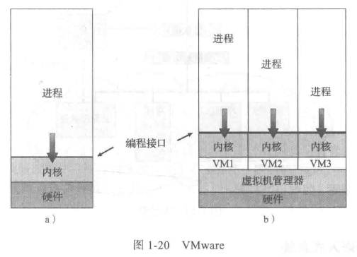

+ 云计算

  

+ 实时嵌入式系统

### 第二章 操作系统结构


# 计算机网络学习
#准备中


# 计算机组成原理学习
#准备中


# 数据结构与算法学习
#准备中


# C/C++语言学习

## 《C Primer Plus》
#准备中


# Linux学习

## 《Linux就该这么学》第2版
#进行中

### 常用命令

~~~bash
cut -d <分隔符> -f <第几列> 文件名 
~~~


### 标准输入输出及错误输出

> 标准输入重定向（STDIN，文件描述符为0）
>
> 标准输出重定向（STDOUT，文件描述符为1）
>
> 错误输出重定向（STDERR，文件描述符为2）


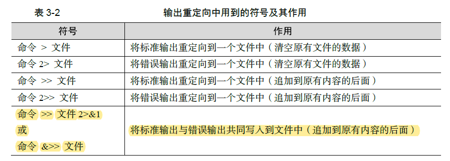

**不区分标准输出和错误输出，只要命令有输出信息则全部追加写入到文件中，这就要用到`&>>`操作符**

### 管道符

> 管道符的作用：**把前一个命令原本要输出在屏幕上的内容作为第二个命令的标准输入**

~~~bash
`tee`命令 

Usage: tee [OPTION]... [FILE]...                                                                                                                                          

Copy standard input to each FILE, and also to standard output. 
既可以在屏幕上显示输出结果，而且还把输出结果保存到某一个文件中。
~~~


### 命令行的通配符

**顾名思义，通配符就是通用的匹配信息的符号**


还可以创建文件，但是使用{}来包括


### 常用的转义字符

~~~bash
\	使得反斜杠后面的变量变成一个普通的字符
''	转义其中所有的变量为普通的字符串
""	保留其中的变量属性，不进行转义处理
``	把其中的命令执行并返回结果
~~~

`$$`的作用是返回当前进程的进程ID号

### 环境变量


> `export`可以把自己设置的变量提升为全局变量
>
> 后续要是不使用这个变量了，则可执行`unset` 命令把它取消掉
>
> 直接在终端设置的变量能够立即生效，但在重启服务器后就会失效，因此我们需要将变量和变量值写入到 .bashrc 或者 .bash pr ofile 文件中 以确保永久能使用它们。


### vim

> 在`/etc/sysconfig/network-scripts`目录下，存放这网卡配置文件 `ifcfg-ensxxx`
>
> `nmcli connection reload ens160`网卡重启命令


### Shell

~~~$bash
$0	脚本的名称
$#	脚本一共几个输入参数
$*	列出所有的参数
$?	显示上一次命令的执行返回值
$1……$N	分别对应1至N的位置上的参数值
~~~

> 条件测试：**条件成立返回数字0，否则返回非零值**
>
> + 文件测试语句
> + 逻辑测试语句
> + 整数值比较语句
> + 字符串比较语句


例子：

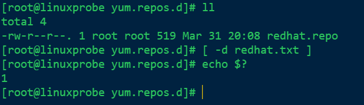

**与或非：**

> &&是逻辑 ”与”，只有当前面的语句执行成功的时候才会执行后面的语句。
> || 是逻辑 ”或”，只有当前面的语句执行失败的时候才会执行后面的语句。
> ! 是逻辑 “非”代表对逻辑测试结果取反值 之前若为正确则变成错误，若为错误则变成正确。

**整数运算符：**


**字符串比较运算符：**

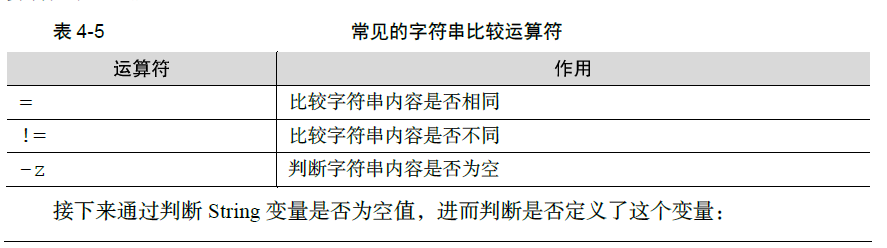

**if条件测试语句：**

+ 单分支的if条件语句

​	

+ 双分支的if条件语句

​	

+ 多分支的 if 条件语句

​	

**for条件语句：**


**while条件循环语句：**


**case条件测试语句：**


### 定时任务

~~~bash
at ： 执行一次定时任务
	-l	显示待执行的任务列表
	-m	执行完成发送邮件
	-d	删除指定的待执行的任务
	-f	指定包含命令的任务文件
	-q	指定新任务的名称
~~~

也可以使用`atrm 任务序号`删除待执行的任务

~~~bash
crontab : 周期性的执行任务
	-e	编译任务
	-u	指定用户名称，root用户可以编辑他人任务
	-l	列出任务列表
	-r	删除任务计划
	
口诀：分、时、日、月、星期 命令
~~~

**注意事项：**


### 用户

~~~bash
useradd 
	-N 	不创建与用户同名的用户组
~~~


~~~bash
passwd
	-e	强制用户在下次登录时修改密码
	-S	显示用户的密码是否被锁定，以及密码所采用的加密算法名称
~~~

### 文件

> 常见的文件类型：
>
> + 普通文件（-）
> + 链接文件（l）
> + 目录文件（d）
> + 管道文件（p）
> + 块设备文件（b）
> + 字符设备文件（c）

#### 文件的特殊权限

> SUID是一种对二进制程序进行设置的特殊权限，能够让二进制程序的执行者暂时拥有所有者的权限；


> 下面的普通用户ljw就会拥有所有者root的权限


**为了权限泄露，千万不要将 SUID 权限设置到 vim 、 cat 、 rm 等命令上面！！！**

> SGID 特殊权限有两种应用场景：当对二进制程序进行设置时，能够让执行者临时获取文件所属组的权限；当对目录进行设置时，则是让目录内新创建的文件自动继承该目录原有用户组的名称。

> SBIT特殊权限位可确保用户只能删除自己的文件，而不能删除其他用户的文件。
>
> 当对某个目录设置了 SBIT 粘滞位权限后，那么该目录中的文件就只能被其所有者执行删除操作了。


**RHEL 8 系统中的 /tmp 作为一个共享文件的目录，默认已经设置了 SBIT 特殊权限位，因此除非是该目录的所有者，否则无法删除这里面的文件。**

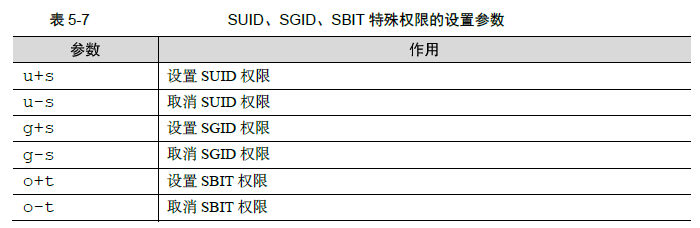

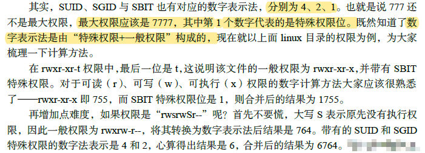

> 注意：SUID 和SGID 的写法是，原先有执行权限则是小写s，如果没有执行权限则是大写S；而SBIT 的写法则是，原先有执行权限是小写t，没有执行权限是大写T。

#### 文件的隐藏属性

~~~bash
chattr:用户设置文件的隐藏属性
语法：chattr [参数] 文件名称

~~~


~~~bash
lsattr:用于查看文件的隐藏权限
语法格式：lsattr [参数]	文件名称
~~~

#### ACL(访问控制列表)

**一般权限、特殊权限、隐藏权限其实有一个共性：权限是针对某一类用户设置的，能够对很多人同时生效。**

> 如果针对某个目录设置了ACL，则目录中的文件会继承其ACL 权限；若针对文件设置了ACL，则文件不再继承其所在目录的ACL 权限。

~~~bash
setfacl:用于管理文件的ACL权限规则
语法格式：setfacl	[参数]	文件名称
~~~


>  常用的ls 命令是看不到ACL 信息的，但是却可以看到文件权限的最后一个点（ .）变成了加号（ +），这就意味着该文件已经设置了ACL。


~~~bash
getfacl:查看文件的ACL权限规则
语法：getfacl	[参数]	文件名称
~~~


### su和sudo

~~~bash
su

~~~

su 命令可以解决切换用户身份的需求，使得当前用户在不退出登录的情况下，顺畅地切换到其他用户，比如从root 管理员切换至普通用户

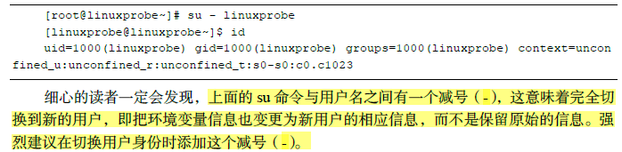

~~~bash
sudo 命令用于给普通用户提供额外的权限，语法格式为“sudo [参数] 用户名”
集中管理用户与权限的文件为`/etc/sudoers`
~~~

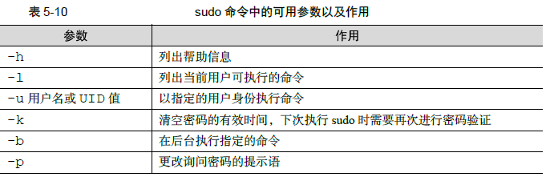

~~~bash
visudo:命令用于编辑、配置用户sudo 的权限文件，语法格式为“visudo [参数]”
这是一条会自动调用vi 编辑器来配置/etc/sudoers 权限文件的命令，能够解决多个用户同时修改权限而导致的冲突问题。
visudo 命令只有root 管理员才可以执行，普通用户在使用时会提示权限不足。
~~~


>  第100 行的信息代表的意思为：
>
> **谁可以使用	允许使用的主机=（以谁的身份）	可以执行的命令列表**
>
> 谁可以使用：稍后为哪位用户进行命令授权
>
> 允许使用的主机：填写ALL表示不限制来源的主机，也可填写如192.168.1.0/24这样的网段限制来源的地址，使得只有从允许网段登录时才能使用sudo命令
>
> 以谁的身份：填写ALL表示系统最高权限，也可以是另外一位用户的名字
>
> 可执行的命令列表：填写ALL表示不限制命令，，亦可填写如/usr/bin/cat 这样的文件名称来限制命令列表，多个命令文件之间用逗号（，）间隔。

利用visodu配置：

`ljw	ALL=(ALL)	ALL`


配置成功


**每次执行sudo 命令都要输入一次密码其实也挺麻烦的，这时可以添加`NOPASSWD `参数，使得用户下次再执行sudo 命令时就不用密码验证：**


### 第六章	存储结构与管理硬盘


#### 一切从“/”开始

> **系Linux统中的一切文件都是从“根”目录（/）开始的，并按照文件系统层次标准（FHS）采用倒树状结构来存放文件。**


#### 物理设备的命名规则

> 系统内核中的**udev 设备管理器**会自动把硬件名称规范起来，目的是让用户通过设备文件的名
> 字可以猜出设备大致的属性以及分区信息等。
>
> **udev设备管理器**的服务会一直以守护进程的形式运行并侦听内核发出的信号来管理/dev 目录下的
> 设备文件。


> **硬盘的分区编号也很有讲究：**
>
> + 主分区或扩展分区的编号从1开始，到4结束；
> + 逻辑分区从编号5开始。

**注：**

**（1）/dev目录中sda设备之所以是a，并不是由插槽决定的，而是由系统内核中的识别顺序来决定的，而恰巧很多主板的插槽顺序就是系统内核的识别顺序，因此才会被命名为/dev/sda。**

**（2）分区的数字编码不一定是强制顺延下来的，也有可能是手工指定的。因为sda3
只能表示是编号3的分区，而不能判设备上已经存在3个分区。**


> /dev/目录中保存的应当是硬件设备文件；其次，sd 表示的是存储设备；然后，a表示系统中同类接口中第一个被识别到的设备；最后，5 表示这个设备是一个逻辑分区。一言以蔽之，**“/dev/sda5”**表示的就是**“这是系统中第一块被识别到的硬件设备中分区编号为5 的逻辑分区的设备文件”。**

---

**主分区、扩展分区、逻辑分区的介绍**

1. 硬盘设备是由大量的扇区组成的，每个扇区的容量为512字节。其中第一个扇区最重要，他里面保存着`主引导记录`和`分区表`信息。就第一个扇区来讲，主引导记录需要占用446字节，分区表占用64字节，结束符2字节；其中分区表中每一个分区信息就需要16字节，这样一来最多只能有4个分区信息可以卸载第一个扇区中，这4个分区就是4个主分区。

   

2. 为了解决分区个数不够的问题，可以将第一个扇区的分区表中16字节（）的空间（）拿来指向另外一个分区。也就是说，扩展分区其实并不是一个真正的分区，而更像是一个占用16 字节分区表空间的指针 —— 一个指向另外一个分区的指针。

   

   **注：**所谓扩展分区，严格地讲它不是一个实际意义的分区，而仅仅是一个指向其他分区的指针，这种指针结构将形成一个`单向链表`。因此扩展分区自身不能存储数据，用户需要在其指向的对应分区（称之为逻辑分区）上进行操作。

   ---

   

#### 文件系统与数据资料

文件系统类型：

+ Ext2
+ Ext3
+ Ext4
+ XFS

> **在拿到一块新的硬盘存储设备后，先需要分区，然后再格式化文件系统，最后才能挂载并正常使用。**
>
> 也可以选择不进行分区，但是必须对硬盘进行格式化处理。

Linux 只是把每个文件的权限与属性记录在`inode` 中，而且每个文件占用一个独立的inode 表格，该表格的大小默认为`128` 字节，里面记录着如下信息：

+ 该文件的访问权限（read、write、execute）；
+  该文件的所有者与所属组（owner、group）； 
+ 该文件的大小（size）；
+  该文件的创建或内容修改时间（Ctime）；
+  该文件的最后一次访问时间（Atime）；
+  该文件的修改时间（Mtime）；
+  文件的特殊权限（SUID、SGID、SBIT）；
+  该文件的真实数据地址（point）。

> 查看其中某个文件的详细信息（包括inode），可以使用`stat`命令，示例：
>
> `stat folder1`

   


**Linux 内核中的软件层为用户程序提供了一个虚拟文件系统（Virtual File System，VFS）接口，这样用户实际上在操作文件时就是统一对这个虚拟文件系统进行操作了。图6-6 所示为VFS 的架构示意图**


#### 挂载硬件设备

硬盘设备：分区->格式化->挂载

**挂载是在使用硬件设备前所执行的最后一步操作**

##### mount

~~~bash
mount 命令用于挂载文件系统
格式为“mount 文件系统 挂载目录”
	-a	挂载所有在/etc/fstab中定义的文件系统
	-t	指定文件系统的类型
	
对于比较新的Linux 系统来讲，一般不需要使用-t 参数来指定文件系统的类型，Linux 系统会自动进行判断。
~~~


> **如果在工作中要挂载一块网络存储设备，该设备的名字可能会变来变去，这样再写为sdb 就不太合适了。这时推荐用UUID（Universally Unique Identifier，通用唯一识别码）进行挂载操作。UUID 是一串用于标识每块独立硬盘的字符串，具有唯一性及稳定性，特别适合用来挂载网络设备**

~~~bash
blkid： 
	blkid 命令用于显示设备的属性信息，英文全称为“block id”，语法格式为“blkid [设备名]”
~~~


> 上面执行`mount`命令挂载的方法，在系统重启之后挂载就会失效
>
> 永久挂载方法：
>
> + 在`/etc/fstab`文件中修改内容
> + 填写格式`设备文件 挂载目录 格式类型 权限选项 是否备份 是否自检`


~~~bash
vim /etc/fstab

/dev/sda1	/root/linux_study/backup	ext4	defaults	0	0
~~~


**写入到`/etc/fstab` 文件中的设备信息并不会立即生效，需要使用`mount -a` 参数进行自动挂载**

##### df

~~~bash
df	: 用于查看已挂载的磁盘空间使用情况，英文全称为“disk free”
	语法格式为 “df -h”。
	-h 参数便捷地对存储容量进行“进位”操作
~~~


> 说到**网络存储设备**，建议您在fstab 文件挂载信息中加上`_netdev` 参数。加上后系统会等联网成功后再尝试挂载这块网络存储设备，从而避免了开机时间过长或失败的情况。


##### umount

~~~bash
umount :用于卸载设备或文件系统，英文全称为“un mount
语法格式为“umount [设备文件/挂载目录]”。
~~~

~~~bash
lsblk	以树状图的形式列举
	用于查看已挂载的磁盘的空间使用情况，英文全称为“list block id”
~~~


#### 添加硬盘设备

##### fdisk	分区

~~~bash
fdisk：用于新建、修改及删除磁盘的分区表信息，英文全称"format	disk"
	用法：fdisk	磁盘名称
这条命令的参数是交互式的一问一答的形式
~~~

> 在Linux 系统中，管理硬盘设备最常用的方法就当属fdisk 命令了。它提供了集添加、删除、转换分区等功能于一身的"一站式分区服务”


##### mkfs	格式化

> 如果硬件存储设备没有进行格式化，则Linux 系统无法得知怎么在其上写入数据。因此，在对存储设备进行分区后还需要进行格式化操作。在Linux 系统中用于格式化操作的命令是`mkfs`。

~~~bash
mkfs:文件系统格式化
用法：mkfs.文件类型名称		分区文件
~~~


##### 挂载设备


**既然存储设备已经顺利挂载，接下来就可以尝试通过挂载点目录向存储设备中写入文件了**

##### du

~~~bash
du:	用于查看分区或目录所占用的磁盘容量大小。英文全称为“disk usage”
语法格式为“du -sh 目录名称”。
~~~

#### 添加交换分区

> 交换（SWAP）分区是一种通过在硬盘中预先划分一定的空间，然后把内存中暂时不常用的数据临时存放到硬盘中，以便腾出物理内存空间让更活跃的程序服务来使用的技术，其设计目的是为了解决真实物理内存不足的问题。
>
> 只有当真实的物理内存耗尽后才会调用交换分区的资源。

##### 创建交换分区

~~~bash
fdisk /dev/sdb
~~~


##### 格式化交换分区

~~~bash
mkswap:用于对新设备进行交换分区格式化。英文全称为：“make swap”
用法：mkswap 设备/分区名称
~~~


##### 激活交换分区

~~~bash
swapon :用于激活新的交换分区设备，英文全称为“swap on”
语法格式为“swapon 设备名称“
~~~


> 为了使交换分区永久有效，需要在/etc/fstab文件中配置


#### 磁盘容量配额
>可以使用`quota`技术进行磁盘容量配额管理，从而**限制用户的硬盘可用容量或所能创建的最大文件个数**。`quota`技术还有软限制和硬限制的功能。
+ **软限制**：当达到软限制会提醒用户，但仍允许用户在限定的额度内继续使用。
+ **硬限制**：当达到硬限制时会提示用户，且强制终止用户的操作。


显示如下则配置quota成功


#####  xfs_quota命令
~~~bash 
xfs_quota：用于管理设备的磁盘容量配额
语法：xfs_quota [参数] 配额 文件系统
	-c: 以参数的形式设置要执行的命令
	-x: 专家模式
~~~

>使用`xfs_quota`命令来设置用户tom 对/boot 目录的quota 磁盘容量配额。具体的限额控制包括：硬盘使用量的软限制和硬限制分别为3MB 和6MB；创建文件数量的软限制和硬限制分别为3 个和6 个。


>在Linux 系统中每个文件都会使用一个独立的inode 信息块来保存属性信息，**一个文件对应一个`inode`信息块**，所以`isoft和ihard` 就是通过限制系统最大使用的inode个数来限制了文件数量。`bsoft和bhard` 则是代表文件所占用的block大小，也就是文件占用的最大容量的总统计。

超过6M，tom用户在/boot目录下创建文件失败


[Linux dd 命令 | 菜鸟教程 (runoob.com)](https://www.runoob.com/linux/linux-comm-dd.html)
##### edquota命令
**在为用户设置了quota 磁盘容量配额限制后，可以使用edquota 命令按需修改限额的数值。**

```bash
edquota: 用于管理系统的磁盘配额。"edit quota"
用法： edquota [参数] 用户名
	-u： 对某个用户进行设置
	-g: 对某个用户组进行设置
	-p: 复制原有的规则到新的用户/组
	-t：限制宽限期限
```
`edquota -u tom`

在上面的界面修改配额
#### VDO（虚拟数据优化）
>VDO（Virtual Data Optimize，虚拟数据优化）是一种通过压缩或删除存储设备上的数据来优化存储空间的技术。
>VDO 技术**支持本地存储和远程存储**，可以作为本地文件系统、iSCSI 或Ceph 存储下的附加存储层使用。

1. 从虚拟机中新添加一个硬盘-> /dev/sdc
2. 使用vdo技术管理新添加的硬盘
	1. name参数表示新的设备卷的名称
	2. device表示由哪块磁盘制作
	3. vdoLogicalSize表示制作后的设备大小，依据红帽公司推荐的原则。20G物理硬盘将映射成200G的逻辑硬盘
```bash
vdo create --name=storage --device=/dev/sdc --vdoLogicalSize=200G
```


在创建成功后，使用`status` 参数查看新建卷的概述信息：


**接下来，对新建卷格式化并挂载**
*新建的vdo卷设备会被放在/dev/mapper目录下，并以设备名称命名*


***挂载前可以用`udevadm settle` 命令对设备进行一次刷新操作，避免刚才的配置没有生效：***
>内核启动后，使用`udevd`为所有检测到的设备创建设备节点。 这是一个相对耗时的任务， _必须_在启动过程中继续完成，否则由于缺少设备节点而存在服务失败的风险。
>`udevadm settle`等待`udevd`处理所有硬件设备的设备创建事件，从而确保所有设备节点都已成功创建，然后再继续。


~~~bash
vdostats:查看设备的实际使用情况
human-readable 参数的作用是将存储容量自动进位，以人们更易读的方式输出（比如，显示20G 而不是20971520K）
~~~


**这里显示的是物理大小，如果想查阅逻辑大小，使用df命令查看**


**使用UUID号，永久挂载vdo设备卷**


#### 软硬方式链接
+ **软链接**：也叫符号链接（symbolic link），仅仅包含所链接文件的名称和路径，很像一个记录地址的标签。**当原始文件被删除或移动后，新的链接文件也会随之失效，不能被访问。**与Windows中的快捷方式具有**一样的性质；
+ **硬链接**：**可以将它理解为一个“指向原始文件block 的指针”，系统会创建出一个与原来一模一样的inode 信息块。**硬链接文件与原始文件其实是一模一样的，只是名字不同。每添加一个硬链接，该文件的inode 个数就会增加1；而且只有当该文件的inode 个数为0 时，才算彻底将它删除。换言之，由于硬链接实际上是指向原文件block 的指针，因此即便原始文件被删除，依然可以通过硬链接文件来访问。需要注意的是，由于技术的局限性，**不能跨分区对目录文件进行硬链接**。

##### ln命令
~~~bash
ln: 用于创建文件的软硬链接，英文全称：“link”
语法： ln [参数] 原始文件名 链接文件名
	-s: 创建“符号链接”（如果不带-s参数，则默认创建硬链接）
	-f: 强制创建文件或目录的链接
	-i: 覆盖前先询问
	-v: 显示创建链接的过程
~~~


>**创建的硬链接文件竟然会让文件属性第二列的数字变成了2，这个数字表示的是文件的inode 信息块的数量。**即便删除了原始文件，新的文件也会一如既往地可以读取，因为只有当文件inode 数量被“清零”时，才真正代表这个文件被删除了。

### 第七章 使用RAID与LVM磁盘阵列技术

本章讲解了如下内容：
+  RAID（独立冗余磁盘阵列）；
+ LVM（逻辑卷管理器）；
#### RAID(独立冗余磁盘阵列)

>RAID技术通过把多个硬盘设备组合成一个容量更大、安全性更好的磁盘阵列，并把数据切割成多个区段后分别存放在各个不同的物理硬盘设备上，然后利用分散读写技术来提升磁盘阵列整体的性能，同时把多个重要数据的**副本同步**到不同的物理硬盘设备上，从而起到了非常好的数据冗余备份效果。

>RAID 不仅**降低了硬盘设备损坏后丢失数据的几率**，还**提升了硬盘设备的读写速度**，所以它在绝大多数运营商或大中型企业中得到了广泛部署和应用。

常见方案：


##### RAID 0 


>+ RAID 0 技术能够有效地提升硬盘数据的吞吐速度，但是不具备数据备份和错误修复能力。如图7-1 所示，数据被分别写入到不同的硬盘设备中，即硬盘A 和硬盘B 设备会分别保存数据资料，最终实现提升读取、写入速度的效果。
>+ 若任意一块硬盘发生故障，将导致整个系统的数据都会受到破坏。

##### RAID 1


>+ 写入操作速度低，读取速度相对较高
>+ 安全性高

##### RAID 5


>+ 图7-3 中Parity 部分存放的就是数据的奇偶校验信息。换句话说，就是RAID 5 技术实际上没有备份硬盘中的真实数据信息，而是当硬盘设备出现问题后通过奇偶校验信息来尝试重建损坏的数据。
>+ RAID5最少由3块硬盘组成，使用的是硬盘切割（Disk Striping）技术。
##### RAID 10


##### 部署磁盘阵列

~~~bash
mdadm: 用于创建、调整、监控和管理RAID设备，英文“multiple devices admin”
语法：mdadm [参数] 硬盘名称
	-a: 检测设备名称
	-n: 指定设备数量
	-l: 指定RAID级别
	-x：设备备份盘
	-C: 创建一个RAID阵列卡
	-v: 显示创建过程
	-f: 模拟设备损坏过程
	-r: 移除设备
	-Q: 查看摘要信息
	-D: 查看详细信息
	-S: 停止RAID磁盘阵列
	
~~~
```bash
mdadm -Cv /dev/md0 -n 4 -l 10 /dev/sdb /dev/sdc /dev/sdd /dev/sde
```


```bash
mdadm -Q /dev/md0
```


**RAID10它通过两两一组硬盘组成的RAID 1 磁盘阵列保证了数据的可靠性，其中每一份数据都会被保存两次，因此导致硬盘存在50%的使用率和50%的冗余率。这样一来，80GB 的硬盘容量也就只有一半了。**

然后格式化磁盘
`mkfs.ext4 /dev/md0
`


挂载磁盘

`mount /dev/md0 /RAID`


永久挂载


##### 损坏磁盘阵列及修复

>在确认有一块物理硬盘设备出现损坏而不能再继续正常使用后，应该使用mdadm 命令将其移除，然后查看RAID 磁盘阵列的状态，可以发现状态已经改变：


`-f`模拟磁盘损坏的效果


`-D`查看磁盘详细信息


`-r`移除设备


`-a`更换硬盘设备后通过-a添加操作


`mdadm -D /dev/md0`


##### 磁盘阵列+备份盘

`mdadm -Cv /dev/md0 -n 3 -l 5 -x 1 /dev/sdb /dev/sdc /dev/sdd /dev/sde`


存在一个备份盘：


`格式化+挂载/dev/md0`


>再次把硬盘设备/dev/sdb 移出磁盘阵列，然后迅速查看/dev/md0 磁盘阵列的状态，就会发现备份盘已经被自动顶替上去并开始了数据同步。


##### 删除磁盘阵列

1. 卸载磁盘、将所有磁盘设置成停用状态


2. 逐一移除出去


3. 停用整个RAID 磁盘阵列


#### LVM（逻辑卷管理器）
>+ 硬盘分好区或者部署为RAID磁盘阵列之后，再想修改硬盘分区大小就不容易了。
>+ 这时就需要用到另外一项非常普及的硬盘设备资源管理技术了——逻辑卷管理器（Logical Volume Manager，LVM）。LVM 允许用户对硬盘资源进行动态调整。
>+ LVM 是Linux 系统用于对硬盘分区进行管理的一种机制，理论性较强，其创建初衷是为了解决硬盘设备在创建分区后不易修改分区大小的缺陷。
>


##### 部署逻辑卷
1. 让新添加的两块硬盘设备支持LVM技术


2. 把两块硬盘设备加入到storage卷中，然后查看卷组的状态。


查看vg信息


3. 切割出一个约为150MB的逻辑卷设备


`lvcreate -n vo -l 37 storage`


`lvdisplay`


4. 把生成好的**逻辑卷**进行格式化，然后挂载使用


>**如果使用了逻辑卷管理器，则不建议用XFS 文件系统，因为XFS 文件系统自身就可以使用xfs_growfs 命令进行磁盘扩容。这虽然不比LVM 灵活，但起码也够用。在实测阶段我们发现，在有一些服务器上，XFS 与LVM 的兼容性并不好。**


5. 查看挂载状态，并写入配置文件，使其永久生效


##### 扩容逻辑卷

> 在前面的实验中，卷组是由两块硬盘设备共同组成的。用户在使用存储设备时感知不到设备底层的架构和布局，更不用关心底层是由多少块硬盘组成的，只要卷组中有足够的资源，就可以一直为逻辑卷扩容。**扩容前请一定要记得卸载设备和挂载点的关联。**


`umount /LV`

1. 把逻辑卷vo的大小从148M扩容到290M

`lvextent -L 290M /dev/storage`


2. 检查硬盘的完整性，确认目录结构、内容和文件内容没有丢失。一般情况下没有报错，均为正常情况。

[e2fsck命令 – 检查使用 Linux ext2档案系统的partition是否正常工作](https://www.linuxcool.com/e2fsck#:~:text=e2fsck%E5%91%BD%E4%BB%A4%E7%94%A8%E4%BA%8E%E6%A3%80%E6%9F%A5%E4%BD%BF%E7%94%A8%20Linux%20ext2%20%E6%A1%A3%E6%A1%88%E7%B3%BB%E7%BB%9F%E7%9A%84,partition%20%E6%98%AF%E5%90%A6%E6%AD%A3%E5%B8%B8%E5%B7%A5%E4%BD%9C%E3%80%82.%20e2fsck%E5%91%BD%E4%BB%A4%E5%8F%AF%E4%BB%A5%E6%A3%80%E6%9F%A5ext2%E3%80%81ext3%E3%80%81ext4%E6%96%87%E4%BB%B6%E7%B3%BB%E7%BB%9F%EF%BC%8C%E5%A6%82%E6%9E%9C%E7%B3%BB%E7%BB%9F%E5%B7%B2%E7%BB%8F%E6%8C%82%E8%BD%BD%E4%BA%86%EF%BC%8C%E9%82%A3%E4%B9%88%E4%B8%8D%E5%BB%BA%E8%AE%AE%E5%8E%BB%E6%A3%80%E6%9F%A5%EF%BC%8C%E5%9B%A0%E4%B8%BA%E8%BF%99%E6%A0%B7%E6%98%AF%E4%B8%8D%E5%AE%89%E5%85%A8%E7%9A%84%E3%80%82.%20%E6%AD%A4%E5%91%BD%E4%BB%A4%E7%9A%84%E9%80%82%E7%94%A8%E8%8C%83%E5%9B%B4%EF%BC%9ARedHat%E3%80%81RHEL%E3%80%81Ubuntu%E3%80%81CentOS%E3%80%81SUSE%E3%80%81openSUSE%E3%80%81Fedora%E3%80%82.)

`e2fsck -f /dev/storage/vo
`


3. 重置设备在系统中的容量。刚刚是对LV（逻辑卷）设备进行了扩容操作，但系统内核还没有同步到这部分新修改的信息，需要手动进行同步。

`resize2fs /dev/storage/vo`


4. 重新挂载硬盘设备并查看挂载状态


##### 缩小逻辑卷

**卸载文件系统**

`umount /LV
`
1. 检查文件系统的完整性

`e2fsck -f /dev/storage/vo`


2. 通知系统内核将逻辑卷vo 的容量减小到120MB。
`resize2fs /dev/storage/vl 120M
`


3. 将LV（逻辑卷）的容量修改为120M
`lvreduce -L 120M /dev/storage/vo`


**缩容操作先通知系统内核自己想缩小逻辑卷，如果在执行resize2fs 命令后系统没有报错，再正式操作。**

4. 重新挂载文件系统并查看系统状态。


##### 逻辑卷快照

>LVM 还具备有“快照卷”功能，该功能类似于虚拟机软件的还原时间点功能。

**快照卷功能的两个特点**
+ 快照卷的容量必须等同于逻辑卷的容量；
+ 快照卷仅一次有效，一旦执行还原操作后则会被立即自动删除。

在正式操作前，先看看VG（卷组）中的容量是否够用
`vgdisplay`

1. 使用`-s` 参数生成一个快照卷，使用`-L `参数指定切割的大小，**需要与要做快照的设备容量保持一致**。另外，还需要在命令后面写上是针对哪个逻辑卷执行的快照操作，稍后数据也会还原到这个相应的设备上。

`lvcreate -L 120M -s -n SNAP /dev/storage/vo
`


2. 在逻辑卷所挂载的目录中创建一个100MB 的垃圾文件，然后再查看快照卷的状态。可以发现存储空间的占用量上升了。

`dd if=/dev/zero of=/LV/files count=1 bs=100M`


3. 为了校验快照卷的效果，需要对逻辑卷进行快照还原操作。**在此之前记得先卸载掉逻辑卷设备与目录的挂载。**
~~~
	lvconvert命令用于管理逻辑卷的快照 
	语法格式为 lvconvert [参数] 快照卷名称
~~~

`lvconvert --merge /dev/storage/SNAP`


4. 快照卷会被自动删除掉，并且刚刚在逻辑卷设备被执行快照操作后再创建出来的100MB 的垃圾文件也被清除了。


##### 删除逻辑卷
**依次删除逻辑卷、卷组、物理卷设备，这个顺序不可颠倒。**
1. 取消逻辑卷与目录的挂载关联，删除配置文件中永久生效的设备参数。


2. 删除逻辑卷设备，需要输入y 来确认操作。


3. 删除卷组，此处只写卷组名称即可，不需要设备的绝对路径。


4. 删除物理卷设备


### 第八章 使用iptables与firewalld防火墙

> 本章主要内容：
> + 防火墙管理工具；
> + iptables
> + firewalld;
> + 服务的访问控制列表；
> + Cockpit驾驶舱管理工具；

#### 防火墙管理工具
**在公网与企业内网之间充当保护屏障的防火墙（见图8-1）虽然有软件或硬件之分，但主要功能都是依据策略对穿越防火墙自身的流量进行过滤。防火墙策略可以基于流量的源目地址、端口号、协议、应用等信息来定制，然后防火墙使用预先定制的策略规则监控出入的流量，若流量与某一条策略规则相匹配，则执行相应的处理，反之则丢弃。**


>1. 其实，iptables 与firewalld 都不是真正的防火墙，它们都只是用来定义防火墙策略的防火墙管理工具而已；或者说它们只是一种服务。
>2. iptables 服务会把配置好的防火墙策略交由内核层面的`netfilter` 网络过滤器来处理；
>3. 而firewalld 服务则是把配置好的防火墙策略交由内核层面的`nftables` 包过滤框架来处理。

#### iptables
##### 策略与规则链

>+ 防火墙会按照从上到下的顺序来读取配置的策略规则，在找到匹配项后就立即结束匹配工作并去执行匹配项中定义的行为（即放行或阻止）。
>+ 如果在读取完所有的策略规则之后没有匹配项，就去执行默认的策略。
>

规则链依据数据包处理位置不同进行分类：
+ 在进行路由选择前处理数据包（PREROUTING）;
+ 处理流入的数据包（INPUT）；
+ 处理流出的数据包（OUTPUT）；
+ 处理转发的数据包（FORWARD）；
+ 在进行路由选择后处理数据包（POSTROUTING）；

##### 基本的名命令参数

>+ 根据OSI七层模型的定义，iptables数据数据链路层的服务，所以可以根据流量的源地址、目的地址、传输协议、服务类型等信息进行匹配；
>+ 一点匹配成功，iptables就会根据策略规则所预设的动作来处理这些流量；
>+ 防火墙策略规则的匹配顺序是从上到下的，因此要把较为严格、优先级较高的策略规则放到前面。


1. 在iptables命令后添加`-L` 参数查看已有的防火墙规则链。


2. 在iptables命令后添加`-F`参数清空已有的防火墙规则链。


3. 把INPUT规则链的默认策略都设置为拒绝。`-P`设置默认策略


%%此时ssh连接流量已经被拒绝了，所以只能用本机的终端了，哈哈哈%%
**当把INPUT 链设置为默认拒绝后，就要往里面写入允许策略了，否则所有流入的数据包都会被默认拒绝掉。**

**规则链的默认策略拒绝动作只能是DROP，而不能是REJECT。**

4. 向INPUT链中添加允许ICMP流量进入的策略规则
`-I` 在规则链的头部加入新规则
`-p` 协议类型
`-j` 目标动作

```bash
iptables -I INPUT -p icmp -j ACCEPT
```


5. 删除INPUT规则链中刚刚加入的那条策略（允许ICMP流量），并把默认策略设置为允许。
`-D` 删除某一条指定的策略，可以按规则序号和内容删除


6. 将INPUT规则链设置为只允许指定网段的主机访问本机的22端口，拒绝来自其它所有主机的流量。
```bash
iptables -I INPUT -s 192.168.10.0/24 -p tcp --dport 22 -j ACCEPT

iptables -A INPUT -p tcp --dport 22 -j REJECT
```


>**防火墙策略规则是按照从上到下的顺序匹配的，因此一定要把允许动作放到拒绝动作前面，否则所有的流量就将被拒绝掉，从而导致任何主机都无法访问我们的服务。**

7. 向INPUT规则链中添加拒绝所有人访问本机12345端口的策略规则
```bash
iptables -I INPUT -p tcp --dport 12345 -j REJECT
iptables -I INPUT -p udp --dport 12345 -j REJECT
```


8. 向INPUT规则链中添加拒绝192.168.10.5主机访问本机80端口（Web服务）的策略规则。

```bash
iptables -I INPUT -p tcp -s 192.168.10.5  --dport 80 -j REJECT
```


9. 向INPUT规则链中添加拒绝所有主机访问本机1000-1024端口的策略
`前面在添加防火墙策略时，使用的是-I 参数，它默认会把规则添加到最上面的位置，因此优先级是最高的。如果工作中需要添加一条最后“兜底”的规则，那就用-A 参数吧。`
```bash
iptables -A INPUT -p tcp --dport 1000:1024 -j REJECT&&iptables -A INPUT -p udp --dport 1000:1024 -j REJECT
```


**但是请特别注意，使用iptables 命令配置的防火墙规则默认会在系统下一次重启时失效，如果想让配置的防火墙策略永久生效，还要执行保存命令：**
`iptables-save`


#### firewalld

>firewalld（Dynamic Firewall Manager of Linux systems，Linux 系统的动态防火墙管理器）服务是默认的防火墙配置管理工具，它拥有基于CLI（命令行界面）和基于GUI（图形用户界面）的两种管理方式。

>相较于传统的防火墙管理配置工具，firewalld 支持动态更新技术并加入了区域（zone）的概念。简单来说，区域就是firewalld 预先准备了几套防火墙策略集合（策略模板），用户可以根据生产场景的不同而选择合适的策略集合，从而实现防火墙策略之间的快速切换。


>**如果想让配置策略一直存在，就需要使用永久（Permanent）模式了，方法就是在命令firewall-cmd正常设置防火墙策略时添加`--permanent`参数，这样配置的防火墙策略就可以永久生效了。
>如果想让配置的策略立即生效，需要手动执行`firewall-cmd --reload` 命令。**

1. 查看firewalld服务当前所使用的区域
`firewall-cmd --get-defaults-zone`


2. 查询指定网卡在firewalld服务中绑定的区域
`firewall-cmd --get-zone-of-interface=ens160`


3. 把网卡默认区域修改为external，并在系统重启后生效。
`firewall-cmd --permanent --zone=external --change-interface=ens160`
`firewall-cmd --permanent --get-zone-of-interface=ens160`


4. 把firewalld服务的默认区域设置为public
`firewall-cmd --set-default-zone=public`

>默认区域也叫全局配置，指的是对所有网卡都生效的配置，优先级较低。在下面的代码中可以看到，当前默认区域为public，而ens160 网卡的区域为external。此时便是以网卡的区域名称为准。


5. 启动和关闭firewalld防火墙服务的应急状况模式。

>使用`--panic-on` 参数会立即切断一切网络连接，而使用`--panic-off`则会恢复网络连接。切记，紧急模式会切断一切网络连接，因此在远程管理服务器时，在按下回车键前一定要三思。


6. 查询SSH和HTTPS协议的流量是否允许放行

>在工作中可以不使用--zone 参数指定区域名称，firewall-cmd 命令会自动依据默认区域进行查询，从而减少用户输入量。但是，如果默认区域与网卡所绑定的不一致时，就会发生冲突，因此规范写法的zone 参数是一定要加的。


7. 把HTTPS协议的流量设置为永久允许放行，并立即生效。
`firewall-cmd --permanent --zone=public --add-service=https`


还是没有设置完成。如果不想重启计算机，需要使用--reload参数更新。

`firewall-cmd --reload`
`firewall-cmd --zone=public --query-service=https`


8. 把HTTP协议的流量设置为永久拒绝，并立即生效
`firewall-cmd --permanent --zone=public --remove=service=http`
`firewall-cmd --reload`


9. 把访问8080和8081端口的流量策略设置为允许，但仅限当前生效
`firwall-cmd --zone=public -add-port=8080-8081/tcp`


10. 把原本访问本机888端口的流量转发到22端口，而且要求当前和长期均有效
`firewall-cmd --permanent --zone=public --add-forward-port=port=888:proto=tcp:toport=22:toaddr=192.168.10.12`
`firewall-cmd --reload`


11. 富规则的设置

>富规则也叫复规则，表示更细致、更详细的防火墙策略配置，它可以针对系统服务、端口号、源地址和目标地址等诸多信息进行更有针对性的策略配置。它的优先级在所有的防火墙策略中也是最高的。

`firewall-cmd --permanent --zone=public --add-rich-rule="rule family="ipv4" source address="192.168.10.0/24" service name="ssh" reject"`


##### 图形管理工具

firewall-config


#### 服务的访问控制列表

>+ TCP Wrapper是RHEL 6/7 系统中默认启用的一款流量监控程序 
>+ Linux 系统中其实有两个层面的防火墙，第一种是前面讲到的基于TCP/IP协议的流量过滤工具，而TCP Wrapper 服务则是能允许或禁止Linux 系统提供服务的防火墙，从而在更高层面保护了Linux 系统的安全运行。


#### Cockpit驾驶舱管理工具
Cockpit 是一个基于Web 的图形化服务管理工具

`dnf install cockpit`
`systemctl start cockpit`
`systemctl enable cockpit.socket`
在Cockpit 服务启动后，打开系统自带的浏览器，在地址栏中输入“本机地址:9090”即可访问.


## 《鸟哥的Linux私房菜——基础学习篇》

> **SATA**接口的**硬盘**的文件名称即为**/dev/sd[a-d]**

**常见的设备在Linux系统的文件命令**


## 《Linux运维之道》第2版

### 基本命令

~~~bash
ls -t	以修改时间排序，默认是以名称排序
ls -d	显示文件目录本身的信息，而非文件目录下的文件信息
ls -u	显示文件或目录最后被访问的时间
~~~

> `touch` 命令可以修改文件的创建时间等信息

~~~bash
cp -r	递归复制
cp -a	复制文件的所有信息，包括权限和时间信息
~~~

~~~bash
du 	计算文件或者目录的容量
du -a	查看所有文件以及目录的容量 
du -s	仅显示总容量
du -h	个性化显示容量（KB、MB等形式）
~~~

> 软链接可以跨分区，但是不可以删除源文件
>
> 硬链接不可以跨分区，但是可以删除源文件

~~~bash
ln -s	创建软链接
ln	创建硬链接
~~~

> 如果`history`的编号为3，可以用!3执行之前编号为3的命令


### vim

~~~bash
`vim`工具：包括普通模式、命令模式和插入模式

在vim编辑文档过程中，如果要执行某一个命令而不想退出vim，则可以在命令模式下输出`:!命令`
如果vim拥有root权限，那么就可以提权；
在普通模式下，按下ZZ也可以保存退出文档；
~~~

###  账号、组

**Linux对用户和组的管理是通过ID号来实现的**

**Linux系统uid是唯一的但可以供多个用户使用，gid其实同理也是可以的；**

**Linux对组分为基本组和附加组，基本组为创建用户的同名组**

#### 创建用户、组

~~~bash
useradd:
用法：	useradd [参数] 用户名
	-c	账号描述信息	
	-d	指定用户家目录，默认加上此参数
	-e	账号失效时间
	-g	指定基本组，默认加上此参数，组名与用户名相同
	-G	指定附加组
	-M	不设置家目录
	-s	设置shell，默认为bash
	-u	设置UID,一般使用自动分配的
~~~

~~~bash
groupadd:
用法：groupadd [参数] 组名
	-g	设置组ID号
~~~

~~~bash
id root：显示root用户的账号信息和组信息
~~~


#### 修改账号、组

~~~bash
passwd ：修改账号密码
	-l	锁定账号，仅root账号有权限使用
	--stdin	从文件或者管道读取密码
	-u	解锁账号，仅root账号有权限使用
	-d	清空账号密码，仅root账号有权限使用
~~~

~~~bash
usermod:
用法：usermod [参数]	账号名
	-e	修改失效时间
	-d	修改家目录
	-g	修改基本组
	-G	修改附加组
	-s	修改shell
    -u	修改UID
~~~


#### 删除账号、组

~~~bash
userdel
用法：userdel [参数] 用户名
	-r	删除账号及相关文件
~~~

~~~bash
groupdel
用法：groupdel 组名
~~~

#### ACL访问控制权限

~~~bash
getfacl
setfacl
	-b	删除全部
	-m	修改一个
	-x	删除一个
	-R	递归操作
~~~


# Python学习

## 《Python自动化运维_技术与最佳实践》


## 《python网络编程》


## 《流畅的python》


## 《Python安全攻防 渗透测试实战指南》


# 数据库学习

## 《MySQL必知必会》

1. 浮点型数据不精准，定点数类型--DECIMAL数据精准

2. **修改字段**数据类型
   
   1. `alter table xxx modify column ziduan DECIMAL(5,2)`
   
3. 创建表

   ~~~mysql
   CREATE table demo.importhead(
   	 listnumber INT,
   	supplierid INT,
   	stocknumber INT,
       --我们在字段importype定义为INT类型的后面，按照MySQL创建表的语法，加了默认值1。
   	importtype int default 1,
   	quantity decimal(10,3),
   	importvalue decimal(10,2),
   	recorder int,
   	recordingdate datetime
   
   );
   ~~~

4. 插入一条记录

   ~~~mysql
   -- 插入一条记录 INSERT INTO 表名 [(字段名 [,字段名] ...)] VALUES (值的列表);
   INSERT INTO demo.importhead
   (
   	listnumber,
   	supplierid,
   	stocknumber,
   	-- 这里我们没有插入字段importtype的值
   	quantity,
   	importvalue,
   	recorder,
   	recordingdate
   ) VALUES(
   	3456,
   	1,
   	1,
   	10,
   	100,
   	1,
   	'2020-12-10'
   	
   );
   ~~~

5.  约束

   + 默认约束：设置了默认约束，插入数据的时候，如果不明确给字段赋值，那么系统会把设置的默认值自动赋值给字段。

6. 克隆表

   ~~~mysql
   create table demo.importheadhist like demo.importhead;
   ~~~

7. 增加字段

   ~~~mysql
   alter table demo.importheadhist add confirmer text;
   alter table demo.importheadhist add confirmdate datetime;
   
   ~~~

8. 修改字段

   ~~~mysql
   alter table demo.importheadhist CHANGE quantity importquantity DOUBLE;
   ~~~

9. 插入查询结果

   ~~~mysql
   INSERT INTO 表名 （字段名）
   SELECT 字段名或值
   FROM 表名
   WHERE 条件
   
   
   ~~~

10. 删除数据

    ~~~mysql
    DELETE FROM 表名 
    WHERE 条件
    ~~~

11. 修改数据

    ~~~mysql
    UPDATE 表名
    SET 字段名=值
    WHERE 条件
    ~~~

12. 查询数据

    ~~~mysql
    SELECT *|字段列表
    FROM 数据源
    WHERE 条件
    GROUP BY 字段
    HAVING 条件
    ORDER BY 字段
    LIMIT 起始点，行数
    ~~~

13. 创建数据库

    ~~~mysql
    
    ~~~

    


## 《深入理解计算机系统》


## 


# 运维学习


# 网络安全学习

 